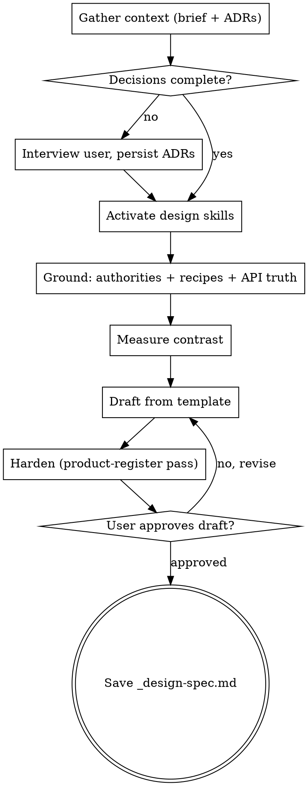

# Create Design Spec

Produce `.compozy/tasks/<name>/_design-spec.md`: a per-screen UI/UX specification that the HTML reference designs in `docs/design/opendesign/` are drawn against, one pipeline step **before** `cy-create-prd`. The spec translates locked concept decisions into screen anatomy, state matrices, and daemon-truthful data contracts, and ends with an actionable `[VERIFY]` list the PRD/TechSpec must resolve. Precedents: `docs/design/opendesign/LOOPS-DESIGN-SPEC.md` and `.compozy/tasks/marketplace/_design-spec.md`.

<HARD-GATE>
Do NOT write the design spec file until grounding is complete and the user has approved the draft.
Do NOT spec any field, count, metric, badge, or control without verifying the daemon/API exposes it — truthful UI over plausible UI. Unverifiable items carry an explicit [VERIFY] marker instead.
Do NOT presume contrast — measure every information-bearing token pair with the bundled checker before the draft.
Do NOT skip the decision interview when concept decisions are missing — a design spec without locked decisions is guesswork dressed as design.
This applies to EVERY design spec regardless of perceived simplicity.
</HARD-GATE>

## Required Reading Router

Match the current phase to the row. Read the listed files **in full before** producing that phase's output. They are load-bearing — inline content in this SKILL.md is a pointer, not a substitute.

| Phase                                             | MUST read                              |
| ------------------------------------------------- | -------------------------------------- |
| Any run of this skill (before drafting, step 5)   | `references/design-spec-template.md`   |
| Grounding + contrast + hardening (steps 2–4, 6)   | `references/grounding-checklist.md`    |
| Persisting interview decisions as ADRs (step 1)   | `references/adr-template.md`           |

## Reference Index

- `references/design-spec-template.md` — canonical section-by-section template: header block, status legend, scope table, design foundation (accent budget, measured contrast, motion contract), shared anatomy contracts, per-screen sections, overlays, microcopy, a11y, final `[VERIFY]` list.
- `references/grounding-checklist.md` — the authorities to read, the API-truth procedure, the exact contrast-checker invocation, the hardening pass, and the known traps that recur in AGH design work.
- `references/adr-template.md` — ADR format shared with `cy-create-techspec` (Status/Date/Context/Decision/Alternatives/Consequences).

## Asking Questions

When this skill instructs asking the user a question, use the runtime's dedicated interactive question tool — the mechanism that presents a question and **pauses execution until the user responds**. Ask one question per message, recommended option first and labeled "(Recommended)". For layout/structural choices, attach ASCII mockup previews per option so the user compares shapes, not adjectives. Never output questions as plain text and continue generating.

## Anti-Pattern: "The Decisions Are Obvious, Skip the Interview"

When no `_brief.md` or ADRs lock the concept decisions, the interview is the product. Page model, source-of-truth per surface, action verbs, placement, and naming each have alternatives with real trade-offs; picking silently produces a spec the user rewrites after the HTML is drawn. Interview first, persist decisions as ADRs, then spec.

## Anti-Pattern: Plausible UI

The most expensive design-spec defect is a field that reads well and does not exist: a trust badge with no trust API, an install count no source returns, a filter facet the endpoint cannot serve. Every data element in the spec cites a verified source (generated OpenAPI types, an existing component consuming it, or a backend route) or carries `[VERIFY]`. When the runtime and the desired design conflict, the spec records the gap — it never papers over it.

## Required Inputs

- Feature name identifying the `.compozy/tasks/<name>/` directory.
- Optional: `_brief.md` with locked decisions (primary input when present).
- Optional: `adrs/adr-NNN.md` records from earlier phases.
- Optional: existing `_design-spec.md` for update mode.

## Checklist

Create a task for each phase and complete them in order:

1. **Gather context** — brief, ADRs, decision completeness check (interview if gaps)
2. **Activate design skills** — `agh-design` + `ui-craft` (+ `impeccable` when available)
3. **Ground in reality** — authorities, component recipes, API-truth per surface
4. **Measure contrast** — run the checker on every information-bearing token pair
5. **Draft the spec** — fill the canonical template, status-mark every claim
6. **Harden** — product-register pass (states, overlays, worst-case content, microcopy)
7. **Review with user** — present draft, iterate until approved
8. **Save** — write `.compozy/tasks/<name>/_design-spec.md`, state next steps

## Workflow

1. Gather context.
   - Read `_brief.md` and `adrs/` in `.compozy/tasks/<name>/` when present; read an existing `_design-spec.md` and operate in update mode when it exists.
   - Audit decision completeness against what a design spec needs: page/navigation model, per-surface data source, action vocabulary, item detail location, installed/state handling, IA placement, naming. For each gap, interview the user (one question at a time, recommended option first, ASCII previews for structural choices).
   - **STOP. Read `references/adr-template.md` before persisting interview outcomes.** Each significant decision becomes `adrs/adr-NNN.md` (next zero-padded number, Status "Accepted", rejected options as Alternatives Considered). Update `_brief.md` to link new ADRs when it exists.

2. Activate design skills before any visual decision: `agh-design` and `ui-craft` via the Skill tool; also `impeccable` when the environment provides it. These load the token invariants, the anti-slop gates, and the register rules the spec must obey.

3. Ground in reality.
   - **STOP. Read `references/grounding-checklist.md` in full before this step.** It names the authorities (DESIGN.md, tokens.css, listing standard, COPY.md, PRODUCT.md), the component-recipe rule, and the API-truth procedure.
   - Gist tripwires: read the real recipe of every primitive the spec names; extract real payload fields per surface from generated OpenAPI types or consuming components; classify every data element as verified or `[VERIFY]`.

4. Measure contrast.
   - Build the list of token pairs the screens will use (text on its owning surface, button ink on fill, signal text on tint/surface) and run the read-only checker exactly as the grounding checklist prescribes.
   - Failures become resolve-at-source findings in the final `[VERIFY]` list — never local overrides.

5. Draft the spec.
   - **STOP. Read `references/design-spec-template.md` in full before drafting.** Fill every applicable section; delete sections that do not apply rather than leaving stubs.
   - Status-mark every non-obvious claim: `[locked-adr]`, `[design-assert]`, `[VERIFY]`, or `[UNCONFIRMED]`.
   - Language: **English**. Voice: implementation-facing, specific, no marketing register.

6. Harden with the product-register pass from the grounding checklist (loading vocabulary, modal justification, worst-case content, focus/disabled traps, microcopy bans). Fold outcomes into the draft before presenting it.

7. Review with the user via the interactive question tool:
   - A) Approved — save as is
   - B) Adjust specific sections (tell me which ones)
   - C) Rewrite section X (tell me what to change)
   - D) Discard and start over
   - If B or C: apply and present again. If D: return to step 1.

8. Save the file.
   - Write to `.compozy/tasks/<name>/_design-spec.md`; confirm the path.
   - State next steps: author the HTML artifacts in `docs/design/opendesign/` against the spec, then run `cy-create-prd` — the PRD inherits `adrs/` and treats the spec's final `[VERIFY]` list as open requirements input.

## Process Flow

## Error Handling

- No `_brief.md` and no ADRs: proceed through the step-1 interview with user-provided context; note the absence in the spec header.
- A named primitive has no recipe in `packages/ui/src/components/**`: spec the closest existing primitive and record the gap as a `[VERIFY]` token/component proposal — never invent chrome.
- The contrast checker is missing or errors: record the affected pairs as `[UNCONFIRMED]` and flag that measurement is pending; do not claim verified contrast.
- Conflicting authorities (DESIGN.md vs token file): trust DESIGN.md, flag the divergence in the `[VERIFY]` list.
- Target directory missing: create it.
- Update mode: preserve sections the user has not asked to change.

## Key Principles

- **Design-first pipeline** — this skill feeds `docs/design/opendesign/` artifacts and then `cy-create-prd`; it owns HOW screens look and behave, never business WHY (PRD) or build HOW (TechSpec).
- **Truthful UI over plausible UI** — verified source or `[VERIFY]`, no third option.
- **Measured, not presumed** — contrast comes from the checker, fields from the code, patterns from the recipes.
- **One question at a time** — interview with recommended answers and ASCII previews; never batch.
- **Decisions before pixels** — concept decisions live in ADRs before the spec references them as `[locked-adr]`.
- **The final `[VERIFY]` list is the deliverable's edge** — everything the design surfaced but cannot confirm, stated as the actionable diff for the PRD/TechSpec.
- **Language consistency** — spec content in English.
