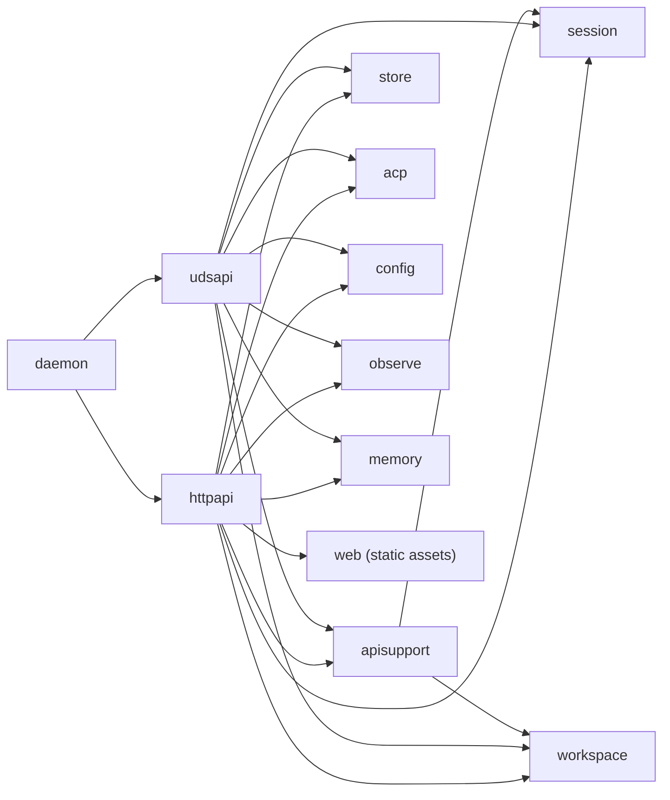

# Refactoring Analysis: API Layer (httpapi, udsapi, apisupport)

> **Date**: 2026-04-06
> **Scope**: `internal/httpapi/`, `internal/udsapi/`, `internal/apisupport/` -- all production and test Go files (12,260 lines across 32 files)
> **Analyzed by**: AI-assisted refactoring analysis (Martin Fowler's catalog)
> **Language/Stack**: Go 1.x, Gin framework, HTTP/SSE + UDS transports
> **Test Coverage**: Present -- both packages have unit tests and integration tests with stubs

---

## Executive Summary

The dominant issue across the API layer is **massive duplication between `httpapi` and `udsapi`**. These two packages implement near-identical handler logic, payload structs, SSE streaming, query parsing, memory operations, workspace operations, and test infrastructure -- differing only in transport binding (TCP vs Unix socket) and a few HTTP-specific features (CORS, static file serving, AI SDK prompt streaming). This copy-paste pattern creates a maintenance burden where every handler change must be applied in two places. The `apisupport` package was created to share some workspace/session utilities, but it covers only ~10% of the duplicated surface area. Beyond duplication, the `udsapi/handlers.go` file is a 1,084-line monolith mixing 14+ handler methods, all payload types, SSE infrastructure, and conversion functions.

| Severity | Count |
|----------|-------|
| P0 Critical | 1 |
| P1 High | 4 |
| P2 Medium | 5 |
| P3 Low | 3 |
| **Total** | **13** |

### Top Opportunities (Quick Wins + High Impact)

| # | Finding | Location | Effort | Impact |
|---|---------|----------|--------|--------|
| 1 | Massive cross-package duplication of handlers, payloads, SSE, query parsers | `httpapi/` vs `udsapi/` | significant | Eliminates ~900 lines of duplicate code; halves maintenance cost |
| 2 | Identical payload struct definitions duplicated across packages | `httpapi/sessions.go` + `udsapi/handlers.go` | moderate | Single source of truth for all API response shapes |
| 3 | Identical memory handler/helper duplication | `httpapi/memory.go` vs `udsapi/memory.go` | moderate | Eliminates 433 copy-pasted lines |
| 4 | Identical test stub types duplicated in test helpers | `httpapi/helpers_test.go` vs `udsapi/helpers_test.go` | trivial | Reduces test code duplication by ~300 lines |
| 5 | `udsapi/handlers.go` monolith at 1,084 lines | `udsapi/handlers.go` | moderate | Improves navigability and cohesion |

---

## Findings

### P0 -- Critical

#### F1: Systemic Cross-Package Duplication (httpapi vs udsapi)

- **Smell**: Duplicated Code / Shotgun Surgery
- **Category**: Dispensable + Change Preventer
- **Location**: Entire `internal/httpapi/` and `internal/udsapi/` packages
- **Severity**: P0 Critical
- **Impact**: Every handler, payload, SSE utility, query parser, and conversion function is duplicated between the two packages. Any feature addition or bug fix must be applied twice. This is the root cause of nearly every other finding in this report.

**Duplicated surfaces identified (with approximate line counts):**

| Surface | httpapi location | udsapi location | ~Lines each |
|---------|-----------------|-----------------|-------------|
| `sessionPayload`, `sessionEventPayload`, `acpCapsPayload`, `turnHistoryPayload` | `sessions.go:17-59` | `handlers.go:57-104` | 48 |
| `agentPayload`, `agentMCPServerJSON` | `agents.go:14-30` | `handlers.go:105-121` | 17 |
| `agentEventPayload`, `tokenUsagePayload` | `prompt.go:31-61` | `handlers.go:122-153` | 32 |
| `observeEventPayload`, `daemonStatusPayload` | `observe.go:11-18`, `daemon.go:11-21` | `handlers.go:155-175` | 22 |
| `errorPayload`, `sseMessage`, `observeCursor`, `flushWriter` | `stream.go:21-39` | `handlers.go:176-194` | 19 |
| `memoryWriteRequest`, `memoryReadResponse`, `memoryMutationResponse`, `memoryConsolidateRequest`, `memoryConsolidateResponse`, `memoryHealthPayload`, `memoryLocation` | `memory.go:19-52` | `memory.go:19-52` | 34 |
| `createWorkspaceRequest`, `updateWorkspaceRequest`, `resolveWorkspaceRequest`, `workspacePayload`, `workspaceSkillPayload` | `workspaces.go:19-50` | `workspaces.go:19-50` | 32 |
| `handlerConfig` struct | `server.go:109-124` | `handlers.go:25-38` | 14 |
| `Handlers` struct | `server.go:127-143` | `handlers.go:41-55` | 14 |
| `newHandlers()` | `server.go:530-571` | `handlers.go:196-232` | 40 |
| `sessionPayloadFromInfo`, `acpCapsPayloadFromInfo`, `sessionEventPayloadFromEvent` | `sessions.go:292-338` | `handlers.go:914-960` | 47 |
| `agentPayloadFromDef` | `agents.go:84-113` | `handlers.go:962-991` | 30 |
| `agentEventPayloadFromEvent`, `tokenUsagePayloadFromUsage` | `prompt.go:373-418` | `handlers.go:993-1031` | 40 |
| `observeEventPayloadFromEvent` | `observe.go:60-69` | `handlers.go:1033-1042` | 10 |
| `payloadJSON` | `stream.go:362-376` | `handlers.go:1044-1058` | 15 |
| `parseSessionEventQuery`, `parseOptionalTime`, `parseOptionalInt`, `parseOptionalInt64` | `sessions.go:225-290` | `handlers.go:700-784` | 65 |
| `parseObserveEventQuery`, `parseObserveCursor` | `stream.go:207-246` | `handlers.go:724-806` | 42 |
| `emitObserveEvents`, `observeEventAfterCursor`, `observeEventID` | `stream.go:248-287` | `handlers.go:808-847` | 40 |
| `prepareSSE`, `writeSSE` | `stream.go:289-342` | `handlers.go:849-900` | 52 |
| All memory handlers + helpers (~14 functions) | `memory.go` (433 lines) | `memory.go` (433 lines) | 433 |
| All workspace handlers + helpers (~12 functions) | `workspaces.go` (279 lines) | `workspaces.go` (279 lines) | 279 |
| Handler methods: `listSessions`, `createSession`, `getSession`, `stopSession`, `resumeSession`, `sessionEvents`, `sessionHistory`, `sessionTranscript`, `streamSession`, `listAgents`, `getAgent`, `observeEvents`, `streamObserveEvents`, `health`, `daemonStatus` | scattered across files | `handlers.go:238-698` | ~460 |
| `RegisterRoutes` | `server.go:470-528` | `routes.go:1-60` | 60 |
| `respondError` | `stream.go:344-356` | `handlers.go:902-908` | ~12 |
| `statusForSessionError` (thin wrapper) | `stream.go:358-360` | `handlers.go:910-912` | 3 |
| **Estimated total duplicated production lines** | | | **~900** |

**Recommended Refactoring**: Extract Module -- create a shared `internal/apicore/` (or expand `apisupport/`) package containing:
1. All payload structs (request/response types)
2. All conversion functions (`*FromInfo`, `*FromEvent`, `*FromDef`)
3. Query parsing utilities (`parseSessionEventQuery`, `parseOptionalTime`, etc.)
4. SSE infrastructure (`prepareSSE`, `writeSSE`, `writeSSERaw`, `emitObserveEvents`, etc.)
5. Memory handler logic (shared `MemoryHandlers` struct or functions)
6. Workspace handler logic (shared workspace helpers already partially in `apisupport`)
7. Shared `Handlers` base struct with common fields and methods
8. Route registration with transport-specific overrides

**After** (proposed architecture):
```go
// internal/apicore/payloads.go -- single source of truth
package apicore

type SessionPayload struct { ... }
type SessionEventPayload struct { ... }
type AgentPayload struct { ... }
// etc.

func SessionPayloadFromInfo(info *session.SessionInfo) SessionPayload { ... }
func SessionEventPayloadFromEvent(event store.SessionEvent) SessionEventPayload { ... }

// internal/apicore/sse.go
type SSEMessage struct { ... }
type FlushWriter interface { ... }
func PrepareSSE(c *gin.Context) (FlushWriter, error) { ... }
func WriteSSE(writer FlushWriter, msg SSEMessage) error { ... }

// internal/apicore/parsers.go
func ParseSessionEventQuery(c *gin.Context) (store.EventQuery, error) { ... }
func ParseOptionalTime(raw string) (time.Time, error) { ... }

// internal/apicore/handlers.go -- shared handler logic
type BaseHandlers struct {
    Sessions     SessionManager
    Observer     Observer
    Workspaces   WorkspaceService
    MemoryStore  *memory.Store
    // ...
}
func (h *BaseHandlers) ListSessions(c *gin.Context) { ... }
func (h *BaseHandlers) CreateSession(c *gin.Context) { ... }

// internal/httpapi/server.go -- only HTTP-specific: CORS, static, AI SDK prompt
// internal/udsapi/server.go -- only UDS-specific: socket lifecycle
```

**Rationale**: This is textbook Fowler "Duplicated Code" at scale. The two packages share ~90% of their logic. The `apisupport` package was the right instinct but covers only a small fraction. Extracting to a shared core eliminates the shotgun surgery problem where every handler change requires editing both packages.

---

### P1 -- High

#### F2: `udsapi/handlers.go` Monolith (1,084 lines)

- **Smell**: Large Class / Long File
- **Category**: Bloater
- **Location**: `internal/udsapi/handlers.go:1-1058`
- **Severity**: P1 High
- **Impact**: This single file contains all handler methods, all payload type definitions, all SSE infrastructure, all query parsers, all conversion functions, and the `Handlers` struct itself. Hard to navigate, hard to review diffs, high merge conflict risk.

**Current structure** (all in one file):
- Lines 1-24: imports
- Lines 25-194: ~14 struct type definitions
- Lines 196-232: `newHandlers` constructor
- Lines 234-518: ~15 handler methods (sessions, agents, observe, daemon)
- Lines 520-698: streaming handlers
- Lines 700-806: query parsing utilities
- Lines 808-847: observe event helpers
- Lines 849-900: SSE infrastructure
- Lines 902-1058: conversion functions

**Recommended Refactoring**: Split Phase + Extract Function -- decompose into domain-cohesive files matching `httpapi`'s organization: `sessions.go`, `agents.go`, `observe.go`, `daemon.go`, `stream.go`, `prompt.go`. (Or better yet, extract to `apicore/` per F1.)

**Rationale**: The `httpapi` package already demonstrates the correct decomposition pattern with separate files for each handler domain. The `udsapi` package should follow the same organization, or ideally both should share the extracted core.

---

#### F3: Duplicated Test Infrastructure

- **Smell**: Duplicated Code
- **Category**: Dispensable
- **Location**: `internal/httpapi/helpers_test.go` (408 lines) vs `internal/udsapi/helpers_test.go` (374 lines)
- **Severity**: P1 High
- **Impact**: The following test types and helpers are copy-pasted between packages:

| Test construct | httpapi lines | udsapi lines |
|---------------|--------------|--------------|
| `stubSessionManager` (struct + 11 methods) | 31-125 | 29-116 |
| `stubObserver` (struct + 2 methods) | 127-144 | 118-135 |
| `stubWorkspaceService` (struct + 7 methods) | 146-203 | 137-194 |
| `sseRecord` struct | 205-209 | 196-200 |
| `newTestHandlers` / `newTestHandlersWithWorkspace` | 211-237 | 202-223 |
| `newTestHomePaths` | 263-274 | 235-246 |
| `writeAgentDef` | 276-293 | 258-275 |
| `newSessionInfo` / `newSession` | 295-321 | 277-303 |
| `performRequest` | 323-342 | 305-316 |
| `decodeJSONResponse` | 344-350 | 318-324 |
| `parseSSE` | 352-382 | 326-358 |
| `discardLogger` | 406-408 | 372-374 |

The `httpapi` stub has `approveFn` that `udsapi` lacks (because UDS approve is not implemented), but otherwise they are structurally identical.

**Recommended Refactoring**: Extract to `internal/apitest/` (test-only package) with shared stub types. Each package's `helpers_test.go` imports the shared stubs and adds only transport-specific helpers (e.g., `mustStaticFS` for httpapi, `shortSocketPath`/`newUnixClient` for udsapi).

**Rationale**: The test code has the same shotgun surgery problem as production code. When the `SessionManager` interface gains a new method, both stub implementations need updating.

---

#### F4: Interface Definitions Duplicated Across Packages

- **Smell**: Duplicated Code / Shotgun Surgery
- **Category**: Change Preventer
- **Location**: `httpapi/server.go:41-77` vs `udsapi/server.go:40-75`
- **Severity**: P1 High
- **Impact**: The `SessionManager`, `Observer`, `DreamTrigger`, and `WorkspaceService` interfaces are defined identically in both packages. When a method is added to `SessionManager` (e.g., `ApprovePermission` was added to httpapi but is absent from udsapi), both interface definitions and their test stubs must be updated. The udsapi `SessionManager` interface currently lacks `ApprovePermission`, creating a functional gap.

**httpapi SessionManager** (13 methods including `ApprovePermission`):
```go
type SessionManager interface {
    Create(ctx context.Context, opts session.CreateOpts) (*session.Session, error)
    // ... 10 other methods ...
    ApprovePermission(ctx context.Context, id string, req acp.ApproveRequest) error
}
```

**udsapi SessionManager** (12 methods, missing `ApprovePermission`):
```go
type SessionManager interface {
    Create(ctx context.Context, opts session.CreateOpts) (*session.Session, error)
    // ... 10 other methods ...
    // ApprovePermission is MISSING
}
```

**Recommended Refactoring**: Define a single set of interfaces in `internal/apicore/` (or `internal/apisupport/`). Both transport packages would embed or reference the shared interface. The `WorkspaceGetter` interface in `apisupport` shows the right pattern already being used at a smaller scale.

**Rationale**: Go idiom says "define interfaces where consumed," but when two consumers need the exact same interface, defining it twice violates DRY and risks drift (as demonstrated by the `ApprovePermission` gap).

---

#### F5: Duplicated Test Cases Across Packages

- **Smell**: Duplicated Code
- **Category**: Dispensable
- **Location**: `httpapi/handlers_test.go` (840 lines) vs `udsapi/handlers_test.go` (862 lines)
- **Severity**: P1 High
- **Impact**: The handler test suites are ~90% identical. Compare test function names:

| httpapi test | udsapi test | Identical? |
|-------------|-------------|-----------|
| `TestRegisterRoutesCoversTechSpecEndpoints` | `TestRegisterRoutesCoversTechSpecEndpoints` | Yes |
| `TestCreateSessionHandlerReturnsSessionID` | `TestCreateSessionHandlerReturnsSessionID` | Yes |
| `TestCreateSessionHandlerAllowsMissingAgent` | `TestCreateSessionHandlerAllowsMissingAgent` | Yes |
| `TestListSessionsHandlerReturnsAllSessions` | `TestListSessionsHandlerReturnsAllSessions` | Yes |
| `TestListSessionsHandlerFiltersByWorkspace` | `TestListSessionsHandlerFiltersByWorkspace` | Yes |
| `TestCreateWorkspaceHandlerRegistersWorkspace` | `TestCreateWorkspaceHandlerRegistersWorkspace` | Yes |
| `TestListWorkspacesHandlerReturnsRegisteredRows` | `TestListWorkspacesHandlerReturnsRows` | ~Yes |
| `TestGetWorkspaceHandlerReturnsDetail` | `TestGetWorkspaceHandlerReturnsDetail` | Yes |
| `TestUpdateWorkspaceHandlerUpdatesWorkspace` | `TestUpdateWorkspaceHandlerUpdatesWorkspace` | Yes |
| `TestDeleteWorkspaceHandlerReturnsNoContent` | `TestDeleteWorkspaceHandlerReturnsNoContent` | Yes |
| `TestResolveWorkspaceHandlerReturnsWorkspace` | `TestResolveWorkspaceHandlerReturnsWorkspace` | Yes |
| `TestStopSessionHandlerReturnsStopped` | `TestStopSessionHandlerReturnsStopped` | Yes |
| `TestSessionEventsAndHistoryHandlers` | (split into 2 separate tests) | ~Yes |
| `TestSessionTranscriptHandlerReturnsMessages` | `TestSessionTranscriptHandlerReturnsMessages` | Yes |

Once handler logic is extracted to `apicore/`, these tests can be consolidated into a single shared test suite parameterized by transport, or tested once at the `apicore` level with thin integration tests per transport.

**Rationale**: ~1,700 lines of test code are functionally duplicated. This magnifies the shotgun surgery cost.

---

### P2 -- Medium

#### F6: `respondError` Behavioral Divergence

- **Smell**: Copy-Paste Variation
- **Category**: DRY Violation
- **Location**: `httpapi/stream.go:344-356` vs `udsapi/handlers.go:902-908`
- **Severity**: P2 Medium
- **Impact**: The two `respondError` functions have different behavior:

**httpapi** (12 lines -- masks 5xx error details):
```go
func respondError(c *gin.Context, status int, err error) {
    message := http.StatusText(status)
    if status >= http.StatusInternalServerError {
        if strings.TrimSpace(message) == "" {
            message = "internal server error"
        }
    } else if err != nil && strings.TrimSpace(err.Error()) != "" {
        message = err.Error()
    } else if strings.TrimSpace(message) == "" {
        message = "unknown error"
    }
    c.JSON(status, errorPayload{Error: message})
}
```

**udsapi** (6 lines -- always exposes error details):
```go
func respondError(c *gin.Context, status int, err error) {
    message := "unknown error"
    if err != nil {
        message = err.Error()
    }
    c.JSON(status, errorPayload{Error: message})
}
```

This is a subtle but meaningful difference: `httpapi` correctly masks internal error details for 5xx responses (security best practice for public-facing HTTP), while `udsapi` always exposes raw error messages (appropriate for local UDS communication). This divergence may be intentional, but it should be made explicit and documented rather than left as an implicit copy-paste variation.

**Recommended Refactoring**: Extract a shared `RespondError(c, status, err, maskInternalErrors bool)` function in `apicore/`, or define two named variants: `RespondErrorPublic` (for HTTP) and `RespondErrorInternal` (for UDS).

**Rationale**: The behavioral difference is valid but should be an explicit design choice, not an implicit artifact of copy-paste divergence.

---

#### F7: `agentEventPayload` Type Divergence Between Transports

- **Smell**: Copy-Paste Variation
- **Category**: DRY Violation
- **Location**: `httpapi/prompt.go:31-61` vs `udsapi/handlers.go:122-153`
- **Severity**: P2 Medium
- **Impact**: The `agentEventPayload` and `tokenUsagePayload` structs have subtle type differences:

**httpapi** (Timestamp as `string`):
```go
type agentEventPayload struct {
    Timestamp  string             `json:"timestamp,omitempty"`
    // ...
}
type tokenUsagePayload struct {
    Timestamp  string             `json:"timestamp,omitempty"`
    // ...
}
```

**udsapi** (Timestamp as `time.Time`):
```go
type agentEventPayload struct {
    Timestamp  time.Time          `json:"timestamp"`
    // ...
}
type tokenUsagePayload struct {
    Timestamp  time.Time          `json:"timestamp"`
    // ...
}
```

The `httpapi` version also includes extra fields (`RequestID`) and uses `string` timestamps because of the AI SDK SSE protocol requirements, while the `udsapi` version uses native `time.Time` for direct JSON serialization. This creates divergent API contracts between the two transports.

**Recommended Refactoring**: Define a base payload type in `apicore/` and use composition or a conversion layer for the httpapi-specific AI SDK format.

**Rationale**: Clients consuming both transports get different JSON shapes for the same logical data, which is confusing.

---

#### F8: `createSessionRequest` Defined Twice

- **Smell**: Duplicated Code
- **Category**: Dispensable
- **Location**: `httpapi/sessions.go:17-21` vs `udsapi/handlers.go:57-62`
- **Severity**: P2 Medium
- **Impact**: The request struct is byte-for-byte identical. Other request structs (`memoryWriteRequest`, `memoryConsolidateRequest`, `createWorkspaceRequest`, `updateWorkspaceRequest`, `resolveWorkspaceRequest`) are also identical across packages.

**Recommended Refactoring**: Move to `apicore/requests.go`.

---

#### F9: `Server` Struct and Constructor Duplication

- **Smell**: Duplicated Code / Large Class
- **Category**: Bloater + Dispensable
- **Location**: `httpapi/server.go:80-342` vs `udsapi/server.go:78-283`
- **Severity**: P2 Medium
- **Impact**: Both `Server` structs share ~90% of fields and the `New()` constructors share ~80% of validation logic. The main differences are:
  - httpapi has `host`, `port`, `actualPort` fields (TCP binding)
  - udsapi has `socketPath` field (Unix socket binding)
  - httpapi has `corsMiddleware`, `requestLoggingMiddleware`, `errorMiddleware`
  - udsapi has `ensureSocketParentDir`, `removeSocketPath`

The `Start()` and `Shutdown()` methods also share ~70% of their structure, differing only in the listen call (`net.Listen("tcp", ...)` vs `net.Listen("unix", ...)`) and cleanup (socket file removal).

**Recommended Refactoring**: Extract a shared `BaseServer` struct in `apicore/` with common fields, options, and lifecycle. Transport-specific servers embed `BaseServer` and override only transport binding.

---

#### F10: `waitForServeDone` Duplicated

- **Smell**: Duplicated Code
- **Category**: Dispensable
- **Location**: `httpapi/server.go:694-705` vs `udsapi/server.go:449-460`
- **Severity**: P2 Medium
- **Impact**: Byte-for-byte identical function (differing only in error prefix string). Both are 12 lines.

```go
func waitForServeDone(ctx context.Context, done <-chan struct{}) error {
    if done == nil { return nil }
    select {
    case <-done: return nil
    case <-ctx.Done():
        return fmt.Errorf("httpapi: wait for serve shutdown: %w", ctx.Err())
    }
}
```

**Recommended Refactoring**: Move to `apicore/` as a shared utility.

---

### P3 -- Low

| # | Smell | Location | Technique | Notes |
|---|-------|----------|-----------|-------|
| F11 | Magic string `"null"` used in 3 places in each `payloadJSON` | `httpapi/stream.go:364,367`, `udsapi/handlers.go:1046,1049` | Extract Constant | `var nullJSON = json.RawMessage("null")` |
| F12 | Thin wrapper functions that add no value | `httpapi/workspaces.go:253-279` (6 one-line wrappers to `apisupport`) | Inline Function or Remove Middle Man | `statusForSessionError`, `filterSessionInfosByWorkspaceID`, `validateCreateSessionRequest`, `validateAbsolutePath`, `validateAbsolutePaths`, `trimStringSlice`, `statusForWorkspaceError` all delegate to `apisupport.*` with only the prefix string differing. These wrappers exist because the functions are called frequently and Go requires explicit package qualifiers, but they add a layer of indirection. |
| F13 | Constant `timeRFC3339Nano` is just an alias for `time.RFC3339Nano` | `httpapi/stream.go:19` | Remove Dead Code | `const timeRFC3339Nano = time.RFC3339Nano` adds no value -- use `time.RFC3339Nano` directly. |

---

## Coupling Analysis

### Module Dependency Map



### High-Risk Coupling

| Module | Afferent (dependents) | Efferent (dependencies) | Risk |
|--------|----------------------|------------------------|------|
| `apisupport` | 2 (httpapi, udsapi) | 2 (session, workspace) | low |
| `httpapi` | 1 (daemon) | 8 (session, store, acp, config, observe, memory, workspace, web) | medium |
| `udsapi` | 1 (daemon) | 7 (session, store, acp, config, observe, memory, workspace) | medium |

### Circular Dependencies

None detected. Dependencies flow strictly downward: `daemon` -> `httpapi`/`udsapi` -> domain packages. This is correct per the project architecture guidelines.

---

## DRY Analysis

### Duplicated Code Clusters

| Cluster | Locations | ~Lines | Extraction Strategy |
|---------|-----------|--------|-------------------|
| All payload struct definitions | `httpapi/{sessions,agents,prompt,observe,daemon,stream,memory,workspaces}.go` + `udsapi/{handlers,memory,workspaces}.go` | ~200 | Extract to `apicore/payloads.go` |
| All conversion functions (`*FromInfo`, `*FromEvent`, `*FromDef`) | `httpapi/{sessions,agents,prompt,observe}.go` + `udsapi/handlers.go` | ~200 | Extract to `apicore/conversions.go` |
| SSE infrastructure (`prepareSSE`, `writeSSE`, `writeSSERaw`, `emitObserveEvents`, cursor logic) | `httpapi/stream.go` + `udsapi/handlers.go` | ~130 | Extract to `apicore/sse.go` |
| Query parsers (`parseSessionEventQuery`, `parseObserveEventQuery`, `parseOptionalTime`, etc.) | `httpapi/sessions.go:225-290` + `httpapi/stream.go:207-246` + `udsapi/handlers.go:700-806` | ~90 | Extract to `apicore/parsers.go` |
| All memory handlers + helpers | `httpapi/memory.go` + `udsapi/memory.go` | 433 | Extract to `apicore/memory_handlers.go` |
| All workspace handlers + helpers | `httpapi/workspaces.go` + `udsapi/workspaces.go` | 279 | Extract to `apicore/workspace_handlers.go` (extend existing `apisupport`) |
| Handler methods (sessions, agents, observe, daemon) | scattered in httpapi + `udsapi/handlers.go` | ~460 | Extract to `apicore/handlers.go` |
| `handlerConfig` + `Handlers` struct + `newHandlers` constructor | `httpapi/server.go` + `udsapi/handlers.go` | ~70 | Extract to `apicore/handlers.go` |
| Test stubs + helpers | `httpapi/helpers_test.go` + `udsapi/helpers_test.go` | ~370 | Extract to `internal/apitest/` |
| Test cases | `httpapi/handlers_test.go` + `udsapi/handlers_test.go` | ~850 | Consolidate into shared test suite |

### Magic Values

| Value | Occurrences | Suggested Constant Name | Files |
|-------|-------------|------------------------|-------|
| `"null"` | 6 (3 per package in `payloadJSON`) | `jsonNull` or `var nullJSON = json.RawMessage("null")` | `httpapi/stream.go`, `udsapi/handlers.go` |
| `100 * time.Millisecond` | 2 | Already `defaultPollInterval` -- good | `httpapi/server.go`, `udsapi/server.go` |
| `5 * time.Second` | 2 | Already `defaultReadHeaderTimeout` -- good (note: udsapi has typo `defaultReadHeaderTimout`) | `httpapi/server.go`, `udsapi/server.go` |
| `60 * time.Second` | 2 | Already `defaultIdleTimeout` -- good | both |

### Repeated Patterns

1. **Error-response-return pattern**: Every handler follows the exact same pattern: `if err != nil { respondError(c, statusFor*Error(err), err); return }`. This is idiomatic Go and acceptable, but the repeated `respondError` + `statusFor*Error` could be simplified with a middleware or helper that maps errors to statuses automatically.

2. **Thin wrapper delegation pattern**: `httpapi/workspaces.go` lines 253-279 and `udsapi/workspaces.go` lines 253-279 define 6-7 one-line wrapper functions that simply call the corresponding `apisupport.*` function with a package prefix string. This is a Middle Man smell -- the wrappers exist solely because Go requires explicit package qualification in function calls.

---

## SOLID Analysis

> **Context**: This project uses interface-based dependency injection with a flat architecture. While not full DDD or hexagonal, SOLID principles -- particularly ISP and DIP -- are relevant because the packages define consumer-side interfaces and inject dependencies.

| Principle | Finding | Location | Severity | Recommendation |
|-----------|---------|----------|----------|----------------|
| SRP | `udsapi/handlers.go` has 5+ responsibilities (payload types, handler methods, SSE infra, query parsing, conversion functions) | `udsapi/handlers.go` | P1 High | Split into cohesive files per domain |
| SRP | `httpapi/server.go` mixes server lifecycle, handler construction, route registration, middleware definitions, and CORS logic (705 lines) | `httpapi/server.go` | P2 Medium | Extract middleware to `middleware.go`, route registration could stay or move to `routes.go` |
| ISP | `SessionManager` interface has 12-13 methods; some handlers only need a subset (e.g., `daemonStatus` only calls `ListAll`) | `httpapi/server.go:41-53`, `udsapi/server.go:40-51` | P3 Low | Acceptable for now -- interface is cohesive around session lifecycle. Could split into `SessionReader` + `SessionWriter` if the interface grows further |
| DIP | Both packages correctly depend on abstractions (interfaces) rather than concrete implementations | Both `server.go` files | N/A | Good -- no action needed |
| OCP | Adding a new handler requires modifying `RegisterRoutes` and `Handlers` struct, but this is standard for Gin-based APIs | Both packages | N/A | Acceptable -- Gin routing does not support polymorphic extension |

---

## Suggested Refactoring Order

Recommended sequence based on impact, effort, and dependency between refactorings:

### Phase 1: Quick Wins (trivial effort, immediate clarity)

1. **Fix typo**: `defaultReadHeaderTimout` -> `defaultReadHeaderTimeout` in `udsapi/server.go:30`
2. **Remove redundant constant**: Delete `const timeRFC3339Nano = time.RFC3339Nano` in `httpapi/stream.go:19`, use `time.RFC3339Nano` directly (F13)
3. **Extract `nullJSON` constant**: Replace magic `"null"` strings with a named constant (F11)
4. **Split `udsapi/handlers.go`** into cohesive files: `sessions.go`, `agents.go`, `observe.go`, `prompt.go`, `daemon.go`, `stream.go`, `payloads.go` to match current httpapi organization where applicable (F2) -- this is a pure file reorganization with no logic changes

### Phase 2: High-Impact Structural Changes

1. **Extract shared `apicore/` package** (F1): Start with the lowest-risk extractions:
   a. Payload structs -> `apicore/payloads.go`
   b. Conversion functions -> `apicore/conversions.go`
   c. Query parsers -> `apicore/parsers.go`
   d. SSE infrastructure -> `apicore/sse.go`
   e. Shared interfaces -> `apicore/interfaces.go`
2. **Extract shared handler base** (F1 continued): Create `apicore.BaseHandlers` with common methods. Both transport packages embed it and add transport-specific handlers only.
3. **Consolidate memory handlers** (F3 subset): Move `memory.go` handler logic to `apicore/memory.go` since both copies are byte-identical.
4. **Consolidate workspace handlers** (F3 subset): Merge with existing `apisupport/` or new `apicore/`.

### Phase 3: Test Infrastructure Consolidation

1. **Extract shared test stubs** (F3): Create `internal/apitest/` with `stubSessionManager`, `stubObserver`, `stubWorkspaceService`, `sseRecord`, `parseSSE`, `performRequest`, `decodeJSONResponse`, `newTestHomePaths`, `writeAgentDef`, `newSessionInfo`, `newSession`, `discardLogger`.
2. **Consolidate test cases** (F5): Once handler logic lives in `apicore/`, test it once there. Keep only transport-specific integration tests in each package.

### Prerequisites

- Existing tests provide good coverage for safe refactoring. Run `make verify` after each extraction to ensure no regressions.
- Phase 2 depends on Phase 1 (splitting `udsapi/handlers.go` first makes the extraction cleaner).
- Phase 3 depends on Phase 2 (test consolidation follows production code consolidation).

---

## Risks and Caveats

- **`respondError` divergence (F6) may be intentional**: The httpapi version masks 5xx details for security, while udsapi exposes them for debugging. This should be preserved as an explicit design choice when consolidating.
- **`agentEventPayload` type divergence (F7) may be intentional**: The httpapi version uses string timestamps for AI SDK SSE protocol compatibility. The consolidation should support both serialization formats.
- **The `apisupport` package already exists**: The proposed `apicore/` package could be an expansion of `apisupport/` rather than a new package. The naming choice should be discussed.
- **Import cycle risk**: The shared package must not import `httpapi` or `udsapi`. All shared code must flow downward.
- **`udsapi.SessionManager` missing `ApprovePermission`**: This appears to be a functional gap (the UDS approve handler returns 501 Not Implemented). When consolidating interfaces, decide whether to add it or keep the gap explicit.
- **Thin wrapper functions (F12)**: These exist because Go requires explicit package qualifiers. After consolidation, handlers would call `apicore.*` directly, eliminating these wrappers naturally.

---

## Appendix: Smell Distribution

| Category | Count | % |
|----------|-------|---|
| Bloaters | 2 | 15% |
| Change Preventers | 2 | 15% |
| Dispensables | 5 | 39% |
| Couplers | 0 | 0% |
| Conditional Complexity | 0 | 0% |
| DRY Violations | 3 | 23% |
| SOLID Violations | 1 | 8% |
| **Total** | **13** | **100%** |

> **Note**: The category totals exceed findings count because F1 spans both Dispensable (duplicated code) and Change Preventer (shotgun surgery) categories. It is counted once in the findings but appears in both category tallies.
