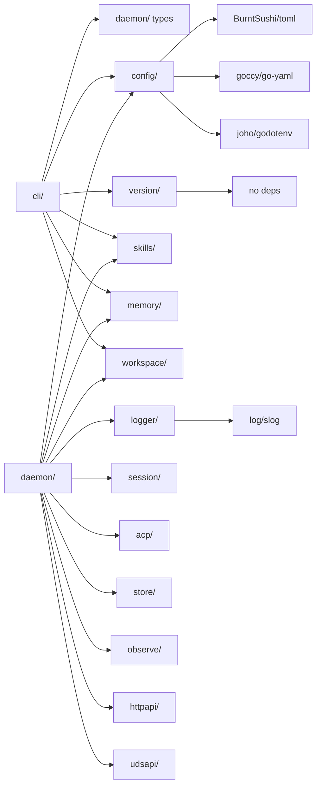

# Refactoring Analysis: Config & Infrastructure Packages

> **Date**: 2026-04-06
> **Scope**: `internal/config/`, `internal/daemon/`, `internal/cli/`, `internal/logger/`, `internal/version/`
> **Analyzed by**: AI-assisted refactoring analysis (Martin Fowler's catalog)
> **Language/Stack**: Go 1.x, Cobra CLI, slog, TOML/YAML config
> **Test Coverage**: Present (unit + integration tests) -- appears reasonable across packages

---

## Executive Summary

The analyzed infrastructure packages are generally well-structured with clean separation of concerns, consistent functional options patterns, and proper error handling. The most impactful finding is that `daemon.go` at **1,495 lines** is a bloated composition root that mixes boot orchestration, dream consolidation logic, orphan cleanup, process management, and import boundary verification into a single file. The second major pattern is **duplicated utility functions** across `daemon/` and `cli/` (`processAlive`, `signalProcess`, `normalizeAbsolutePath`/`expandUserPath`, `userAgentsSkillsDir`/`cliUserAgentsSkillsDir`). The `cli/` package also has a **repetitive output bundle pattern** that could benefit from extraction into a generic helper.

| Severity | Count |
|----------|-------|
| P0 Critical | 0 |
| P1 High | 3 |
| P2 Medium | 7 |
| P3 Low | 6 |
| **Total** | **16** |

### Top Opportunities (Quick Wins + High Impact)

| # | Finding | Location | Effort | Impact |
|---|---------|----------|--------|--------|
| 1 | Duplicated `processAlive` / `signalProcess` across daemon + CLI | `daemon/daemon.go`, `cli/root.go` | trivial | Eliminates divergent copies of critical process utilities |
| 2 | Duplicated `userAgentsSkillsDir` / `cliUserAgentsSkillsDir` | `daemon/daemon.go:882`, `cli/skill.go:348` | trivial | Removes identical ~15-line function in two packages |
| 3 | Duplicated path normalization (`normalizeAbsolutePath` vs `expandUserPath`) | `daemon/daemon.go:1338`, `config/home.go:138` | trivial | Single source of truth for tilde/path resolution |
| 4 | Extract daemon dream logic from `daemon.go` | `daemon/daemon.go:930-1181` | moderate | Reduces daemon.go by ~250 lines, improves cohesion |
| 5 | Extract daemon orphan cleanup from `daemon.go` | `daemon/daemon.go:1232-1292` | moderate | Reduces daemon.go further, isolates process management |

---

## Findings

### P1 -- High

#### F1: Duplicated Process Utilities Across daemon/ and cli/

- **Smell**: Duplicated Code
- **Category**: Dispensable / DRY Violation
- **Location**: `internal/daemon/daemon.go:1390-1403` + `internal/daemon/lock.go:195-202` + `internal/cli/root.go:247-273`
- **Severity**: P1 High
- **Impact**: Two independent implementations of `processAlive` and `signalProcess` exist in `daemon/` and `cli/`. The `daemon/` version uses `syscall.Kill(pid, 0)` directly while the `cli/` version uses `os.FindProcess` + `process.Signal`. A bug fix in one will not propagate to the other. Both are critical for daemon lifecycle (lock acquisition, stop command).

**Current Code** (simplified):
```go
// daemon/daemon.go and daemon/lock.go
func processAlive(pid int) bool {
    if pid <= 0 { return false }
    err := syscall.Kill(pid, 0)
    return err == nil || errors.Is(err, syscall.EPERM)
}

func signalProcess(pid int, sig syscall.Signal) error {
    process, err := os.FindProcess(pid)
    // ...
}

// cli/root.go -- nearly identical but subtly different
func processAlive(pid int) bool {
    if pid <= 0 { return false }
    process, err := os.FindProcess(pid)
    // uses process.Signal instead of syscall.Kill
}
```

**Recommended Refactoring**: Extract Function -- Move into a shared internal utility package (e.g., `internal/procutil/`) or into `internal/config/` as exported helpers since both daemon and cli already depend on config.

**After** (proposed):
```go
// internal/procutil/procutil.go
package procutil

func Alive(pid int) bool { /* canonical implementation */ }
func Signal(pid int, sig syscall.Signal) error { /* canonical implementation */ }
```

**Rationale**: Two implementations that can diverge silently is a classic Shotgun Surgery smell. Single canonical location ensures consistent behavior and single maintenance point.

---

#### F2: Duplicated userAgentsSkillsDir Logic

- **Smell**: Duplicated Code (Copy-Paste Variation)
- **Category**: Dispensable / DRY Violation
- **Location**: `internal/daemon/daemon.go:882-904` + `internal/cli/skill.go:348-370`
- **Severity**: P1 High
- **Impact**: Two nearly identical ~20-line functions resolve `~/.agents/skills` with the exact same algorithm (check `getenv("HOME")`, fall back to `os.UserHomeDir()`, resolve abs, join path). Only the error message prefix differs ("daemon:" vs "cli:").

**Current Code** (simplified):
```go
// daemon/daemon.go
func (d *Daemon) userAgentsSkillsDir() (string, error) {
    if d.getenv != nil {
        if home := strings.TrimSpace(d.getenv("HOME")); home != "" {
            absHome, _ := filepath.Abs(home)
            return filepath.Join(absHome, ".agents", "skills"), nil
        }
    }
    home, _ := os.UserHomeDir()
    absHome, _ := filepath.Abs(home)
    return filepath.Join(absHome, ".agents", "skills"), nil
}

// cli/skill.go -- identical logic
func cliUserAgentsSkillsDir(deps commandDeps) (string, error) { /* same */ }
```

**Recommended Refactoring**: Extract Function to a shared location. This belongs in `internal/config/` since it resolves a well-known filesystem path, like `ResolveHomePaths`.

**After** (proposed):
```go
// internal/config/home.go
func ResolveUserAgentsSkillsDir(getenv func(string) string) (string, error) {
    // single canonical implementation
}
```

**Rationale**: Fowler's Rule of Three is satisfied -- this pattern already appears twice with identical logic. Moving it to config/ eliminates the duplication and aligns with the existing filesystem resolution responsibility of that package.

---

#### F3: daemon.go is a Large File / Bloater (1,495 lines)

- **Smell**: Large Class / Large Module
- **Category**: Bloater
- **Location**: `internal/daemon/daemon.go:1-1496`
- **Severity**: P1 High
- **Impact**: The file contains at least 5 distinct responsibility clusters: (1) daemon struct + options + constructor (~320 lines), (2) boot/shutdown orchestration (~310 lines), (3) dream consolidation logic (~250 lines), (4) orphan process cleanup (~60 lines), (5) import boundary verification (~60 lines), (6) process utilities (~50 lines), (7) notifier fanout (~30 lines). This makes the file hard to navigate and understand.

**Recommended Refactoring**: Extract to separate files within the same package using Go's file-level organization.

**After** (proposed file split):
```
internal/daemon/
  daemon.go           -- Daemon struct, options, New(), Run(), Shutdown() (~400 lines)
  boot.go             -- boot() and its helpers (~300 lines)
  dream.go            -- dream loop, dream spawner, dream workspace resolution (~250 lines)
  orphan.go           -- orphan cleanup, process list, wait for exit (~100 lines)
  boundary.go         -- verifyImportBoundaries (~60 lines)
  notifier.go         -- notifierFanout (~30 lines)
```

**Rationale**: This is not a package split -- it is file-level extraction within the same `daemon` package, which is the recommended approach in CLAUDE.md ("File-level organization within packages"). Each file would have a clear, single responsibility while maintaining package cohesion.

---

### P2 -- Medium

#### F4: Duplicated Path Normalization Functions

- **Smell**: Duplicated Code
- **Category**: DRY Violation
- **Location**: `internal/daemon/daemon.go:1338-1360` + `internal/config/home.go:119-156`
- **Severity**: P2 Medium
- **Impact**: `daemon.normalizeAbsolutePath()` and `config.expandUserPath()` + `config.resolveAbsoluteDir()` do largely the same thing: handle `~` expansion, trim whitespace, resolve to absolute path. The daemon version reimplements tilde expansion instead of calling the config utility. This creates a maintenance burden if path resolution logic needs to change.

**Current Code** (simplified):
```go
// daemon/daemon.go
func normalizeAbsolutePath(path string) (string, error) {
    // handles ~ and ~/..., calls filepath.Abs
}

// config/home.go
func expandUserPath(path string) (string, error) {
    // handles ~ and ~/..., returns expanded
}
func resolveAbsoluteDir(path string) (string, error) {
    // calls expandUserPath, trims, calls filepath.Abs
}
```

**Recommended Refactoring**: Export `config.ResolveAbsolutePath()` (rename `resolveAbsoluteDir`) and use it in daemon/. Remove the daemon copy.

**Rationale**: config/ already owns path resolution. daemon/ should delegate rather than duplicate.

---

#### F5: Repetitive Overlay Apply Pattern in merge.go

- **Smell**: Duplicated Code (Copy-Paste Variation)
- **Category**: DRY Violation
- **Location**: `internal/config/merge.go:152-290`
- **Severity**: P2 Medium
- **Impact**: Every overlay `Apply()` method follows the exact same pattern: `if o.Field != nil { dst.Field = *o.Field }`. There are **~30** of these nearly identical stanzas across 10+ overlay types. While this is Go's idiomatic pointer-based optional pattern, the volume creates visual noise and maintenance burden when adding a new config field (requires adding it in 3 places: config struct, overlay struct, Apply method).

**Current Code** (simplified):
```go
func (o httpOverlay) Apply(dst *HTTPConfig) {
    if o.Host != nil { dst.Host = *o.Host }
    if o.Port != nil { dst.Port = *o.Port }
}
func (o limitsOverlay) Apply(dst *LimitsConfig) {
    if o.MaxSessions != nil { dst.MaxSessions = *o.MaxSessions }
    if o.MaxConcurrentAgents != nil { dst.MaxConcurrentAgents = *o.MaxConcurrentAgents }
}
// ... repeated 10+ times
```

**Recommended Refactoring**: This is a **potential** finding -- the current pattern is idiomatic Go and compile-time safe. However, if the config grows significantly, consider a reflection-based or code-generated merge. For now, this is acceptable as-is but worth noting for future complexity.

**Rationale**: Fowler's "Rule of Three" is well past triggered, but the pattern is type-safe and straightforward. Flag for monitoring rather than immediate action.

---

#### F6: Repetitive Output Bundle Pattern in CLI

- **Smell**: Duplicated Code (Copy-Paste Variation)
- **Category**: DRY Violation
- **Location**: `internal/cli/session.go`, `internal/cli/workspace.go`, `internal/cli/agent.go`, `internal/cli/observe.go`, `internal/cli/memory.go`, `internal/cli/skill.go`
- **Severity**: P2 Medium
- **Impact**: Every CLI command follows the same pattern: construct an `outputBundle` with `jsonValue`, `human`, and `toon` closures. The human/toon closures repeat the same row-building loop (`make([][]string, 0, len(items))` + `for _, item := range items { rows = append(rows, ...) }`). This pattern appears **~20+ times** across the CLI package.

**Current Code** (simplified):
```go
// Repeated in every list-style bundle function
func fooListBundle(items []FooRecord) outputBundle {
    return outputBundle{
        jsonValue: items,
        human: func() (string, error) {
            rows := make([][]string, 0, len(items))
            for _, item := range items {
                rows = append(rows, []string{ /* fields */ })
            }
            return renderHumanTable("Foo", headers, rows), nil
        },
        toon: func() (string, error) {
            rows := make([][]string, 0, len(items))
            for _, item := range items {
                rows = append(rows, []string{ /* fields */ })
            }
            return renderToonArray("foo", headers, rows), nil
        },
    }
}
```

**Recommended Refactoring**: Introduce a generic list bundle helper:

**After** (proposed):
```go
func listBundle[T any](name string, headers []string, items []T, extract func(T) []string) outputBundle {
    return outputBundle{
        jsonValue: items,
        human: func() (string, error) {
            rows := extractRows(items, extract)
            return renderHumanTable(titleCase(name), headers, rows), nil
        },
        toon: func() (string, error) {
            rows := extractRows(items, extract)
            return renderToonArray(name, headers, rows), nil
        },
    }
}
```

**Rationale**: A generic helper would eliminate ~50% of the boilerplate in bundle functions. Since Go supports generics, this is now idiomatic and would reduce maintenance when adding new resource types.

---

#### F7: boot() Function is Too Long (~300 lines)

- **Smell**: Long Function
- **Category**: Bloater
- **Location**: `internal/daemon/daemon.go:563-866`
- **Severity**: P2 Medium
- **Impact**: The `boot()` method is ~300 lines and operates at multiple abstraction levels: config loading, logger creation, memory store setup, skills registry, lock acquisition, orphan cleanup, registry opening, workspace resolver creation, dream service, session manager, observer, HTTP server, UDS server, info writing, reconciliation, boundary verification, and final state assignment. It is essentially a sequential script with cleanup handling.

**Recommended Refactoring**: Split Phase -- Extract boot into named phases:

**After** (proposed):
```go
func (d *Daemon) boot(ctx context.Context) error {
    cfg, logger, closeLogger, err := d.bootInfrastructure(ctx)
    // ...
    stores, err := d.bootStores(ctx, cfg, logger)
    // ...
    services, err := d.bootServices(ctx, cfg, stores, logger)
    // ...
    servers, err := d.bootServers(ctx, services)
    // ...
    d.finalizeBootState(cfg, logger, stores, services, servers)
    return nil
}
```

**Rationale**: The function works correctly but is hard to reason about at a glance. Named phases improve comprehension and make the boot sequence self-documenting.

---

#### F8: Repeated stream handler pattern in CLI (session events + observe events)

- **Smell**: Duplicated Code
- **Category**: DRY Violation
- **Location**: `internal/cli/session.go:294-358` + `internal/cli/observe.go:93-144`
- **Severity**: P2 Medium
- **Impact**: `streamSessionEvents` and `streamObserveEvents` follow the exact same structure: resolve output format, create JSON encoder, call SSE stream handler, decode event, switch on output mode (JSON/Toon/Human), write output. The only differences are the event type and field names.

**Recommended Refactoring**: Extract Function -- Create a generic `streamEvents` helper parameterized by the decode and render functions.

**Rationale**: Two instances with identical structure satisfy the "wince" threshold. A third streaming command would trigger Rule of Three.

---

#### F9: Config.Validate() Sequential Error Checks

- **Smell**: Long Function (borderline)
- **Category**: Bloater
- **Location**: `internal/config/config.go:288-329`
- **Severity**: P2 Medium
- **Impact**: `Config.Validate()` is a 40-line function that calls 9 sub-validators sequentially, each with the identical pattern `if err := x.Validate(); err != nil { return err }`. While straightforward, this will grow linearly with every new config section.

**Current Code** (simplified):
```go
func (c Config) Validate() error {
    if err := c.Daemon.Validate(); err != nil { return err }
    if err := c.HTTP.Validate(); err != nil { return err }
    if err := c.Defaults.Validate(); err != nil { return err }
    // ... 6 more identical stanzas
}
```

**Recommended Refactoring**: Use a validation helper that iterates over a slice of validators:

**After** (proposed):
```go
func (c Config) Validate() error {
    validators := []interface{ Validate() error }{
        c.Daemon, c.HTTP, c.Defaults, c.Limits,
        c.Permissions, c.Observability, c.Log, c.Memory, c.Skills,
    }
    for _, v := range validators {
        if err := v.Validate(); err != nil {
            return err
        }
    }
    // provider-specific validation...
}
```

**Rationale**: Reduces duplication and makes adding new config sections a single-line change. The interface approach is idiomatic Go.

---

#### F10: `startingDaemonStatus` and `stoppedDaemonStatus` are near-identical

- **Smell**: Duplicated Code
- **Category**: Dispensable
- **Location**: `internal/cli/daemon.go:296-322`
- **Severity**: P2 Medium
- **Impact**: Two functions that differ only in the `Status` string field value ("starting" vs "stopped"). Everything else is identical.

**Current Code** (simplified):
```go
func startingDaemonStatus(runtime runtimeContext, info aghdaemon.Info) DaemonStatus {
    return DaemonStatus{
        Status: "starting",
        // ... identical fields
    }
}
func stoppedDaemonStatus(runtime runtimeContext, info aghdaemon.Info) DaemonStatus {
    return DaemonStatus{
        Status: "stopped",
        // ... identical fields
    }
}
```

**Recommended Refactoring**: Extract Function with a status parameter:

**After** (proposed):
```go
func localDaemonStatus(runtime runtimeContext, info aghdaemon.Info, status string) DaemonStatus {
    return DaemonStatus{
        Status: status,
        // ... shared fields
    }
}
```

**Rationale**: Trivial DRY fix. One function with a parameter eliminates a potential sync issue.

---

### P3 -- Low

| # | Smell | Location | Technique | Notes |
|---|-------|----------|-----------|-------|
| F11 | Magic Number `1 << 30` (1 GiB) | `config/config.go:259` | Extract Constant | `defaultMaxGlobalBytes` would be clearer than `1 << 30` |
| F12 | Magic Number `256 << 20` (256 MiB) | `config/config.go:263` | Extract Constant | `defaultMaxBytesPerSession` for clarity |
| F13 | Magic Number `1 << 20` (1 MiB) | `config/config.go:261` | Extract Constant | `defaultSegmentBytes` |
| F14 | `max()` function redefined in format.go | `cli/format.go:279-284` | Remove Dead Code | Go 1.21+ has `max()` as a builtin. This shadows it. |
| F15 | `loadDotEnv` does not belong in config.go | `config/config.go:493-511` | Move Function | `.env` loading is a side-effect concern, not config parsing |
| F16 | `int64OrDash` appears unused in non-observe code | `cli/format.go:263-268` | Verify usage | May be a lazy element if only used once; keep if growing |

---

## Coupling Analysis

### Module Dependency Map



### High-Risk Coupling

| Module | Afferent (dependents) | Efferent (dependencies) | Risk |
|--------|----------------------|------------------------|------|
| `config/` | ~8 packages | 3 (toml, yaml, dotenv) | medium -- many dependents but stable API |
| `daemon/` | 0 (composition root) | 12 packages | low -- expected for composition root |
| `cli/` | 0 (entry point) | 7 packages | low -- expected for CLI layer |
| `logger/` | 1 (daemon) | 0 | low -- minimal, well-scoped |
| `version/` | 2 (cli, daemon) | 0 | low -- zero deps, stable |

### Circular Dependencies

None detected. The dependency graph flows strictly downward as designed.

---

## DRY Analysis

### Duplicated Code Clusters

| Cluster | Locations | Lines | Extraction Strategy |
|---------|-----------|-------|-------------------|
| `processAlive()` | `daemon/daemon.go`, `daemon/lock.go`, `cli/root.go` | ~25 | Extract to `internal/procutil/` |
| `signalProcess()` | `daemon/daemon.go`, `cli/root.go` | ~20 | Extract to `internal/procutil/` |
| `userAgentsSkillsDir` | `daemon/daemon.go:882`, `cli/skill.go:348` | ~40 | Extract to `config/home.go` |
| `normalizeAbsolutePath` / `expandUserPath` | `daemon/daemon.go:1338`, `config/home.go:138` | ~40 | Consolidate in `config/home.go` |
| `startingDaemonStatus` / `stoppedDaemonStatus` | `cli/daemon.go:296,310` | ~25 | Parameterize with status string |
| Output bundle row-building | `cli/*.go` (20+ instances) | ~200 total | Generic `listBundle[T]` helper |
| Stream event handler | `cli/session.go:294`, `cli/observe.go:93` | ~100 | Generic `streamEvents` helper |

### Magic Values

| Value | Occurrences | Suggested Constant Name | Files |
|-------|-------------|------------------------|-------|
| `1 << 30` | 1 | `defaultMaxGlobalBytes` | `config/config.go:259` |
| `256 << 20` | 1 | `defaultMaxBytesPerSession` | `config/config.go:263` |
| `1 << 20` | 1 | `defaultSegmentBytes` | `config/config.go:261` |
| `1 << 20` | 1 | `maxAPIErrorBytes` | `cli/client.go:764` |
| `0o755` | ~8 | `defaultDirMode` | multiple files |
| `0o644` | ~4 | `defaultFileMode` | multiple files |
| `".agents/skills"` | 2 | `userAgentsSkillsPath` | `daemon/daemon.go`, `cli/skill.go` |

### Repeated Patterns

1. **Output bundle triple** (`jsonValue` + `human` closure + `toon` closure): Every CLI command constructs the same bundle shape. A generic helper would cut boilerplate by 30-50%.

2. **`clientFromDeps` + `writeCommandOutput`**: Every command handler follows `client, _, err := clientFromDeps(deps)` then `writeCommandOutput(cmd, bundle)`. This is acceptably repetitive -- extracting it further would obscure control flow.

3. **Overlay `Apply()` pattern**: 10+ overlay types each with the same `if ptr != nil { *dst = *ptr }` body. Idiomatic but verbose.

---

## SOLID Analysis

> **Context**: This project uses a pragmatic flat architecture with interface-based DI. While not DDD, it explicitly models bounded package responsibilities and uses Go-style consumer-defined interfaces (e.g., `daemon.SessionManager`, `daemon.Observer`, `daemon.Registry`). SOLID analysis is applicable at the interface design level.

| Principle | Finding | Location | Severity | Recommendation |
|-----------|---------|----------|----------|----------------|
| SRP | `daemon.go` mixes boot, dream, orphan cleanup, boundary checks | `daemon/daemon.go` | P1 | Split into file-level units within the package |
| SRP | `cli/client.go` mixes transport (HTTP/UDS client) with DTO definitions | `cli/client.go` | P2 | Consider separating DTOs into `cli/types.go` |
| ISP | `SessionManager` interface has 10 methods | `daemon/daemon.go:51-62` | Low | Acceptable for now; monitor if implementations need to stub methods |
| ISP | `DaemonClient` interface has 23 methods | `cli/client.go:29-54` | Low | Large but cohesive -- all are daemon transport operations |
| DIP | daemon/ imports concrete packages (httpapi, udsapi) only through factory functions | `daemon/daemon.go` | None | Well-designed: factories abstract the concrete implementations |
| OCP | Adding a new config section requires modifying 3 files (config.go, merge.go, config_test.go) | `config/` | Low | Inherent to TOML config; no practical alternative in Go |

---

## Suggested Refactoring Order

### Phase 1: Quick Wins (trivial effort, immediate clarity)

1. **Extract `processAlive` + `signalProcess`** into `internal/procutil/` -- `daemon/daemon.go`, `daemon/lock.go`, `cli/root.go`
2. **Extract `userAgentsSkillsDir`** into `internal/config/home.go` as `ResolveUserAgentsSkillsDir()` -- `daemon/daemon.go`, `cli/skill.go`
3. **Consolidate path normalization** -- daemon's `normalizeAbsolutePath` should call config's exported path resolver -- `daemon/daemon.go`
4. **Merge `startingDaemonStatus`/`stoppedDaemonStatus`** into `localDaemonStatus(status string)` -- `cli/daemon.go`
5. **Extract magic numbers** to named constants in `config/config.go`
6. **Remove custom `max()` function** in `cli/format.go` (use Go builtin)

### Phase 2: High-Impact Structural Changes

1. **Split `daemon.go`** into file-level units: `daemon.go`, `boot.go`, `dream.go`, `orphan.go`, `boundary.go`, `notifier.go` -- `internal/daemon/`
2. **Extract generic `listBundle[T]` helper** in `cli/format.go` to reduce boilerplate across all CLI resource types -- `internal/cli/`
3. **Extract generic stream handler** to deduplicate `streamSessionEvents` / `streamObserveEvents` -- `internal/cli/`
4. **Separate DTOs from transport** in `cli/client.go` -- move record types to `cli/types.go`

### Phase 3: Deeper Architectural Improvements

1. **Refactor `Config.Validate()`** to use a validator slice pattern -- `internal/config/config.go`
2. **Extract `boot()` into named phases** for improved readability -- `internal/daemon/daemon.go`
3. **Evaluate overlay merge approach** if config sections continue to grow -- `internal/config/merge.go`

### Prerequisites

- All refactorings are safe to perform with existing test coverage
- Phase 1 items are independent and can be done in any order
- Phase 2 item 1 (split daemon.go) should precede Phase 3 item 2 (refactor boot)
- No external API changes required -- all refactorings are internal

---

## Risks and Caveats

- **F5 (overlay Apply pattern)**: Flagged as "potential" -- the current approach is idiomatic Go and type-safe. Refactoring with reflection would trade type safety for less verbosity, which may not be worthwhile.
- **F6 (output bundle pattern)**: Generics could reduce code but may make individual bundle functions harder to customize for edge cases (e.g., capabilities sub-section in session bundle).
- **F14 (custom `max()`)**: The project may target Go <1.21 which lacks builtin `max`. Verify `go.mod` go version before removing.
- **daemon.go file split**: Pure file-level split within the same package is zero-risk (no API changes, no import changes) but requires updating test file references if tests call private functions.
- The `cli/` package is large (~4,100 lines across 11 files) but each file has clear domain boundaries. Further package splitting is not recommended at this stage.

---

## Appendix: Smell Distribution

| Category | Count | % |
|----------|-------|---|
| Bloaters | 3 | 19% |
| Change Preventers | 0 | 0% |
| Dispensables | 2 | 12% |
| Couplers | 0 | 0% |
| Conditional Complexity | 0 | 0% |
| DRY Violations | 8 | 50% |
| SOLID Violations | 3 | 19% |
| **Total** | **16** | **100%** |
