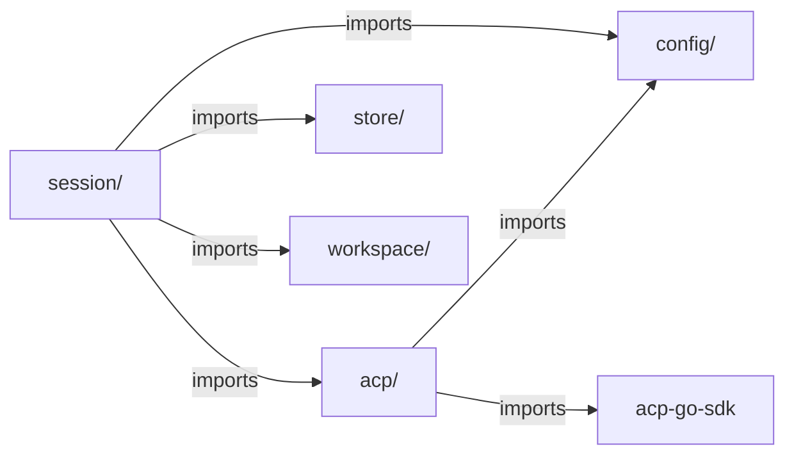

# Refactoring Analysis: Core Session & ACP Packages

> **Date**: 2026-04-06
> **Scope**: `internal/session/` (6 source files, 2753 LOC) and `internal/acp/` (6 source files, 2435 LOC)
> **Analyzed by**: AI-assisted refactoring analysis (Martin Fowler's catalog)
> **Language/Stack**: Go 1.x, single-binary daemon, interface-based DI, functional options
> **Test Coverage**: Good -- comprehensive unit and integration tests across both packages (~5600 LOC of tests)

---

## Executive Summary

The core `session/` and `acp/` packages are well-structured for a greenfield alpha, with clean interface boundaries and disciplined concurrency patterns. The most impactful findings center on: (1) **`manager.go` at 1205 lines is a Large Class** with mixed responsibilities spanning session lifecycle, workspace resolution, event recording, and prompt orchestration; (2) **significant code duplication** between `Create` and `Resume` flows (~50 lines of near-identical driver-start and activation logic); (3) **duplicated utility functions** across packages (`cloneRawMessage`/`cloneRawJSON`, `stringPointer`/`stringValue`/`derefString`, `firstNonEmpty`); and (4) the **`handleRequestPermission` function (95 lines)** contains three heavily duplicated event-emission blocks. The transcript parsing layer has accumulated substantial complexity through legacy compatibility, which is worth revisiting given the project's zero-backward-compatibility stance.

| Severity | Count |
|----------|-------|
| Critical (P0) | 0 |
| High (P1) | 4 |
| Medium (P2) | 7 |
| Low (P3) | 6 |
| **Total** | **17** |

### Top Opportunities (Quick Wins + High Impact)

| # | Finding | Location | Effort | Impact |
|---|---------|----------|--------|--------|
| 1 | Extract duplicated Create/Resume driver-start sequence | `session/manager.go:298-348,479-513` | moderate | Eliminates ~50 lines of copy-paste, reduces future divergence risk |
| 2 | Consolidate duplicated raw-clone and string helpers | `session/transcript.go:595`, `acp/handlers.go:753`, etc. | trivial | Removes 5+ identical functions scattered across packages |
| 3 | Extract `handleRequestPermission` permission-event emission | `acp/handlers.go:228-324` | moderate | Removes 3x duplicated 12-line event-emission blocks |
| 4 | Split `manager.go` into focused files | `session/manager.go` (1205 LOC) | moderate | Improves navigability and separates lifecycle from orchestration |
| 5 | Replace legacy transcript parsers with canonical-only | `session/transcript.go:367-437` | significant | Simplifies ~150 lines of legacy compat code in a zero-compat project |

---

## Findings

### P1 -- High

#### F1: Large Class -- `manager.go` (1205 lines, 7+ responsibilities)

- **Smell**: Large Class / Divergent Change
- **Category**: Bloater / Change Preventer
- **Location**: `internal/session/manager.go:1-1206`
- **Severity**: High
- **Impact**: The Manager struct handles session creation, resumption, stopping, prompting, event recording, workspace resolution, metadata persistence, process watching, and cleanup. Changes to any of these concerns require editing the same 1200-line file. The constructor alone has 14 optional dependencies.

**Current Code** (simplified):
```go
type Manager struct {
    sessions, pending, finalizing maps
    logger, driver, notifier, homePaths, workspace, openStore,
    assembler, now, newSessionID, newTurnID, maxSessions, promptBufSize
}
// Methods: Create, Resume, Stop, Prompt, ApprovePermission, Get, List,
//          lookup, reserve, activate, remove, claimFinalization,
//          writeMeta, pumpPrompt, normalizeEvent, recordEvent,
//          watchProcess, handleProcessExit, finalizeStopped,
//          cleanupFailedCreate, cleanupFailedResume, startupPrompt,
//          startPermissions, sessionLogger, resolveCreateWorkspace,
//          resolveResumeWorkspace, requireWorkspaceResolver,
//          effectiveMaxSessions + ListAll, Status, Events, History, Transcript (from query.go/transcript.go)
```

**Recommended Refactoring**: Extract Module / Split Phase -- separate `manager.go` into focused files within the same package:

**After** (proposed file organization):
```
session/
  manager.go          -- Manager struct, constructor, Get, List, lookup, reserve/activate/remove
  manager_lifecycle.go -- Create, Resume, Stop, finalizeStopped, cleanup helpers
  manager_prompt.go    -- Prompt, pumpPrompt, normalizeEvent, recordEvent
  manager_workspace.go -- resolveCreateWorkspace, resolveResumeWorkspace, resolveWorkspaceAgent
  manager_helpers.go   -- startupPrompt, startPermissions, writeMeta, sessionLogger, effectiveMaxSessions
```

**Rationale**: This is a file-level organization refactoring within the same package (consistent with project conventions). It groups related functions without changing any public API. The Manager struct stays in one place; methods are distributed by concern.

---

#### F2: Duplicated Code -- Create/Resume driver-start and activation sequence

- **Smell**: Duplicated Code
- **Category**: Dispensable
- **Location**: `internal/session/manager.go:298-348` and `internal/session/manager.go:479-513`
- **Severity**: High
- **Impact**: The post-driver-start sequence (updateFromProcess, activate, writeMeta, activate-in-map, watchProcess, notify) is nearly identical in Create and Resume. Any behavioral change (e.g., adding a post-activation hook) must be applied in both places.

**Current Code** (simplified):
```go
// In Create():
session.updateFromProcess(proc, m.now())
if err := session.activate(m.now()); err != nil { return nil, err }
if err := m.writeMeta(session); err != nil { return nil, err }
if err := m.activate(session); err != nil { return nil, err }
m.watchProcess(session)
if m.notifier != nil { m.notifier.OnSessionCreated(ctx, session) }

// In Resume(): (identical)
session.updateFromProcess(proc, m.now())
if err := session.activate(m.now()); err != nil { return nil, err }
if err := m.writeMeta(session); err != nil { return nil, err }
if err := m.activate(session); err != nil { return nil, err }
m.watchProcess(session)
if m.notifier != nil { m.notifier.OnSessionCreated(ctx, session) }
```

**Recommended Refactoring**: Extract Function

**After** (proposed):
```go
func (m *Manager) activateAndWatch(ctx context.Context, session *Session, proc *AgentProcess) error {
    session.updateFromProcess(proc, m.now())
    if err := session.activate(m.now()); err != nil {
        return err
    }
    if err := m.writeMeta(session); err != nil {
        return err
    }
    if err := m.activate(session); err != nil {
        return err
    }
    m.watchProcess(session)
    if m.notifier != nil {
        m.notifier.OnSessionCreated(ctx, session)
    }
    return nil
}
```

**Rationale**: Fowler's Rule of Three: this exact block appears twice, and the workspace/agent resolution preceding it is also highly similar. Extracting the activation sequence eliminates 12 lines of duplication and centralizes the post-start protocol.

---

#### F3: Duplicated Code -- `cleanupFailedCreate` and `cleanupFailedResume`

- **Smell**: Duplicated Code / Copy-Paste Variation
- **Category**: Dispensable
- **Location**: `internal/session/manager.go:964-1005`
- **Severity**: High
- **Impact**: These two cleanup functions differ only in that `cleanupFailedCreate` additionally removes the session directory. The process-stop and recorder-close logic is copy-pasted identically.

**Current Code** (simplified):
```go
func (m *Manager) cleanupFailedCreate(sessionDir string, recorder EventRecorder, proc *AgentProcess) error {
    // stop proc (8 lines)
    // close recorder (8 lines)
    // remove sessionDir (5 lines) <-- only difference
}

func (m *Manager) cleanupFailedResume(recorder EventRecorder, proc *AgentProcess) error {
    // stop proc (8 lines) -- identical
    // close recorder (8 lines) -- identical
}
```

**Recommended Refactoring**: Parameterize the Function

**After** (proposed):
```go
func (m *Manager) cleanupFailedStart(sessionDir string, recorder EventRecorder, proc *AgentProcess) error {
    var errs []error
    if proc != nil {
        stopCtx, cancel := context.WithTimeout(context.Background(), defaultLifecycleTimeout)
        if err := m.driver.Stop(stopCtx, proc); err != nil {
            errs = append(errs, err)
        }
        cancel()
    }
    if recorder != nil {
        closeCtx, cancel := context.WithTimeout(context.Background(), defaultLifecycleTimeout)
        if err := recorder.Close(closeCtx); err != nil {
            errs = append(errs, err)
        }
        cancel()
    }
    if strings.TrimSpace(sessionDir) != "" {
        if err := os.RemoveAll(sessionDir); err != nil {
            errs = append(errs, fmt.Errorf("session: remove failed session directory %q: %w", sessionDir, err))
        }
    }
    return errors.Join(errs...)
}
// Resume calls: m.cleanupFailedStart("", recorder, proc)
// Create calls: m.cleanupFailedStart(sessionDir, recorder, proc)
```

**Rationale**: The only difference is the sessionDir parameter. Passing an empty string for Resume elegantly skips the removal step. This eliminates 16 lines of duplicated cleanup logic.

---

#### F4: Long Function with Duplicated Event Emission -- `handleRequestPermission`

- **Smell**: Long Function / Duplicated Code
- **Category**: Bloater / Dispensable
- **Location**: `internal/acp/handlers.go:228-324`
- **Severity**: High
- **Impact**: This 95-line function contains three nearly identical 12-line blocks that build and emit permission events. Each block constructs an `AgentEvent` with the same fields (Type, SessionID, TurnID, RequestID, Timestamp, Title, ToolCallID, Action, Resource, Decision, Raw). Modifying the event structure requires updating all three places.

**Current Code** (simplified):
```go
// Block 1 (auto-resolve, line ~249-260):
p.emitPromptEvent(AgentEvent{
    Type: EventTypePermission, SessionID: ..., TurnID: turnID,
    RequestID: requestID, Timestamp: timeNowUTC(), Title: title,
    ToolCallID: ..., Action: ..., Resource: resource,
    Decision: string(appliedDecision), Raw: cloneRawJSON(raw),
})

// Block 2 (interactive-resolved, line ~285-300): identical structure
// Block 3 (timeout, line ~303-318): identical structure
```

**Recommended Refactoring**: Extract Function

**After** (proposed):
```go
func (p *AgentProcess) emitPermissionEvent(sessionID, turnID, requestID, title, toolCallID, resource string, decision permissionDecision, raw json.RawMessage) {
    p.emitPromptEvent(AgentEvent{
        Type:       EventTypePermission,
        SessionID:  sessionID,
        TurnID:     turnID,
        RequestID:  requestID,
        Timestamp:  timeNowUTC(),
        Title:      title,
        ToolCallID: strings.TrimSpace(string(toolCallID)),
        Action:     string(permissionRequestToolGrant),
        Resource:   resource,
        Decision:   string(decision),
        Raw:        cloneRawJSON(raw),
    })
}
```

**Rationale**: The three emission sites differ only in the `decision` value and the `raw` payload (which is rebuilt before each call). Extracting a helper reduces the function from 95 to ~55 lines and prevents field-set drift between the three code paths.

---

### P2 -- Medium

#### F5: Duplicated Utility Functions Across Packages

- **Smell**: Duplicated Code
- **Category**: DRY Violation
- **Location**: `session/transcript.go:595` (`cloneRawMessage`), `acp/handlers.go:753` (`cloneRawJSON`), `session/session.go:390` (`stringPointer`), `session/query.go:260` (`stringValue`), `session/manager.go:1143` (`derefString`), `session/transcript.go:618` (`firstNonEmpty`), `cli/format.go:270` (`firstNonEmpty`)
- **Severity**: Medium
- **Impact**: At least 5 identical or near-identical utility functions are duplicated across packages. `cloneRawMessage` and `cloneRawJSON` are byte-for-byte identical. `stringPointer`, `stringValue`, and `derefString` all convert between `string` and `*string` with minor variations. `firstNonEmpty` exists in both `session/` and `cli/`.

**Recommended Refactoring**: Extract to a shared internal utility package (e.g., `internal/xutil/` or inline within the consuming package as a single canonical copy).

**After** (proposed):
```go
// internal/xutil/strings.go
package xutil

func DerefString(value *string) string { ... }
func StringPtr(value string) *string { ... }
func FirstNonEmpty(values ...string) string { ... }

// internal/xutil/json.go
func CloneRawMessage(value json.RawMessage) json.RawMessage { ... }
```

**Rationale**: These are pure utility functions with no domain coupling. A shared package eliminates duplication without violating the project's downward-dependency rule. Alternatively, for the session-internal helpers, consolidate into a single `session/helpers.go`.

---

#### F6: `recordEvent` Field-by-Field Copy of TokenUsage

- **Smell**: Data Clumps / Manual Struct Mapping
- **Category**: Bloater
- **Location**: `internal/session/manager.go:834-851`
- **Severity**: Medium
- **Impact**: The `recordEvent` function manually copies 10 fields from `acp.TokenUsage` to `store.TokenUsage`. If a new usage field is added (which has happened -- `ThoughtTokens`, `CacheReadTokens`, etc.), both structs and this mapping must be updated in lockstep, risking missed fields.

**Current Code** (simplified):
```go
if err := recorder.RecordTokenUsage(ctx, store.TokenUsage{
    TurnID:           event.Usage.TurnID,
    InputTokens:      event.Usage.InputTokens,
    OutputTokens:     event.Usage.OutputTokens,
    TotalTokens:      event.Usage.TotalTokens,
    ThoughtTokens:    event.Usage.ThoughtTokens,
    CacheReadTokens:  event.Usage.CacheReadTokens,
    CacheWriteTokens: event.Usage.CacheWriteTokens,
    ContextUsed:      event.Usage.ContextUsed,
    ContextSize:      event.Usage.ContextSize,
    CostAmount:       event.Usage.CostAmount,
    CostCurrency:     event.Usage.CostCurrency,
    Timestamp:        event.Usage.Timestamp,
}); err != nil { ... }
```

**Recommended Refactoring**: Either unify the TokenUsage type (have `store` import from `acp`, or define once in a shared types package), or add a conversion function `acp.TokenUsage.ToStore() store.TokenUsage`.

**After** (proposed):
```go
func toStoreTokenUsage(u *acp.TokenUsage) store.TokenUsage {
    if u == nil { return store.TokenUsage{} }
    return store.TokenUsage{
        TurnID: u.TurnID, InputTokens: u.InputTokens, /* ... */
    }
}
// Usage:
if err := recorder.RecordTokenUsage(ctx, toStoreTokenUsage(event.Usage)); err != nil { ... }
```

**Rationale**: Centralizes the mapping in one place, making it impossible to miss a field on future additions.

---

#### F7: `marshalAgentEvent` is a Long Function with Mixed Abstraction Levels

- **Smell**: Long Function
- **Category**: Bloater
- **Location**: `internal/session/manager.go:1089-1141`
- **Severity**: Medium
- **Impact**: This 52-line function mixes three concerns: (1) building the canonical envelope, (2) parsing legacy raw payloads for tool metadata, and (3) JSON marshaling. The legacy-raw parsing block (lines 1108-1131) is particularly dense with nested conditionals.

**Recommended Refactoring**: Extract Function -- separate `enrichFromRawPayload(payload *canonicalEventPayload, raw json.RawMessage)` to isolate the legacy-enrichment logic.

**Rationale**: The canonical envelope construction is clear; the raw-payload enrichment is a separate concern that could be removed when legacy support is dropped.

---

#### F8: Legacy Transcript Parsers in a Zero-Compat Project

- **Smell**: Speculative Generality / Dead Code (potential)
- **Category**: Dispensable
- **Location**: `internal/session/transcript.go:367-437` (`parseLegacyTranscriptEvent`, `parseLooseTranscriptEvent`)
- **Severity**: Medium
- **Impact**: The project's CLAUDE.md states "Zero Legacy Tolerance -- never write migration, compat, or defensive code for old state." Yet `transcript.go` maintains two legacy parsing paths (`parseLegacyTranscriptEvent` and `parseLooseTranscriptEvent`) that handle pre-canonical event formats. These account for ~70 lines of complex parsing logic.

**Recommended Refactoring**: Evaluate whether any stored sessions use legacy formats. If not, remove both legacy parsers and `parseLooseTranscriptEvent`. If legacy data exists in `~/.agh/sessions/`, provide a one-time migration script rather than runtime compat code.

**Rationale**: Per the project's own architecture principles, backward compatibility code should be deleted. The canonical envelope (`agh.session.event.v1`) is the current format -- all new events use it.

---

#### F9: `handleInbound` Repeated Unmarshal-Dispatch Pattern

- **Smell**: Repeated Switches / Copy-Paste Variations
- **Category**: Conditional Complexity
- **Location**: `internal/acp/handlers.go:104-194`
- **Severity**: Medium
- **Impact**: The `handleInbound` method has 9 case branches, each following the same pattern: unmarshal params into a typed request, call a handler, map errors. This pattern is repeated identically across all branches.

**Current Code** (simplified):
```go
case acpsdk.ClientMethodFsReadTextFile:
    var request acpsdk.ReadTextFileRequest
    if err := json.Unmarshal(params, &request); err != nil {
        return nil, acpsdk.NewInvalidParams(...)
    }
    response, err := p.handleReadTextFile(ctx, request)
    if err != nil { return nil, requestError(err) }
    return response, nil
// Repeated 8 more times with only type names changing
```

**Recommended Refactoring**: Extract a generic dispatch helper using Go generics:

**After** (proposed):
```go
func dispatch[Req any, Resp any](params json.RawMessage, handler func(context.Context, Req) (Resp, error), ctx context.Context) (any, *acpsdk.RequestError) {
    var request Req
    if err := json.Unmarshal(params, &request); err != nil {
        return nil, acpsdk.NewInvalidParams(map[string]any{"error": err.Error()})
    }
    response, err := handler(ctx, request)
    if err != nil { return nil, requestError(err) }
    return response, nil
}
```

**Rationale**: This would reduce the switch body from ~90 lines to ~20 lines. However, note that some handlers take `context.Context` and some don't, so the handler signatures would need slight unification. This is a moderate-effort improvement.

---

#### F10: `AgentProcess` Struct is a Large Class (25+ fields)

- **Smell**: Large Class
- **Category**: Bloater
- **Location**: `internal/acp/types.go:191-225`
- **Severity**: Medium
- **Impact**: `AgentProcess` has 25+ fields spanning process metadata, connection handling, lifecycle control, prompt state, permission management, and system prompt injection. It accumulates responsibilities that could be separated into focused sub-components.

**Recommended Refactoring**: The process already delegates to `terminalManager` and `permissionPolicy`. Consider also extracting `promptState` (activePrompt, system prompt tracking) and `permissionBroker` (pending permissions, timeout, registration) into focused helper structs embedded in `AgentProcess`.

**Rationale**: While Go favors flat structs over deep hierarchies, 25 fields with 5 mutexes is approaching the threshold where extract-class improves clarity. The prompt and permission concerns are already logically distinct.

---

#### F11: `buildToolResult` Function Complexity

- **Smell**: Long Function / Nested Conditionals
- **Category**: Bloater / Conditional Complexity
- **Location**: `internal/session/transcript.go:439-488`
- **Severity**: Medium
- **Impact**: This 49-line function has multiple responsibility layers: raw output parsing, JSON unmarshaling with field extraction, tool-name-specific routing (`bash`, `glob`, `grep`, `read`), and empty-result detection. The final 7-line nil check for empty results is particularly fragile.

**Recommended Refactoring**: Split into phases: `parseRawToolOutput` + `routeToolOutput(toolName, displayText, failed)` + `isEmptyResult(result)`.

---

### P3 -- Low

| # | Smell | Location | Technique | Notes |
|---|-------|----------|-----------|-------|
| F12 | Magic Number | `acp/handlers.go:537-538` (`defaultTerminalOutputLimit = 64 * 1024`) used in two places without named reference in `appendOutput` | Extract Constant reference | The constant is defined but the comparison in `appendOutput` should reference it by name (it does -- this is fine; noting the pattern) |
| F13 | Duplicated sort logic | `session/manager.go:661-666` and `session/query.go:235-240` | Extract Function | Identical sort comparator for `[]*SessionInfo` appears twice -- already extracted as `sortSessionInfos` in `query.go` but `List()` duplicates it inline |
| F14 | Nil-guard repetition on Session methods | `session/session.go:86-220` | Consider removing nil-receiver guards | 10+ methods begin with `if s == nil { return ... }`. In Go, nil-receiver checks on value types are unusual and add noise. If Session is always non-nil by construction, these guards are defensive dead code. |
| F15 | `stringPointer` vs `stringValue` vs `derefString` naming inconsistency | `session/session.go:390`, `session/query.go:260`, `session/manager.go:1143` | Rename to consistent pair | Three functions doing string/pointer conversion with different names in the same package |
| F16 | `timeNowUTC()` wrapper in acp vs `m.now()` in session | `acp/handlers.go:762` vs `session/manager.go` | Make injectable | `acp` uses a package-level `timeNowUTC()` that's not injectable for testing, while `session` properly injects `now` via functional options. This inconsistency makes ACP timing non-deterministic in tests. |
| F17 | Constructor nil-then-default repetition | `session/manager.go:166-232` | Simplify with default-then-override | The `NewManager` constructor sets defaults, applies options, then re-checks and re-sets defaults for nil values. The initial defaults before the option loop are redundant for fields that are re-checked after. |

---

## Coupling Analysis

### Module Dependency Map



### High-Risk Coupling

| Module | Afferent (dependents) | Efferent (dependencies) | Risk |
|--------|----------------------|------------------------|------|
| `acp/` | 1 (session) | 2 (config, acpsdk) | low |
| `session/` | 3 (httpapi, udsapi, daemon) | 4 (acp, config, store, workspace) | medium |
| `config/` | 5+ | 0 | high -- heavily depended on, changes ripple |

### Circular Dependencies

None detected. Dependencies flow strictly downward: `session/ -> acp/ -> config/`. The `session/` package defines `AgentDriver` interface locally and `acp/` implements it via the adapter -- clean dependency inversion.

---

## DRY Analysis

### Duplicated Code Clusters

| Cluster | Locations | Lines | Extraction Strategy |
|---------|-----------|-------|-------------------|
| Create/Resume activation sequence | `manager.go:332-348`, `manager.go:497-513` | ~16 each | Extract `activateAndWatch()` method |
| Cleanup on failed start | `manager.go:964-986`, `manager.go:988-1005` | ~22 each | Merge into parameterized `cleanupFailedStart(sessionDir, ...)` |
| Permission event emission | `handlers.go:249-260`, `handlers.go:285-300`, `handlers.go:303-318` | ~12 each | Extract `emitPermissionEvent()` method |
| Raw JSON clone | `transcript.go:595-603`, `handlers.go:753-760` | ~8 each | Shared utility or consolidate |

### Magic Values

| Value | Occurrences | Suggested Constant Name | Files |
|-------|-------------|------------------------|-------|
| `5 * time.Second` | 3 | `defaultLifecycleTimeout` (already defined) | `manager.go` uses it; `permission.go:460` hardcodes `5 * time.Minute` |
| `64 * 1024` | 1 | `defaultTerminalOutputLimit` (already defined) | `handlers.go:21` |
| `"agh.session.event.v1"` | 1 | `eventEnvelopeSchema` (already defined) | `transcript.go:16` |

### Repeated Patterns

1. **String-pointer conversion triple**: `stringPointer`, `stringValue`, `derefString` -- three functions in the same package doing essentially the same conversion with different names and slight semantic differences (trimming behavior).

2. **Repeated `strings.TrimSpace` guards**: Extremely frequent throughout both packages. Nearly every string parameter is trimmed before use. Consider whether trim-at-boundary (API entry points only) would reduce internal noise.

3. **Repeated `append([]string(nil), slice...)` clone pattern**: Used ~15 times across both packages to defensive-copy slices. A shared `cloneStrings` helper would reduce this to one-liners.

---

## SOLID Analysis

> **Context**: This project uses interface-based DI with a pragmatic flat architecture. While not full DDD or hexagonal, it employs enough interface abstraction and dependency inversion to benefit from targeted SOLID analysis.

| Principle | Finding | Location | Severity | Recommendation |
|-----------|---------|----------|----------|----------------|
| SRP | Manager handles 7+ responsibilities | `session/manager.go` | Medium | Split into focused files (F1) |
| OCP | Adding new ACP client methods requires modifying `handleInbound` switch | `acp/handlers.go:104-194` | Low | Acceptable for now; registry pattern if methods grow beyond ~15 |
| ISP | `EventRecorder` interface has 5 methods; some consumers only use `Record` | `session/interfaces.go:147-153` | Low | Acceptable -- all 5 methods are cohesive |
| DIP | `acp/` uses `timeNowUTC()` package-level function instead of injectable clock | `acp/handlers.go:762` | Low | Inject clock for testability (F16) |

---

## Suggested Refactoring Order

### Phase 1: Quick Wins (trivial effort, immediate clarity)

1. **Consolidate `cleanupFailedCreate`/`cleanupFailedResume` into single function** -- `session/manager.go:964-1005` -- 5 min
2. **Rename string-pointer helpers to consistent names** -- `session/session.go`, `session/query.go`, `session/manager.go` -- 10 min
3. **Use `sortSessionInfos` in `List()` instead of inline sort** -- `session/manager.go:660-666` -- 2 min
4. **Extract `emitPermissionEvent` helper** -- `acp/handlers.go:228-324` -- 15 min

### Phase 2: High-Impact Structural Changes

1. **Extract `activateAndWatch` method to deduplicate Create/Resume** -- `session/manager.go` -- 30 min
2. **Split `manager.go` into focused files** -- `session/manager.go` -- 45 min
3. **Extract `enrichFromRawPayload` from `marshalAgentEvent`** -- `session/manager.go:1089-1141` -- 20 min
4. **Consolidate duplicated utilities into shared helpers** -- multiple files -- 30 min

### Phase 3: Deeper Architectural Improvements

1. **Evaluate and remove legacy transcript parsers** -- `session/transcript.go:367-437` -- requires audit of stored data
2. **Make `timeNowUTC` injectable in `acp/` package** -- `acp/handlers.go` -- 30 min
3. **Consider extracting `promptState` and `permissionBroker` from `AgentProcess`** -- `acp/types.go` -- significant

### Prerequisites

- All refactorings in Phase 1 and 2 are safe with existing test coverage.
- Phase 3 items (legacy parser removal) require verifying no stored sessions use legacy format.
- `make verify` must pass after each change.

---

## Risks and Caveats

- **Nil-receiver guards on Session (F14)**: These may be intentional defensive programming for a struct that is passed by pointer across goroutines. Before removing, verify that no code path can reach Session methods with a nil receiver. The current guards prevent panics at the cost of silent no-ops.
- **Legacy transcript parsers (F8)**: Flagged as potential dead code, but may be necessary if any persisted sessions in `~/.agh/sessions/` contain pre-canonical events from development/testing. A one-time migration is safer than silent removal.
- **`handleInbound` generic dispatch (F9)**: Go generics for method dispatch can reduce readability for unfamiliar contributors. The current explicit switch is verbose but very clear. Consider this a low-priority improvement.
- **Test coverage is strong**: Both packages have comprehensive test suites, making all proposed refactorings safe to execute incrementally.

---

## Appendix: Smell Distribution

| Category | Count | % |
|----------|-------|---|
| Bloaters | 5 | 29% |
| Change Preventers | 1 | 6% |
| Dispensables | 5 | 29% |
| Couplers | 0 | 0% |
| Conditional Complexity | 2 | 12% |
| DRY Violations | 3 | 18% |
| SOLID Violations | 1 | 6% |
| **Total** | **17** | **100%** |
