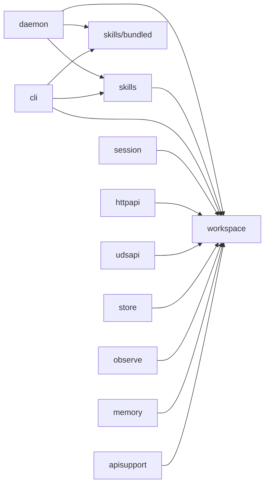

# Refactoring Analysis: internal/skills & internal/workspace

> **Date**: 2026-04-06
> **Scope**: `internal/skills/` (8 files, ~1,577 LOC prod) and `internal/workspace/` (4 files, ~1,259 LOC prod) -- the newer feature packages in AGH
> **Analyzed by**: AI-assisted refactoring analysis (Martin Fowler's catalog)
> **Language/Stack**: Go 1.22+, single-binary daemon, pragmatic flat architecture
> **Test Coverage**: Good -- both packages have thorough table-driven tests with `-race`, integration tests co-located, mock stores. Coverage appears to exceed 80% target.

---

## Executive Summary

Both packages are well-structured for a greenfield alpha, but **`workspace/resolver.go` is the clear hotspot** -- at 1,069 lines it aggregates workspace resolution, caching, cloning, filesystem scanning, name generation, and ID generation into a single file. The most impactful opportunity is extracting the ~180 lines of deep-clone boilerplate into a dedicated helpers file and the ~130 lines of filesystem scanning into its own module. A secondary pattern emerges across both packages: **duplicated `fileSnapshot` types and `snapshotsEqual`/`cloneSnapshots` functions** exist independently in `skills/` and `workspace/`, performing identical work with slightly different struct shapes. Both packages also share an identical `checkContext` helper pattern.

| Severity | Count |
|----------|-------|
| Critical (P0) | 0 |
| High (P1) | 3 |
| Medium (P2) | 5 |
| Low (P3) | 5 |
| **Total** | **13** |

### Top Opportunities (Quick Wins + High Impact)

| # | Finding | Location | Effort | Impact |
|---|---------|----------|--------|--------|
| 1 | Duplicated `fileSnapshot` type + comparison logic across packages | `skills/registry.go` + `workspace/resolver.go` | moderate | Eliminate cross-package DRY violation, reduce bug surface |
| 2 | Large File: resolver.go mixes resolution, scanning, cloning, ID gen | `workspace/resolver.go` | moderate | Improve navigability, separate concerns within the package |
| 3 | Duplicated skill-load-verify-overlay loop (3 occurrences) | `skills/registry.go:255-327` | moderate | Single change point for skill loading pipeline |
| 4 | Repeated `checkContext` pattern across packages | `skills/registry.go:437` + `workspace/resolver.go:1032` | trivial | Tiny shared utility reduces duplication |
| 5 | `reflect.DeepEqual` for map comparison in hot path | `skills/registry.go:201` | trivial | Replace with manual comparison for type safety and performance |

---

## Findings

### P1 -- High

#### F1: Duplicated `fileSnapshot` Type and Snapshot Helpers Across Packages

- **Smell**: Duplicated Code, Data Clumps
- **Category**: DRY Violation / Dispensable
- **Location**: `internal/skills/types.go:67-71` and `internal/workspace/resolver.go:64-67`; `internal/skills/registry.go:453-472` and `internal/workspace/resolver.go:849-868`; `internal/skills/registry.go:546-557` and `internal/workspace/resolver.go:870-880`
- **Severity**: High
- **Impact**: Two independent `fileSnapshot` structs and three pairs of near-identical helper functions (`snapshotsEqual`, `cloneSnapshots`/`cloneFileSnapshots`, `snapshotFile`/`snapshotPath`). Any bug fix or behavior change to snapshot staleness detection must be applied to both packages independently, risking divergence. The skills package `fileSnapshot` has a `path` field; the workspace one does not -- this is the only difference.

**Current Code** (simplified):
```go
// skills/types.go
type fileSnapshot struct {
    path    string
    modTime time.Time
    size    int64
}

// workspace/resolver.go
type fileSnapshot struct {
    modTime time.Time
    size    int64
}

// Both packages implement snapshotsEqual with identical logic:
func snapshotsEqual(left, right map[string]fileSnapshot) bool {
    if len(left) != len(right) { return false }
    for path, leftSnapshot := range left {
        rightSnapshot, ok := right[path]
        if !ok { return false }
        if leftSnapshot.size != rightSnapshot.size { return false }
        if !leftSnapshot.modTime.Equal(rightSnapshot.modTime) { return false }
    }
    return true
}
```

**Recommended Refactoring**: Extract Class / Introduce Shared Type

**After** (proposed):
```go
// internal/fsnap/fsnap.go (or a shared location like internal/fsutil/)
package fsnap

type Snapshot struct {
    ModTime time.Time
    Size    int64
}

func Equal(left, right map[string]Snapshot) bool { ... }
func Clone(src map[string]Snapshot) map[string]Snapshot { ... }
func FromPath(path string) (Snapshot, error) { ... }
```

**Rationale**: Fowler's Rule of Three -- the snapshot pattern appears in 3+ locations. A thin shared package eliminates divergence risk. The `path` field in the skills version is only used by `snapshotFile` return; callers already track the path as the map key, so it can be dropped.

---

#### F2: Large File -- resolver.go Mixes Multiple Responsibilities

- **Smell**: Large Class/Module, Divergent Change
- **Category**: Bloater / Change Preventer
- **Location**: `internal/workspace/resolver.go:1-1078`
- **Severity**: High
- **Impact**: At 1,069 lines, this file handles: workspace CRUD (`Register`, `Unregister`, `Update`, `Get`), resolution + caching (`Resolve`, `ResolveOrRegister`, cache management), filesystem scanning (`scanWorkspace`, `scanAgentSource`, `scanSkillSource`), agent/skill loading (`loadAgents`, `mergeSkillPaths`), deep cloning (~180 lines of `clone*` functions), ID generation, name generation, path canonicalization, and general utility helpers. Any change to workspace scanning, caching, or CRUD requires navigating a 1K-line file.

**Recommended Refactoring**: Extract functions into separate files within the same package

**After** (proposed file split):
```
workspace/
  resolver.go         -- Resolver struct, Resolve, ResolveOrRegister, cache logic (~350 lines)
  resolver_crud.go    -- Register, Unregister, Update, Get, List, createWorkspaceRegistration (~150 lines)
  scanner.go          -- scanWorkspace, scanAgentSource, scanSkillSource, loadAgents, mergeSkillPaths (~150 lines)
  clone.go            -- all clone* functions (~180 lines)
  helpers.go          -- canonicalRoot, normalizeAdditionalDirs, checkContext, errorType, generateID, etc (~120 lines)
```

**Rationale**: Go packages are the encapsulation boundary, not files. Splitting into focused files within the same package preserves the API surface while dramatically improving navigability. This is Fowler's "Split Phase" applied at the file level -- each file addresses one category of concern.

---

#### F3: Duplicated Skill Load-Verify-Overlay Loop (3 occurrences)

- **Smell**: Duplicated Code
- **Category**: Dispensable / DRY Violation
- **Location**: `internal/skills/registry.go:255-286` (`loadBundledSkills`), `internal/skills/registry.go:305-328` (`loadSkillPaths`), `internal/skills/registry.go:228-253` (`loadWorkspaceSkills`)
- **Severity**: High
- **Impact**: Three methods repeat the same core loop: iterate paths, parse skill, apply disabled, verify content, log warnings, skip critical, overlay into map. The only differences are (1) how the skill is parsed (bundled FS vs. disk file) and (2) whether source is assigned after parse. Any change to the loading pipeline (e.g., adding a new verification step) must be replicated in three places.

**Current Code** (simplified):
```go
// This pattern appears 3 times with minor variations:
for _, skillPath := range paths {
    if err := checkRegistryContext(ctx); err != nil { return ... }
    skill, err := ParseSkillFile(path)    // or parseBundledSkill()
    if err != nil { return ... }
    skill.Source = source                 // sometimes set
    r.applyDisabled(skill)
    warnings := VerifyContent(skill.Content)
    r.logVerificationWarnings(skill, warnings)
    if hasCriticalWarning(warnings) { continue }
    r.overlaySkill(dst, skill)
}
```

**Recommended Refactoring**: Extract Function -- create a unified `processSkill` method

**After** (proposed):
```go
// processSkill applies the shared post-parse pipeline: disable check, verify, log, overlay.
// Returns true if the skill was added, false if skipped.
func (r *Registry) processSkill(skill *Skill, dst map[string]*Skill) bool {
    r.applyDisabled(skill)
    warnings := VerifyContent(skill.Content)
    r.logVerificationWarnings(skill, warnings)
    if hasCriticalWarning(warnings) {
        return false
    }
    r.overlaySkill(dst, skill)
    return true
}
```

**Rationale**: The "Rule of Three" clearly applies. This also makes it trivial to add future pipeline steps (e.g., content sanitization, metrics) in one place.

---

### P2 -- Medium

#### F4: `reflect.DeepEqual` Used for Map Comparison on Global Reload

- **Smell**: Primitive Obsession (using reflection where typed comparison is available)
- **Category**: Coupler (tight coupling to reflect package for a simple check)
- **Location**: `internal/skills/registry.go:201`
- **Severity**: Medium
- **Impact**: `reflect.DeepEqual` on `map[string]*Skill` is used to detect whether the global skill map changed. This is both slower than a manual comparison and hides type errors at compile time. If the Skill struct gains fields with non-comparable types (e.g., func fields), this will silently break.

**Current Code** (simplified):
```go
if reflect.DeepEqual(r.globalSkills, loaded) {
    return nil
}
```

**Recommended Refactoring**: Replace with a content-hash or version-based comparison. Since snapshots already track file metadata, comparing `globalSnapshots` (which is already done by `snapshotsEqual` in the workspace cache path) would be the natural approach -- if snapshots are unchanged, the loaded skills are unchanged.

**After** (proposed):
```go
if snapshotsEqual(r.globalSnapshots, snapshots) {
    return nil
}
// Snapshots changed, so swap the skills.
r.globalSnapshots = cloneFileSnapshots(snapshots)
r.globalSkills = loaded
r.globalVersion.Add(1)
```

**Rationale**: The snapshot comparison already exists and is used elsewhere. This removes the `reflect` import from registry.go and provides a deterministic, type-safe check. Fowler: "Substitute Algorithm."

---

#### F5: `ParseSkillFile` Uses Package-Level `slog.Warn` Instead of Injected Logger

- **Smell**: Feature Envy (function reaches for global state instead of using the Registry's logger)
- **Category**: Coupler
- **Location**: `internal/skills/loader.go:68-69`
- **Severity**: Medium
- **Impact**: `ParseSkillFile` calls `slog.Warn(...)` directly for the "parsed skill without description" warning, while every other logging site in the package uses the registry's injected `r.logger`. This breaks the project's testability convention -- tests that capture log output via injected loggers will miss this warning. It also means the warning level cannot be controlled per-registry.

**Current Code** (simplified):
```go
func ParseSkillFile(path string) (*Skill, error) {
    // ...
    if skill.Meta.Description == "" {
        slog.Warn("skills: parsed skill without description", "path", absPath, "name", skill.Meta.Name)
    }
    return skill, nil
}
```

**Recommended Refactoring**: Move the warning to the caller (registry methods that invoke `ParseSkillFile`) where `r.logger` is available, or accept an optional logger parameter.

**After** (proposed):
```go
// In ParseSkillFile -- remove the slog.Warn call, return the skill as-is.
// In loadSkillPaths / loadWorkspaceSkills (callers):
skill, err := ParseSkillFile(path)
if err != nil { return ... }
if skill.Meta.Description == "" {
    r.logger.Warn("skills: parsed skill without description",
        "path", skill.FilePath, "name", skill.Meta.Name)
}
```

**Rationale**: The project convention (CLAUDE.md: "`log/slog` for structured logging") and the architectural principle of injected dependencies mean logging should flow through the injected logger, not the global default.

---

#### F6: `warnUnknownFields` Uses Package-Level `slog.Warn`

- **Smell**: Feature Envy (same pattern as F5)
- **Category**: Coupler
- **Location**: `internal/skills/loader.go:210-228`
- **Severity**: Medium
- **Impact**: Same issue as F5 -- `warnUnknownFields` calls `slog.Warn` directly. This function is called from `decodeSkillMeta`, which is called from `parseFrontmatter`, which is called from both `ParseSkillFile` and `parseBundledSkill`. Neither caller has access to a logger to pass down. The function also logs during YAML parsing, which is a side effect in what should be a pure parsing function.

**Recommended Refactoring**: Return unknown field names as part of the parse result (or as warnings in a separate return value) instead of logging as a side effect.

**After** (proposed):
```go
func decodeSkillMeta(frontmatter string) (SkillMeta, []string, error) {
    // ... returns unknown field names as second value
    unknownFields := collectUnknownFields(&document)
    return meta, unknownFields, nil
}
```

**Rationale**: Pure functions are easier to test and compose. The caller can decide whether/how to log. Fowler: "Separate Query from Modifier."

---

#### F7: Deep Clone Boilerplate in workspace/resolver.go (~180 lines)

- **Smell**: Long Function (collective), Data Clumps
- **Category**: Bloater
- **Location**: `internal/workspace/resolver.go:882-1014`
- **Severity**: Medium
- **Impact**: ~180 lines of mechanical `clone*` functions: `cloneResolvedWorkspace`, `cloneWorkspace`, `cloneWorkspaces`, `cloneConfig`, `cloneProviders`, `cloneProvider`, `cloneAgentDefs`, `cloneSkillPaths`, `cloneMCPServers`, `cloneStringMap`. These are pure data-copying functions that clutter the resolver file. They are correct and necessary (the project requires deep cloning for thread safety), but they belong in a separate file.

**Recommended Refactoring**: Move to `workspace/clone.go` within the same package. No API change needed -- these are all unexported.

**Rationale**: File-level organization is explicitly called out in CLAUDE.md as a project principle. Separating cloning logic from resolution logic makes both easier to review and maintain.

---

#### F8: `canonicalRoot` and `refreshRootDir` Have Overlapping Path Canonicalization Logic

- **Smell**: Duplicated Code
- **Category**: DRY Violation
- **Location**: `internal/workspace/resolver.go:473-515` (`refreshRootDir`) and `internal/workspace/resolver.go:748-784` (`canonicalRoot`)
- **Severity**: Medium
- **Impact**: Both functions perform `os.Stat` + `filepath.EvalSymlinks` + `filepath.Abs` with similar error handling for `os.ErrNotExist` -> `ErrWorkspaceRootMissing`. `refreshRootDir` additionally checks `IsDir()` and updates the store. The core "resolve a path to its canonical form" logic is duplicated.

**Current Code** (simplified):
```go
// refreshRootDir:
info, err := os.Stat(rootDir)
if errors.Is(err, os.ErrNotExist) { return Workspace{}, ErrWorkspaceRootMissing }
if !info.IsDir() { return error }
canonicalDir, err := filepath.EvalSymlinks(rootDir)
canonicalDir, err = filepath.Abs(canonicalDir)

// canonicalRoot:
absPath, err := filepath.Abs(trimmed)
info, err := os.Stat(absPath)
if errors.Is(err, os.ErrNotExist) { return "", ErrWorkspaceRootMissing }
if !info.IsDir() { return error }
canonicalPath, err := filepath.EvalSymlinks(absPath)
canonicalPath, err = filepath.Abs(canonicalPath)
```

**Recommended Refactoring**: Have `refreshRootDir` call `canonicalRoot` for the path resolution, then handle the store update logic separately.

**After** (proposed):
```go
func (r *Resolver) refreshRootDir(ctx context.Context, ws Workspace) (Workspace, error) {
    canonicalDir, err := canonicalRoot(ws.RootDir)
    if err != nil { return Workspace{}, err }
    if canonicalDir == ws.RootDir { return ws, nil }
    // ... update store with new canonical path
}
```

**Rationale**: Single source of truth for path canonicalization. Fowler: "Replace Inline Code with Function Call."

---

### P3 -- Low

| # | Smell | Location | Technique | Notes |
|---|-------|----------|-----------|-------|
| F9 | Duplicated `checkContext` pattern | `skills/registry.go:437-442`, `workspace/resolver.go:1032-1037` | Extract shared utility | Identical 5-line function in both packages. Could be a tiny shared `internal/ctxutil` package or just accepted as the cost of flat layout. |
| F10 | Magic constant: `workspaceCacheTTL = 10 * time.Minute` duplicated | `skills/registry.go:21`, `workspace/options.go:12` | Extract Constant | Both packages independently define a 10-minute cache TTL. If they should stay in sync, extract to shared config. If intentionally independent, document why. |
| F11 | `scanBundledFS` and `scanDirectoryWithSnapshots` share structural pattern | `skills/registry.go:599-642`, `skills/loader.go:115-188` | Potential Extract Function | Both walk a directory tree, skip hidden dirs, collect SKILL.md paths with depth limits. The FS walk vs. OS walk difference is real, but the skip/depth logic is duplicated. |
| F12 | `sort.SliceStable` + `slices.Clip` in `VerifyContent` mixes old/new sort APIs | `skills/verify.go:126-133` | Modernize API usage | Could use `slices.SortStableFunc` for consistency with the rest of the codebase which uses `slices.SortFunc` throughout. |
| F13 | Integration test helper duplication: `writeAgentDef`, `writeSkill`, `writeFile`, `createSymlink` | `workspace/resolver_test.go` + `workspace/resolver_integration_test.go` | Extract shared test helpers | These helpers are duplicated across unit and integration test files in the same package. Move to a `testutil_test.go` or use `TestMain` for shared setup. |

---

## Coupling Analysis

### Module Dependency Map



### High-Risk Coupling

| Module | Afferent (dependents) | Efferent (dependencies) | Risk |
|--------|----------------------|------------------------|------|
| `workspace` | 11 (session, httpapi, udsapi, store, observe, memory, apisupport, daemon, cli, skills, skills/bundled) | 1 (config) | **high** -- workspace is a foundational type; any breaking change ripples widely |
| `skills` | 3 (daemon, cli, bundled_test) | 2 (workspace, yaml) | low -- relatively isolated consumer |
| `skills/bundled` | 2 (daemon, cli) | 0 (only embed) | low -- leaf package |

### Circular Dependencies

None detected. Dependency flow is strictly downward: `daemon` -> `skills` -> `workspace` -> `config`.

### Key Observation

The `workspace` package has very high afferent coupling (11 dependents). The exported types (`Workspace`, `ResolvedWorkspace`, `SkillPath`, `WorkspaceResolver`, `WorkspaceStore`) form a central contract in the system. This is appropriate for a domain model package, but it means changes to these types require careful consideration. The current design is sound -- types are plain structs without methods that could change, and interfaces are narrow.

---

## DRY Analysis

### Duplicated Code Clusters

| Cluster | Locations | Lines | Extraction Strategy |
|---------|-----------|-------|-------------------|
| `fileSnapshot` type + `snapshotsEqual` + clone | `skills/types.go:67-71` + `skills/registry.go:453-557`, `workspace/resolver.go:64-67` + `workspace/resolver.go:849-880` | ~60 | Extract `internal/fsnap` package with shared `Snapshot`, `Equal`, `Clone`, `FromPath` |
| Skill load-verify-overlay loop | `skills/registry.go:228-253`, `:255-286`, `:305-328` | ~75 | Extract `processSkill` method on Registry |
| `checkContext` helper | `skills/registry.go:437-442`, `workspace/resolver.go:1032-1037` | ~10 | Accept duplication (2 occurrences) or extract `internal/ctxutil` |
| Path canonicalization | `workspace/resolver.go:473-515` + `:748-784` | ~70 | `refreshRootDir` should call `canonicalRoot` |
| Test helpers in workspace | `workspace/resolver_test.go` + `workspace/resolver_integration_test.go` | ~50 | Merge into shared `testhelpers_test.go` file |

### Magic Values

| Value | Occurrences | Suggested Constant Name | Files |
|-------|-------------|------------------------|-------|
| `10 * time.Minute` | 2 | Already named (`workspaceCacheTTL`, `defaultCacheTTL`) -- but defined independently | `skills/registry.go:21`, `workspace/options.go:12` |
| `"SKILL.md"` | 2 (independently defined) | Already named (`skillFileName`, `skillDefinitionFile`) | `skills/loader.go:17`, `workspace/resolver.go:23` |
| `"AGENT.md"` | 1 | Already named (`agentDefinitionFile`) | `workspace/resolver.go:22` |
| `300` | 1 | `maxScanCandidates` -- already named | `skills/loader.go:19` |

### Repeated Patterns

The deep-clone pattern in `workspace/resolver.go` is extensive but correct for the thread-safety requirements. The `cloneConfig` function is particularly detailed, manually copying every field of `aghconfig.Config`. If `Config` gains new fields, `cloneConfig` will silently produce incomplete clones. Consider a **compile-time completeness check** by adding a test that compares field counts via reflection (similar to `TestWorkspaceStructSurface` in `workspace_test.go`).

---

## SOLID Analysis

> **Context**: This project uses a pragmatic flat architecture with interface-based DI (Go-style: interfaces defined where consumed). It does not use DDD bounded contexts, but it does model a meaningful domain (agent sessions, workspaces, skills). SOLID analysis is applicable for the interface-based patterns.

| Principle | Finding | Location | Severity | Recommendation |
|-----------|---------|----------|----------|----------------|
| SRP | `resolver.go` handles 6+ responsibilities (CRUD, resolve, cache, scan, clone, ID gen) | `workspace/resolver.go` | Medium | Split into focused files within the package (F2) |
| OCP | Skills loading pipeline is closed -- adding a new step requires modifying 3 loop bodies | `skills/registry.go:228-328` | Medium | Extract `processSkill` to make pipeline extensible (F3) |
| ISP | `WorkspaceStore` interface has 7 methods -- all implementers use all methods | `workspace/store.go` | None | Interface is well-sized for its role |
| ISP | `WorkspaceResolver` interface has 2 methods -- appropriately narrow | `workspace/workspace.go:53-56` | None | Good design |
| DIP | `skills` depends on `workspace` for `ResolvedWorkspace` type only (data, not behavior) | `skills/registry.go:18` | None | Acceptable -- depends on a stable value type, not an implementation |
| DIP | `ParseSkillFile` and `warnUnknownFields` depend on global `slog.Default()` | `skills/loader.go:68,226` | Low | Should use injected logger (F5, F6) |

---

## Suggested Refactoring Order

Recommended sequence based on impact, effort, and dependency between refactorings:

### Phase 1: Quick Wins (trivial effort, immediate clarity)

1. **Extract `processSkill` method** in `skills/registry.go` to eliminate the 3x duplicated load-verify-overlay loop -- `internal/skills/registry.go:228-328` (F3)
2. **Replace `reflect.DeepEqual` with snapshot comparison** in `reloadGlobal` -- `internal/skills/registry.go:201` (F4)
3. **Move `slog.Warn` from `ParseSkillFile` to callers** that have access to `r.logger` -- `internal/skills/loader.go:68` (F5)
4. **Have `refreshRootDir` call `canonicalRoot`** instead of duplicating path resolution -- `internal/workspace/resolver.go:473` (F8)
5. **Use `slices.SortStableFunc` instead of `sort.SliceStable`** in verify.go -- `internal/skills/verify.go:126` (F12)

### Phase 2: High-Impact Structural Changes

1. **Split `workspace/resolver.go`** into `resolver.go`, `resolver_crud.go`, `scanner.go`, `clone.go`, `helpers.go` -- same package, no API change (F2, F7)
2. **Extract shared `fileSnapshot` type** into a small shared package (`internal/fsnap` or similar) used by both `skills` and `workspace` (F1)
3. **Return unknown fields from `decodeSkillMeta`** instead of logging as side effect (F6)

### Phase 3: Deeper Architectural Improvements

1. **Add `cloneConfig` completeness test** using reflection to detect missing fields when `Config` struct evolves (DRY Analysis observation)
2. **Consolidate test helpers** in `workspace/` between unit and integration test files (F13)
3. **Evaluate whether `checkContext` and cache TTL constants** should be shared or remain independent (F9, F10)

### Prerequisites

- All refactorings in Phase 1 are independent and can be done in any order
- F2 (file split) should be done before F1 (shared snapshot type) to reduce diff noise
- F5 and F6 (logger injection) can be done together as they address the same pattern
- `make verify` must pass after each refactoring step

---

## Risks and Caveats

- **`workspace` has 11 dependents**: Any change to exported types (`Workspace`, `ResolvedWorkspace`, `SkillPath`, `WorkspaceResolver`, `WorkspaceStore`) will have wide blast radius. All proposed refactorings here target unexported internals, so this risk is mitigated.
- **The `reflect.DeepEqual` in F4 may be intentional**: It provides a semantic comparison of parsed skill content, not just file metadata. If two different files produce the same parsed skills, the current code avoids bumping the version counter. The proposed snapshot-based approach changes this behavior slightly (it would bump the version even if the parsed result is identical after a file touch). This is likely acceptable for an alpha, but worth noting.
- **Shared `fileSnapshot` package (F1) adds a new package**: The project's CLAUDE.md says "sub-packages only when complexity justifies it." A 4-function, 1-type package is borderline. An alternative is to define the type in `workspace` (which has higher afferent coupling) and import it from `skills`. However, this creates a dependency direction that may not be desired.
- **Test helper duplication in workspace (F13)** is partially forced by Go's build tag system -- `resolver_test.go` (unit) and `resolver_integration_test.go` (integration, `//go:build integration`) cannot share helpers defined in non-tagged files because the integration file uses `_test` package suffix. The helpers duplicated in the integration test file (`writeAgentDef`, `writeSkill`, etc.) use the external package name. This is a Go constraint, not a code smell.
- **Global `slog` usage in `loader.go` (F5, F6)** may be intentional for the `ParseSkillFile` function, which is a standalone public function used by both the registry and the CLI. Making it accept a logger would change its signature. Moving the logging to callers is cleaner.

---

## Appendix: Smell Distribution

| Category | Count | % |
|----------|-------|---|
| Bloaters | 2 | 15% |
| Change Preventers | 1 | 8% |
| Dispensables | 3 | 23% |
| Couplers | 3 | 23% |
| Conditional Complexity | 0 | 0% |
| DRY Violations | 4 | 31% |
| SOLID Violations | 0 | 0% |
| **Total** | **13** | **100%** |

*Note: Some findings span multiple categories. Each finding is counted once under its primary category.*
