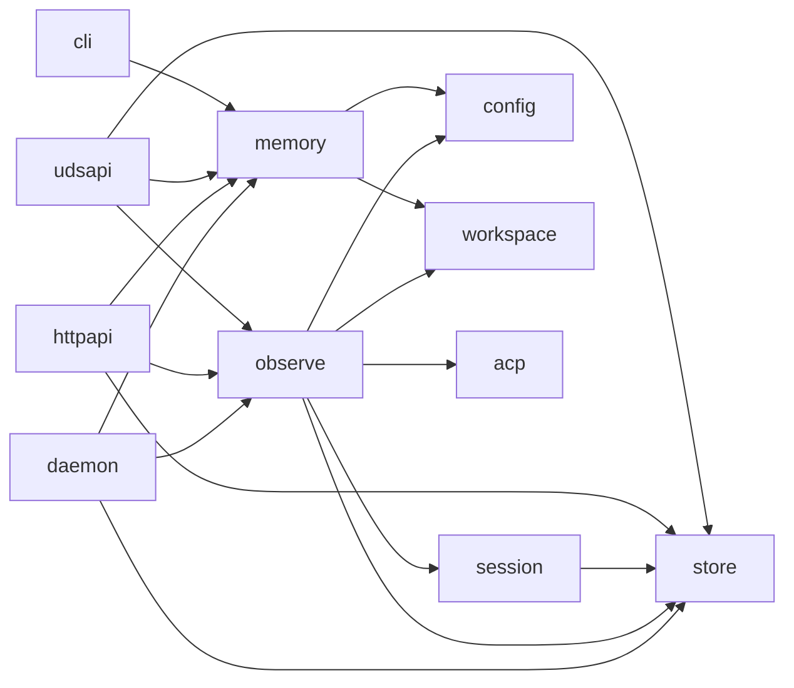

# Refactoring Analysis: Storage & Observability Packages

> **Date**: 2026-04-06
> **Scope**: `internal/store/`, `internal/observe/`, `internal/memory/` -- 17 source files (5,306 LOC), 15 test files
> **Analyzed by**: AI-assisted refactoring analysis (Martin Fowler's catalog)
> **Language/Stack**: Go 1.x, SQLite (modernc.org/sqlite), slog, functional options
> **Test Coverage**: Present and thorough -- table-driven, parallel, integration tests with `-race` flag

---

## Executive Summary

The three packages are well-structured for an alpha project with clean interface boundaries, good error wrapping, and solid test coverage. The most impactful finding is the **Large Class smell in `global_db.go`** (1,099 lines mixing workspace CRUD, session registry, observability writes, and schema migration), which concentrates four unrelated change reasons in one file. The second systemic issue is **pervasive Validate() boilerplate** duplicated across 10+ domain structs with identical `strings.TrimSpace` + switch patterns. A third area is **cross-package duplication of atomic-write logic and test helpers** (`testContext`, `equalStringSlices`, `atomicWriteFile`).

| Severity | Count |
|----------|-------|
| Critical (P0) | 0 |
| High (P1) | 3 |
| Medium (P2) | 6 |
| Low (P3) | 6 |
| **Total** | **15** |

### Top Opportunities (Quick Wins + High Impact)

| # | Finding | Location | Effort | Impact |
|---|---------|----------|--------|--------|
| 1 | Extract workspace CRUD from GlobalDB into dedicated file or type | `internal/store/global_db.go` | moderate | Reduces change-surface and cognitive load of the largest file |
| 2 | Extract shared `atomicWriteFile` to a common utility | `store/meta.go` + `memory/store.go` | trivial | Eliminates 30-line near-duplicate |
| 3 | Extract duplicated test helpers to shared test packages | multiple `_test.go` files | trivial | Eliminates 6 copies of `testContext`, 3 copies of `equalStringSlices` |

---

## Findings

### P1 -- High

#### F1: GlobalDB is a Large Class with Divergent Change

- **Smell**: Large Class / Large Module + Divergent Change
- **Category**: Bloater + Change Preventer
- **Location**: `internal/store/global_db.go:1-1097`
- **Severity**: High
- **Impact**: Four unrelated change reasons in one 1,099-line file: (1) workspace CRUD, (2) session registry, (3) event summary / token stats observability writes, (4) permission audit log. Any workspace schema change, session lifecycle change, or observability addition modifies this file.

**Current Code** (simplified):
```go
type GlobalDB struct { db *sql.DB; path string; now func() time.Time }

// Workspace CRUD (lines 54-206)
func (g *GlobalDB) InsertWorkspace(...)  error { ... }
func (g *GlobalDB) UpdateWorkspace(...)  error { ... }
func (g *GlobalDB) DeleteWorkspace(...)  error { ... }
func (g *GlobalDB) GetWorkspace(...)     (Workspace, error) { ... }
func (g *GlobalDB) ListWorkspaces(...)   ([]Workspace, error) { ... }

// Session Registry (lines 246-441)
func (g *GlobalDB) RegisterSession(...)      error { ... }
func (g *GlobalDB) UpdateSessionState(...)   error { ... }
func (g *GlobalDB) ListSessions(...)         ([]SessionInfo, error) { ... }
func (g *GlobalDB) ReconcileSessions(...)    (ReconcileResult, error) { ... }

// Observability (lines 443-720)
func (g *GlobalDB) WriteEventSummary(...)    error { ... }
func (g *GlobalDB) ListEventSummaries(...)   ([]EventSummary, error) { ... }
func (g *GlobalDB) UpdateTokenStats(...)     error { ... }
func (g *GlobalDB) ListTokenStats(...)       ([]TokenStats, error) { ... }
func (g *GlobalDB) WritePermissionLog(...)   error { ... }
func (g *GlobalDB) ListPermissionLog(...)    ([]PermissionLogEntry, error) { ... }
```

**Recommended Refactoring**: Extract Class / Split by File

**After** (proposed):
```
internal/store/
  global_db.go           -- GlobalDB struct, Open, Close, shared helpers (~100 lines)
  global_db_workspace.go -- InsertWorkspace, UpdateWorkspace, DeleteWorkspace, Get*, List, scan/normalize helpers
  global_db_session.go   -- RegisterSession, UpdateSessionState, ListSessions, ReconcileSessions, scan helpers
  global_db_observe.go   -- WriteEventSummary, ListEventSummaries, UpdateTokenStats, ListTokenStats, scan helpers
  global_db_permission.go-- WritePermissionLog, ListPermissionLog, scan helpers
```

All methods remain on `*GlobalDB` -- this is a file-level split, not a type decomposition. Each file groups one cohesive responsibility.

**Rationale**: Fowler's Divergent Change: "When you look at a piece of code and decide whether it needs to change for one reason or another, you should be able to focus on the code that changes for that reason." Splitting by file within the same package preserves the Go interface satisfaction while reducing cognitive load from 1,099 to ~200-250 lines per file.

---

#### F2: Duplicated Validate() Boilerplate Across 10+ Structs

- **Smell**: Duplicated Code / Copy-Paste Variations
- **Category**: DRY Violation
- **Location**: `internal/store/store.go:79-349` (SessionEvent.Validate, EventQuery.Validate, TokenUsage.Validate, SessionInfo.Validate, SessionListQuery.Validate, SessionStateUpdate.Validate, EventSummary.Validate, EventSummaryQuery.Validate, TokenStatsUpdate.Validate, TokenStatsQuery.Validate, PermissionLogEntry.Validate, PermissionLogQuery.Validate, SessionMeta.Validate)
- **Severity**: High
- **Impact**: 13 Validate() methods share the same structure: `switch { case strings.TrimSpace(f) == "": return errors.New("store: <field> is required") }`. Each requires manual maintenance when field rules change. The query validators all have the same `if q.Limit < 0` pattern copied 5 times.

**Current Code** (simplified):
```go
func (e SessionEvent) Validate() error {
    switch {
    case strings.TrimSpace(e.TurnID) == "":
        return errors.New("store: event turn id is required")
    case strings.TrimSpace(e.Type) == "":
        return errors.New("store: event type is required")
    case strings.TrimSpace(e.AgentName) == "":
        return errors.New("store: event agent name is required")
    default:
        return nil
    }
}

// Same pattern repeated 12 more times...

func (q EventQuery) Validate() error {
    if q.Limit < 0 { return fmt.Errorf("store: invalid event limit %d", q.Limit) }
    // ... same pattern in 4 other query types
}
```

**Recommended Refactoring**: Extract Function for common validation primitives

**After** (proposed):
```go
func requireField(value string, label string) error {
    if strings.TrimSpace(value) == "" {
        return fmt.Errorf("store: %s is required", label)
    }
    return nil
}

func requirePositiveLimit(limit int, label string) error {
    if limit < 0 {
        return fmt.Errorf("store: invalid %s %d", label, limit)
    }
    return nil
}

func (e SessionEvent) Validate() error {
    return errors.Join(
        requireField(e.TurnID, "event turn id"),
        requireField(e.Type, "event type"),
        requireField(e.AgentName, "event agent name"),
    )
}
```

**Rationale**: 5 identical `Limit < 0` checks and 10+ identical `strings.TrimSpace(x) == ""` checks are textbook DRY violations. A shared helper reduces boilerplate and centralizes the error message format. Note: `errors.Join` behavior differs from the current switch (it would report ALL errors, not short-circuit). If short-circuit is desired, keep the switch but extract just the check: `if err := requireField(e.TurnID, "event turn id"); err != nil { return err }`.

---

#### F3: Duplicated Atomic Write Logic Between store/ and memory/

- **Smell**: Duplicated Code
- **Category**: Dispensable / DRY Violation
- **Location**: `internal/store/meta.go:36-79` (WriteSessionMeta) and `internal/memory/store.go:489-521` (atomicWriteFile)
- **Severity**: High
- **Impact**: Two independent implementations of the same atomic-write-via-temp-file-and-rename pattern. Bug fixes to one (e.g., fsync behavior, error handling) may not reach the other.

**Current Code** (simplified):

store/meta.go:
```go
file, err := os.CreateTemp(filepath.Dir(cleanPath), filepath.Base(cleanPath)+".tmp-*")
// write, sync, close, rename
```

memory/store.go:
```go
func atomicWriteFile(path string, content []byte, mode os.FileMode) error {
    tempFile, err := os.CreateTemp(dir, ".memory-*")
    // write, chmod, close, rename
}
```

**Recommended Refactoring**: Extract Function into a shared internal utility

**After** (proposed):
```go
// internal/fileutil/atomic.go (or just internal/store, importable by memory)
func AtomicWriteFile(path string, content []byte, perm os.FileMode) error {
    dir := filepath.Dir(path)
    tmp, err := os.CreateTemp(dir, filepath.Base(path)+".tmp-*")
    if err != nil { return err }
    defer func() { _ = os.Remove(tmp.Name()) }()
    if _, err := tmp.Write(content); err != nil { _ = tmp.Close(); return err }
    if err := tmp.Chmod(perm); err != nil { _ = tmp.Close(); return err }
    if err := tmp.Sync(); err != nil { _ = tmp.Close(); return err }
    if err := tmp.Close(); err != nil { return err }
    return os.Rename(tmp.Name(), path)
}
```

**Rationale**: Fowler: "Copy-paste code is the most pernicious form of duplication." These two implementations diverge slightly (one calls Sync, the other doesn't), which is itself a latent bug. Unifying ensures consistent durability guarantees.

---

### P2 -- Medium

#### F4: schema.go Mixes Schema DDL, SQLite Infrastructure, and Migration Logic

- **Smell**: Large Class / Divergent Change
- **Category**: Bloater + Change Preventer
- **Location**: `internal/store/schema.go:1-734`
- **Severity**: Medium
- **Impact**: The file handles three unrelated responsibilities: (1) DDL statement constants (lines 18-107), (2) SQLite open/configure/recover infrastructure (lines 109-234), and (3) legacy workspace migration logic (lines 253-690). The migration code alone is 437 lines that will become dead code once all databases have been migrated.

**Recommended Refactoring**: Split Phase / Extract File

**After** (proposed):
```
internal/store/
  schema.go              -- DDL constants + ensureSchema + openSession/GlobalSQLite (~120 lines)
  sqlite.go              -- openSQLiteDatabase, configureSQLite, recoverSQLiteDatabase, etc. (~130 lines)
  migrate_workspace.go   -- migrateGlobalSchema + all legacy migration helpers (~490 lines)
```

**Rationale**: The migration code is a one-shot concern (greenfield alpha = "delete the old thing"). Once workspace migration is no longer needed, `migrate_workspace.go` can be deleted entirely without touching schema or infrastructure code.

---

#### F5: store.go Is Bloated with Types, Helpers, and SQL Utilities (568 lines)

- **Smell**: Large Class / Large Module
- **Category**: Bloater
- **Location**: `internal/store/store.go:1-568`
- **Severity**: Medium
- **Impact**: This file contains: (1) 13 domain struct definitions with Validate methods (~330 lines), (2) SQL clause builders and utility functions (~130 lines), (3) SQL null converters (~100 lines), (4) ID generation. Mixing domain types with SQL plumbing forces anyone reading domain types to wade through low-level helpers.

**Recommended Refactoring**: Extract File

**After** (proposed):
```
internal/store/
  types.go        -- SessionEvent, TokenUsage, SessionInfo, etc. with Validate methods
  store.go        -- package doc, constants, sentinel errors, interfaces (EventRecorder, SessionRegistry)
  sql_helpers.go  -- clause, buildClauses, appendWhere, appendLimit, nullable*, formatTimestamp, parseTimestamp, newID
```

**Rationale**: File-level splits within the same package are free in Go. Grouping domain types separately from SQL plumbing improves scanability.

---

#### F6: Nil Receiver Guard Boilerplate in Every GlobalDB Method

- **Smell**: Duplicated Code / Copy-Paste Variations
- **Category**: DRY Violation
- **Location**: `internal/store/global_db.go` -- appears in 18+ methods
- **Severity**: Medium
- **Impact**: Every public method on `*GlobalDB` starts with `if g == nil { return ..., errors.New("store: global database is required") }` followed by `if ctx == nil { return ..., errors.New("store: ... context is required") }`. This is 36+ lines of identical boilerplate.

**Current Code** (simplified):
```go
func (g *GlobalDB) InsertWorkspace(ctx context.Context, ws Workspace) error {
    if g == nil { return errors.New("store: global database is required") }
    if ctx == nil { return errors.New("store: insert workspace context is required") }
    // ...
}
// Same two checks repeated in every method
```

**Recommended Refactoring**: Extract Function

**After** (proposed):
```go
func (g *GlobalDB) checkReady(ctx context.Context) error {
    if g == nil { return errors.New("store: global database is required") }
    if ctx == nil { return errors.New("store: context is required") }
    return nil
}

func (g *GlobalDB) InsertWorkspace(ctx context.Context, ws Workspace) error {
    if err := g.checkReady(ctx); err != nil { return err }
    // ...
}
```

**Rationale**: This is a textbook "Extract Function" case. The method-specific context error message ("insert workspace context") adds minimal value over a generic "context is required" -- callers know which method they called. This eliminates ~36 lines.

---

#### F7: Duplicated `testContext` Helper Across 6 Packages

- **Smell**: Duplicated Code
- **Category**: Dispensable / DRY Violation
- **Location**: `internal/store/session_db_test.go:322`, `internal/observe/observer_test.go:488`, `internal/memory/dream_test.go:775`, `internal/acp/client_test.go:778`, `internal/session/manager_test.go:993`, `internal/daemon/daemon_test.go:1591`
- **Severity**: Medium
- **Impact**: Six identical `testContext(t)` implementations (create `context.WithTimeout`, `t.Cleanup(cancel)`, return `ctx`). Also `equalStringSlices` appears in `store/session_db_test.go` and `observe/reconcile_test.go` and `daemon/daemon_test.go`.

**Recommended Refactoring**: Extract to `internal/testutil/testutil.go`

**After** (proposed):
```go
// internal/testutil/testutil.go
package testutil

func Context(t *testing.T) context.Context {
    t.Helper()
    ctx, cancel := context.WithTimeout(context.Background(), 10*time.Second)
    t.Cleanup(cancel)
    return ctx
}

func EqualStringSlices(a, b []string) bool { ... }
```

**Rationale**: Go test helpers in `internal/testutil/` are importable only within the project. This eliminates 6 copies and provides a single place to adjust timeout defaults.

---

#### F8: Observer.New() Has Redundant Nil-Guard Initialization

- **Smell**: Dispensable / Dead Code pattern
- **Category**: Dispensable
- **Location**: `internal/observe/observer.go:131-191`
- **Severity**: Medium
- **Impact**: Lines 142-149 set defaults (`now`, `logger`, `versionSource`, `sessions`), then lines 157-173 check the same fields for nil and re-set defaults. This double-initialization is confusing and wasteful.

**Current Code** (simplified):
```go
observer := &Observer{
    now:           func() time.Time { return time.Now().UTC() },
    logger:        slog.Default(),
    versionSource: version.Current,
    sessions:      make(map[string]observedSession),
}
for _, opt := range opts { opt(observer) }

// Redundant re-checks:
if observer.now == nil { observer.now = func() time.Time { return time.Now().UTC() } }
if observer.logger == nil { observer.logger = slog.Default() }
if observer.versionSource == nil { observer.versionSource = version.Current }
if observer.sessions == nil { observer.sessions = make(map[string]observedSession) }
```

**Recommended Refactoring**: Remove redundant post-option nil guards

**After** (proposed):
```go
observer := &Observer{
    sessions: make(map[string]observedSession),
}
for _, opt := range opts { if opt != nil { opt(observer) } }

// Apply defaults only for fields not set by options:
if observer.now == nil { observer.now = func() time.Time { return time.Now().UTC() } }
if observer.logger == nil { observer.logger = slog.Default() }
if observer.versionSource == nil { observer.versionSource = version.Current }
```

**Rationale**: Either set defaults before options (and trust options to override) or set defaults after options (as fallback). Doing both is redundant.

---

#### F9: memory/dream.go Service Has Long Parameter List in Functional Options

- **Smell**: Potential -- this is borderline, the functional options pattern is idiomatic Go
- **Category**: Bloater (potential)
- **Location**: `internal/memory/dream.go:1-449`
- **Severity**: Medium
- **Impact**: The `Service` struct has 13 fields and 10+ `Option` functions. While functional options are idiomatic, the struct mixes configuration (minHours, minSessions, goal, prompt), runtime dependencies (lock, logger, now, countSessionsSince, workspaceResolver), and mutable state (mu, runMu, pending, priorMtime). The mutable state fields should not be configurable.

**Recommended Refactoring**: Split into config struct + runtime state

**After** (proposed):
```go
type serviceConfig struct {
    memStore    *Store
    sessionsDir string
    lockPath    string
    minHours    float64
    minSessions int
    logger      *slog.Logger
    goal        string
    prompt      string
}

type Service struct {
    cfg serviceConfig
    // runtime dependencies
    lock               consolidationLocker
    now                func() time.Time
    countSessionsSince func(time.Time) (int, error)
    workspaceResolver  workspacepkg.WorkspaceResolver
    // mutable state
    mu         sync.Mutex
    runMu      sync.Mutex
    pending    bool
    priorMtime time.Time
}
```

**Rationale**: Separating configuration from state makes it clearer which fields are set at construction time vs. mutated at runtime. However, this is a moderate effort refactoring with moderate payoff -- prioritize higher-impact items first.

---

### P3 -- Low

| # | Smell | Location | Technique | Notes |
|---|-------|----------|-----------|-------|
| F10 | Magic number `240` for max summary runes | `observe/observer.go:426` | Extract Constant | `const maxSummaryRunes = 240` |
| F11 | Magic number `200` for maxScanEntries in memory | `memory/store.go:23` | Already a constant | Good -- but `200` also appears in `defaultIndexLines` as a separate constant with the same value. Document relationship or use one. |
| F12 | `query.go` Middle Man pattern | `observe/query.go:1-22` | Potential Middle Man | Three methods that solely delegate to `o.registry.ListXxx()`. Intentional thin facade for API ergonomics -- acceptable. |
| F13 | `normalizeSessionType` repeated inline check | `store/store.go:443-449` | Already a function | Called in 2 locations -- fine. |
| F14 | `store/meta.go` WriteSessionMeta lacks Chmod | `store/meta.go:36-79` vs `memory/store.go:506-510` | Consistency issue | memory's atomicWriteFile calls Chmod, store's WriteSessionMeta does not. Not a smell per se, but an inconsistency that the shared utility (F3) would fix. |
| F15 | `observe/reconcile_test.go` has its own `equalStrings` | `observe/reconcile_test.go:201-211` | Extract to shared test helper | Near-duplicate of `store/session_db_test.go:equalStringSlices` |

---

## Coupling Analysis

### Module Dependency Map



### High-Risk Coupling

| Module | Afferent (dependents) | Efferent (dependencies) | Risk |
|--------|----------------------|------------------------|------|
| `store` | 8 (session, observe, httpapi, udsapi, daemon, cli, workspace, tests) | 1 (workspace) | medium -- high afferent coupling, but interface-buffered |
| `observe` | 4 (httpapi, udsapi, daemon, tests) | 5 (store, session, config, workspace, acp) | medium -- high efferent, but each dependency is via interface or small surface |
| `memory` | 5 (cli, httpapi, udsapi, daemon, tests) | 2 (config, workspace) | low |

### Circular Dependencies

None detected. Dependencies flow strictly downward: daemon -> {httpapi, udsapi, cli} -> {observe, session, memory} -> {store, config, workspace}. The architecture follows the project's stated principle that `daemon/` is the sole composition root.

---

## DRY Analysis

### Duplicated Code Clusters

| Cluster | Locations | Lines | Extraction Strategy |
|---------|-----------|-------|-------------------|
| Atomic write file | `store/meta.go:36-79`, `memory/store.go:489-521` | ~60 | Extract to shared `internal/fileutil` package or `store` package |
| `testContext(t)` helper | 6 packages (`store`, `observe`, `memory`, `acp`, `session`, `daemon`) | ~30 | Extract to `internal/testutil/testutil.go` |
| `equalStringSlices` / `equalStrings` | `store/session_db_test.go:417`, `observe/reconcile_test.go:201`, `daemon/daemon_test.go:1775` | ~30 | Extract to `internal/testutil/testutil.go` |
| Nil receiver + nil context guard | 18+ methods in `global_db.go`, 6+ in `session_db.go` | ~72 | Extract `checkReady(ctx)` helper method |
| `strings.TrimSpace(x) == ""` required field check | 13 Validate() methods in `store/store.go` | ~80 | Extract `requireField(value, label)` helper |
| Limit validation `if q.Limit < 0` | 5 query Validate() methods | ~15 | Extract `requirePositiveLimit(limit, label)` helper |

### Magic Values

| Value | Occurrences | Suggested Constant Name | Files |
|-------|-------------|------------------------|-------|
| `240` | 1 | `maxSummaryRunes` | `observe/observer.go:426` |
| `200` | 2 (separate constants already) | Verify `maxScanEntries` vs `defaultIndexLines` relationship | `memory/store.go` |
| `5000` | 1 (constant) | `defaultBusyTimeoutMS` | Already extracted in `store/store.go` |
| `"orphaned"` | 2 | `sessionStateOrphaned` | `store/global_db.go:425`, `observe/health.go:79` |
| `"user"` | 1 (constant) | `defaultSessionType` | Already extracted in `store/store.go` |

### Repeated Patterns

The **scan-rows-into-struct** pattern is repeated for every entity type in `global_db.go`: `scanWorkspace`, `scanSessionInfo`, `scanEventSummary`, `scanTokenStats`, `scanPermissionLog`. Each follows the identical structure: declare temp variables, call `scanner.Scan(...)`, parse timestamps, assign nullable fields. This is characteristic of Go database code and the variation between scanners (different columns) makes extraction difficult without reflection or code generation. Flagged as **intentional duplication** -- the Go community generally accepts this pattern.

---

## SOLID Analysis

> **Context**: This project uses a pragmatic flat architecture with interface-based DI. While not full DDD or hexagonal, it explicitly models domain concepts (sessions, agents, workspaces) and uses the interfaces-defined-where-consumed pattern. SOLID analysis is partially applicable.

| Principle | Finding | Location | Severity | Recommendation |
|-----------|---------|----------|----------|----------------|
| SRP | GlobalDB handles 4 responsibilities (workspace, session, observability, permissions) | `store/global_db.go` | High | Split by file (F1) |
| SRP | `schema.go` mixes DDL, infrastructure, and migration | `store/schema.go` | Medium | Split by file (F4) |
| OCP | Adding a new event summary type or token stat dimension requires modifying GlobalDB methods directly | `store/global_db.go` | Low | Acceptable for current complexity; monitor as types grow |
| ISP | `SessionRegistry` interface has 10 methods | `store/store.go:52-64` | Medium (potential) | Currently only one implementor (GlobalDB) and one consumer (observe). If more consumers appear, consider splitting into `SessionRegistrar` + `ObservabilityWriter` + `PermissionAuditor` |
| DIP | `observe/` depends on concrete `store.SessionInfo` and `store.EventSummary` types | `observe/observer.go` | Low | Acceptable -- these are value types, not behaviors. Wrapping them in observer-local types would be over-engineering. |

---

## Suggested Refactoring Order

### Phase 1: Quick Wins (trivial effort, immediate clarity)

1. **Extract shared `testContext` and `equalStringSlices`** to `internal/testutil/` -- `multiple test files`
2. **Extract `maxSummaryRunes = 240` constant** -- `observe/observer.go:426`
3. **Extract `sessionStateOrphaned = "orphaned"` constant** -- `store/global_db.go`, `observe/health.go`
4. **Remove redundant nil-guard initialization in Observer.New()** -- `observe/observer.go:157-173`

### Phase 2: High-Impact Structural Changes

1. **Split `global_db.go` into 4-5 files by responsibility** (F1) -- `store/global_db.go`
2. **Extract `atomicWriteFile` into a shared utility** (F3) -- `store/meta.go`, `memory/store.go`
3. **Extract `requireField` / `requirePositiveLimit` validation helpers** (F2) -- `store/store.go`
4. **Split `schema.go` into schema + sqlite infra + migration** (F4) -- `store/schema.go`

### Phase 3: Deeper Architectural Improvements

1. **Extract nil-receiver guard helper `checkReady(ctx)`** on GlobalDB and SessionDB (F6)
2. **Split `store.go` into `types.go` + `sql_helpers.go`** (F5) -- `store/store.go`
3. **Evaluate splitting `SessionRegistry` interface** if new consumers appear (ISP finding)

### Prerequisites

- All refactorings are safe given the existing test coverage. No additional tests are required before proceeding.
- F1 (split global_db.go) and F4 (split schema.go) are file-level splits with zero API changes -- no consumers need modification.
- F3 (shared atomicWriteFile) introduces a new package dependency from `memory` -- verify with `make verify` that no import cycle forms. Alternative: place it in `store/` and have `memory` import it, which is fine since `memory` does not currently import `store`.

---

## Risks and Caveats

- **F12 (query.go Middle Man)**: The three query methods in `observe/query.go` are pure delegates. This is flagged as "potential" Middle Man but is likely intentional -- it provides a stable API surface for httpapi/udsapi consumers without exposing the `Registry` interface directly. Recommend keeping.
- **F2 (Validate boilerplate)**: The proposed `errors.Join` approach changes error reporting from short-circuit to report-all. If short-circuit semantics are desired, use sequential `if err := requireField(); err != nil { return err }` instead.
- **Scan function duplication**: The per-entity scan functions (`scanWorkspace`, `scanSessionInfo`, etc.) follow identical patterns but have different columns. This is idiomatic Go database code and generally not worth abstracting without code generation.
- **memory/ and store/ have no cross-dependency**: The atomic write extraction (F3) would introduce the first import from `memory` to `store` (or to a new `internal/fileutil`). A new `internal/fileutil` package is cleaner architecturally.

---

## Appendix: Smell Distribution

| Category | Count | % |
|----------|-------|---|
| Bloaters | 4 | 27% |
| Change Preventers | 2 | 13% |
| Dispensables | 2 | 13% |
| Couplers | 1 | 7% |
| Conditional Complexity | 0 | 0% |
| DRY Violations | 5 | 33% |
| SOLID Violations | 1 | 7% |
| **Total** | **15** | **100%** |
