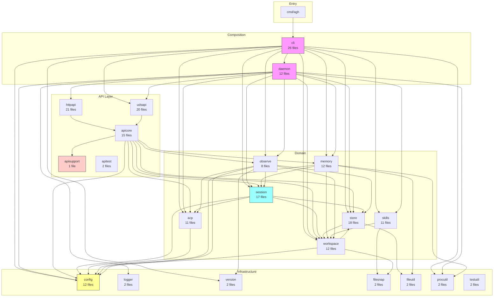
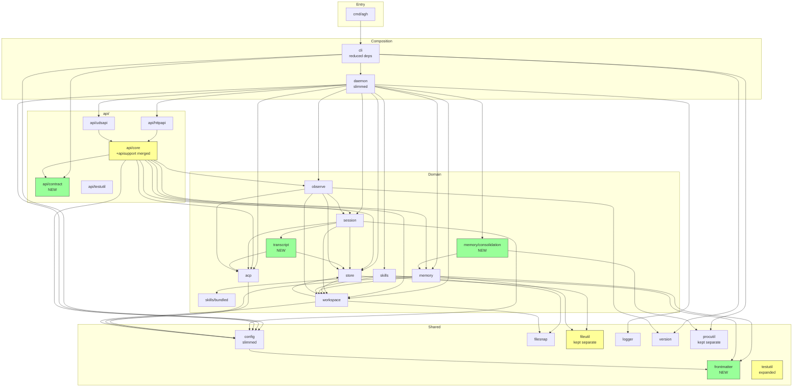

# Refactoring Analysis: Consolidated Summary

**Date**: 2026-04-06
**Codebase**: AGH (Agent Operating System) -- Go single-binary daemon
**Stats**: 21 packages, ~27K LOC (production), 217 Go files
**Reports**: 5 parallel subagent analyses (Core, API Layer, Domain Features, Infrastructure, CLI)

---

## Table of Contents

1. [All Findings by Severity](#1-all-findings-by-severity)
2. [Architectural Recommendations](#2-architectural-recommendations)
3. [Current Dependency Diagram](#3-current-dependency-diagram)
4. [Proposed Dependency Diagram](#4-proposed-dependency-diagram)
5. [Top 10 Opportunities by Impact](#5-top-10-opportunities-by-impact)
6. [Phased Execution Roadmap](#6-phased-execution-roadmap)

---

## 1. All Findings by Severity

### P0 -- Critical (1 finding)

| # | ID | Finding | Packages | Action | Effort | Report |
|---|-----|---------|----------|--------|--------|--------|
| 1 | CP-3 | Duplicated `TokenUsage` type (12 identical fields, field-by-field copy) -- creates drift risk across acp/store boundary | acp, store | (C) Extract to shared location | Moderate | Core |

### P1 -- High (27 findings)

| # | ID | Finding | Packages | Action | Effort | Report |
|---|-----|---------|----------|--------|--------|--------|
| 2 | A-1 | `acp/handlers.go` is 774 LOC covering 4 unrelated concerns (dispatch, terminal, permission, events) | acp | (A) File-level split into 3-4 files | Trivial | Core |
| 3 | F-MEM-04 | `parseFrontmatter` + `normalizeLineEndings` + `findClosingDelimiter` duplicated across 3 packages (~200 LOC duplicated) | memory, config, skills | (C) Extract `internal/frontmatter` | Moderate | Domain |
| 4 | F-MEM-01 | `memory` package has 4 distinct subdomains (Store, Dream/Consolidation, Lock, Assembler) in one flat package | memory | (B) Split `memory/consolidation` subpackage | Moderate | Domain |
| 5 | 3.1 | ~800 lines of near-identical handler tests between httpapi and udsapi | httpapi, udsapi | (C) Consolidate into apicore tests | Moderate | API |
| 6 | S-1 | `transcript.go` is 643 LOC standalone module with zero coupling to session lifecycle | session | (B) Extract to `internal/transcript/` | Moderate | Core |
| 7 | S-5 | `Create` and `Resume` share ~70% structure (~80 duplicated lines) | session | (D) Extract shared `startSession` helper | Moderate | Core |
| 8 | CP-1 | `newID` function duplicated verbatim between session and store | session, store | (C) Extract to shared package | Trivial | Core |
| 9 | ST-1 | `migrate_workspace.go` is 586 LOC of legacy migration code (violates zero-legacy policy) | store | Delete | Trivial | Core |
| 10 | ST-3 | `SessionRegistry` interface has 11 methods spanning 4 domains (ISP violation) | store | (B) Split into focused interfaces | Moderate | Core |
| 11 | C-5 | `config` is a God package (72 importers, 7 responsibilities) | config | (B) Extract `internal/agentdef/` | Significant | Core |
| 12 | A-2 | `acp/permission.go` mixes policy engine + pending permission state machine (546 LOC) | acp | (A) File-level split | Trivial | Core |
| 13 | F1.2 | `daemon/dream.go` has 323 LOC of domain logic exceeding composition-root scope | daemon | (B) Move to `internal/memory` | Moderate | Infra |
| 14 | F1.10 | Test helpers (`discardLogger`, `freeTCPPort`, `shortSocketPath`, `waitForCondition`) duplicated across 5+ packages | testutil + 5 pkgs | (C) Centralize in testutil | Trivial | Infra |
| 15 | F6.1 | `testutil` exports only 2 functions -- missing widely-duplicated helpers | testutil | (C) Add missing helpers | Trivial | Infra |
| 16 | 2.1+3.2 | 13 empty 1-line placeholder files across httpapi (6) and udsapi (7) | httpapi, udsapi | Delete | Trivial | API |
| 17 | 4.1 | `apisupport` is vestigial single-file package (147 LOC), only imported by apicore | apisupport | (B) Merge into apicore | Low | API |
| 18 | 3.3 | ~300 lines of duplicated server lifecycle code between httpapi and udsapi | httpapi, udsapi | (C) Extract shared ServerBase | Significant | API |
| 19 | 2.2 | Duplicated prompt payload types in httpapi differ only in timestamp format | httpapi, apicore | (C) Consolidate | Moderate | API |
| 20 | ~~F-SKL-04/05~~ | ~~`fileSnapshot` struct + `snapshotsEqual` duplicated~~ **RESOLVED**: `internal/filesnap` already exists and is used by both `skills` and `workspace` | ~~skills, workspace~~ | N/A | N/A | Domain |
| 21 | F-MEM-05/06 | `normalizeLineEndings` + `findClosingDelimiter` duplicated (part of frontmatter) | memory, config, skills | (C) Part of frontmatter extraction | Trivial | Domain |
| 21b | F-SKL-03 | Duplicated `errFrontmatterMissing`/`errFrontmatterUnterminated` sentinels | memory, skills | (C) Part of frontmatter extraction | Trivial | Domain |
| 21c | F-OBS-05 | `activeCounts()` conflates active sessions and active agents -- will silently return wrong data if they diverge | observe | (D) Separate metrics | Low | Domain |
| 21d | CLI-9 | Domain helper logic (`memoryNameFromFilename`, `normalizeSkillName`, `renderSkillXML`) lives in CLI instead of domain packages | cli | (C) Move to memory/skills | Low | CLI |
| 22 | F-OBS-01 | `observe` imports 7 packages -- `defaultPermissionModeResolver` contains composition-root logic | observe | (D) Move resolver to daemon | Low | Domain |
| 23 | F-WS-01 | `workspace.Resolver` is God Object (CRUD + resolution + caching + scanning + config) | workspace | (B) Consider splitting scanner | Moderate | Domain |
| 24 | CLI-1 | `client.go` has 20+ DTO types representing API contract defined only in CLI | cli | (B) Extract to `internal/api/contract` | Moderate | CLI |
| 25 | CLI-3 | `skill.go` (920 LOC) bypasses daemon -- opens SQLite DB, walks FS directly | cli | (B) Extract skill resolution service | Significant | CLI |
| 26 | CLI-4 | 15+ output bundle functions follow identical triple-format pattern (DRY) | cli | (D) Declarative field-spec approach | Moderate | CLI |
| 27 | CP-4 | Duplicated `SessionInfo` type between session and store | session, store | Document or unify | Trivial | Core |
| 28 | F-SKL-01 | `registry.go` is 715 lines mixing 7 responsibilities | skills | (A) File-level split | Low | Domain |

### P2 -- Medium (39 findings)

| # | ID | Finding | Packages | Action | Effort |
|---|-----|---------|----------|--------|--------|
| 29 | A-3 | `handleRequestPermission` duplicated event emission 4x | acp | (D) Extract helper | Trivial |
| 30 | A-4 | `handleInbound` 90-line switch with repeated dispatch boilerplate | acp | (D) Reduce with helper | Trivial |
| 31 | A-5 | `types.go` mixes DTOs + process state (429 LOC) | acp | (A) File-level split | Trivial |
| 32 | S-2 | `interfaces.go` mixes types, adapter, and AgentProcess struct | session | (A) File-level split | Trivial |
| 33 | S-4 | `marshalAgentEvent` re-uses transcript replay logic in forward path | session | (D) Decouple | Moderate |
| 34 | S-6 | session owns both runtime orchestration AND query concerns | session | (B) Optional split | Moderate |
| 35 | S-7 | `AgentProcess` wrapper is a Middle Man around `acp.AgentProcess` | session | (C) Consider removing | Significant |
| 36 | ST-2 | `store/types.go` has 14 flat types across 5 domains (328 LOC) | store | (A) File-level split | Trivial |
| 37 | ST-6 | store handles 5 distinct domains in one package | store | (B) Consider subpackage split | Significant |
| 38 | ST-7 | Circular-ish dependency: store -> workspace -> store | store, workspace | Analysis (correct DI) | N/A |
| 39 | C-1 | `config.go` is 511 LOC mixing 12 structs + loading logic | config | (A) File-level split | Trivial |
| 40 | C-4 | `agent.go` mixes agent parsing + workspace discovery + skill dirs | config | (A) File-level split | Trivial |
| 41 | CP-2 | `cloneRawJSON`/`cloneRawMessage` duplicated between acp and session | acp, session | (C) Extract shared | Trivial |
| 42 | CP-5 | `normalizeSessionType` duplicated in session and store | session, store | (C) Consolidate | Trivial |
| 43 | F1.1 | `boot()` is 303-line orchestration monolith | daemon | (A) Decompose into phases | Moderate |
| 44 | F1.3 | `WriteInfo()` duplicates `fileutil.AtomicWriteFile` | daemon | (D) Use fileutil | Trivial |
| 45 | F1.4 | `syncDir()` duplicated between daemon and store | daemon, store | (C) Add to fileutil | Trivial |
| 46 | F1.5 | `Daemon` struct has 37 fields (God Object) | daemon | (A) Extract sub-structs | Moderate |
| 47 | F1.7 | `boundary.go` implements static analysis inside daemon | daemon | (B) Optional extraction | Low |
| 48 | F1.8 | `ComposedAssembler` in daemon -- acceptable unless prompt assembly becomes a first-class session concern | daemon | Keep (reviewed) | N/A |
| 49 | F4.1 | `fileutil` missing `SyncDir()` that others duplicate | fileutil | (C) Add function | Trivial |
| 50 | 1.1 | `BaseHandlers` God Struct (14 fields, 6 domains) | apicore | (B) Split into domain groups | Significant |
| 51 | 1.2 | `parsers.go` depends on `gin.Context` (framework coupling) | apicore | (D) Accept `url.Values` | Low |
| 52 | 1.4 | `memory.go` is 413 LOC largest file in apicore | apicore | (A) File-level split | Trivial |
| 53 | 2.4 | `shared_test.go` heavy alias boilerplate in httpapi + udsapi | httpapi, udsapi | (C) Consolidate | Low |
| 54 | 2.5 | `server.go` duplicates default-setting logic with udsapi | httpapi | (D) Extract shared config | Moderate |
| 55 | 3.4 | `shared.go`/`shared_test.go` near-identical between transports | httpapi, udsapi | (C) Consolidate | Low |
| 56 | 3.5 | `helpers_test.go` duplicated between httpapi and udsapi | httpapi, udsapi | (C) Move to apitest | Low |
| 57 | F-MEM-02 | `dream.go` Service scans session directories directly (feature envy) | memory | (D) Inject from daemon | Low |
| 58 | F-MEM-03 | `assembler.go` imports `session` and `workspace` concrete types | memory | (D) Acceptable | Low |
| 59 | F-MEM-07 | `contextErr`/`checkContext`/`checkRegistryContext` duplicated across 3 pkgs | memory, workspace, skills | (C) Optional shared helper | Low |
| 60 | F-MEM-08 | `store.go` is 489 lines mixing CRUD + frontmatter + utilities | memory | (A) File-level split | Trivial |
| 61 | F-OBS-02 | `observer.go New()` auto-opens database (impure constructor) | observe | (D) Make registry required | Low |
| 62 | F-OBS-03 | `OnAgentEvent` is 76 lines mixing 4 concerns | observe | (D) Extract sub-methods | Low |
| 63 | F-WS-02 | `clone.go` deeply clones `config.Config` internals (maintenance trap) | workspace | (C) Move Clone to config | Moderate |
| 64 | F-WS-04 | `canonicalRoot` duplicates logic in `refreshRootDir` | workspace | (D) Extract shared helper | Trivial |
| 65 | CLI-2 | `DaemonClient` interface has 25 methods (ISP violation, 220-line stub) | cli | (D) Split into domain interfaces | Moderate |
| 66 | CLI-5 | Stream handler duplication between session and observe commands | cli | (C) Generic stream helper | Low |
| 67 | CLI-7 | Integration test duplicates harness code from udsapi/httpapi | cli | (C) Share via apitest | Moderate |

### P3 -- Low (23 findings)

| # | ID | Finding | Packages | Action |
|---|-----|---------|----------|--------|
| 68 | S-3 | Duplicate sort comparator for `[]*SessionInfo` | session | (D) Reuse `sortSessionInfos` |
| 69 | C-2 | Mechanical overlay Apply methods (necessary boilerplate) | config | Accept |
| 70 | C-3 | Hardcoded provider versions | config | (D) Extract to constants |
| 71 | C-6 | `ResolveAgentName` misplaced in bootstrap.go | config | (C) Move to session |
| 72 | ST-4 | Boilerplate nullable helpers (183 LOC) | store | (D) Accept |
| 73 | ST-5 | Overly defensive workspace normalization | store | (D) Minor cleanup |
| 74 | F1.6 | `notifier.go` thin fan-out (justified) | daemon | Keep |
| 75 | F1.9 | `daemon_test.go` is 2,096 lines with embedded fakes | daemon | (A) Split test files |
| 76 | F2.2 | `logger` has only 1 consumer (justified) | logger | Keep |
| 77 | F3.2 | `version` is 32 LOC (justified) | version | Keep |
| 78 | F5.1 | `procutil` is 29 LOC (justified) | procutil | Keep |
| 79 | F6.2 | `EqualStringSlices` replaceable with `slices.Equal` | testutil | (D) Simplify |
| 80 | 1.5 | Duplicated exported/unexported function pairs in apicore | apicore | (D) Remove after P0 |
| 81 | 2.3 | `shared.go` thin alias file in httpapi | httpapi | (D) Use apicore directly |
| 82 | 2.6 | `handlerConfig` mirrors `BaseHandlerConfig` | httpapi | (D) Use directly |
| 83 | 5.2 | Missing `StubDreamTrigger` in apitest | apitest | (C) Export stub |
| 84 | F-SKL-02 | `bundled/` subpackage is good pattern (positive) | skills | Keep |
| 85 | F-SKL-06 | `slog.Warn` used directly instead of injected logger | skills | (D) Use registry logger |
| 86 | F-SKL-07 | `warnUnknownFields` uses global `slog.Warn` | skills | (D) Accept |
| 87 | F-WS-03 | `workspace.go` has clean domain model separation (positive) | workspace | Keep |
| 88 | CLI-8 | Dead `lastEventID` assignment | cli | (D) Remove |
| 89 | CLI-10 | `commandDeps.withDefaults()` 60-line nil-check chain | cli | (D) Optional cleanup |
| 90 | CLI-11 | `parseSinceFlag` uses `time.Now()` fallback (dead code) | cli | (D) Remove fallback |

### Summary Statistics

| Severity | Count | Notes |
|----------|-------|-------|
| P0 Critical | 1 | Only `TokenUsage` duplication (cross-boundary drift risk) |
| P1 High | 27 | 4 former P0s reclassified + 3 missing findings added |
| P2 Medium | 39 | Includes 1 resolved finding (F-SKL-04/05, already fixed by `filesnap`) |
| P3 Low | 23 | |
| **Total** | **90** | (1 resolved finding retained for traceability) |

> **Severity policy**: P0 = cross-boundary correctness risk (data drift, silent corruption). P1 = high-priority refactoring (large duplication, SRP violations, oversized files). P2 = opportunistic improvements. P3 = litter-pickup.

---

## 2. Architectural Recommendations

### 2.1 Packages to CREATE (new packages for domain concepts)

| New Package | Source | Rationale | Effort |
|-------------|--------|-----------|--------|
| `internal/frontmatter` | memory, config, skills | ~200 LOC of identical YAML frontmatter parsing duplicated across 3 packages. Generic `Parse[T any]()` function. | Moderate |
| `internal/transcript` | session | 643 LOC self-contained event replay engine with zero session lifecycle coupling. | Moderate |
| `internal/memory/consolidation` | memory, daemon | Dream service (449 LOC) + scheduling + workspace resolution logic from daemon (323 LOC). Follows the `skills/bundled` subpackage pattern. | Moderate |
| `internal/api/contract` | cli | 20+ DTO types representing the daemon API contract, currently defined only in CLI. Lives inside `api/` subtree to avoid split-brain (contract next to its consumers). | Moderate |

### 2.2 Packages to SPLIT (existing packages doing too much)

| Package | Split Into | Rationale |
|---------|-----------|-----------|
| `internal/memory` | `memory` (store, assembler) + `memory/consolidation` (dream service, lock, prompt) | 4 distinct subdomains. Consolidation has 700+ LOC and different change cadence. |
| `internal/store` (optional) | `store` (types, helpers) + `store/sessiondb` (per-session SQLite) + `store/globaldb` (global database) | 5 domains in one package, 13-method interface. Start with splitting the interface. |
| `internal/apicore` + `apisupport` | `api/core` (merge apisupport in) | apisupport is vestigial (147 LOC, 1 consumer). |

### 2.3 Packages to MERGE

| Merged | Into | Rationale |
|--------|------|-----------|
| `apisupport` | `apicore` | Single-file vestigial package, only imported by apicore through pass-through wrappers. |

### 2.4 Packages to REORGANIZE (subpackage grouping)

| Current Flat Packages | Proposed Structure | Rationale |
|----------------------|-------------------|-----------|
| `apicore`, `apisupport`, `apitest`, `httpapi`, `udsapi` | `api/core`, `api/contract`, `api/httpapi`, `api/udsapi`, `api/testutil` | All 5 share the `api` prefix, have tight coupling, identical dependency sets. Use explicit names (`api/httpapi` not `api/http`) to avoid ambiguity with Go's `net/http`. Contract types co-located with their consumers. |
| `memory`, `memory/consolidation` | Subpackage | Dream service is already partially there, formalize it. |
| `skills`, `skills/bundled` | Already correct | Good pattern to follow elsewhere. |

### 2.5 Domain Concepts: Current State vs. Proposed

| Domain Concept | Current Location | Proposed Location | Why Move |
|---------------|-----------------|-------------------|----------|
| Frontmatter parsing | memory, config, skills (3 copies) | `internal/frontmatter` | DRY -- 200 LOC tripled |
| Event transcript/replay | `session/transcript.go` | `internal/transcript` | Zero coupling to session, 22% of package |
| Dream orchestration | `daemon/dream.go` + `memory/dream.go` | `memory/consolidation` | Domain logic in composition root |
| Prompt composition | `daemon/composed_assembler.go` | Keep in `daemon/` | Composition-root concern -- only move if prompt assembly becomes a first-class session boundary |
| ID generation | session + store (2 copies) | `internal/idgen` or `testutil` | Identical implementations |
| Atomic file ops | fileutil (incomplete) + daemon + store (duplicates) | `internal/fileutil` (expanded) | Add `SyncDir()`, use everywhere. Stays separate -- store is SQLite persistence, not the right home for generic FS primitives. |
| File snapshot/diffing | ~~skills + workspace (duplicated)~~ | `internal/filesnap` (ALREADY EXISTS) | Already extracted and used by both packages. No action needed. |
| API contract types | cli only | `internal/api/contract` | Shared contract inside `api/` subtree, co-located with consumers |
| Skill resolution | cli (direct DB/FS access) | `skills` or `skills/resolver` | CLI bypasses daemon |
| Config cloning | workspace | config | Knows config struct internals |

---

## 3. Current Dependency Diagram



**Key observations from current diagram:**
- `config` is imported by nearly everything (72 files) -- hottest change target
- `cli` imports 14 packages -- too many for a presentation layer
- `daemon` imports 15+ packages -- expected for composition root but contains domain logic
- `apisupport` is a dead-end package with only 1 consumer
- `filesnap` exists as shared utility for skills + workspace (often missed in analysis)
- 5 API packages sit flat alongside unrelated packages

---

## 4. Proposed Dependency Diagram



**Key improvements in proposed diagram:**
- CLI drops from 14 to ~6 dependencies (pure presentation layer)
- `daemon` loses dream domain logic but keeps `ComposedAssembler` (composition-root concern)
- 5 flat API packages become `api/` subtree (5 children including `contract`)
- `frontmatter` eliminates 3-way duplication
- `transcript` reduces session package by 22%
- `api/contract` creates a shared server/client DTO contract co-located with API code
- `memory/consolidation` follows the `skills/bundled` pattern
- `observe` drops `config` dependency (permission resolver moves to daemon)
- `fileutil` and `procutil` stay flat -- idiomatic Go for small, honest utility packages
- Flat package count: 20 -> 16 top-level (with 4 new packages, 1 merged, 5 nested under `api/`, 2 as subpackages)

---

## 5. Top 10 Opportunities by Impact

| Rank | Finding | Severity | Impact | Effort | What Changes |
|------|---------|----------|--------|--------|-------------|
| **1** | Unify `TokenUsage` type (CP-3) | P0 | Eliminates field-by-field copy, prevents drift between acp/store boundary. Only true cross-boundary correctness risk. | Moderate | 2 packages, 1 copy function deleted |
| **2** | Extract `internal/frontmatter` (F-MEM-04) | P1 | Eliminates ~200 LOC triplicated across 3 packages + 3 error sentinels. Highest DRY ROI. | Moderate | New package, 3 packages simplified |
| **3** | Consolidate handler tests (3.1) | P1 | Removes ~800 lines of duplicate tests. Highest test maintenance ROI. | Moderate | httpapi/udsapi tests reduced 60% |
| **4** | Delete 586-LOC migration code (ST-1) | P1 | Zero-legacy policy mandates removal. Frees store from legacy concerns. Note: verify schema state first. | Trivial | 1 file deleted |
| **5** | Centralize test helpers (F1.10) | P1 | Touches 5+ packages, eliminates ~120 LOC of duplication. Trivial effort. | Trivial | testutil expanded, 5+ packages simplified |
| **6** | Extract `transcript` from session (S-1) | P1 | 643 LOC standalone module, reduces session by 22%. Clean extraction. | Moderate | New package, session simplified |
| **7** | Delete 13 empty placeholder files (2.1+3.2) | P1 | Immediate noise reduction, clarifies actual package structure. | Trivial | 13 files deleted |
| **8** | Merge apisupport into apicore (4.1) | P1 | Removes vestigial package + 8 pass-through wrappers. | Low | 1 package deleted, apicore cleaned up |
| **9** | Move dream orchestration to memory (F1.2) | P1 | 323 LOC of domain logic moved from composition root. Daemon becomes pure wiring. | Moderate | daemon slimmed, memory enriched |
| **10** | Split `SessionRegistry` interface (ST-3) | P1 | 11-method God Interface -> focused interfaces. Enables narrow consumer contracts. | Moderate | store refactored, consumers narrowed |

---

## 6. Phased Execution Roadmap

### Phase 0: Quick Wins (Trivial effort, high signal, ~1-2 hours)

Goal: Clean up noise and eliminate trivial duplications without structural changes.

| Task | Findings | Packages | Lines Affected |
|------|----------|----------|----------------|
| Delete 13 empty placeholder files | 2.1, 3.2 | httpapi, udsapi | -13 files |
| Delete 586-LOC legacy migration | ST-1 | store | -586 LOC |
| Add `DiscardLogger`, `FreeTCPPort`, `ShortSocketPath`, `WaitForCondition` to testutil | F1.10, F6.1 | testutil + 5 consumers | -120 LOC duplication |
| Use `fileutil.AtomicWriteFile` in daemon, add `SyncDir` to fileutil | F1.3, F1.4, F4.1 | daemon, store, fileutil | -60 LOC duplication |
| Deduplicate `newID` function | CP-1 | session, store | -15 LOC |
| Deduplicate `cloneRawJSON`/`cloneRawMessage` | CP-2 | acp, session | -10 LOC |
| Replace `EqualStringSlices` with `slices.Equal` | F6.2 | testutil | -10 LOC |
| Reuse `sortSessionInfos` in `List()` | S-3 | session | -6 LOC |

**Estimated total**: ~800 LOC removed/deduplicated, 13 files deleted. Low risk, but note: deleting `migrate_workspace.go` is a behavior change in persistence bootstrapping -- verify that the current schema is the only one in use before deleting.

### Phase 1: Structural Extractions (Moderate effort, ~4-8 hours)

Goal: Create the new packages that eliminate cross-package duplication and improve SRP.

| Task | Findings | What Changes |
|------|----------|-------------|
| Extract `internal/frontmatter` | F-MEM-04, F-MEM-05/06, F-SKL-03 | New package with generic `Parse[T]()`. Update memory, config, skills to use it. |
| Extract `internal/transcript` from session | S-1 | Move `transcript.go` + transcript types. Session calls `transcript.Assemble()`. |
| Merge apisupport into apicore | 4.1 | Inline 9 functions, delete apisupport package, remove 8 pass-through wrappers. |
| Unify `TokenUsage` type | CP-3 | Pick one location (acp or shared), delete duplicate, remove copy function. |
| ~~Extract `fileSnapshot` + `snapshotsEqual` to shared~~ | ~~F-SKL-04/05~~ | ~~RESOLVED: `internal/filesnap` already exists and is used by both packages.~~ |
| Move `Config.Clone()` to config package | F-WS-02 | Move clone functions from workspace to config. |

**Estimated total**: 3 new packages created, 1 package deleted, ~400 LOC of duplication eliminated.

### Phase 2: File-Level Reorganization (Moderate effort, ~2-4 hours)

Goal: Split oversized files within packages for readability.

| Task | Findings | Package |
|------|----------|---------|
| Split `acp/handlers.go` (774 LOC) into 3-4 files | A-1 | acp |
| Split `acp/permission.go` into policy + pending | A-2 | acp |
| Split `acp/types.go` into DTOs + process | A-5 | acp |
| Split `config/config.go` into types + loading | C-1 | config |
| Split `config/agent.go` into agent + discovery | C-4 | config |
| Split `store/types.go` by domain | ST-2 | store |
| Split `memory/store.go` after frontmatter extraction | F-MEM-08 | memory |
| Split `skills/registry.go` into registry + helpers | F-SKL-01 | skills |
| Split `daemon_test.go` into domain test files | F1.9 | daemon |

**Estimated total**: ~20 file splits, zero logic changes. Pure readability improvement.

### Phase 3: Interface & Coupling Improvements (Significant effort, ~8-16 hours)

Goal: Improve architectural boundaries, reduce coupling, and address ISP violations.

| Task | Findings | What Changes |
|------|----------|-------------|
| Split `SessionRegistry` (11 methods) into focused interfaces | ST-3 | store interface + all consumers narrowed |
| Extract dream orchestration from daemon to memory/consolidation | F1.2, F-MEM-01 | daemon slimmed, new `memory/consolidation` subpackage |
| Consolidate handler tests (eliminate ~800 LOC duplication) | 3.1 | httpapi/udsapi tests reduced, apicore tests authoritative |
| Extract shared server lifecycle from httpapi/udsapi | 3.3 | ~300 LOC deduplication, shared `ServerBase` |
| Deduplicate Create/Resume in session manager | S-5 | Extract `startSession()`, ~80 LOC dedup |
| Move `defaultPermissionModeResolver` to daemon | F-OBS-01 | observe drops config+workspace deps |
| Decompose `boot()` into named phases | F1.1 | Readability of 303-line function |

### Phase 4: Strategic Restructuring (Significant effort, ~16-24 hours)

Goal: Reorganize package tree for long-term maintainability. Best done as a single coordinated effort.

| Task | Findings | What Changes |
|------|----------|-------------|
| Reorganize API packages under `internal/api/` subtree | API group recommendation | 5 flat packages -> `api/{core,contract,httpapi,udsapi,testutil}` |
| Extract `internal/api/contract` (shared API contract) | CLI-1 | CLI DTO types become shared, co-located inside `api/` subtree |
| Extract skill resolution from CLI | CLI-3 | CLI drops store, workspace, skills imports |
| Extract `internal/agentdef` from config (optional) | C-5 | config loses 2 of 7 responsibilities |
| Deduplicate bundle pattern in CLI | CLI-4 | 15+ functions -> declarative field specs |
| Split `DaemonClient` into domain interfaces | CLI-2 | 25-method interface -> 6 focused interfaces |

**After Phase 4, the package structure would be:**

```
internal/
  api/                  # NEW parent
    core/               # apicore + apisupport merged
    contract/           # NEW: shared API contract DTOs (co-located with api/)
    httpapi/            # httpapi (transport only, explicit name avoids net/http ambiguity)
    udsapi/             # udsapi (transport only)
    testutil/           # apitest
  acp/                  # ACP protocol client
  cli/                  # CLI commands (reduced deps)
  config/               # Config loading (slimmed)
  daemon/               # Composition root (keeps ComposedAssembler)
  filesnap/             # File snapshot metadata + equality (already exists)
  fileutil/             # Atomic file ops + SyncDir (kept separate -- generic FS primitives)
  frontmatter/          # NEW: YAML frontmatter parsing
  logger/               # Structured logging
  memory/               # Memory store, assembler
    consolidation/      # NEW: Dream service, lock, scheduling
  observe/              # Event recording, health
  procutil/             # Process utilities (kept separate -- small but honest)
  session/              # Session lifecycle
  skills/               # Skill catalog, registry
    bundled/            # Bundled skill files
  store/                # SQLite persistence
  testutil/             # Test helpers (expanded)
  transcript/           # NEW: Event replay/normalization
  version/              # Build metadata
  workspace/            # Workspace resolver
```

**Net change**: 21 flat packages -> 17 top-level packages + 5 subpackages. 3 new packages created (`frontmatter`, `transcript`, `memory/consolidation`), 1 new subpackage (`api/contract`), 1 deleted (`apisupport`), 5 nested under `api/`. `filesnap` already exists and is retained.

### Design rationale

Package organization follows Go community conventions observed in large projects (CockroachDB: 50 flat packages, Kubernetes: 31, Prometheus: 23). The Go standard library groups under a parent **only when the parent has real shared code** (`crypto/`, `encoding/`, `net/`). The `api/` subtree follows this pattern -- `api/core` contains shared handlers, interfaces, and payloads consumed by `api/httpapi` and `api/udsapi`. Utility packages (`fileutil`, `procutil`, `testutil`) stay flat because they share no domain relationship and grouping them under `util/` would create an empty namespace package with no code -- a Go anti-pattern.

Sources: [go.dev/doc/modules/layout](https://go.dev/doc/modules/layout), [Google Go Style Guide](https://google.github.io/styleguide/go/best-practices.html), [Russ Cox on golang-standards/project-layout#117](https://github.com/golang-standards/project-layout/issues/117).

---

## Appendix: Reports Index

| Report | File | Findings | Notes |
|--------|------|----------|-------|
| Core | `20260406-core.md` | 26 | SessionRegistry count corrected (11 not 13). Coupling metrics mix test imports. |
| API Layer | `20260406-api-layer.md` | 18 | Uses old names (`api/http`). File counts stale. |
| Domain Features | `20260406-domain-features.md` | 20 | F-SKL-04/05 is stale (`filesnap` already exists). LOC counts stale. |
| Infrastructure | `20260406-infra-utils.md` | 14 | ComposedAssembler recommendation overridden (stays in daemon). Daemon fields: 45 not 37. |
| CLI | `20260406-cli.md` | 12 | Uses old name (`apitypes`). File count is 27 not 26. |
| Verification | `20260406-verification.md` | -- | Missed `filesnap` existence. 87% accuracy (3 errors found + 1 false PASS on F-SKL-04). |
| Codex Review | `20260406-codex-review.md` | -- | GPT-5.4 review identifying stale findings, naming drift, severity inflation. |
| **Summary** | `20260406-summary.md` | **90** | Corrected: 1 P0, 27 P1, 39 P2, 23 P3. 1 finding resolved (filesnap). |

> **Note on individual reports**: The per-group reports were generated against a point-in-time snapshot and contain stale metrics (file counts, LOC, some coupling data). The summary document is the authoritative source after corrections. Individual reports are useful for detailed finding descriptions but should not be trusted for exact numbers.
