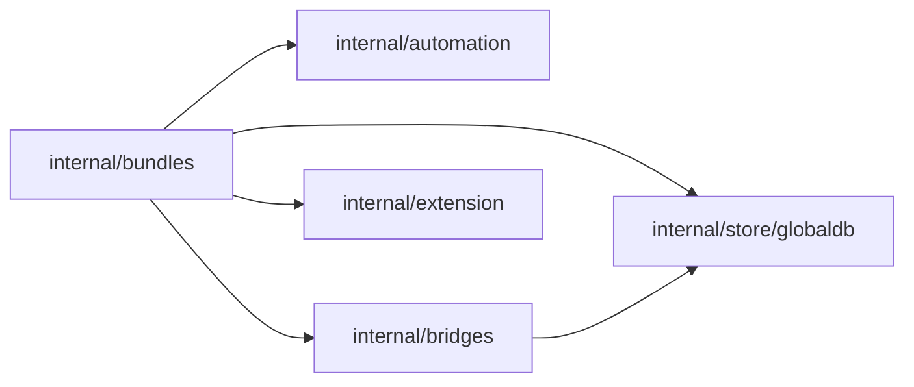

# Refactoring Analysis: Bundle Runtime Reconcile

> **Date**: 2026-04-14
> **Scope**: `internal/bundles`, `internal/bridges`, and the bundle-activation persistence path in `internal/store/globaldb`
> **Analyzed by**: AI-assisted refactoring analysis (Martin Fowler's catalog)
> **Language/Stack**: Go, SQLite, daemon-managed runtime services
> **Test Coverage**: partial; after this pass `internal/bundles` is ~66.6% and `internal/store/globaldb` is ~78.4% for targeted `go test -cover` runs

---

## Executive Summary

The highest-cost smell in this area was divergent change around bridge reconciliation: `internal/bundles.Service` both compiled activation intent and owned bridge CRUD. That coupling is now addressed by moving managed bridge synchronization behind a bridge-owned sync abstraction. The second major issue was hidden state drift and partial rollback semantics in the activation runtime; this pass adds persisted spec hashing, serialized reconcile, and explicit rollback failure surfacing, but deeper transactional compensation remains intentionally out of scope.

| Severity         | Count |
| ---------------- | ----- |
| 🔴 Critical (P0) | 2     |
| 🟠 High (P1)     | 1     |
| 🟡 Medium (P2)   | 1     |
| 🔵 Low (P3)      | 0     |
| **Total**        | **4** |

### Top Opportunities (Quick Wins + High Impact)

| #   | Finding                                                        | Location                                                                             | Effort   | Impact                                                                          |
| --- | -------------------------------------------------------------- | ------------------------------------------------------------------------------------ | -------- | ------------------------------------------------------------------------------- |
| 1   | Separate bridge reconcile from bundle activation orchestration | `internal/bundles/service.go:74`, `internal/bridges/managed_sync.go:12`              | moderate | Reduces shotgun surgery when bridge lifecycle rules evolve                      |
| 2   | Persist activation-specific spec hash and warn on drift        | `internal/bundles/service.go:634`, `internal/store/globaldb/global_db_bundles.go:30` | trivial  | Makes live spec mutation observable instead of silent                           |
| 3   | Serialize activation mutation + reconcile lifecycle            | `internal/bundles/service.go:250`, `internal/bundles/service.go:448`                 | trivial  | Removes stale-snapshot races across HTTP activation and daemon reload reconcile |

---

## Findings

### P0 — Critical

#### F1: Bridge Reconciliation Lived in the Wrong Module

- **Smell**: Feature Envy
- **Category**: Coupler
- **Location**: `internal/bundles/service.go:74-99`, `internal/bundles/service.go:524-533`
- **Severity**: 🔴 Critical
- **Impact**: The bundle runtime had to change whenever bridge persistence or equality semantics changed, increasing change cost and widening the bundle store interface.

**Current Code** (simplified):

```go
type Store interface {
    CreateBundleActivation(...)
    ...
    ListBridgeInstances(ctx context.Context) ([]bridgepkg.BridgeInstance, error)
    InsertBridgeInstance(ctx context.Context, instance bridgepkg.BridgeInstance) error
    UpdateBridgeInstance(ctx context.Context, instance bridgepkg.BridgeInstance) error
    DeleteBridgeInstance(ctx context.Context, id string) error
}
```

**Recommended Refactoring**: Move Function / Extract Module

**After** (proposed):

```go
type BridgeManagedSyncer interface {
    SyncManagedInstances(ctx context.Context, source bridgepkg.BridgeInstanceSource, desired []bridgepkg.BridgeInstance) (bridgepkg.ManagedSyncStats, error)
}
```

**Rationale**: Bundle activation should compile desired bridge instances; the bridges domain should own how managed instances are diffed and reconciled. This branch now applies that split with `internal/bridges/managed_sync.go`.

#### F2: Reconcile Was a Hidden Shared Critical Section

- **Smell**: Mutable Shared State
- **Category**: Coupler
- **Location**: `internal/bundles/service.go:250-317`, `internal/bundles/service.go:448-569`
- **Severity**: 🔴 Critical
- **Impact**: Concurrent activation/update/deactivate and daemon-triggered reconcile could operate on stale activation snapshots and apply inconsistent desired sets.

**Current Code** (simplified):

```go
func (s *Service) Activate(...) {
    ...
    _ = s.store.CreateBundleActivation(...)
    return s.Reconcile(ctx)
}

func (s *Service) Reconcile(ctx context.Context) error {
    activations, _ := s.store.ListBundleActivations(ctx)
    ...
}
```

**Recommended Refactoring**: Encapsulate Variable / Split Phase

**After** (proposed):

```go
type Service struct {
    opMu sync.Mutex
}

func (s *Service) Activate(...) {
    s.opMu.Lock()
    defer s.opMu.Unlock()
    ...
    return s.reconcileLocked(ctx)
}
```

**Rationale**: The real boundary is not just settings mutation; it is the whole activation mutation + reconcile cycle. This branch now serializes that lifecycle explicitly.

### P1 — High

#### F3: Activation Drift Was Silent

- **Smell**: Hidden Temporal Coupling
- **Category**: Change Preventer
- **Location**: `internal/bundles/service.go:613-645`, `internal/bundles/service.go:1044-1071`
- **Severity**: 🟠 High
- **Impact**: The persisted activation did not remember which bundle/profile declaration it was created from, so extension updates could silently reinterpret active bundle state.

**Current Code** (simplified):

```go
type Activation struct {
    ID, ExtensionName, BundleName, ProfileName string
}
```

**Recommended Refactoring**: Introduce Field / Make Temporal State Explicit

**After** (proposed):

```go
type Activation struct {
    ...
    SpecContentHash string
}
```

**Rationale**: Persisting an activation-specific spec hash turns the runtime from a silent live compiler into an observable one. This pass warns on drift without pretending to offer full versioned recompilation.

### P2 — Medium

#### F4: Rollback Semantics Were Stronger in Narrative Than in Code

- **Smell**: Comments as Deodorant
- **Category**: Dispensable
- **Location**: `internal/bundles/service.go:298-317`, `internal/bundles/service.go:391-399`, `internal/bundles/service.go:419-427`, `internal/bundles/service.go:459-462`
- **Severity**: 🟡 Medium
- **Impact**: The runtime only compensates activation records; downstream side effects already applied by automation/bridge syncers are not transactionally reversed.

**Current Code** (simplified):

```go
if reconcileErr := s.Reconcile(ctx); reconcileErr != nil {
    _ = s.store.UpdateBundleActivation(ctx, current)
    return reconcileErr
}
```

**Recommended Refactoring**: Replace Silent Failure with Explicit Error Propagation

**After** (proposed):

```go
rollbackErr := s.store.UpdateBundleActivation(ctx, current)
return errors.Join(reconcileErr, rollbackErr)
```

**Rationale**: Hiding rollback failure is a workaround. This branch now surfaces rollback errors explicitly and documents the actual compensation boundary in code.

---

## Coupling Analysis

### Module Dependency Map



### High-Risk Coupling

| Module                    | Afferent (dependents) | Efferent (dependencies) | Risk   |
| ------------------------- | --------------------- | ----------------------- | ------ |
| `internal/bundles`        | medium                | high                    | high   |
| `internal/bridges`        | medium                | medium                  | medium |
| `internal/store/globaldb` | high                  | low                     | high   |

### Circular Dependencies

None detected.

---

## DRY Analysis

### Duplicated Code Clusters

| Cluster                      | Locations                                                     | Lines | Extraction Strategy                           |
| ---------------------------- | ------------------------------------------------------------- | ----- | --------------------------------------------- |
| Activation rollback handling | `internal/bundles/service.go:298-317`, `:391-399`, `:419-427` | ~30   | Centralize rollback error joining in a helper |

### Repeated Patterns

The runtime repeats the same “materialize desired state, persist mutation, reconcile, compensate record” pattern across activate/update/deactivate. The new `joinRollbackFailure` helper removes the most fragile duplication, but a future `runActivationMutation` helper could collapse the pattern further if this area grows.

---

## SOLID Analysis

> **Context**: Clean-ish daemon composition with package-owned domain services under `internal/`

| Principle | Finding                                                                                                                     | Location                            | Severity | Recommendation                                                                                |
| --------- | --------------------------------------------------------------------------------------------------------------------------- | ----------------------------------- | -------- | --------------------------------------------------------------------------------------------- |
| SRP       | `internal/bundles.Service` still owns catalog, activation CRUD, reconcile, network settings computation, and drift warnings | `internal/bundles/service.go`       | medium   | Keep splitting helpers only when a second caller appears; avoid speculative service explosion |
| ISP       | Previous `bundles.Store` forced bridge CRUD on all bundle store implementers                                                | `internal/bundles/service.go:74-82` | high     | Keep bridge sync in `BridgeManagedSyncer` and do not re-expand the store interface            |

---

## Suggested Refactoring Order

Recommended sequence based on impact, effort, and dependency between refactorings:

### Phase 1: Quick Wins (trivial effort, immediate clarity)

1. Persist and compare `spec_content_hash` — `internal/bundles/service.go`, `internal/store/globaldb/global_db_bundles.go`
2. Serialize activation mutation + reconcile — `internal/bundles/service.go`

### Phase 2: High-Impact Structural Changes

1. Keep managed bridge diffing in `internal/bridges` — `internal/bridges/managed_sync.go`
2. Preserve explicit rollback error surfacing — `internal/bundles/service.go`

### Phase 3: Deeper Architectural Improvements

1. Consider a transactional reconcile plan object if automations and bridges need shared compensation semantics later

### Prerequisites

- Maintain behavior-first tests for deactivate cleanup, rollback visibility, and workspace-scoped activations before deeper refactors
- Do not introduce generic “resource sync” abstractions unless a second managed resource type needs the exact same contract
