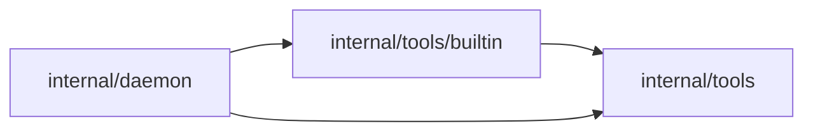

# Refactoring Analysis: Tools Built-In Domain Split

> **Date**: 2026-04-29
> **Scope**: `internal/tools/builtin.go`, daemon native built-in wiring, and native built-in descriptor tests
> **Analyzed by**: AI-assisted refactoring analysis (Martin Fowler's catalog)
> **Language/Stack**: Go, AGH daemon runtime
> **Test Coverage**: Known targeted coverage through `internal/tools`, `internal/tools/builtin`, and `internal/daemon` tests

---

## Executive Summary

The built-in tool descriptor layer had grown into one mixed-responsibility module containing source metadata, tool IDs, descriptor factories, toolset definitions, four domain groups, and all input schemas. The highest-impact fix is an Extract Module refactor that keeps canonical IDs in `internal/tools` but moves built-in descriptors to `internal/tools/builtin` files split by domain.

| Severity      | Count |
| ------------- | ----- |
| Critical (P0) | 0     |
| High (P1)     | 1     |
| Medium (P2)   | 1     |
| Low (P3)      | 0     |
| **Total**     | **2** |

### Top Opportunities

| #   | Finding                                                          | Location                              | Effort      | Impact                                                                              |
| --- | ---------------------------------------------------------------- | ------------------------------------- | ----------- | ----------------------------------------------------------------------------------- |
| 1   | Built-in descriptors mixed unrelated domains in one large module | `internal/tools/builtin.go:54`        | moderate    | Reduces change cost for adding or reviewing task, network, skill, and catalog tools |
| 2   | Daemon native tool handlers remain a long mixed adapter          | `internal/daemon/native_tools.go:274` | significant | Future handler changes can still create broad merge conflicts                       |

---

## Findings

### P1 - High

#### F1: Built-In Descriptor Module Mixes Tool Domains

- **Smell**: Large Module, Divergent Change
- **Category**: Bloater / Change Preventer
- **Location**: `internal/tools/builtin.go:54-554`
- **Severity**: High
- **Impact**: Adding or reviewing one built-in domain required touching a file that also owned unrelated domains, schemas, toolsets, and descriptor construction. That raises merge-conflict risk and makes policy/risk metadata harder to audit by domain.

**Current Code** (simplified):

```go
var nativeBuiltinTools = []Descriptor{
	builtinDescriptor(ToolIDToolList, ...),
	builtinDescriptor(ToolIDSkillView, ...),
	builtinDescriptor(ToolIDNetworkSend, ...),
	builtinDescriptor(ToolIDTaskCancel, ...),
}

const toolListInputSchema = `...`
const skillViewInputSchema = `...`
const networkSendInputSchema = `...`
const taskCancelInputSchema = `...`
```

**Recommended Refactoring**: Extract Module.

**After** (implemented):

```go
// internal/tools/builtin/descriptors.go
func NativeDescriptors() []toolspkg.Descriptor {
	groups := [][]toolspkg.Descriptor{
		catalogDescriptors(),
		skillDescriptors(),
		networkDescriptors(),
		taskDescriptors(),
	}
	// clone and return all descriptors
}

// internal/tools/builtin/network.go
var networkTools = []toolspkg.Descriptor{
	nativeDescriptor(toolspkg.ToolIDNetworkPeers, ...),
	nativeDescriptor(toolspkg.ToolIDNetworkSend, ...),
}
```

**Rationale**: The descriptor factory remains shared, while domain-specific descriptors and schemas now live beside their own domain vocabulary. This addresses the root cause instead of creating comments, aliases, or a secondary registry.

### P2 - Medium

#### F2: Daemon Native Tool Adapter Still Mixes Handler Domains

- **Smell**: Long Module, Long Function Cluster
- **Category**: Bloater
- **Location**: `internal/daemon/native_tools.go:274-917`
- **Severity**: Medium
- **Impact**: The daemon adapter still contains registry, skill, network, task handlers, input DTOs, and helper functions in one file. It is less severe than the descriptor issue because handlers share daemon dependencies, but a future refactor should split handler files by domain inside the `daemon` package.

**Current Code** (simplified):

```go
func (n *daemonNativeTools) bindings() map[toolspkg.ToolID]nativeToolBinding {
	return map[toolspkg.ToolID]nativeToolBinding{
		toolspkg.ToolIDToolList:    {call: n.toolList},
		toolspkg.ToolIDSkillView:   {call: n.skillView},
		toolspkg.ToolIDNetworkSend: {call: n.networkSend},
		toolspkg.ToolIDTaskCancel:  {call: n.taskCancel},
	}
}
```

**Recommended Refactoring**: Extract Module by file inside the existing package.

**After** (proposed follow-up):

```go
// internal/daemon/native_tools_bindings.go
func (n *daemonNativeTools) bindings() map[toolspkg.ToolID]nativeToolBinding { ... }

// internal/daemon/native_tools_network.go
func (n *daemonNativeTools) networkPeers(...) (toolspkg.ToolResult, error) { ... }
func (n *daemonNativeTools) networkSend(...) (toolspkg.ToolResult, error) { ... }

// internal/daemon/native_tools_tasks.go
func (n *daemonNativeTools) taskList(...) (toolspkg.ToolResult, error) { ... }
```

**Rationale**: Keep dependency ownership in the daemon composition root, but give each handler domain a focused file. Do this after descriptor extraction so behavioral tests have a stable baseline.

---

## Coupling Analysis

### Module Dependency Map



### High-Risk Coupling

| Module                            | Afferent (dependents) | Efferent (dependencies)        | Risk                                                             |
| --------------------------------- | --------------------- | ------------------------------ | ---------------------------------------------------------------- |
| `internal/tools`                  | high                  | low                            | medium, canonical contract types are intentionally central       |
| `internal/tools/builtin`          | low                   | one package (`internal/tools`) | low, built-in descriptors are isolated and import only contracts |
| `internal/daemon/native_tools.go` | internal daemon only  | multiple runtime services      | medium, shared dependency adapter remains broad                  |

### Circular Dependencies

None detected. The new built-in descriptor package imports `internal/tools`; `internal/tools` does not import `internal/tools/builtin`.

---

## DRY Analysis

### Duplicated Code Clusters

| Cluster                    | Locations                     | Lines                                  | Extraction Strategy                                            |
| -------------------------- | ----------------------------- | -------------------------------------- | -------------------------------------------------------------- |
| Descriptor assembly fields | `internal/tools/builtin/*.go` | repeated descriptor literals by domain | Keep a shared `nativeDescriptor` factory                       |
| Schema ownership by domain | `internal/tools/builtin/*.go` | one schema per tool                    | Keep schemas local to the domain file to preserve auditability |

### Magic Values

| Value               | Occurrences          | Suggested Constant Name         | Files                                   |
| ------------------- | -------------------- | ------------------------------- | --------------------------------------- |
| `{"type":"object"}` | shared output schema | no new exported constant needed | `internal/tools/builtin/descriptors.go` |

### Repeated Patterns

Tool descriptors intentionally repeat title, description, risk flags, toolsets, tags, and search hints. The shared factory removes structural duplication while keeping metadata explicit for review.

---

## SOLID Analysis

> **Context**: The Go runtime follows a pragmatic package-boundary architecture rather than OOP inheritance. SRP and dependency direction are applicable; LSP/ISP are not material here.

| Principle | Finding                                                                                                          | Location                    | Severity | Recommendation                                                       |
| --------- | ---------------------------------------------------------------------------------------------------------------- | --------------------------- | -------- | -------------------------------------------------------------------- |
| SRP       | Built-in descriptors had multiple reasons to change: catalog, skills, network, task scope, schemas, and toolsets | `internal/tools/builtin.go` | High     | Extract descriptors into domain files under `internal/tools/builtin` |
| DIP       | Descriptor package should depend only on registry contracts, not daemon services                                 | `internal/tools/builtin`    | Low      | Preserve the new package dependency on `internal/tools` only         |

---

## Suggested Refactoring Order

### Phase 1: Quick Wins

1. Extract source/ID constants from the old descriptor file into `internal/tools/builtin_ids.go`.
2. Extract descriptor groups into `internal/tools/builtin/{catalog,skills,network,tasks}.go`.
3. Move built-in descriptor tests into `internal/tools/builtin`.

### Phase 2: High-Impact Structural Changes

1. Update daemon native provider wiring to consume `internal/tools/builtin`.
2. Keep toolset catalog construction in the same built-in descriptor package.

### Phase 3: Deeper Architectural Improvements

1. Split `internal/daemon/native_tools.go` handler groups into separate same-package files once this descriptor split is verified.

### Prerequisites

- Preserve existing descriptor validation and clone tests before moving behavior.
- Run targeted tests for `internal/tools`, `internal/tools/builtin`, and `internal/daemon`.
