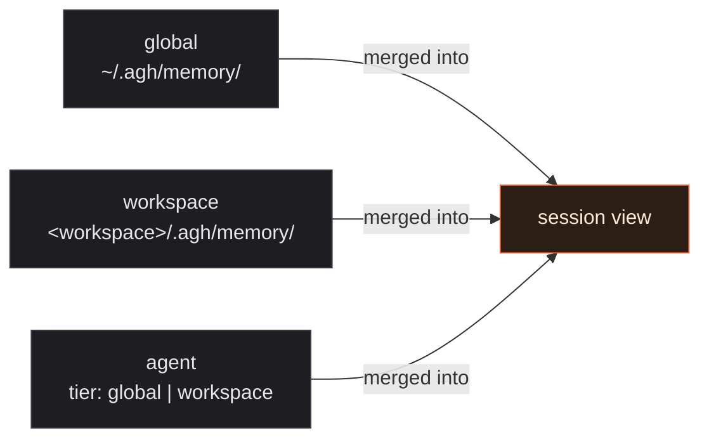

## The session that forgets

A working agent ends a session knowing things. It learned that the deploy script
refuses to run from a dirty worktree. It learned that the QA lab on port 2125 is
the operator's; the one on 2127 is for parallel scenarios. It learned that the
user prefers verbs in commit messages, not nouns.

Then the session stops. Everything the agent absorbed lives in transcript bytes
that the next session will not read. The user opens a new tab tomorrow and
re-explains the deploy script. The agent re-derives the port convention from
context, getting it wrong twice. The commit message comes back in the old
voice.

This is not a documentation problem. It is a runtime problem. Real agent work
is iterative — the same workspace, the same operator, the same set of
preferences and rules and pinned references — and an agent that cannot carry
forward what it just learned is an agent that cannot do real work. The web is
full of "AI memory" pitches that mean a vector database wired behind a chat
box. That is not what an agent at a desk needs. An agent at a desk needs the
notebook on the desk: human-readable, file-backed, the same shape across
sessions, addressable by both the agent and the operator who sits next to it.

AGH ships memory as a runtime primitive on those terms. Three scopes. Markdown
on disk. A typed four-term taxonomy. A consolidation loop gated by three
conditions before it ever wakes up. The next sections walk through each piece
and end on the command an operator runs to inspect the whole thing.

## Three scopes, one merge order

Where memory lives is the first question. The runtime answers it with three
scopes, each a directory of Markdown files, each addressed by a stable name in
the contract.



_Three scopes feed one session view. Agent overrides workspace; workspace
overrides global. Higher-precedence entries shadow lower ones by name._

The scopes are not a suggestion in the source — they are a closed enum.
`internal/memory/contract/enums.go:13-16` declares `ScopeGlobal`,
`ScopeWorkspace`, and `ScopeAgent` as the only legal values. Anything outside
this set fails validation at parse time. Agent scope adds a second axis: an
`AgentTier` of `workspace` or `global`, so an agent definition can carry
private preferences either for one project or across the whole AGH install.

The merge order is the load-bearing part. When the same memory file name
appears in more than one scope, agent wins over workspace, workspace wins over
global, and the loser is shadowed — still on disk, still inspectable, but
hidden from the active session unless the operator asks for it with
`--include-shadowed`. That precedence is what lets an agent override a
workspace convention for one project without rewriting the global note, and
lets a workspace override a personal default without editing global truth.

The default _write_ scope is not picked at random either. The runtime resolves
it from the memory type:
`user` and `feedback` land in `global`, `project` and `reference` land in
`workspace` (`internal/memory/contract/enums.go:119-130`). The agent never has
to think "where does this go" for the common cases.

That answers where memory lives. The next question is what each entry actually
looks like on disk.

## Why Markdown, not a vector database

A vector database is the obvious move for an "agent memory" feature. AGH
explicitly does not make that move. Memory is plain Markdown — one entry per
file, YAML frontmatter on top, free-form Markdown below — sitting in a flat
directory the operator can `ls`, `grep`, and `git diff` like any other text in
the repository.

```
~/.agh/memory/
├── MEMORY.md            # human-readable index, one line per entry
├── user_role.md
├── feedback_testing.md
└── reference_dashboards.md

<workspace>/.agh/memory/
├── MEMORY.md
├── project_migration_plan.md
└── reference_api_spec.md
```

_Memory on disk: one Markdown file per entry, one index file per scope. The
index lives at `internal/memory/store.go:27` as `indexFilename = "MEMORY.md"`._

Each entry carries a validated header. `internal/memory/contract/types.go:16-27`
defines it: `name`, `description`, `type`, `scope`, optional `agent_name` and
`agent_tier`, optional `provenance` block. `internal/memory/document.go:11-28`
parses and validates it before any read or write path touches the file.
Frontmatter that does not match the schema is rejected — not silently
normalized — so an operator who hand-edits a file gets an explicit error
instead of a corrupted record.

The shape choice is deliberate. Markdown on disk gives the runtime four
properties a vector store cannot:

1. **Inspectable.** An operator opens a file and reads it. There is nothing to
   decode and no embedding to interpret. When an agent does something
   surprising, the memory directory is one of the first places to look.
2. **Diffable and version-controllable.** A workspace's `.agh/memory/` can sit
   inside the repository. The same review tools that catch a bad commit catch
   a bad memory write.
3. **Editable by hand.** The operator can fix a bad entry with a text editor.
   The agent reads it the next session.
4. **Portable.** A workspace clone carries its memory. A new machine inherits
   global memory by copying one directory.

A vector database trades all of that for similarity search. AGH keeps the
Markdown and adds the index separately — covered in the next section — so the
file remains the truth and the index remains a derived view.

## A typed index over plain files

Storage is not retrieval. An agent reaching for "what does the operator prefer
about commit messages?" cannot scan every Markdown file on disk for every
prompt. The runtime needs a typed index over the directory, and that index has
to be opinionated enough to be useful.

AGH closes the type vocabulary to four values. `Type` in
`internal/memory/contract/enums.go:95-99`:

```go
const (
    TypeUser      Type = "user"
    TypeFeedback  Type = "feedback"
    TypeProject   Type = "project"
    TypeReference Type = "reference"
)
```

Each value is load-bearing. `user` covers persona, role, preferences,
knowledge. `feedback` covers rules and corrections — the "don't mock the
database in these tests" guidance the operator gave once and would rather not
give again. `project` covers ongoing work: who is doing what, why, by when.
`reference` covers pointers into external systems — Linear projects, Grafana
dashboards, Slack channels — so the agent knows where to look without
guessing.

The four-value taxonomy is what lets recall be deterministic. When an agent
asks the runtime for memories at the start of a session, AGH walks the three
scopes in precedence order, applies the type filter, materializes a session
view, and records why each entry surfaced into the recall trace. The trace is
inspectable by `agh memory recall trace get` and the rebuild path is
`agh memory reindex` — both visible through the CLI in
`internal/cli/memory.go`. There is no opaque ranker. The same query produces
the same answer until the underlying files or scopes change.

The closed type set has a second job: it constrains the _write_ side. A new
entry without a valid `type` does not get written. An agent attempting to
invent a fifth type fails at the controller decision point
(`OpReject` in `internal/memory/contract/enums.go:155`) before anything
touches disk.

That handles storage and retrieval at rest. The interesting work happens when
the runtime decides to fold transient session signal back into durable memory
— what AGH calls dreaming.

## Dreaming: three gates before consolidation runs

Consolidation is the move where a runtime looks at recent session activity,
distills it, and writes the distilled signal back into memory as a curated
entry. Done eagerly, it burns model tokens and grinds the disk. Done lazily,
it never catches up. AGH gates it with a cascade — three conditions, evaluated
cheapest to most expensive, every condition must pass before a dream session
spawns.

The cascade lives in `internal/memory/dream.go`:

```go
// ShouldRun evaluates the time and session gates in that order.
func (s *Service) ShouldRun() (bool, error) {
    // ...
    lastConsolidatedAt, err := s.lock.LastConsolidatedAt()
    if err != nil {
        return false, err
    }
    if !s.timeGatePasses(lastConsolidatedAt) {
        // gate 1: enough wall-clock time has elapsed since the last run
        return false, nil
    }

    completedSessions := 0
    if s.minSessions > 0 {
        completedSessions, err = s.countSessionsSince(lastConsolidatedAt)
        // ...
    }
    if completedSessions < s.minSessions {
        // gate 2: enough sessions have completed in that window
        return false, nil
    }
    return true, nil
}
// ...
// gate 3: acquire the file lock; concurrent daemons cannot race
priorMtime, ok, err := s.acquireLock()
```

_The cascade is ordered by cost. The time gate is a single stat on the lock
file. The session gate walks a directory of session metadata. The lock gate
performs an atomic file-system acquire. Each gate is a cheaper "no" before a
more expensive one ever runs._

The defaults sit at the top of the same file (`dream.go:21-23`):
`defaultMinHours = 24` and `defaultMinSessions = 3`. Both are tunable through
the runtime config under `[memory.dream]`. The lock path resolves to a single
file under the global memory directory; the runtime uses `flock`-style
exclusive acquire so a second daemon instance — for example, a parallel QA
lab — cannot start a competing consolidation against the same store
(`ErrLockUnavailable` at `dream.go:28` carries that signal explicitly).

When all three gates pass, the runtime spawns a dedicated session. The default
agent is `dreaming-curator` (`consolidation/runtime.go:62`), a one-shot
session of type `SessionTypeDream` that reads the recent session corpus,
proposes new memory candidates through the controller, and exits. The
controller's decision values — `OpAdd`, `OpUpdate`, `OpDelete`, `OpReject`,
`OpNoop` in `internal/memory/contract/enums.go:150-156` — are the only ways a
dream session can change disk state. There is no shortcut around the
controller.

Two pieces of the dreaming path are deliberately partial. The catalog-driven
signal gate that selects which candidates a dream run promotes
(`dreamSignalGateResult` in `dream.go:283-311`) is scaffolded but expects a
populated catalog to do its sharpest work; without it, the runtime still
spawns dream sessions and still writes curated entries, but the candidate
ranking is conservative. The promotion CLI (`agh memory promote`) for moving
an entry between scopes or agent tiers is shipped and works
(`internal/cli/memory.go:131`) but lives alongside automatic promotion logic
that is still being tuned against real-session data. Both gaps are visible in
the source; neither blocks day-to-day use.

That answers when consolidation fires. The remaining question is how a human
— or another agent — actually touches the memory the runtime holds.

## Operator surface: `agh memory`

Every primitive in this post is reachable from one CLI surface. `agh memory`
is the operator-facing verb set, mounted in `internal/cli/memory.go:116-143`,
and every command supports `-o json` for agent consumption:

```bash
$ agh memory list --scope workspace
NAME                      TYPE       AGE
project_migration_plan    project    2h
reference_api_spec        reference  1d
project_release_freeze    project    3d

$ agh memory show feedback_testing.md --scope global
---
name: feedback-testing
description: Integration tests must hit a real database, not mocks.
type: feedback
---
Reason: prior incident where mock/prod divergence masked a broken
migration.
How to apply: applies to every integration suite under `internal/`.

$ agh memory list --scope agent --agent reviewer --agent-tier workspace
NAME                      TYPE       AGE
feedback_review_tone      feedback   12h
```

_The same verbs work for the runtime, the operator, and another agent
reaching across UDS. Output is structured under `-o json` for downstream
tools._

The verb set covers the full lifecycle. `list`, `show`, `write`, `edit`,
`delete` for direct manipulation. `search` for content queries.
`reindex` to rebuild the derived catalog. `history` to audit past
operations. `health` to inspect the catalog and provider state. `promote`
to move an entry between scopes or tiers. `recall` to fetch and trace the
deterministic recall path. `dream` to inspect or trigger consolidation
manually. `scope-show` to resolve which scope and tier a query lands in.
The HTTP surface mirrors the verb set at `/api/memory/*` —
`packages/site/content/runtime/api-reference/memory.mdx` is generated from
the OpenAPI schema and stays in sync with the implementation.

Agent-manageable is the load-bearing property. Every memory operation an
operator can do through the CLI is reachable by another AGH agent over UDS
with structured input and structured output. There is no UI-only path; the
web view is one consumer of the same surface, not the authority for it.

## Where memory is still partial

Truthful posts name their gaps. Memory is shipped, but the runtime has three
specific places where execution is intentionally incomplete:

- **Catalog signal-driven dream selection.** The dream signal gate
  (`internal/memory/dream.go:367-390`) accepts candidate counts and minimum
  thresholds, and the cascade respects them, but the upstream catalog that
  feeds the signal is still expanding to cover every recall and edit path.
  Until the catalog is fully populated, the dream signal gate defaults to a
  conservative active-but-permissive posture.
- **Cross-workspace memory promotion automation.** Manual promotion via
  `agh memory promote` works and is the canonical path. Automatic promotion
  from `workspace` to `global` based on recurrence across workspaces is
  scaffolded but not yet wired into the dream runtime.
- **Provider abstraction beyond local.** The `internal/memory/provider/local`
  package is the only memory provider currently registered. The provider
  interface exists; alternative backends (remote, encrypted, team-shared)
  are planned and not shipped.

None of the gaps block the primary loop: an agent writes a memory, the next
session reads it, the operator can inspect and edit it, and the dreaming loop
keeps the store curated.

## Try it on your next session

The fastest way to feel the difference is to give the next session something
to remember. From a workspace where AGH is running:

```bash
# Write a workspace memory the next session will read by default.
agh memory write \
  --scope workspace \
  --type project \
  --name "Deploy script invariants" \
  --content @- <<'EOF'
The deploy script refuses to run from a dirty worktree.
Always commit or stash before invoking `make deploy`.
EOF

# Confirm it landed.
agh memory list --scope workspace

# Show the file as the agent will see it next session.
agh memory show "Deploy script invariants.md" --scope workspace
```

The next session in the workspace starts with that note in its recall view.
The session after that one starts with it too. The agent that ended yesterday
knowing things keeps knowing them tomorrow. The notebook stays on the desk.

The full reference for every verb, every scope, and every gate config lives
in the AGH runtime docs at `agh.network/runtime/memory`. The Markdown is on
disk. The cascade is in `internal/memory/dream.go`. Inspect it, edit it,
break it, and tell the runtime where the model of an agent at a desk still
falls short.
