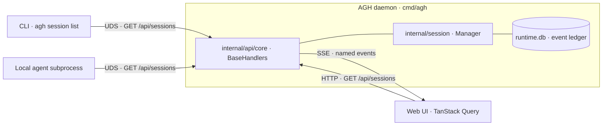

An operator starts a session through the web UI, watches the agent finish a long task, then opens a terminal and asks a second agent to keep going from there. The second agent reads its own scratchpad, runs `agh session list`, and finds an empty list. The state the operator just watched in the browser lives only in browser memory. The CLI agent cannot see it, cannot resume it, cannot inspect it. The work the operator just witnessed was never durable enough to cross one terminal tab.

That is the failure shape AGH refuses. If a runtime is going to host AI agents as first-class operators, then every piece of state the agent might need has to be reachable from every surface the agent might be standing on. AGH treats this as a product invariant, not a roadmap aspiration: one local daemon, four operator surfaces — CLI, HTTP/SSE, UDS, and web UI — all reading and writing the same SQLite-backed truth through the same Go handler. The rest of this post walks through how the daemon enforces that parity, why the contract is generated instead of paraphrased, and what an operator can do with a runtime that refuses to hide state behind any one window.

## What state-fragmentation costs operators

AGH is positioned as a local-first agent operating system, and the word `operating system` is load-bearing. An operating system is the thing every program agrees to talk to. The moment one program — say, the web UI — keeps state the others cannot see, the system stops being an operating system and becomes a collection of apps that happen to share a logo.

The agent-manageability claim in the AGH copy system makes the consequence explicit: *user-visible runtime capabilities must expose stable machine-readable control surfaces for agents*. The `internal/CLAUDE.md` invariants restate it from the implementation side. *No partial-surface completions. Any change touching a public surface closes the loop end-to-end in one pass: contract → HTTP handler → UDS handler → CLI client → CLI command → extension/config/docs surfaces → tests → docs.* A capability that ships only through the UI is an incomplete capability — a half-feature that breaks the day an agent needs it.

## One daemon, four windows into it

AGH is a single Go binary. When `agh daemon start` runs, that one process opens four operator surfaces over the same in-memory handler set and the same SQLite-backed event ledger. The CLI talks to the daemon over a Unix domain socket. The web UI talks to the daemon over HTTP and Server-Sent Events. Local subprocess agents talk to the daemon over the same Unix socket the CLI uses. The daemon never serves a request that bypasses its shared handlers.



*Figure 1 — Every operator surface terminates at the same `BaseHandlers` instance; SQLite and the session Manager are the daemon's only sources of truth.*

The diagram is also a scope contract: nothing in the rest of this post lives outside that center box. There is no second service, no shadow store, no per-surface cache the daemon pretends not to know about.

## The CLI: scripting register, structured output

The first surface is the one operators reach for when they want a script. Every CLI verb has the same shape: parse flags, call a typed method on a Unix-socket client, render the response with the operator's chosen format. The body of `agh session list` is small enough to read in one screen.

```go
// internal/cli/session.go (excerpt — see file:160 for full RunE)
cmd := &cobra.Command{
    Use:   sessionListKey,
    Short: "List sessions",
    Example: `  agh session list
  agh session list --all --workspace checkout-api`,
    RunE: func(cmd *cobra.Command, _ []string) error {
        client, err := clientFromDeps(deps)
        if err != nil {
            return err
        }
        sessions, err := client.ListSessions(cmd.Context(), SessionListQuery{
            Workspace: workspaceFilter,
        })
        // ... format-aware rendering
        return writeCommandOutput(cmd, sessionListBundle(sessions, deps.now))
    },
}
```

*Figure 2 — The CLI verb has no business logic; it delegates to `client.ListSessions`, which speaks the same HTTP wire format the web UI uses.*

`client.ListSessions` is the load-bearing line. The implementation in `internal/cli/client.go:1916` issues `GET /api/sessions` against the Unix-socket-backed client; the daemon answers that request with the same `BaseHandlers.ListSessions` method that serves the browser. The `-o json` flag — present on every state-reading verb — is the agent-manageable escape hatch: agents pipe structured output to other agents without parsing TTY decoration.

## HTTP and SSE: long-poll over a generated contract

The second surface is the one the web UI lives on. AGH terminates HTTP on a loopback port, registers every handler against Gin, and exposes a streaming variant for any state that changes faster than the operator can hit refresh. The SSE writer is six lines plus envelope plumbing.

```go
// internal/api/core/session_stream.go:33 (excerpt)
for _, event := range events {
    afterSequence = event.Sequence
    if err := WriteSSE(writer, SSEMessage{
        ID:   strconv.FormatInt(event.Sequence, 10),
        Name: event.Type,
        Data: SessionEventPayloadFromEvent(event, info),
    }); err != nil {
        return afterSequence, err
    }
}
```

*Figure 3 — Each SSE frame carries the event's persisted sequence number as its `ID`, its domain type as its `Name`, and the typed payload as `Data`. Reconnecting consumers replay from `Last-Event-ID`.*

Three properties of that loop matter for parity. The event has already been durably appended to `runtime.db` before the broadcaster sees it — the SSE stream is a projection over the append-only ledger, not an in-memory bus. The `Name` field is the canonical domain event type (`session.stopped`, `prompt.tool_call`, and so on), so consumers branch on the same vocabulary the daemon uses internally. And the `ID` is the database sequence: a web tab that drops its connection reconnects with `Last-Event-ID: 4217` and the daemon resumes from event 4218, no replay storm, no missed transitions.

The HTTP surface is bound to loopback by default and gated by an origin-aware middleware; nothing about the parity argument depends on exposing the daemon to a network. The point is that *if* a future operator decides to remote a session over WireGuard or an SSH tunnel, the wire format is already the one the local browser uses.

## UDS: local subprocess control, no port

The third surface is the one most agents never see by name, which is the point. The daemon listens on a Unix domain socket — `internal/api/udsapi/server.go:723` calls `listenConfig.Listen(ctx, "unix", socketPath)` — and registers the same handlers against a parallel Gin engine. The two registration files are essentially mirrors of each other.

```go
// internal/api/httpapi/routes.go:72                        // internal/api/udsapi/routes.go:65
func registerSessionRoutes(...) {                           func registerSessionRoutes(...) {
    sessions := api.Group("/sessions")                          sessions := api.Group("/sessions")
    sessions.GET("", handlers.ListSessions)                     sessions.GET("", handlers.ListSessions)
    sessions.POST("", handlers.CreateSession)                   sessions.POST("", handlers.CreateSession)
    // ...                                                      // ...
}                                                           }
```

*Figure 4 — The HTTP and UDS registrars wire the identical `BaseHandlers` method into the same path. Transports differ in authentication and listener, not in business logic.*

Three things become cheap once the local control plane is a socket instead of a port. Parallel QA runs no longer fight for `:2123`; each isolated `AGH_HOME` gets its own socket path, and an operator can drive five daemons from one shell. Local subprocess agents — Claude Code, OpenClaw, or Hermes spawned by the runtime — authenticate by peer credential rather than by handing tokens around. And the daemon never has to negotiate TLS for a request that never leaves the host.

The UDS surface is also where the daemon exposes a small set of task-claim verbs that intentionally do not exist on HTTP. `ClaimTaskRun`, `CompleteTaskRun`, and their peers are agent-only operations that take a `claim_token`, and AGH keeps those tokens off any network-reachable surface by registering them only against the local socket. The parity invariant says *most state moves through both transports*; the security invariant says *some state, by design, only moves through the one transport an attacker on the LAN cannot reach*. Both are explicit, and both live in the same registration file an operator can read.

## The web UI inspects, it does not own

The fourth surface is the one most product screenshots will show, and it is deliberately the most boring participant. The web UI is a TanStack Query consumer of the same `/api/sessions` route the CLI calls. There is no UI-only state store standing between the browser and the daemon.

```tsx
// web/src/systems/session/hooks/use-sessions.ts
export function useSessions(workspace: string | null = null, options?: UseSessionsOptions) {
  return useQuery({
    ...sessionsListOptions(workspace),
    enabled: options?.enabled ?? true,
  });
}

// web/src/systems/session/adapters/session-api.ts:64
export async function fetchSessions(workspace?: string, signal?: AbortSignal) {
  const { data, error, response } = await apiClient.GET("/api/sessions", {
    params: workspace ? { query: { workspace } } : undefined,
    signal,
  });
  // ...
  return requireResponseData(data, response, "Failed to fetch sessions").sessions;
}
```

*Figure 5 — The `useSessions` hook resolves to a typed `GET /api/sessions` call against the same daemon route the CLI hits over UDS.*

The `apiClient` is not a hand-written wrapper. `web/src/lib/api-client.ts:13` constructs it from `createClient<aghPaths>()`, where `aghPaths` is the path table imported from the generated TypeScript declaration of the daemon's OpenAPI schema. The browser cannot ask for an endpoint the daemon does not document; the daemon cannot ship a public endpoint that the browser cannot see. The web UI's job is to render and to mutate, not to keep its own version of the truth.

## Codegen enforces parity, not docs

Four implementations of the same contract is exactly the situation where prose documentation drifts and a feature ends up working in two places, broken in a third, and aspirational in the fourth. AGH side-steps that drift by treating the contract as code.

```go
// magefile.go:32
openAPISpecPath           = "openapi/agh.json"
webOpenAPITypePath        = "web/src/generated/agh-openapi.d.ts"
// ...
webOpenAPIArtifacts = []openapits.Artifact{
    {SpecPath: openAPISpecPath, OutputPath: webOpenAPITypePath},
    // ...
}
```

*Figure 6 — `openapi/agh.json` is the single source of truth for the HTTP/UDS contract; `make codegen` regenerates the TypeScript declaration that the web client is typed against, and `make codegen-check` fails the verify gate if the two have drifted.*

A backend engineer who adds a route to `internal/api/core/handlers.go` regenerates `openapi/agh.json` and the matching TypeScript declaration in the same change. A web engineer who relies on the new route gets a typed `paths["/api/new-route"]` entry; if the route is removed, the typecheck for every consuming hook breaks. `make verify` — the monorepo's commit gate — runs `codegen-check` before any test stage. The contract cannot quietly diverge because the build refuses to ship a divergent contract.

The CLI client benefits from the same discipline from the Go side: `unixSocketClient.ListSessions` calls the same path the OpenAPI schema describes, so the same handler-level test fixtures protect the CLI's wire format and the web UI's typed client at once.

## Pick a verb. Run it everywhere.

Surface parity is the kind of property that is invisible when it works and catastrophic when it doesn't. The cheapest way to feel it is to pick one verb and run it through every door.

| Verb                              | CLI                                    | HTTP                                       | UDS                                        | Web UI                       |
| --------------------------------- | -------------------------------------- | ------------------------------------------ | ------------------------------------------ | ---------------------------- |
| List sessions                     | `agh session list -o json`             | `GET /api/sessions`                        | `GET /api/sessions` (over socket)          | Session table                |
| Create a session                  | `agh session create --agent claude`    | `POST /api/sessions`                       | `POST /api/sessions`                       | New-session dialog           |
| Stream session events             | `agh session events <id> --follow`     | `GET /workspaces/:w/sessions/:id/stream`   | `GET /workspaces/:w/sessions/:id/stream`   | Live transcript view         |
| Stop a session                    | `agh session stop <id>`                | `POST /workspaces/:w/sessions/:id/stop`    | `POST /workspaces/:w/sessions/:id/stop`    | Stop action on session row   |
| Claim a task run (agent-only)     | n/a                                    | n/a                                        | `POST /workspaces/:w/task-runs/:id/claim`  | n/a                          |

*Table 1 — The same daemon answers every cell except the last row, which is intentionally UDS-only because the `claim_token` it returns must never traverse a network surface.*

That last row is the honest exception. Most verbs an operator or an agent will reach for live on every public surface; a small, named set is locked to UDS for security reasons and the table says so. No partial-surface completions, no hidden UI control, no "this only works in the browser" workflows.

For an operator picking up AGH today: install the daemon, run `agh session list -o json` from a script, open the same workspace in the web UI, and watch the table populate from the same handler the script just called. For a runtime developer: add one route in `internal/api/core/`, regenerate the OpenAPI schema, and find that the CLI client, the UDS server, the HTTP server, and the web's typed `apiClient` all know about it before the next `make verify` finishes. Agent-manageability is not a promise written into the README; it is the shape the build refuses to break.
