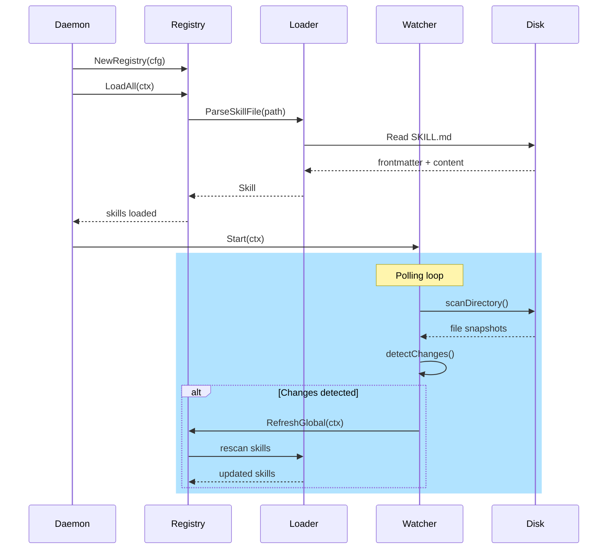
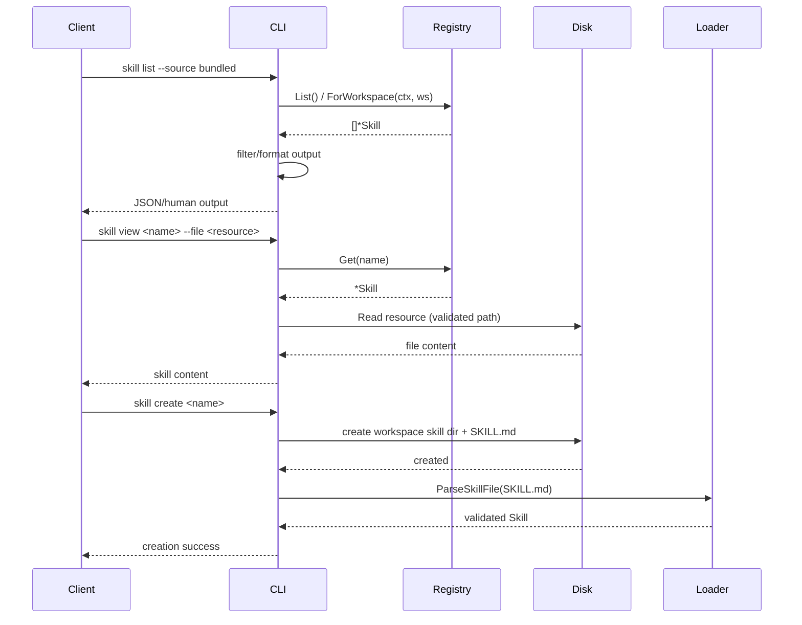

# PR #1: feat: new skills system

- **URL**: https://github.com/compozy/agh/pull/1
- **Author**: @pedronauck
- **State**: merged
- **Created**: 2026-04-06T12:56:17Z
- **Merged**: 2026-04-06T13:33:31Z

## Summary by CodeRabbit

- **New Features**
  - CLI: new skill management commands — list, view, info, create — for bundled and custom skills.
  - Skills integrated into agent prompts via a catalog; skills are auto-loaded and polled for changes.
  - New agent skill bundle added (fix-coderabbit-review) with helper scripts.

- **Configuration**
  - New skills config section with enable/disable toggle, disabled-skills list, and poll interval.

- **Tests**
  - Extensive test coverage added for skills, loader, watcher, registry, catalog, and CLI.

- **Chores**
  - Added YAML dependency and updated .gitignore.

## Walkthrough

Adds a new skills subsystem: skill types, loader, verifier, registry with workspace-aware caching, polling watcher, CLI commands (list/view/info/create), bundled skill embedding, daemon integration via composable prompt providers, config/home plumbing, and comprehensive tests across modules.

## Changes

| Cohort / File(s)                                                                                                                                                                                                                                                                                                       | Summary                                                                                                                                                                                                                                                                     |
| ---------------------------------------------------------------------------------------------------------------------------------------------------------------------------------------------------------------------------------------------------------------------------------------------------------------------- | --------------------------------------------------------------------------------------------------------------------------------------------------------------------------------------------------------------------------------------------------------------------------- |
| **Config & Home**   `/.gitignore`, `go.mod`, `internal/config/...`   `internal/config/config.go`, `internal/config/config_test.go`, `internal/config/home.go`, `internal/config/home_test.go`, `internal/config/merge.go`, `internal/config/merge_test.go`                                                       | Add `[skills]` config (enabled, disabled_skills, poll_interval), merge overlay support, home paths for skills, default values, tests; add `gopkg.in/yaml.v3` dependency and new .gitignore entries.                                                                         |
| **CLI**   `internal/cli/root.go`, `internal/cli/skill.go`, `internal/cli/skill_test.go`                                                                                                                                                                                                                             | Introduce `skill` command group with `list`, `view`, `info`, `create` subcommands, safe resource access, source filtering, multiple output formats, creation scaffolding, and extensive integration tests including traversal/symlink protections.                          |
| **Skills Core (types, loader, verify)**   `internal/skills/types.go`, `internal/skills/loader.go`, `internal/skills/loader_test.go`, `internal/skills/verify.go`, `internal/skills/verify_test.go`                                                                                                                  | Define skill models and registry config, add SKILL.md frontmatter parsing, directory scanning with snapshotting/limits, content verification patterns and severity, and comprehensive unit tests.                                                                           |
| **Registry & Watcher**   `internal/skills/registry.go`, `internal/skills/registry_test.go`, `internal/skills/watcher.go`, `internal/skills/watcher_test.go`                                                                                                                                                         | Implement in-memory registry with global/workspace merging, cloning, caching with TTL, file-snapshot diffs, refresh semantics, and a polling Watcher that triggers global refreshes; extensive concurrency and behavior tests.                                              |
| **Catalog & Bundled Assets**   `internal/skills/catalog.go`, `internal/skills/catalog_test.go`, `internal/skills/bundled/embed.go`, `internal/skills/bundled/bundled_test.go`                                                                                                                                       | Add embedded bundled-skills FS, catalog builder emitting XML-like available-skills block with escaping/truncation, and tests validating embedded assets and deterministic catalog rendering.                                                                                |
| **Daemon & Prompt Composition**   `internal/daemon/...`, `internal/memory/assembler.go`, `internal/session/prompt_provider.go`   `internal/daemon/daemon.go`, `internal/daemon/composed_assembler.go`, `internal/daemon/..._test.go`, `internal/memory/assembler_test.go`, `internal/session/prompt_provider.go` | Introduce PromptProvider interface and ComposedAssembler; wire skills registry and catalog into daemon boot when enabled, start/stop watcher, adapt memory assembler to provider interface, and add integration tests covering various feature flags and watcher lifecycle. |
| **Skills Tests & Helpers**   `internal/skills/*_test.go`                                                                                                                                                                                                                                                            | Large suite of new tests for loader, registry, catalog, watcher, and bundled assets to validate parsing, verification, caching, refresh, and concurrency behaviors.                                                                                                         |
| **Agents Skill Pack**   `.agents/skills/fix-coderabbit-review/...`, `skills-lock.json`                                                                                                                                                                                                                              | Add new skill package with agent config, Node script (`pr-review.ts`) and resolver script, and update `skills-lock.json` to pin the new skill; scripts export and optionally resolve PR review issues.                                                                      |

## Sequence Diagram

