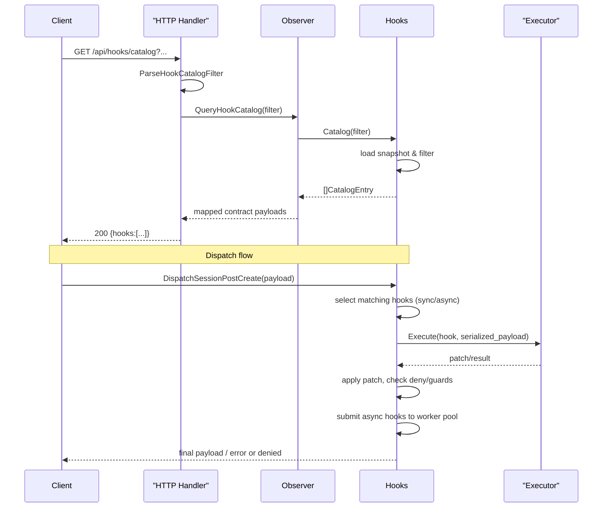

# PR #10: feat: improve hooks system

- **URL**: https://github.com/compozy/agh/pull/10
- **Author**: @pedronauck
- **State**: merged
- **Created**: 2026-04-09T23:13:55Z
- **Merged**: 2026-04-10T02:11:17Z

## Summary by CodeRabbit

- **New Features**
  - Hooks subsystem: runtime with native/subprocess/wasm executors, dispatch pipeline, taxonomy, catalog, events and runs endpoints.
  - New CLI: top-level `hooks` command with `list`, `info`, `events`, `runs` (human/json/toon output).

- **Bug Fixes / Behavior**
  - Safer config and agent hook parsing/merging; improved shutdown/drain sequencing for hook execution.

- **Tests**
  - Broad unit and integration coverage for hooks, executors, CLI, API, config, and daemon integration.

## Walkthrough

Adds a full hooks subsystem: taxonomy, payloads/patches, executors (native/subprocess/wasm stub), hot-reloadable registry and dispatch pipeline (sync/async, guards, depth tracking), daemon integration replacing notifier fanout, API endpoints and CLI, config parsing/merge support, and extensive unit/integration tests.

## Changes

| Cohort / File(s)                                                                                                                                                                                                                                                           | Summary                                                                                                                                                                                                                                                           |
| -------------------------------------------------------------------------------------------------------------------------------------------------------------------------------------------------------------------------------------------------------------------------- | ----------------------------------------------------------------------------------------------------------------------------------------------------------------------------------------------------------------------------------------------------------------- |
| **Hooks core & types**   `internal/hooks/...` (`doc.go`, `events.go`, `payloads.go`, `payloads_test.go`, `depth.go`, `introspection.go`, `introspection_test.go`, `matcher.go`, `matcher_test.go`)                                                                      | New hooks package: event taxonomy, payload/patch models, dispatch-depth utilities, matcher predicates/validation, introspection/catalog APIs and tests. Review exported types, validation rules, and descriptor mappings.                                         |
| **Normalization, ordering & validation**   `internal/hooks/normalize.go`, `normalize_test.go`, `ordering.go`, `ordering_test.go`                                                                                                                                        | Declaration validation/normalization and deterministic ordering of resolved hooks, with executor resolver plumbing and priority defaults. Check normalization edge-cases and error messages.                                                                      |
| **Dispatch pipeline & permission guards**   `internal/hooks/dispatch.go`, `pipeline.go`, `pipeline_test.go`, `permission.go`, `permission_test.go`, `dispatch_integration_test.go`                                                                                      | Core executeDispatch implementation, per-event typed Dispatch\* methods, pipeline execution (sync/async), patch apply/guards/deny handling, and permission-escalation blocking. Focus review on deny/guard semantics, async submission, and depth/trace handling. |
| **Executors (native/subprocess/wasm)**   `internal/hooks/executor.go`, `executor_native.go`, `executor_subprocess.go`, `executor_subprocess_unix.go`, `executor_subprocess_windows.go`, `executor_wasm_stub.go`, `executor_test.go`, `executor_subprocess_unix_test.go` | Defines Executor interface, native/typed executors, subprocess execution (timeouts, env allowlist, signal handling) and wasm stub. Pay attention to subprocess lifecycle, env merging/sorting, and platform signal semantics.                                     |
| **Runtime / registry**   `internal/hooks/hooks.go`, `hooks_test.go`                                                                                                                                                                                                     | Hot-reloadable Hooks runtime with providers (native/config/agent/skill), snapshot fingerprinting, rebuild semantics, async worker pool, telemetry hooks. Verify Rebuild/version/fingerprint swaps and resolver wiring.                                            |
| **Daemon integration / bridge**   `internal/daemon/hooks_bridge.go`, `boot.go`, `daemon.go`, `daemon_test.go`, `daemon_integration_test.go`                                                                                                                             | Replaces notifier fanout with hooks runtime, wires native lifecycle hooks and declaration providers, integrates rebuilds on watcher refresh, and adjusts shutdown/drain ordering. Review lifecycle wiring and shutdown sequence.                                  |
| **Removed legacy notifier**   `internal/daemon/notifier.go` (deleted), `internal/daemon/notifier_integration_test.go` (deleted)                                                                                                                                         | Removes previous notifier fanout and associated tests—ensure no dangling references and new bridge covers responsibilities.                                                                                                                                       |
| **API & server**   `internal/api/contract/contract.go`, `internal/api/core/{parsers.go,payloads.go,handlers.go,interfaces.go}`, `internal/api/httpapi/server.go`, `internal/api/testutil/apitest.go`, `internal/api/httpapi/*`, `internal/api/udsapi/*`                 | Adds HookCatalog/HookRuns/HookEvents DTOs, observer interface methods, query parsers, handlers, payload mappers, and routes on HTTP/UDS with tests and StubObserver extensions. Validate query parsing, workspace/session resolution, and status mapping.         |
| **CLI & client**   `internal/cli/{client.go,hooks.go,root.go}`, `internal/cli/*_test.go`                                                                                                                                                                                | Adds `hooks` CLI command (list/info/events/runs), client methods and contract aliases, query→URL encoding, and output bundles. Review flag→query translation, output formatting, and required session validation for runs.                                        |
| **Config parsing & overlays**   `internal/config/{hooks.go,agent.go,merge.go,config.go,bootstrap.go}`, `internal/config/*_test.go`                                                                                                                                      | Parses hook declarations from TOML/YAML and agents, merges hooks overlay, integrates hooks validation into config Validate(), and surfaces decode errors. Check TOML/YAML fallback, overlay merge semantics, and error context.                                   |
| **Tests & test infra**   numerous test files across packages                                                                                                                                                                                                            | Large test surface added: unit and integration tests for executors, pipeline, runtime, CLI, API, and daemon integration. Audit nondeterministic/time-sensitive tests and filesystem/time helpers.                                                                 |

## Sequence Diagram

