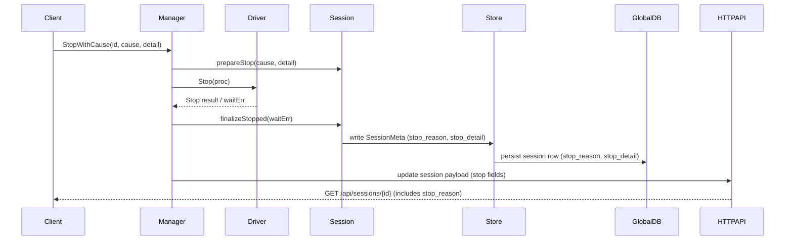

# PR #11: feat: session resilience

- **URL**: https://github.com/compozy/agh/pull/11
- **Author**: @pedronauck
- **State**: merged
- **Created**: 2026-04-10T13:18:58Z
- **Merged**: 2026-04-10T14:33:45Z

## Summary by CodeRabbit

- **New Features**
  - Sessions now record and expose termination reason and detail (user, crash, timeout, etc.).
  - Configurable session timeout limits.

- **Bug Fixes**
  - Persisted stop reasons on shutdown/crash and improved crash detection during resume.

- **Improvements**
  - Stronger resume validation and repair checks; refined session lifecycle and metadata persistence.
  - Session events and API payloads include stop classification.

- **Documentation**
  - Added ANP/agent-network protocol proof-of-concept transcript.

## Walkthrough

Adds end-to-end session stop reason/detail tracking: enums, classification, stop-with-cause APIs, resume validation/classification, DB schema + migrations, propagation to API/observer/daemon, and extensive tests. Also adds a docs JSONL transcript (ANP discussion) as a PoC artifact.

## Changes

| Cohort / File(s)                                                                                                                                                                                                                                                                 | Summary                                                                                                                                                                                                                     |
| -------------------------------------------------------------------------------------------------------------------------------------------------------------------------------------------------------------------------------------------------------------------------------- | --------------------------------------------------------------------------------------------------------------------------------------------------------------------------------------------------------------------------- |
| **Core stop types & mapping**   `internal/store/types.go`, `internal/session/stop_cause.go`, `internal/session/stop_reason.go`, `internal/session/stop_reason_test.go`, `internal/store/stop_reason_test.go`                                                                  | Introduce `StopReason` enum, `StopCause` enum, and `classifyStopReason` mapping; tests cover classification and validity.                                                                                                   |
| **Session model & APIs**   `internal/session/session.go`, `internal/session/session_test.go`, `internal/session/stop_cause.go`, `internal/session/stop_reason.go`, `internal/session/stop_reason_test.go`                                                                     | Extend Session/SessionInfo with stop fields, add stop-cause helpers, change prepareStop signature, add `StopWithCause` and update Meta() persistence. Tests added/updated to assert stop metadata.                          |
| **Manager lifecycle & resume repair**   `internal/session/manager_lifecycle.go`, `internal/session/resume_repair.go`, `internal/session/resume_repair_test.go`, `internal/session/manager_test.go`                                                                            | Stop now delegates to StopWithCause; Resume classifies previous stops, validates infrastructure, persists crash classifications, and logs resume validation failures. New validation/classification helpers and tests.      |
| **Integration stop behavior & tests**   `internal/session/manager_stop_integration_test.go`, `internal/session/manager_test.go`, `internal/session/stop_*_integration_tests`                                                                                                  | Multiple integration tests added: process kill/crash persistence, resume failure modes (missing workspace/agent/empty DB), multi-cycle Stop→Resume→Stop checks, and helpers for real ACP harnesses.                         |
| **Global DB schema & persistence**   `internal/store/globaldb/global_db.go`, `internal/store/globaldb/global_db_session.go`, `internal/store/globaldb/migrate_workspace.go`, `internal/store/globaldb/global_db_test.go`, `internal/store/globaldb/global_db_session_test.go` | Add `stop_reason` and `stop_detail` columns, migrate when absent, update queries (register/update/list/scan) to read/write stop fields, and add migration/tests ensuring backward compatibility.                            |
| **Store types & meta handling**   `internal/store/types.go`, `internal/store/meta_test.go`                                                                                                                                                                                    | Extend `SessionMeta`, `SessionInfo`, and `SessionStateUpdate` with stop fields; validate `stop_reason` values and add tests including legacy omission handling.                                                             |
| **Observer & reconciliation**   `internal/observe/observer.go`, `internal/observe/reconcile.go`, `internal/observe/reconcile_test.go`                                                                                                                                         | Observer writes stop reason/detail on session stop; reconciliation normalizes stop reason when loading metadata; tests updated to assert stop fields.                                                                       |
| **API contract & conversions**   `internal/api/contract/contract.go`, `internal/api/contract/contract_test.go`, `internal/api/core/conversions.go`, `internal/api/core/conversions_parsers_test.go`                                                                           | Expose optional `stop_reason`/`stop_detail` in `SessionPayload` and populate them from session info; tests assert omit-empty behavior and inclusion when set.                                                               |
| **HTTP & daemon integration tests / driver changes**   `internal/api/httpapi/httpapi_integration_test.go`, `internal/daemon/daemon.go`, `internal/daemon/daemon_test.go`, `internal/daemon/daemon_integration_test.go`                                                        | Integration harness and driver extended to inject crashes and assert stop reason propagation to DB and HTTP API. Daemon now attempts StopWithCause (CauseShutdown) when supported; tests and helper subprocess agent added. |
| **Config: session limits**   `internal/config/config.go`, `internal/config/config_test.go`, `internal/config/merge.go`                                                                                                                                                        | Add `SessionConfig` and `SessionLimitsConfig` with `session.limits.timeout`, initialization, validation, merging logic, and tests (including negative timeout rejection).                                                   |
| **Workspace cloning**   `internal/workspace/clone.go`, `internal/workspace/resolver_test.go`                                                                                                                                                                                  | Ensure `Session` config is copied by `cloneConfig`; updated test to assert deep copy of session limits.                                                                                                                     |
| **Docs / PoC transcript**   `docs/ideas/anp/conversa.jsonl`                                                                                                                                                                                                                   | Add newline-delimited JSON transcript of an assistant-to-assistant conversation proposing ANP (Agent Network Protocol) and discussing session resilience—serves as RFC/PoC artifact.                                        |

## Sequence Diagram

