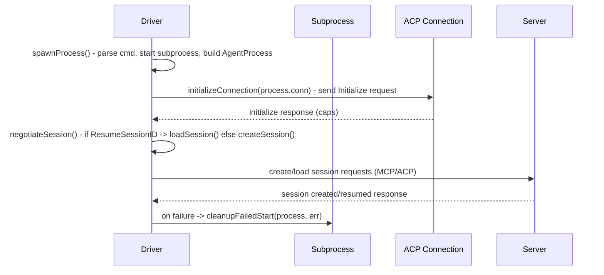

# PR #12: refactor: kb improvements

- **URL**: https://github.com/compozy/agh/pull/12
- **Author**: @pedronauck
- **State**: merged
- **Created**: 2026-04-10T15:57:49Z
- **Merged**: 2026-04-10T17:07:57Z

## Summary by CodeRabbit

- **New Features**
  - CLI: full marketplace skills management (search, install, update, remove, view, create)
  - SSE: shared Server-Sent-Events decoding and improved session event streaming

- **Refactoring**
  - Modularized session start/resume and daemon boot flow; revamped hook surface into granular hook sets
  - Reorganized HTTP API handlers, routes, and middleware

- **Removals**
  - Removed several UI component exports (calendar, carousel, chart, drawer, and others)

- **Tests**
  - Added extensive unit/integration tests for hooks, SSE, skills, and HTTP routing

## Walkthrough

Refactors and feature additions across multiple subsystems: ACP client start flow decomposed into helpers; hook dispatch split into domain-specific interfaces (`HookSet`); SSE decoding extracted; session start/resume orchestrated via new start spec; skills CLI and registry rebuilt with workspace caching; numerous HTTP API, daemon boot, memory, and web UI removals/additions.

## Changes

| Cohort / File(s)                                                                                                                                                                                              | Summary                                                                                                                                                                                                                                           |
| ------------------------------------------------------------------------------------------------------------------------------------------------------------------------------------------------------------- | ------------------------------------------------------------------------------------------------------------------------------------------------------------------------------------------------------------------------------------------------- |
| **ACP client & inbound handlers**   `internal/acp/client.go`, `internal/acp/handlers.go`                                                                                                                   | Decomposed `Driver.Start` into `spawnProcess`, `initializeConnection`, `negotiateSession`, `loadSession`, `createSession`; centralized cleanup in `Start`. Replaced large switch in `handleInbound` with handler map and generic request helpers. |
| **Hooks & dispatch**   `internal/session/hooks.go`, `internal/session/interfaces.go`, `internal/hooks/...`                                                                                                 | Replaced single `HookDispatcher` with granular interfaces and `HookSet`; moved matcher and async dispatch logic into new matcher/async files; updated manager/daemon callsites to use typed accessors.                                            |
| **Session manager start lifecycle**   `internal/session/manager_lifecycle.go`, `internal/session/manager_start.go`, `internal/session/manager_*`                                                           | Extracted shared start/resume orchestration (`sessionStartSpec`, `prepareCreateStart`, `prepareResumeStart`, `startSession`); removed inlined start logic from create/resume entrypoints.                                                         |
| **API streaming, handlers & middleware**   `internal/api/core/session_stream.go`, `internal/api/core/handlers.go`, `internal/api/httpapi/{handlers,middleware,routes,server}.go`                           | Added SSE polling/streaming helpers and refactored `StreamSession` to delegate; introduced HTTP API handler wiring, CORS/logging/error middleware, and centralized route registration (handlers moved out of server.go).                          |
| **Skills CLI & marketplace**   `internal/cli/skill.go` (deleted), `internal/cli/skill_commands.go`, `internal/cli/skill_marketplace.go`, `internal/cli/skill_output.go`, `internal/cli/skill_workspace.go` | Removed monolithic skill.go; added new CLI command tree and marketplace install/update/remove logic, output bundles, and workspace/registry resolution utilities.                                                                                 |
| **Skills registry & snapshot/cache**   `internal/skills/registry.go`, `internal/skills/registry_snapshot.go`, `internal/skills/registry_workspace_cache.go`                                                | Moved workspace cache plumbing, snapshot recording, cloning, and bundled-skill parsing into new snapshot and workspace-cache files; cleaned up `registry.go`.                                                                                     |
| **Daemon boot & wiring**   `internal/daemon/boot.go`, `internal/daemon/daemon.go`, `internal/daemon/hooks_bridge.go`                                                                                       | Refactored daemon boot into staged methods with `bootState`/`bootCleanup`; switched daemon hook wiring to `HookSet`; updated hook-bridge compile-time assertions.                                                                                 |
| **SSE utility & CLI client**   `internal/sse/decode.go`, `internal/cli/client.go`                                                                                                                          | Added shared `sse.Decode` API and types; replaced in-file SSE parsing in CLI to use shared package and sentinel `ErrStop`.                                                                                                                        |
| **Config/workspace/memory/transcript API surface changes**   `internal/config/*`, `internal/workspace/*`, `internal/memory/*`, `internal/transcript/*`, `internal/workref/ref.go`                          | Renamed several exported helpers to unexported variants (config, workspace, memory, transcript); added `workref` package (`PathRef`/`RootRef`) and updated payload conversions to use it.                                                         |
| **HTTP UDS server & tests**   `internal/api/udsapi/server.go`, `internal/api/udsapi/server_test.go`                                                                                                        | Relaxed constructor validation around `skillsRegistry`; adjusted tests to expect error behavior.                                                                                                                                                  |
| **Hooks tests & telemetry**   `internal/hooks/*_test.go`                                                                                                                                                   | Added tests for async hook cancellation and dropped-submission telemetry; made telemetry test helper concurrency-safe.                                                                                                                            |
| **Registry tests & skills tests**   `internal/skills/registry_test.go`, `internal/cli/skill_test.go`                                                                                                       | Added tests for workspace cache key behavior, marketplace archive close errors, package rename handling, and version semantics; adjusted helpers.                                                                                                 |
| **Memory & consolidation**   `internal/memory/consolidation/runtime.go`, `internal/memory/dream.go`, `internal/memory/*_test.go`                                                                           | Removed session spawner option plumbing; renamed some option constructors to unexported forms and updated tests.                                                                                                                                  |
| **Web UI removals**   `web/src/components/ui/*` (multiple files removed)                                                                                                                                   | Removed 16 UI component modules (alert-dialog, calendar, carousel, chart, context-menu, drawer, hover-card, input-otp, menubar, navigation-menu, pagination, radio-group, resizable, slider, aspect-ratio, checkbox).                             |

## Sequence Diagram

