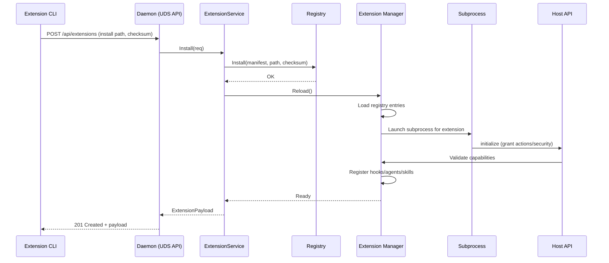
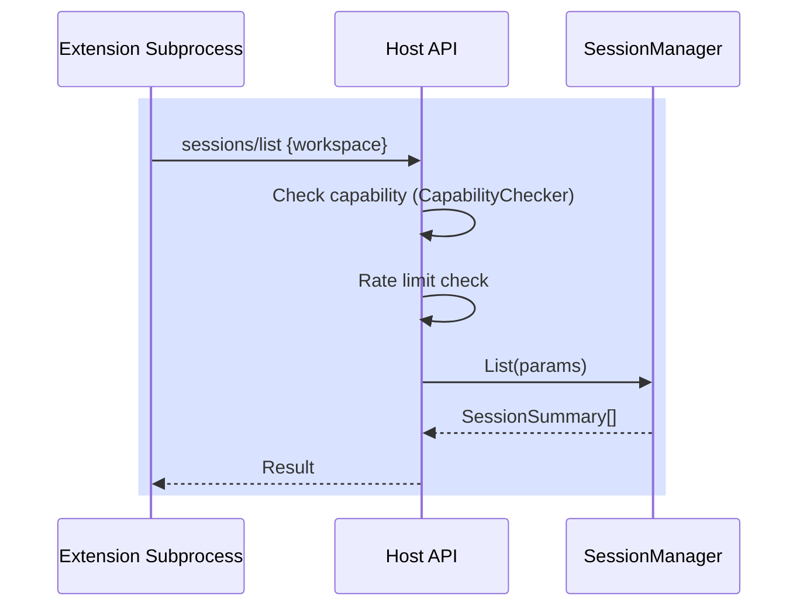

# PR #13: feat: add extensability

- **URL**: https://github.com/compozy/agh/pull/13
- **Author**: @pedronauck
- **State**: merged
- **Created**: 2026-04-10T22:05:10Z
- **Merged**: 2026-04-11T01:38:07Z

## Summary by CodeRabbit

- **New Features**
  - Full extensions system: install/enable/disable/status, runtime manager, registry, manifest format, and CLI commands.
  - Host API for extensions to interact with sessions, memory, skills, and observability.
  - Codegen and build targets to generate/verify OpenAPI and a TypeScript SDK.
  - Static transcript viewer page for local JSONL transcripts.

- **Improvements**
  - Typed API response envelopes and richer daemon status (includes resolved user home dir).
  - Better subprocess supervision, health checks, graceful shutdown, and config-sidecar (MCP JSON) support.

- **Tests**
  - Extensive unit/integration coverage for extensions, host API, registry, manager, and codegen.

## Walkthrough

Adds a full extension subsystem (manifest format, registry, manager with subprocess supervision and capability model), Host API and daemon/UDS/CLI wiring for extension lifecycle, OpenAPI/TypeScript codegen tooling, API contract/handler migrations, ACP/subprocess integration updates, skills/hooks enhancements, DB schema changes, many tests, and a static docs viewer.

## Changes

| Cohort / File(s)                                                                                                                                                                                                                                                                                                     | Summary                                                                                                                                                                                                                                                             |
| -------------------------------------------------------------------------------------------------------------------------------------------------------------------------------------------------------------------------------------------------------------------------------------------------------------------- | ------------------------------------------------------------------------------------------------------------------------------------------------------------------------------------------------------------------------------------------------------------------- |
| **Build & Codegen**   `Makefile`, `cmd/agh-codegen/main.go`, `cmd/agh-codegen/main_test.go`, `internal/api/spec/spec.go`, `internal/codegen/sdkts/generate.go`, `go.mod`                                                                                                                                          | Added `codegen`/`codegen-check` Make targets; new codegen CLI that emits/validates OpenAPI and a TypeScript SDK; OpenAPI generator package and TS SDK generator; formatter integration and tests; added indirect Go deps.                                           |
| **Extension Manifests & Registry**   `internal/extension/manifest.go`, `internal/extension/manifest_test.go`, `internal/extension/registry.go`, `internal/extension/registry_test.go`, `internal/extension/registry_integration_test.go`                                                                          | New manifest format (TOML/JSON) with validation and Duration type; manifest loading/merge semantics; deterministic directory checksum; SQLite-backed Registry with Install/Enable/Disable/List/Get and typed sentinel errors; comprehensive unit/integration tests. |
| **Extension Manager & Runtime**   `internal/extension/manager.go`, `internal/extension/describe.go`, `internal/extension/manager_test.go`, `internal/extension/manager_integration_test.go`                                                                                                                       | New Manager implementing multi-phase lifecycle, subprocess supervision (init/health/restart/backoff), resource registration (hooks/agents/skills/MCP), runtime snapshot APIs and many tests.                                                                        |
| **Capability Model & Host API**   `internal/extension/capability.go`, `internal/extension/host_api.go`, `internal/extension/host_api_test.go`, `internal/extension/host_api_integration_test.go`, `internal/extension/contract/host_api.go`, `internal/extension/protocol/host_api.go`                            | Introduced CapabilityChecker with tiered/wildcard policies; Host API JSON‑RPC handler for extension→daemon (sessions, memory, observe, skills) with authorization, rate limiting, method specs, and tests.                                                          |
| **Daemon Integration & Service**   `internal/daemon/boot.go`, `internal/daemon/daemon.go`, `internal/daemon/extensions.go`, `internal/daemon/hooks_bridge.go`, `internal/daemon/daemon_integration_test.go`, `internal/daemon/daemon_test.go`                                                                     | Wired extension runtime into boot/shutdown/reload; added daemon-side ExtensionService implementation; chained declaration providers for hooks; boot sequence, shutdown, and related tests updated.                                                                  |
| **UDS API & CLI**   `internal/api/udsapi/routes.go`, `internal/api/udsapi/extensions.go`, `internal/api/udsapi/handlers_test.go`, `internal/cli/extension.go`, `internal/cli/client.go`, `internal/cli/*_test.go`, `internal/cli/root.go`                                                                         | New `/api/extensions` endpoints and ExtensionService interface; CLI `extension` command (list/install/enable/disable/status) supporting daemon-backed and local-registry modes; client/CLI implementations and tests.                                               |
| **API Contracts & Handler Migrations**   `internal/api/contract/*.go`, `internal/api/core/*.go`, `internal/api/core/conversions.go`, `internal/api/core/conversions_parsers_test.go`, `internal/api/core/handlers.go`, `internal/api/core/workspaces.go`, `internal/api/core/skills.go`, `internal/api/httpapi/*` | Added typed request/response DTOs and response wrapper types; migrated many handlers from `gin.H` maps to typed contract responses; updated conversions to use typed enums; updated tests.                                                                          |
| **ACP / Subprocess Integration**   `internal/acp/client.go`, `internal/acp/types.go`, `internal/acp/client_test.go`                                                                                                                                                                                               | Switched to `internal/subprocess.Launch` managed processes, updated I/O and shutdown/wait logic, added `IsLoadSessionResourceMissing` helper and tests for managed shutdown behavior.                                                                               |
| **Hooks & Skills**   `internal/hooks/types.go`, `internal/hooks/normalize.go`, `internal/skills/loader.go`, `internal/skills/registry.go`, `internal/skills/registry_external.go`                                                                                                                                 | Added `WorkingDir` to HookDecl and normalization; introduced external skills registration and merge logic; added ParseSkillFileWithSource.                                                                                                                          |
| **Store Schema & Global DB**   `internal/store/globaldb/global_db.go`                                                                                                                                                                                                                                             | Added `extensions` table to global DB schema and exposed `GlobalDB.DB()` to return the underlying `*sql.DB`.                                                                                                                                                        |
| **OpenAPI Tests & Spec**   `internal/api/spec/spec_test.go`                                                                                                                                                                                                                                                       | Added tests asserting required/optional fields and enums in generated OpenAPI document, covering sessions, workspaces, hooks, and memory schemas.                                                                                                                   |
| **CLI/Daemon/Integration Tests**   many `internal/extension/*`, `internal/daemon/*`, `internal/cli/*`, `internal/api/*`, `cmd/agh-codegen/*`                                                                                                                                                                      | Large set of new and updated unit/integration tests covering manifest/registry/manager lifecycles, Host API, capability enforcement, daemon boot/integration, CLI, and codegen.                                                                                     |
| **Docs / Static pages**   `docs/ideas/anp/conversa.jsonl`, `docs/ideas/anp/index.html`                                                                                                                                                                                                                            | Reformatted JSONL transcript and added a static HTML viewer that can load/parse `conversa.jsonl`.                                                                                                                                                                   |
| **Misc / Temporary files**   `.codex/tmp/*`                                                                                                                                                                                                                                                                       | Added review/ledger text files (documentation artifacts).                                                                                                                                                                                                           |

## Sequence Diagram

