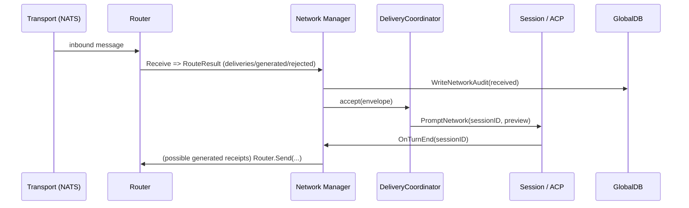

# PR #15: feat: add network implementation

- **URL**: https://github.com/compozy/agh/pull/15
- **Author**: @pedronauck
- **State**: merged
- **Created**: 2026-04-11T12:16:58Z
- **Merged**: 2026-04-12T03:54:50Z

## Summary by CodeRabbit

- **New Features**
  - Full network subsystem: transport, routing, peer discovery, messaging, plus API & CLI endpoints (status, peers, spaces, send, inbox).
  - Session "space" support: specify, persist and display space across lifecycle; network-aware prompts and bundled helper content.
- **Configuration**
  - New [network] section with defaults, ports, payload/queue/timeouts.
- **Observability**
  - Network diagnostics in daemon status and durable audit logging.
- **Persistence**
  - DB schema and APIs persist network audit logs and session space.
- **Tests**
  - Extensive unit and integration coverage across network, delivery, API, CLI, and persistence.

## Walkthrough

Implements a complete AGH network subsystem (protocol, validation, transport, router, peer registry, delivery coordinator, manager, audit, and CLI/API surfaces), adds session turn provenance and Space propagation, updates DB schema/migrations, and wires tests and runtime integration across daemon, API, CLI, session manager, ACP, and store layers.

## Changes

| Cohort / File(s)                                                                                                                                                                                                                                                                                                                           | Summary                                                                                                                                                                                                                  |
| ------------------------------------------------------------------------------------------------------------------------------------------------------------------------------------------------------------------------------------------------------------------------------------------------------------------------------------------ | ------------------------------------------------------------------------------------------------------------------------------------------------------------------------------------------------------------------------ |
| **Network core & protocol**   `internal/network/envelope.go`, `internal/network/validate.go`, `internal/network/validate_test.go`, `internal/network/helpers_test.go`                                                                                                                                                                   | Add AGH Network v0 envelope model, kinds/bodies, parsing/validation, replay/expiry rules, RouteToken, and unit tests.                                                                                                    |
| **Runtime: router, transport, manager, delivery, peer registry, stats**   `internal/network/router.go`, `internal/network/transport.go`, `internal/network/manager.go`, `internal/network/delivery.go`, `internal/network/peer.go`, `internal/network/stats.go`, `internal/network/*_test.go`, `internal/network/*_integration_test.go` | Implement Router (Send/Receive/heartbeat), embedded NATS Transport, Manager (Join/Leave/Send/Inbox/Status), delivery coordinator, peer registry, runtime metrics, and extensive tests/integration coverage.              |
| **Audit & persistence**   `internal/network/audit.go`, `internal/network/audit_test.go`, `internal/store/globaldb/global_db_network_audit.go`, `internal/store/globaldb/global_db.go`                                                                                                                                                   | Add audit writer (file + DB), NormalizeAuditEntry, network_audit_log schema, DB read/write APIs, and tests.                                                                                                              |
| **Interaction lifecycle**   `internal/network/lifecycle.go`, `internal/network/lifecycle_test.go`                                                                                                                                                                                                                                       | Introduce interaction lifecycle types, state transitions, lifecycle actions/results, and tests.                                                                                                                          |
| **Session & ACP integration**   `internal/session/*`, `internal/acp/handlers.go`, `internal/acp/permission.go`, `internal/acp/types.go`, `internal/acp/client*.go`, `internal/acp/*_test.go`                                                                                                                                            | Add Session.Space, turn-source provenance, PromptNetwork/PromptWithOpts, ACP turn-source provider, network-turn tool restrictions and terminal ownership, session join/leave hooks, session-mode application, and tests. |
| **API layer & contracts**   `internal/api/contract/...`, `internal/api/core/interfaces.go`, `internal/api/core/network.go`, `internal/api/core/handlers.go`, `internal/api/httpapi/*`, `internal/api/udsapi/*`, `internal/api/testutil/apitest.go`                                                                                      | Add NetworkService interface, contract DTOs/responses, Gin/UDS handlers for /network endpoints, conversion/validation helpers, error mapping, and stub test double.                                                      |
| **CLI**   `internal/cli/network.go`, `internal/cli/client.go`, `internal/cli/*_test.go`, `internal/cli/session.go`, `internal/cli/root.go`, `internal/cli/daemon.go`                                                                                                                                                                    | Add `network` command group (status/peers/spaces/send/inbox), client methods, output formatting, session `--space` flag, and CLI tests.                                                                                  |
| **Config, home & overlays**   `internal/config/config.go`, `internal/config/merge.go`, `internal/config/home.go`, `internal/config/*_test.go`                                                                                                                                                                                           | Add NetworkConfig with validation/defaults, overlay support, NetworkAuditFile path, and tests.                                                                                                                           |
| **Daemon boot & lifecycle**   `internal/daemon/boot.go`, `internal/daemon/daemon.go`, `internal/daemon/info.go`, `internal/daemon/*_test.go`                                                                                                                                                                                            | Boot network manager when enabled, wire into runtime deps/servers, persist NetworkInfo in daemon discovery, and adjust shutdown ordering and tests.                                                                      |
| **Store schema, types & migrations**   `internal/store/types.go`, `internal/store/store.go`, `internal/store/globaldb/*`, `internal/store/globaldb/migrate_workspace.go`                                                                                                                                                                | Add Space to SessionInfo/SessionMeta, NetworkAuditEntry/Query, embed NetworkAuditStore in registry, add `sessions.space` column and `network_audit_log` table, and implement DB read/write plus migrations/tests.        |
| **Bundled skills**   `internal/skills/bundled/content.go`, `internal/skills/bundled/bundled_test.go`                                                                                                                                                                                                                                    | Add LoadContent for embedded SKILL.md (agh-network) and related tests.                                                                                                                                                   |
| **ACP subprocess env & session-mode**   `internal/acp/client.go`, `go.mod`                                                                                                                                                                                                                                                              | Add daemonMatchedEnv/AGH_BIN/PATH handling for subprocess launches, apply negotiated session mode on start, and update module deps.                                                                                      |
| **Tests & wiring**   many `*_test.go` across packages                                                                                                                                                                                                                                                                                   | Add/extend large number of unit and integration tests across network, session, API, CLI, daemon, store, and ACP guardrails.                                                                                              |

## Sequence Diagram

