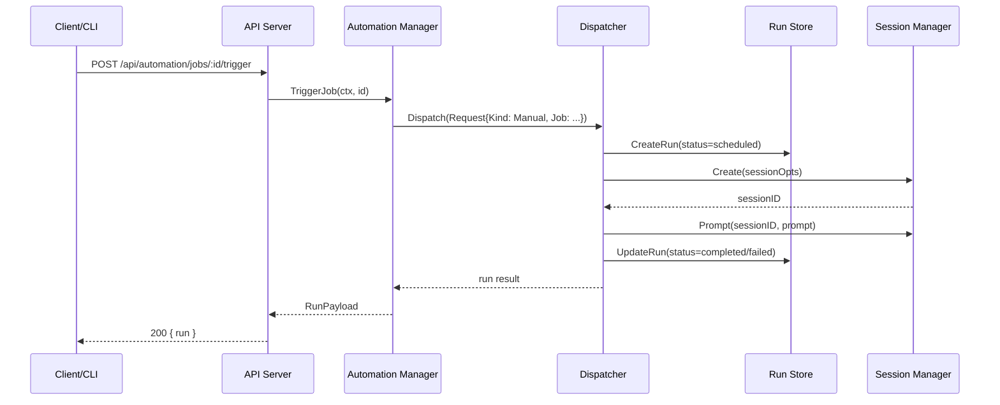

# PR #16: feat: add automation

- **URL**: https://github.com/compozy/agh/pull/16
- **Author**: @pedronauck
- **State**: merged
- **Created**: 2026-04-11T12:17:22Z
- **Merged**: 2026-04-11T16:08:16Z

## Summary by CodeRabbit

- **New Features**
  - Full automation platform: scheduled jobs (cron/interval/one‑time), event-driven triggers, webhooks, retries/backoff, fire‑limits, replay protection, and manual trigger.
  - New HTTP API endpoints for automation and webhooks; automation included in health/status and OpenAPI.
  - CLI commands to manage jobs, triggers, and runs with multiple output formats.

- **Tests**
  - Broad unit and integration coverage across automation runtime, scheduler, dispatcher, trigger engine, webhooks, and CLI.

## Walkthrough

Adds a full automation subsystem: domain model, validation and template tooling, dispatcher/scheduler/trigger engine, manager runtime, API + CLI surfaces (including webhook endpoints), TOML config support, extensive tests, and Go module dependency updates.

## Changes

| Cohort / File(s)                                                                                                                                                                                                          | Summary                                                                                                                                                                                                 |
| ------------------------------------------------------------------------------------------------------------------------------------------------------------------------------------------------------------------------- | ------------------------------------------------------------------------------------------------------------------------------------------------------------------------------------------------------- |
| **Go module**   `go.mod`                                                                                                                                                                                               | Promoted several indirect deps to direct and added scheduling/cron/cli libs (`github.com/go-co-op/gocron/v2`, `github.com/jonboulle/clockwork`, `github.com/robfig/cron/v3`, `github.com/spf13/cobra`). |
| **API contracts & responses**   `internal/api/contract/automation.go`, `internal/api/contract/responses.go`, `internal/api/contract/contract_test.go`                                                                  | Added automation DTOs (jobs/triggers/runs/webhook payloads/requests), HasChanges helpers, response wrappers, extended HealthResponse, and contract tests.                                               |
| **API core & handlers**   `internal/api/core/automation.go`, `internal/api/core/conversions.go`, `internal/api/core/errors.go`, `internal/api/core/interfaces.go`, `internal/api/core/handlers.go`                     | New Gin handlers, query parsers, conversion helpers, automation error→HTTP mapping, `AutomationManager` interface, and wiring into BaseHandlers.                                                        |
| **API tests & testutil**   `internal/api/core/*.go`, `internal/api/testutil/apitest.go`, `internal/api/core/test_helpers_test.go`                                                                                      | Unit and integration tests for handlers, helper fixtures, and a `StubAutomationManager` test double.                                                                                                    |
| **HTTP/UDS server & routes**   `internal/api/httpapi/*`, `internal/api/udsapi/*`, `internal/api/httpapi/routes.go`, `internal/api/udsapi/routes.go`, `internal/api/httpapi/server.go`, `internal/api/udsapi/server.go` | Added server options to inject automation manager, registered `/api/automation/*` and `/api/webhooks/*` routes, and updated route tests.                                                                |
| **OpenAPI spec**   `internal/api/spec/spec.go`, `internal/api/spec/spec_test.go`                                                                                                                                       | Added automation/webhook operations, header parameter support, enum schema generation, and spec tests.                                                                                                  |
| **Automation domain model & persistence**   `internal/automation/model/*`, `internal/automation/model/persistence.go`, `internal/automation/persistence.go`, `internal/automation/types.go`                            | New model types/enums, persistence query/overlay types, sentinel errors, and re-exported aliases.                                                                                                       |
| **Model validation & templates**   `internal/automation/model/validate.go`, `internal/automation/model/template.go`, `internal/automation/template.go`, `internal/automation/validate.go`                              | Comprehensive validation (schedules/retry/fire-limit/scope/filter) and strict trigger prompt template parsing/validation with public wrappers.                                                          |
| **Dispatcher, TriggerEngine, Scheduler, Manager**   `internal/automation/dispatch.go`, `internal/automation/trigger.go`, `internal/automation/schedule.go`, `internal/automation/manager.go`                           | New Dispatcher (concurrency, retries, fire-limits), TriggerEngine (webhook auth/replay/filtering), Scheduler (gocron-backed), and Manager (config sync, lifecycle, CRUD, webhook handling).             |
| **Scheduler & dispatcher tests**   `internal/automation/*_test.go`, `internal/automation/*_integration_test.go`                                                                                                        | Extensive unit and integration tests for dispatcher, scheduler, trigger engine and manager (many new test files, including integration-tagged suites).                                                  |
| **CLI surface & client**   `internal/cli/automation.go`, `internal/cli/client.go`, `internal/cli/*_test.go`, `internal/cli/root.go`                                                                                    | New `automation` Cobra command (jobs/triggers/runs), client methods and type aliases, parsing/formatting, and many CLI tests/integration updates.                                                       |
| **Configuration**   `internal/config/automation.go`, `internal/config/automation_integration_test.go`                                                                                                                  | TOML-backed automation config structs, validation, overlay merging logic, and integration tests.                                                                                                        |
| **Extension API**   `internal/automation/extension.go`, `internal/automation/extension_test.go`                                                                                                                        | Added extension trigger request type and validation requiring `ext.` prefix.                                                                                                                            |
| **Test scaffolding updates**   many files under `internal/api/*`, `internal/cli/*`, `internal/automation/*`                                                                                                            | Test helpers wired to accept/inject automation manager; many tests added/updated to cover automation surface.                                                                                           |

## Sequence Diagram

