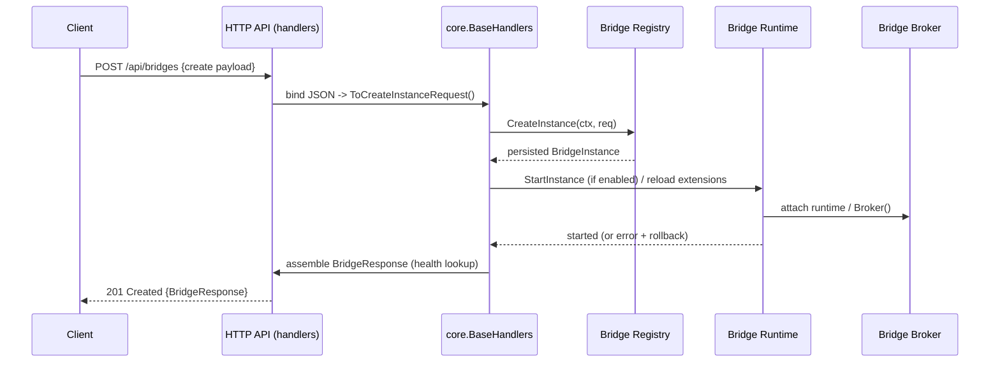

# PR #17: refactor: rename spaces to channels

- **URL**: https://github.com/compozy/agh/pull/17
- **Author**: @pedronauck
- **State**: merged
- **Created**: 2026-04-13T16:14:22Z
- **Merged**: 2026-04-13T17:23:50Z

## Summary by CodeRabbit

- **New Features**
  - Added full "bridge" management: REST endpoints (/api/bridges), CLI commands (bridge ...), test-delivery, route listing, and lifecycle actions (enable/disable/restart).

- **Refactor**
  - Replaced the "channel" domain with "bridge" across API, runtime, CLI and docs.
  - Renamed network "spaces" to "channels" in session/network payloads, CLI flags, and observability outputs.

- **Bug Fixes**
  - Network-terminal command allowlist updated to include the "channels" command name.

## Walkthrough

This PR renames the "channels" domain to "bridges", replaces network/session "space" with "channel", adds a full bridges domain implementation (models, registry, broker, runtime), replaces handlers/HTTP/UDS/CLI/contracts/tests to bridges, and updates many tests and wiring. Also changes ACP terminal allowlist: `spaces` → `channels`.

## Changes

| Cohort / File(s)                                                                                                                                                                                                                                                                                                            | Summary                                                                                                                                                                             |
| --------------------------------------------------------------------------------------------------------------------------------------------------------------------------------------------------------------------------------------------------------------------------------------------------------------------------- | ----------------------------------------------------------------------------------------------------------------------------------------------------------------------------------- |
| **API Contracts — Bridges**   `internal/api/contract/bridges.go`, `internal/api/contract/bridges_test.go`                                                                                                                                                                                                                | Added bridge DTOs, validators/converters, delivery-test types, health/response wrappers; tests converted from channel → bridge semantics.                                           |
| **API Contracts — Removed Channels**   `internal/api/contract/channels.go`                                                                                                                                                                                                                                               | Deleted channel contract types and converters.                                                                                                                                      |
| **Core Handlers — Bridges**   `internal/api/core/bridges.go`, `internal/api/core/bridges_test.go`, `internal/api/core/interfaces.go`, `internal/api/core/errors.go`, `internal/api/core/conversions.go`                                                                                                                  | Added BaseHandlers bridge endpoints, lifecycle transitions, health enrichment and bridge-specific interfaces; substituted channel error mapping and conversions to bridge variants. |
| **Core Handlers — Removed Channels**   `internal/api/core/channels.go`, `internal/api/core/channels_test.go`                                                                                                                                                                                                             | Removed channel HTTP handlers, helpers and their tests.                                                                                                                             |
| **Network / Session renames**   `internal/api/contract/contract.go`, `internal/api/core/network.go`, `internal/api/core/handlers.go`, `internal/api/core/conversions_parsers_test.go`                                                                                                                                    | Replaced Session/Network DTO fields and query params `Space` → `Channel`; NetworkSpaces → NetworkChannels and related tests.                                                        |
| **HTTP API routing & server wiring**   `internal/api/httpapi/routes.go`, `internal/api/httpapi/handlers.go`, `internal/api/httpapi/server.go`, `internal/api/httpapi/bridges_test.go`, `internal/api/httpapi/bridges_integration_test.go`                                                                                | Rewired REST from `/api/channels` → `/api/bridges`, updated handler wiring, added bridge HTTP tests and integration tests.                                                          |
| **HTTP API — Removed channel tests**   `internal/api/httpapi/channels_test.go`, `internal/api/httpapi/channels_integration_test.go`                                                                                                                                                                                      | Deleted channel-focused HTTP tests.                                                                                                                                                 |
| **UDS API — Bridges**   `internal/api/udsapi/bridges_test.go`, `internal/api/udsapi/bridges_integration_test.go`, `internal/api/udsapi/routes.go`, `internal/api/udsapi/server.go`                                                                                                                                       | Added UDS bridge tests, route wiring, and server option changes to accept BridgeService.                                                                                            |
| **UDS API — Removed channels**   `internal/api/udsapi/channels_test.go`, `internal/api/udsapi/channels_integration_test.go`                                                                                                                                                                                              | Removed UDS channel tests.                                                                                                                                                          |
| **OpenAPI / Spec updates**   `internal/api/spec/spec.go`, `internal/api/spec/spec_test.go`                                                                                                                                                                                                                               | Replaced channel endpoints/enums with bridge equivalents in OpenAPI spec and tests.                                                                                                 |
| **Test utilities & stubs**   `internal/api/testutil/apitest.go`, `internal/api/httpapi/helpers_test.go`, `internal/api/udsapi/helpers_test.go`                                                                                                                                                                           | Renamed stubs (StubChannelService → StubBridgeService), updated Observer/NetworkService stubs to bridge types and query param rename.                                               |
| **Domain: Bridges (new)**   `internal/bridges/*` (`doc.go`, `types.go`, `lifecycle.go`, `routing.go`, `target.go`, `registry.go`, `delivery_*.go`, `dimensions.go`, tests)                                                                                                                                               | Introduced bridges package: models, errors, statuses, routing, delivery types, registry service/store interfaces, lifecycle validation, broker and delivery metrics, and tests.     |
| **Domain: Removed Channels**   `internal/channels/doc.go`, `internal/channels/registry.go`                                                                                                                                                                                                                               | Deleted old channels package doc and registry implementation.                                                                                                                       |
| **Daemon: Bridge runtime & boot**   `internal/daemon/bridges.go`, `internal/daemon/bridges_test.go`, `internal/daemon/boot.go`, `internal/daemon/daemon.go`, `internal/daemon/daemon_integration_test.go`                                                                                                                | Added bridge runtime (lifecycle, secret resolution, extension reload/rollback), wired into boot and daemon composition; tests updated.                                              |
| **Daemon: Removed Channel runtime**   `internal/daemon/channels.go`                                                                                                                                                                                                                                                      | Removed channel runtime implementation.                                                                                                                                             |
| **Extension: Bridge delivery & host API**   `internal/extension/bridge_delivery_notifier.go`, `internal/extension/bridge_delivery_notifier_test.go`, `internal/extension/bridge_delivery_integration_test.go`, `internal/extension/contract/*`, `internal/extension/capability.go`, `internal/extension/contract/sdk.go` | Replaced channel delivery notifier, host API methods and SDK root types with bridge equivalents; updated capability → host API mappings.                                            |
| **CLI: Bridge commands & client**   `internal/cli/bridge.go`, `internal/cli/bridge_test.go`, `internal/cli/client.go`, `internal/cli/client_test.go`, `internal/cli/helpers_test.go`                                                                                                                                     | Added bridge CLI surface and tests; DaemonClient interface and client helpers now target bridges; tests updated.                                                                    |
| **CLI: Removed channel tests/commands**   `internal/cli/channel_test.go`                                                                                                                                                                                                                                                 | Removed legacy channel CLI tests.                                                                                                                                                   |
| **CLI: Network/Session renames**   `internal/cli/network.go`, `internal/cli/network_test.go`, `internal/cli/network_client_test.go`, `internal/cli/session.go`, `internal/cli/session_test.go`                                                                                                                           | Replaced `spaces` with `channels` in network commands, session flags/outputs, and tests.                                                                                            |
| **Config: default network key rename**   `internal/config/config.go`, `internal/config/config_test.go`, `internal/config/merge.go`, `internal/config/merge_test.go`                                                                                                                                                      | Renamed NetworkConfig.DefaultSpace → DefaultChannel and TOML key default_space → default_channel; validation and tests updated.                                                     |
| **ACP handler small change**   `internal/acp/handlers.go`                                                                                                                                                                                                                                                                | Adjusted isAllowedNetworkTerminalArgv allowlist: replaced `spaces` with `channels` for argv[2].                                                                                     |
| **Misc: test/handler wiring & helper tweaks**   many \*\_test.go and helpers across packages                                                                                                                                                                                                                             | Numerous test updates for channel→bridge renames and `space`→`channel` query/body keys; added mustMarkFlagRequired helper and used it in flag setup.                                |

## Sequence Diagram

