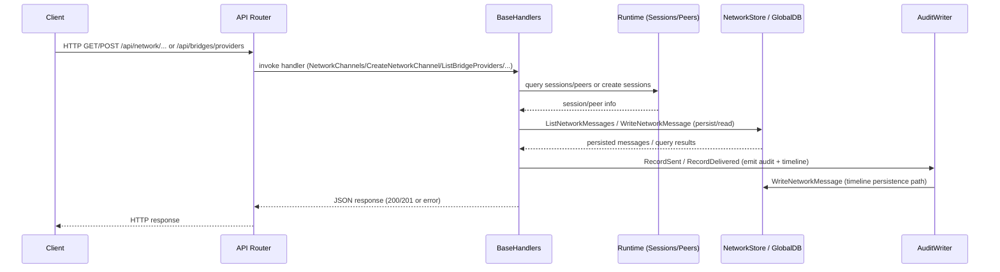

# PR #18: feat: add network, bridges and automations web pages

- **URL**: https://github.com/compozy/agh/pull/18
- **Author**: @pedronauck
- **State**: merged
- **Created**: 2026-04-14T02:24:54Z
- **Merged**: 2026-04-14T16:58:24Z

## Summary by CodeRabbit

- **New Features**
  - Network tab: channels, peers, read-only timelines, create-channel with agent selection, channel/peer detail views, and peer/channel messages.
  - Bridges: provider discovery & listing, provider-aware bridge list/detail, create-bridge dialog, test-delivery tool, and new providers endpoint.

- **Telemetry & Persistence**
  - Persisted network message history; bridge delivery and health now report last-success timestamps.

- **UI/UX Improvements**
  - Sidebar links for Network and Bridges; new panels, dialogs, summaries, and improved relative-time and metric displays.

## Walkthrough

Adds bridge provider discovery/listing and last-success telemetry; implements a persisted network subsystem (channels, peers, messages) with DB schema, store APIs, new HTTP/UDS routes and handlers, core interfaces and handler wiring, web UI/hook surfaces for Bridges and Network, message/audit timeline persistence, manifest bridge metadata, and extensive tests.

## Changes

| Cohort / File(s)                                                                                                                                                                                                                                                         | Summary                                                                                                                                                                                                                                                               |
| ------------------------------------------------------------------------------------------------------------------------------------------------------------------------------------------------------------------------------------------------------------------------ | --------------------------------------------------------------------------------------------------------------------------------------------------------------------------------------------------------------------------------------------------------------------- |
| **API Contracts & Responses**   `internal/api/contract/bridges.go`, `internal/api/contract/contract.go`, `internal/api/contract/responses.go`                                                                                                                         | Added `BridgeProvidersResponse` and provider-shaped DTOs; extended `BridgeHealthPayload` with `last_success_at`; added network DTOs for channels/peers/messages/metrics and new response wrapper types.                                                               |
| **Core Handlers & Interfaces**   `internal/api/core/bridges.go`, `internal/api/core/interfaces.go`, `internal/api/core/handlers.go`, `internal/api/core/network.go`, `internal/api/core/network_details.go`                                                           | Added `ListBridgeProviders` handler and `BridgeService.ListProviders`; introduced `NetworkStore` interface and threaded it through `BaseHandlers`; implemented network endpoints (peers/channels/messages/peer detail/create channel) and session-enrichment/helpers. |
| **Conversions & Observability**   `internal/api/core/conversions.go`, `internal/observe/bridges.go`                                                                                                                                                                   | Populated `last_success_at` in Bridge health conversion and observation from delivery metrics.                                                                                                                                                                        |
| **Audit / Message Persistence & Manager**   `internal/network/audit.go`, `internal/network/manager.go`, `internal/network/audit_test.go`                                                                                                                              | Added `delivered` audit direction and `RecordDelivered`; introduced `MessageStore` and timeline normalization to persist network messages alongside audit entries.                                                                                                    |
| **Store / DB schema & implementation**   `internal/store/store.go`, `internal/store/types.go`, `internal/store/globaldb/global_db.go`, `internal/store/globaldb/global_db_network_messages.go`                                                                        | Added `NetworkMessageStore` interface, `NetworkMessageEntry`/`NetworkMessageQuery` types, created `network_message_log` table and indexes, and implemented `WriteNetworkMessage` / `ListNetworkMessages` with tests.                                                  |
| **Daemon / Bridge runtime & metrics**   `internal/bridges/types.go`, `internal/bridges/delivery_metrics.go`, `internal/bridges/delivery_broker.go`, `internal/daemon/bridges.go`                                                                                      | Added `BridgeProvider` type and extension-registry discovery; recorded/exposed per-instance `lastSuccessAt` delivery metric; implemented `bridgeRuntime.ListProviders`.                                                                                               |
| **Server wiring & routes**   `internal/api/httpapi/routes.go`, `internal/api/udsapi/routes.go`, `internal/api/httpapi/server.go`, `internal/api/udsapi/server.go`, `internal/api/httpapi/handlers.go`                                                                 | Registered `/api/bridges/providers` and network routes (`/api/network/...`); added `WithNetworkStore` option and passed `networkStore` into handler construction.                                                                                                     |
| **Web — Bridges frontend**   `web/src/systems/bridges/*`, `web/src/routeTree.gen.ts`, `web/src/components/app-sidebar.tsx`                                                                                                                                            | New Bridges frontend modules: adapters, hooks, types, formatters, query keys/options, UI components (list/detail/provider/create/test), route integration and tests.                                                                                                  |
| **Web — Network frontend**   `web/src/systems/network/*`, `web/src/routeTree.gen.ts`, `web/src/components/app-sidebar.tsx`                                                                                                                                            | New Network frontend modules: adapters, hooks, types, formatters, query keys/options, UI components (channels/peers lists, detail panels, create dialog, empty states), route integration and tests.                                                                  |
| **Tests & Test Utilities**   `internal/api/core/bridges_test.go`, `internal/api/testutil/apitest.go`, `internal/api/httpapi/bridges_test.go`, `internal/api/udsapi/bridges_test.go`, `internal/store/globaldb/global_db_network_messages_test.go`, assorted web tests | Extensive unit/integration tests added or extended for bridge providers, network endpoints, audit/message persistence, daemon registry, and web UI; added `StubNetworkStore` and extended `StubBridgeService`.                                                        |
| **Extension manifest & helpers**   `internal/extension/manifest.go`, `internal/extension/manifest_test.go`, `internal/daemon/extensions.go`                                                                                                                           | Added `[bridge]` manifest section (platform/display_name) with conditional validation for bridge-capable extensions; refactored manifest/snapshot loading helpers.                                                                                                    |
| **Misc UI & infra tweaks**   assorted web and server files (automation, session message rendering, workspace API/hooks)                                                                                                                                               | Various UI refactors and small infra/test wiring adjustments (e.g., remove lazy MessageMarkdown import, automation editor/dialog refactors, workspace fetch/detail additions).                                                                                        |

## Sequence Diagram

