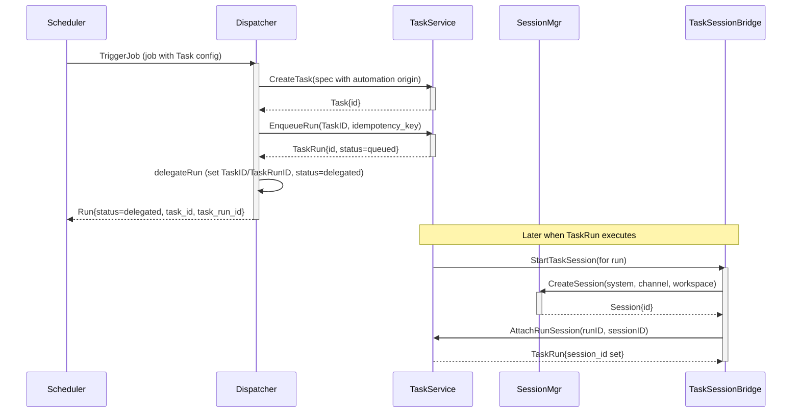

# PR #19: feat: add core tasks

- **URL**: https://github.com/compozy/agh/pull/19
- **Author**: @pedronauck
- **State**: merged
- **Created**: 2026-04-14T14:33:23Z
- **Merged**: 2026-04-14T20:31:56Z

## Summary by CodeRabbit

- **New Features**
  - Full task management across APIs and CLI: create/list/get/update/cancel tasks, child tasks, dependencies, and filters.
  - Task run lifecycle: enqueue, claim, start, attach-session, complete, fail, cancel with idempotency and session binding.
  - Automation delegation: jobs can delegate execution into task runs and record task/run links.
  - Network ingress auditing: peer-driven task create/update/enqueue with detailed audit records.
  - Observability: task metrics, summaries, and health reporting.

- **Tests**
  - Extensive unit & integration coverage across APIs, CLI, daemon, network ingress, persistence, host integration, and automation.

## Walkthrough

Adds a new task subsystem and integrates it across API contracts, HTTP/UDS routes, Host API, network ingress/auditing, persistence (DB schema + stores), daemon task runtime/session bridge, automation delegation into tasks, CLI/client surfaces, observer metrics/health, and extensive tests.

## Changes

| Cohort / File(s)                                                                                                                                                                                                                                                          | Summary                                                                                                                                                                                                                             |
| ------------------------------------------------------------------------------------------------------------------------------------------------------------------------------------------------------------------------------------------------------------------------- | ----------------------------------------------------------------------------------------------------------------------------------------------------------------------------------------------------------------------------------- |
| **API contract & responses**   `internal/api/contract/tasks.go`, `internal/api/contract/responses.go`, `internal/api/contract/automation.go`, `internal/api/contract/contract_test.go`                                                                                 | Add task/task-run payloads, list/detail wrappers, create/update/enqueue/claim/start/complete/fail/cancel request types; extend Job/Run payloads with `task`/`task_id`/`task_run_id`; update JSON-shape tests and Update.HasChanges. |
| **Core handlers, interfaces & errors**   `internal/api/core/interfaces.go`, `internal/api/core/tasks.go`, `internal/api/core/handlers.go`, `internal/api/core/conversions.go`, `internal/api/core/errors.go`, `internal/api/core/*_test.go`                            | Introduce `TaskService` and TaskActorContextResolver; wire Tasks into BaseHandlers; implement HTTP handlers, request/query parsing, converters, error→HTTP status mapping, and many unit/integration tests.                         |
| **HTTP/UDS servers & routes**   `internal/api/httpapi/routes.go`, `internal/api/httpapi/server.go`, `internal/api/udsapi/routes.go`, `internal/api/udsapi/server.go`, `internal/api/httpapi/*_test.go`, `internal/api/udsapi/*_test.go`                                | Register `/api/tasks` and `/api/task-runs` routes; add server options `WithTaskService` and require TaskService; update route registration tests.                                                                                   |
| **Automation model & dispatch**   `internal/automation/model/*`, `internal/automation/dispatch.go`, `internal/automation/manager.go`, `internal/automation/*_test.go`                                                                                                  | Add `JobTaskConfig` and `RunDelegated`; extend Job/Run model and validation; dispatch path delegates task-backed jobs into task creation/enqueue and persist task linkage; add session↔task actor provenance APIs.                  |
| **Daemon boot & task runtime**   `internal/daemon/task_runtime.go`, `internal/daemon/boot.go`, `internal/daemon/daemon.go`, `internal/daemon/*_test.go`                                                                                                                | Add taskSessionBridge implementing SessionExecutor, boot wiring for TaskManager, task-run recovery on boot, and integration tests for runtime/recovery.                                                                             |
| **Persistence & DB schema**   `internal/store/globaldb/global_db.go`, `internal/store/globaldb/global_db_task*.go`, `internal/store/globaldb/global_db_automation.go`, `internal/store/globaldb/*_test.go`                                                             | DB schema additions (tasks, task_runs, dependencies, events, idempotency), tasks/task-run CRUD stores, dependency graph with cycle detection, events and idempotency handling, and automation job/run persistence updates.          |
| **Network ingress & auditing**   `internal/network/tasks.go`, `internal/network/manager.go`, `internal/network/audit.go`, `internal/network/*_test.go`, `internal/network/tasks_integration_test.go`                                                                   | Peer-driven task ingress APIs with TaskIngressContext validation, channel binding/enforcement (including stale-repair), capability checks, and task ingress auditing (accepted/rejected) plus tests.                                |
| **Extension Host API & protocol**   `internal/extension/contract/host_api.go`, `internal/extension/host_api.go`, `internal/extension/host_api_tasks.go`, `internal/extension/protocol/host_api.go`, `internal/extension/capability.go`, `internal/extension/*_test.go` | Expose tasks Host API methods and params; add host API handler implementations, protocol constants, capability mappings, and host-api integration tests.                                                                            |
| **Observer / health / metrics**   `internal/observe/tasks.go`, `internal/observe/observer.go`, `internal/observe/health.go`, `internal/observe/*_test.go`                                                                                                              | Add task summary and metrics queries, stuck-run detection with configurable thresholds, TaskHealth aggregation, and associated tests.                                                                                               |
| **CLI & client**   `internal/cli/task.go`, `internal/cli/client.go`, `internal/cli/root.go`, `internal/cli/*_test.go`, `internal/cli/cli_integration_test.go`                                                                                                          | Add `task` CLI commands and DaemonClient task methods, request/query serialization, validation, output formatting, and extensive CLI tests.                                                                                         |
| **Extension & test fixtures**   `internal/api/testutil/apitest.go`, `internal/api/core/test_helpers_test.go`, many `*_test.go` files                                                                                                                                   | Add StubTaskManager/test fixtures and adapt test route wiring so suites exercise task APIs and runtime flows.                                                                                                                       |
| **Spec / OpenAPI**   `internal/api/spec/spec.go`, `internal/api/spec/spec_test.go`                                                                                                                                                                                     | Add `tasks` tag and OpenAPI specs for task/task-run endpoints; include new enums (including `delegated`) and spec tests.                                                                                                            |
| **Misc & support**   `internal/session/stop_reason.go`, `internal/extension/manager.go`, `internal/network/manager.go`, `internal/network/audit.go`                                                                                                                    | Add cooperative RequestStopWithCause, new sentinel errors, task audit writer, manager wiring to accept TaskService, and related test updates.                                                                                       |

## Sequence Diagram

