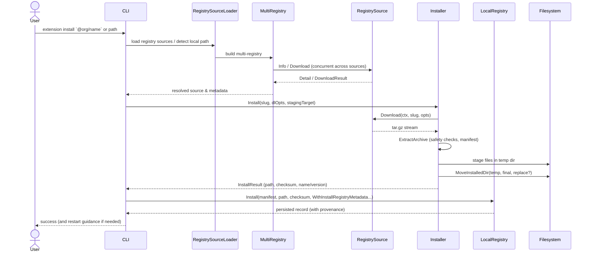

# PR #20: feat: ext registry

- **URL**: https://github.com/compozy/agh/pull/20
- **Author**: @pedronauck
- **State**: merged
- **Created**: 2026-04-14T14:33:43Z
- **Merged**: 2026-04-14T20:14:06Z

## Summary by CodeRabbit

- **New Features**
  - Extension marketplace: search, install, update (with --check), remove; install accepts local path-or-slug, persists marketplace provenance/version, and may emit restart guidance.
  - CLI: new extension subcommands (search/remove/update) and improved install behavior.

- **Refactor**
  - Unified registry abstraction with multi-registry support, GitHub registry adapter, staged/atomic installer, safer archive extraction, managed local extension installs, and provenance tracking.
  - Config: extensions.marketplace settings and DB migration for provenance columns.

- **Tests**
  - Large suite of new unit and integration tests covering CLI, marketplace, registry, installer, extraction, and migration.

## Walkthrough

Adds a registry-backed marketplace and installer pipeline for extensions and skills, registry source abstractions/adapters (GitHub, ClawHub, MultiRegistry), CLI commands for marketplace operations, extension provenance persistence and DB migrations, safe archive extraction/move utilities, many tests, and a nil-returning DeliveryMetrics bridge method for tests.

## Changes

| Cohort / File(s)                                                                                                                                                                                                                                                                 | Summary                                                                                                                                                                                                                                                        |
| -------------------------------------------------------------------------------------------------------------------------------------------------------------------------------------------------------------------------------------------------------------------------------- | -------------------------------------------------------------------------------------------------------------------------------------------------------------------------------------------------------------------------------------------------------------- |
| **Extension CLI & marketplace**   `internal/cli/extension.go`, `internal/cli/extension_marketplace.go`, `internal/cli/extension_marketplace_test.go`, `internal/cli/extension_marketplace_integration_test.go`                                                                | Add `extension` subcommands (search/install/remove/update), local vs marketplace install branching, staging/rollback semantics, provenance recording, restart guidance, and local registry interface changes (`Install` opts and `Uninstall`).                 |
| **Skill CLI & marketplace**   `internal/cli/skill_commands.go`, `internal/cli/skill_marketplace.go`, `internal/cli/skill_marketplace_integration_test.go`, `internal/cli/skill_output.go`, `internal/cli/skill_test.go`                                                       | Refactor skill flows to use new registry abstractions and Installer; add `--check` update mode; centralize registry loading/cleanup; update output types and tests to registry types.                                                                          |
| **Registry core types & aggregation**   `internal/registry/types.go`, `internal/registry/source.go`, `internal/registry/multi.go`, `internal/registry/version.go`, `internal/registry/multi_test.go`, `internal/registry/source_test.go`, `internal/registry/version_test.go` | Introduce unified registry model and interfaces (`RegistrySource`, `Downloader`), `MultiRegistry` aggregator with concurrent resolution/merge, semantic-version update detection, and tests.                                                                   |
| **Registry backends (adapters)**   `internal/registry/github/client.go`, `internal/registry/clawhub/client.go`, `internal/registry/clawhub/client_test.go`, `internal/registry/github/client_test.go`                                                                         | Add GitHub Releases adapter and convert ClawHub client to `RegistrySource` semantics (Name/Capabilities/Info/Download/Close) with updated tests.                                                                                                               |
| **Installer & extraction utilities**   `internal/registry/installer.go`, `internal/registry/installer_test.go`, `internal/registry/installer_integration_test.go`, `internal/registry/extract.go`, `internal/registry/extract_test.go`                                        | Implement `Installer` pipeline: validated downloads, content-type checks, compressed/decompressed/entry limits, safe tar.gz extraction, MoveInstalledDir with backup/rollback, manifest discovery/verification, checksum computation, and comprehensive tests. |
| **Extension persistence & managed installs**   `internal/extension/registry.go`, `internal/extension/registry_test.go`, `internal/extension/install_managed.go`, `internal/extensiontest/...`                                                                                 | Persist provenance fields (`registry_slug`, `registry_name`, `remote_version`), add `InstallOption` API (source/replace/metadata), change managed local install flow to copy/stage via `InstallLocalManaged`, and add tests.                                   |
| **Store schema & migrations**   `internal/store/globaldb/global_db.go`, `internal/store/globaldb/global_db_test.go`, `internal/store/globaldb/migrate_workspace.go`                                                                                                           | Add three nullable provenance columns to `extensions` table and migration to add missing columns; update tests to assert migrated schema/NULL values for legacy rows.                                                                                          |
| **Config & CLI wiring**   `internal/config/config.go`, `internal/config/config_test.go`, `internal/config/merge.go`, `internal/cli/root.go`                                                                                                                                   | Add `ExtensionsConfig`/`ExtensionsMarketplaceConfig`, validation rules (registry/base_url constraints and http warning), overlay merge support, and inject registry source loaders into CLI deps defaults.                                                     |
| **Registry infra & helpers**   `internal/registry/...` (new helpers/tests)                                                                                                                                                                                                    | New installer/extractor helpers, staging/temp cleanup, filesystem-safe moves with backup/rollback, limits and error normalization, and many unit/integration tests across registry packages.                                                                   |
| **Remove legacy marketplace types**   `internal/skills/marketplace/registry.go`, `internal/skills/marketplace/types.go`                                                                                                                                                       | Remove old `marketplace` package types/interfaces in favor of the new `registry` abstraction.                                                                                                                                                                  |
| **Daemon & runtime wiring**   `internal/daemon/boot.go`, `internal/daemon/extensions.go`, `internal/daemon/daemon_test.go`                                                                                                                                                    | Change boot error handling to continue with partial runtime on start failure, pass `homePaths` into daemon extension service, and switch install to `extensionpkg.InstallLocalManaged`.                                                                        |
| **Tests & minor mocks**   `internal/cli/cli_integration_test.go`, many `*_test.go` files                                                                                                                                                                                      | Add/adjust extensive unit and integration tests across CLI, registry, installer, extract, backends, and DB; extend bridge test mock with `DeliveryMetrics() map[string]bridgepkg.BridgeDeliveryMetrics` returning `nil`.                                       |

## Sequence Diagram

