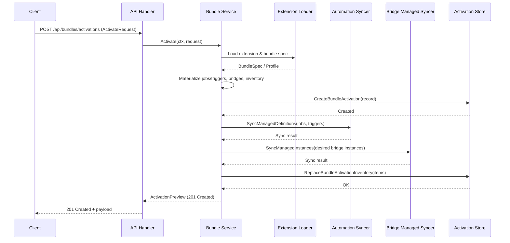

# PR #21: refactor: add extensions gaps

- **URL**: https://github.com/compozy/agh/pull/21
- **Author**: @pedronauck
- **State**: merged
- **Created**: 2026-04-15T02:46:58Z
- **Merged**: 2026-04-15T03:59:10Z

## Summary by CodeRabbit

- **New Features**
  - Bundle activation lifecycle: catalog, preview, activate, list/update/deactivate, and network settings endpoints.
  - Bridge secret‑binding API: list, set, and delete secret bindings for bridges.

- **Improvements**
  - Network status now includes bundle-derived defaults and declared channels.
  - Automation supports managed job/trigger definitions sourced from bundles.
  - Extension uninstall/disable is blocked when active bundle activations exist.

- **Persistence**
  - Database schema extended to store bundle activations/inventory and bridge instance source.

## Walkthrough

Adds bundle activation lifecycle: bundle spec loading/validation, persistent activations and inventory, reconciliation syncing automations and managed bridges, bundle network settings exposure, bridge secret‑binding CRUD, DB migrations, daemon wiring, API routes/handlers, and extensive tests and fixtures.

## Changes

| Cohort / File(s)                                                                                                                                                                                                                                                                                | Summary                                                                                                                                                                                                                   |
| ----------------------------------------------------------------------------------------------------------------------------------------------------------------------------------------------------------------------------------------------------------------------------------------------- | ------------------------------------------------------------------------------------------------------------------------------------------------------------------------------------------------------------------------- |
| **API contract additions**   `internal/api/contract/bundles.go`, `internal/api/contract/contract.go`                                                                                                                                                                                         | New bundle-related request/response DTOs; NetworkStatusPayload replaced/extended to include configured/effective default channel/source and DeclaredChannels; ExtensionPayload now includes bundle summaries.             |
| **HTTP/UDS routing & handlers**   `internal/api/core/bundles.go`, `internal/api/core/bridges.go`, `internal/api/httpapi/routes.go`, `internal/api/udsapi/routes.go`, `internal/api/httpapi/handlers.go`, `internal/api/udsapi/server.go`, `internal/api/httpapi/server.go`                   | Added bundle endpoints (catalog, preview, activations CRUD, network settings) and bridge secret-binding endpoints; wired BundleService into servers and handler config.                                                   |
| **Core interfaces & error mapping**   `internal/api/core/interfaces.go`, `internal/api/core/errors.go`                                                                                                                                                                                       | BridgeService gains secret-binding methods; new BundleService interface introduced; StatusForBridgeError extended to map new bridge errors.                                                                               |
| **Bundles service & domain**   `internal/bundles/service.go`, `internal/bundles/model/model.go`, `internal/bundles/service_test.go`                                                                                                                                                          | New Service implementing Catalog/Preview/Activate/List/Get/Update/Deactivate/Reconcile; Activation and Inventory domain models; reconciliation producing automations, bridges, declared channels and persisted inventory. |
| **Persistence: global DB bundle support & migrations**   `internal/store/globaldb/global_db_bundles.go`, `internal/store/globaldb/global_db.go`, `internal/store/globaldb/migrate_workspace.go`, `internal/store/globaldb/global_db_bundles_test.go`                                         | New `bundle_activations` and `bundle_activation_inventory` tables, CRUD and inventory replace/list/count methods; migrations add `bridge_instances.source` and `bundle_activations.spec_content_hash` when missing.       |
| **Bridge managed sync & types**   `internal/bridges/managed_sync.go`, `internal/bridges/types.go`, `internal/bridges/managed_sync_test.go`, `internal/bridges/registry.go`                                                                                                                   | ManagedSyncer for reconciling bridge instances by source; new BridgeInstanceSource (`dynamic`,`package`) type; package-sourced instances treated read-only; registry accepts `source` on create.                          |
| **Daemon wiring & runtime secret store**   `internal/daemon/boot.go`, `internal/daemon/daemon.go`, `internal/daemon/extensions.go`, `internal/daemon/bridges.go`                                                                                                                             | Bootstraps bundles service at startup, integrates bundle reconcile into extension reload, extends bridge runtime with secret-binding store methods and wiring, and exposes Bundles dependency to servers.                 |
| **Extension bundle support & installer**   `internal/extension/bundle.go`, `internal/extension/manager.go`, `internal/extension/manifest.go`, `internal/extension/describe.go`, `internal/extension/install_managed.go`, `internal/extension/install_managed_test.go`                        | Bundle spec loader/validator and model types; manifest resources include bundles; manager loads/clones bundle specs; managed install materializes symlinks and recomputes recorded checksum.                              |
| **Automation: managed sources & sync**   `internal/automation/manager.go`, `internal/automation/model/types.go`, `internal/automation/types.go`, `internal/automation/model/validate.go`, `internal/automation/model/persistence.go`                                                         | Introduced `JobSourcePackage`, generalized overlay-managed sources, added `SyncManagedDefinitions` to sync jobs/triggers per managed source and refactored sync flows.                                                    |
| **API handler updates & tests**   `internal/api/core/handlers.go`, `internal/api/httpapi/handlers_test.go`, `internal/api/udsapi/handlers_test.go`, `internal/api/httpapi/httpapi_integration_test.go`, `internal/api/udsapi/udsapi_integration_test.go`, `internal/api/testutil/apitest.go` | BaseHandlers now accept Bundles service and resolve default session channel from bundle/network settings; tests and stubs updated to cover new routes and secret-binding behavior.                                        |
| **Global DB bridge updates & tests**   `internal/store/globaldb/global_db_bridge.go`, `internal/store/globaldb/global_db_bridges_test.go`                                                                                                                                                    | `bridge_instances` schema and persistence updated to include `source` column; tests assert legacy rows default to `dynamic`.                                                                                              |
| **Integration/CLI/test harness updates**   `internal/cli/cli_integration_test.go`, `internal/api/httpapi/httpapi_integration_test.go`, `internal/daemon/bridges_test.go`                                                                                                                     | Integration and test harnesses extended to support bridge secret-store methods and validate secret-binding behaviors.                                                                                                     |
| **Evidence files**   `.compozy/tasks/extgaps/qa/evidence/http-bundles-delete.status`, `.compozy/tasks/extgaps/qa/evidence/http-bundles-get-after-delete.status`                                                                                                                              | Added status files recording expected HTTP outcomes (204 for delete, 404 for get-after-delete).                                                                                                                           |

## Sequence Diagram

