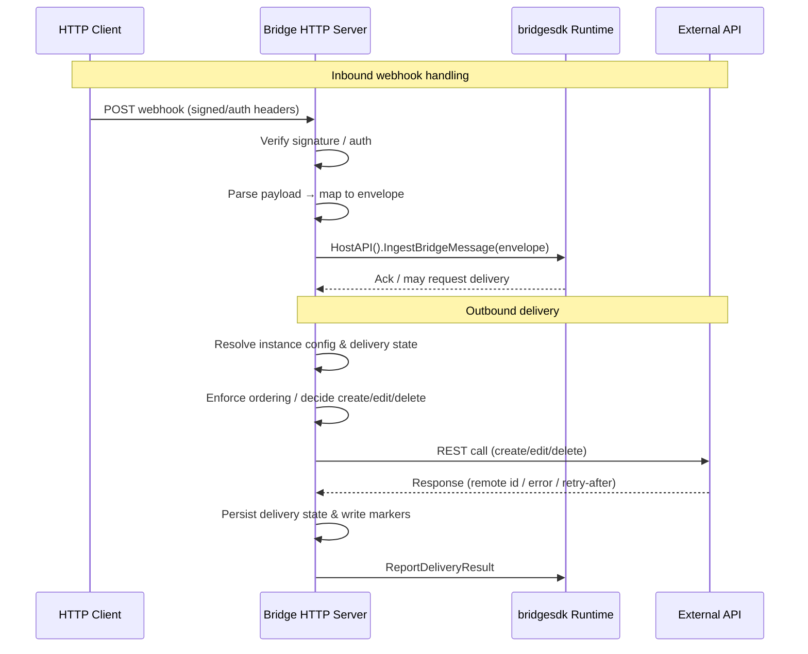

# PR #23: feat: bridge adapters

- **URL**: https://github.com/compozy/agh/pull/23
- **Author**: @pedronauck
- **State**: merged
- **Created**: 2026-04-15T16:07:45Z
- **Merged**: 2026-04-15T20:14:03Z

## Summary by CodeRabbit

- **New Features**
  - Added Discord bridge with webhook interactions, message create/edit/delete, reactions, and signature verification.
  - Added Google Chat bridge supporting direct webhooks and Pub/Sub, threading, DM policy, and delivery operations.
  - Added GitHub bridge for issue/review comment create/update/delete with PAT and App auth modes.
- **Tests**
  - Added extensive end-to-end and unit tests covering webhook handling, signature verification, mapping, and delivery flows.

## Walkthrough

Adds three new bridge adapters (Discord, Google Chat, GitHub): CLI entrypoints, environment-driven marker helpers, full providers with webhook HTTP servers, external-API clients, delivery/ingest sequencing, and extensive unit/integration tests.

## Changes

| Cohort / File(s)                                                                                                                                                                                   | Summary                                                                                                                                                                                                                                                                 |
| -------------------------------------------------------------------------------------------------------------------------------------------------------------------------------------------------- | ----------------------------------------------------------------------------------------------------------------------------------------------------------------------------------------------------------------------------------------------------------------------- |
| **Discord bridge**   `extensions/bridges/discord/main.go`, `extensions/bridges/discord/markers.go`, `extensions/bridges/discord/provider.go`, `extensions/bridges/discord/provider_test.go`     | New Discord executable entrypoint, marker-file utilities, provider implementing webhook server, Ed25519 signature verification, inbound mapping, delivery sequencing and REST client, plus comprehensive tests.                                                         |
| **Google Chat (gchat) bridge**   `extensions/bridges/gchat/main.go`, `extensions/bridges/gchat/markers.go`, `extensions/bridges/gchat/provider.go`, `extensions/bridges/gchat/provider_test.go` | New GChat executable entrypoint, marker-file utilities, provider implementing direct & Pub/Sub webhook handling, JWT bearer auth, RS256 verification, delivery sequencing and API client, plus comprehensive tests.                                                     |
| **GitHub bridge**   `extensions/bridges/github/api.go`, `extensions/bridges/github/main.go`, `extensions/bridges/github/markers.go`, `extensions/bridges/github/provider.go`                    | New GitHub API client and interface (PAT and App auth with JWT→installation token flow), executable entrypoint, marker-file utilities, provider with HMAC webhook verification, comment create/update/delete delivery, per-instance ordering, and runtime integrations. |

## Sequence Diagram

