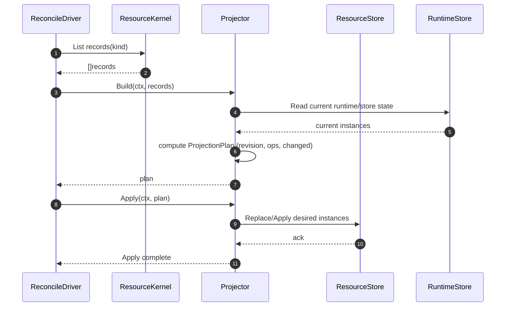
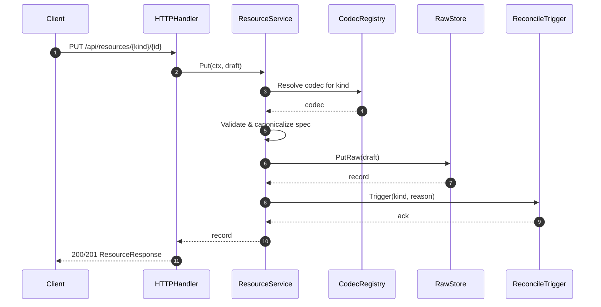

# PR #25: feat: add ext refac and sandbox

- **URL**: https://github.com/compozy/agh/pull/25
- **Author**: @pedronauck
- **State**: merged
- **Created**: 2026-04-16T16:16:41Z
- **Merged**: 2026-04-16T21:59:17Z

## Summary by CodeRabbit

- **New Features**
  - Operator-facing Resources API: CRUD for bundles, activations, automation (jobs/triggers), bridge instances, agents, skills, MCP servers.
  - Resource-backed automation/bridge definitions with reconciliation and projection.
  - Environment profiles: configurable backends, sync/persistence, network and Daytona settings.
  - CLI: workspace add/edit --environment flag; session listing and outputs show Environment/Backend.

- **Bug Fixes**
  - Webhook handlers now verify signatures and reject unauthorized requests.

## Walkthrough

Introduces a resource-driven desired-state system (resources, codecs, projection plans, stores, and projectors) across bundles, automation, bridges, agents/skills, and MCP servers; adds environment profiles and ACP launcher/tool-host abstractions; wires resource APIs, server routing, daemon boot/reconcile, and extensive tests.

## Changes

| Cohort / File(s)                                                                                                                                                                                  | Summary                                                                                                                                                                                                                                                            |
| ------------------------------------------------------------------------------------------------------------------------------------------------------------------------------------------------- | ------------------------------------------------------------------------------------------------------------------------------------------------------------------------------------------------------------------------------------------------------------------ |
| **Resource API & DTOs**   `internal/api/contract/resources.go`, `internal/api/contract/responses.go`, `internal/api/spec/spec.go`, `internal/api/contract/contract.go`                         | Added resource request/response DTOs, OpenAPI registration for resource endpoints, and session-environment payload fields.                                                                                                                                         |
| **Core resource handlers & interfaces**   `internal/api/core/resources.go`, `internal/api/core/interfaces.go`, `internal/api/core/errors.go`, `internal/api/core/*_test.go`                    | Added ResourceService interface, HTTP handlers/parsers for List/Get/Put/Delete resources, error→status mapping, and extensive tests.                                                                                                                               |
| **HTTP/UDS server wiring**   `internal/api/httpapi/*`, `internal/api/udsapi/*`, `internal/api/spec/*`, `internal/api/testutil/apitest.go`                                                      | Wired ResourceService and AgentCatalog into servers, added options (WithResourceService/WithAgentCatalog/WithResourceOperatorAuth), conditional route registration based on operator auth, and test helpers/stubs.                                                 |
| **Resource framework (kernel, codecs, stores)**   `internal/resources` usages across many files, `internal/api/testutil/apitest.go`                                                            | Added typed-kind codecs, codec registry usage, typed stores and test stubs to support resource operations (referenced broadly).                                                                                                                                    |
| **Bundles / Activation resources**   `internal/bundles/resource.go`, `internal/bundles/resource_projection.go`, `internal/bundles/resource_store.go`, `internal/bundles/*`                     | Typed bundle/activation codecs, projection plan and apply, ResourceStore that fans out owned jobs/triggers/bridges, apply/cleanup logic, and unit/integration tests; Service refactored to resource APIs.                                                          |
| **Automation resources & manager**   `internal/automation/resource.go`, `internal/automation/resource_projection.go`, `internal/automation/manager.go`, `internal/automation/resource_test.go` | Added job/trigger resource codecs, projection build/apply, manager option to enable resource-definitions, and routing of CRUD to resource-backed flows with tests.                                                                                                 |
| **Bridges resources & managed sync**   `internal/bridges/resource.go`, `internal/bridges/resource_projection.go`, `internal/bridges/managed_sync.go`, `internal/bridges/resource_test.go`      | BridgeInstance resource codec/validation, projection plan/apply, ManagedResourceSyncService for reconciliation against typed store, semantic JSON equality, and tests.                                                                                             |
| **Daemon boot & resource integration**   `internal/daemon/boot.go`, `internal/daemon/*_resources.go`, `internal/daemon/*_resources_test.go`, `internal/daemon/bridges.go`                      | Boot refactor to construct resource kernel/codecs/projectors, run resource reconciliation during boot, wire publishers/hook bindings/reconcile triggers, and update runtime reconcile/apply and rollback semantics with tests.                                     |
| **ACP launcher & ToolHost**   `internal/acp/launcher.go`, `internal/acp/tool_host.go`, `internal/acp/client.go`, `internal/acp/handlers.go`, `internal/acp/types.go`, `internal/acp/*test.go`  | Added Launcher/Handle abstraction, NewLocalLauncher, local ToolHost, Driver options WithLauncher/WithToolHost, and refactored process/terminal/file operations to use tool host abstractions with tests.                                                           |
| **Daemon agent/skill & automation resource publishers**   `internal/daemon/agent_skill_resources.go`, `internal/daemon/automation_resources.go`, `internal/daemon/*_resources_test.go`         | Publishers/projectors to sync agents, skills, MCPs, jobs, triggers into resource kernel and tests for sync/boot behavior.                                                                                                                                          |
| **Resource projection helpers & stores**   `internal/bridges/resource_projection.go`, `internal/bundles/resource_*`, `internal/bundles/resource_store.go`                                      | Projection plan builders/appliers and ResourceStore logic to atomically replace/project desired runtime state and fan-out activations; many helpers and tests.                                                                                                     |
| **Config & environments**   `internal/config/*.go`, `internal/config/*_test.go`                                                                                                                | Added environment profiles, ResolveEnvironment, extensions.resources policy and rate-limit settings, agent/MCP resource codecs, TOML overlay changes, and tests.                                                                                                   |
| **CLI & UX**   `internal/cli/session.go`, `internal/cli/workspace.go`, `internal/cli/*test.go`                                                                                                 | Added environment display and session environment backend fields, `--environment` workspace flags, updated CLI outputs and tests.                                                                                                                                  |
| **Small provider/test fixes & deps**   `extensions/bridges/*`, `internal/bridgesdk/test_helpers_test.go`, `go.mod`, `.env.example`                                                             | Provider tweaks (GChat token env rename, batcher map allocation changes), GitHub webhook signature verification for comment handlers, added SessionNonce to initialize requests in tests, go.mod dependency bumps, and `.env.example` Daytona API key placeholder. |
| **Many tests added/updated**   numerous `*_test.go` files across packages                                                                                                                      | Extensive new and updated unit/integration tests exercising resource codecs, stores, projections, handler behavior, server routing, boot, and ACP/tool-host behavior.                                                                                              |

## Sequence Diagram

