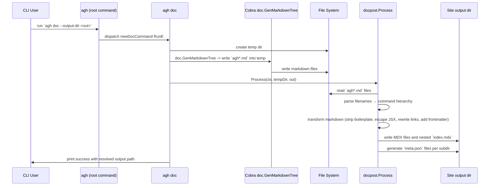

# PR #26: feat: add site

- **URL**: https://github.com/compozy/agh/pull/26
- **Author**: @pedronauck
- **State**: merged
- **Created**: 2026-04-16T18:03:53Z
- **Merged**: 2026-04-16T20:03:39Z

## Summary by CodeRabbit

- **New Features**
  - Redesigned documentation website with landing pages, runtime & protocol docs, interactive diagrams, visual components, and a site-wide layout/theme.
  - Site search API and a CLI command to generate docs for inclusion on the site.

- **Documentation**
  - Auto-generated MDX CLI reference with improved frontmatter, navigation, and examples visible in CLI help.

- **Chores**
  - Added Makefile targets for site dev/build and docs generation; updated .gitignore for common local/tooling artifacts.

## Walkthrough

Adds a CLI docs generator and postprocessor, a Next.js documentation/site (layouts, routes, search API, styles, many components and logos), Makefile targets, updated Go module requires, extensive doc-postprocessing logic and tests, plus numerous CLI help/example text updates. No CLI runtime control-flow changes beyond help/examples.

## Changes

| Cohort / File(s)                                                                                                                                                                          | Summary                                                                                                                                                                                                                                                                                  |
| ----------------------------------------------------------------------------------------------------------------------------------------------------------------------------------------- | ---------------------------------------------------------------------------------------------------------------------------------------------------------------------------------------------------------------------------------------------------------------------------------------- |
| **Repo tooling & config**   `/.gitignore`, `Makefile`, `go.mod`                                                                                                                        | Expanded ignore patterns; added `site-dev`, `site-build`, `cli-docs` Make targets; promoted two Go deps to direct requires and added a couple indirect modules.                                                                                                                          |
| **CLI — help/examples & root**   `internal/cli/...`   `internal/cli/agent.go`, `daemon.go`, `install.go`, `memory.go`, `session.go`, `skill_commands.go`, `workspace.go`, `root.go` | Populated Cobra `Example` fields across many commands, added `memoryWriteExample`, reformatted root metadata, and registered the new `doc` subcommand; no execution logic changed.                                                                                                       |
| **CLI — docs command & tests**   `internal/cli/doc.go`, `internal/cli/doc_test.go`                                                                                                     | Added hidden `agh doc` command with `--output-dir` flag and tests validating generation, output layout, and content rules.                                                                                                                                                               |
| **Doc postprocessor & tests**   `internal/cli/docpost/...`   `internal/cli/docpost/docpost.go`, `internal/cli/docpost/docpost_test.go`                                              | New `docpost` package: transforms Cobra Markdown into Fumadocs-compatible MDX (YAML frontmatter, escapes, link remap, code fixes), writes nested layout and per-dir `meta.json`; extensive unit and integration tests.                                                                   |
| **Next.js app & site root**   `packages/site/app/...`   `app/layout.tsx`, `app/global.css`, `(home)/layout.tsx`, `(home)/page.tsx`, `api/search/route.ts`                           | Added root layout, metadata, global Tailwind/theme CSS, fonts, home layout/page, and a search API route backed by fumadocs search.                                                                                                                                                       |
| **Runtime & Protocol doc routes**   `packages/site/app/runtime/...`, `packages/site/app/protocol/...`   `.../[[...slug]]/page.tsx`, `layout.tsx`                                    | Added dynamic catch-all pages for runtime and protocol docs with `generateStaticParams` and `generateMetadata`, and area layouts wiring docs trees.                                                                                                                                      |
| **Docs components & MDX helpers**   `packages/site/components/docs/...`   `doc-page-masthead.tsx`, `mdx-blocks.tsx`, `mermaid.tsx`, tests                                           | New DocPageMasthead component, MDX block primitives, client-side Mermaid renderer with lazy init/error fallback, and tests.                                                                                                                                                              |
| **Landing site & primitives**   `packages/site/components/landing/...` and `.../primitives/*`                                                                                          | Large set of landing sections (hero, features, network, runtime, bridges, install, comparison, final CTA), primitives (SectionFrame, SectionHeader, FeatureCard, CtaButton, CodeBlock, etc.), interactive visuals (protocol walkthrough, micro-diagram, hero player), and related tests. |
| **Logos & assets**   `packages/site/components/logos/...`, `packages/site/components/logos/index.ts`                                                                                   | Added many SVG logo components (variants in some files) and a barrel export.                                                                                                                                                                                                             |
| **Site tests**   `packages/site/app/global.test.ts`, `.../mermaid.test.tsx`, `.../logos.test.tsx`, `.../landing/__tests__/landing.test.tsx`                                            | New Vitest suites covering global styles, Mermaid behavior, logo SVG IDs, and landing page rendering.                                                                                                                                                                                    |
| **Various Go internal updates & tests**   `internal/...` (manager, bridges, acp, config, automation, daemon, etc.)                                                                     | Multiple test additions/adjustments and focused logic tweaks (error wrapping, JSON normalization, webhook secret deletion helper, minor assertion and type changes); mostly test and error-message / wrapping improvements.                                                              |
| **Site layout & UI additions**   `packages/site/app/(home)/page.tsx`, `packages/site/components/site/home-header.tsx`, `packages/site/components/logo.tsx`                             | Added Home page composition, HomeHeader sticky nav, and a Logo component.                                                                                                                                                                                                                |

## Sequence Diagram

