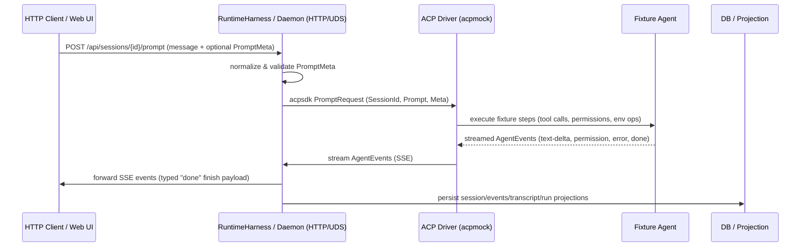

# PR #27: test: add e2e tests

- **URL**: https://github.com/compozy/agh/pull/27
- **Author**: @pedronauck
- **State**: merged
- **Created**: 2026-04-17T13:42:36Z
- **Merged**: 2026-04-17T18:00:07Z

## Summary by CodeRabbit

- **New Features**
  - New E2E test commands/lanes and Make targets for runtime, web, combined, and nightly runs; Playwright e2e suites and config added.
  - Runtime test harness, artifact collector, and richer diagnostics capture for persisted test artifacts; improved fixture-driven mock agent tooling.
  - UI: "View Session" links and data-testid attributes added for improved navigation and testability.

- **Tests**
  - Large expansion of unit/integration/E2E tests across daemon, transports, bridges, network, automation, web, and tooling.

- **Bug Fixes**
  - SSE stream "done" events now include a typed finish reason consistently.

## Walkthrough

Adds comprehensive e2e infrastructure, a runtime test harness and artifact system, ACP mock fixture/driver tooling, many integration and Playwright tests, SSE finish payload typing, and threads typed prompt metadata through ACP, session, and network delivery layers.

## Changes

| Cohort / File(s)                                                                                                                                                                                                                                                                | Summary                                                                                                                                                                                                                                  |
| ------------------------------------------------------------------------------------------------------------------------------------------------------------------------------------------------------------------------------------------------------------------------------- | ---------------------------------------------------------------------------------------------------------------------------------------------------------------------------------------------------------------------------------------- |
| **Build / CLI & lanes**   `Makefile`, `magefile.go`, `internal/e2elane/lanes.go`, `internal/e2elane/lanes_test.go`, `internal/e2elane/command_wiring_test.go`                                                                                                                | Added Make/mage e2e targets and lane planning/types; Mage targets and tests to run lane-specific Go suites and scripts.                                                                                                                  |
| **Runtime harness & e2e helpers**   `internal/testutil/e2e/...` (e.g., `runtime_harness.go`, `artifacts.go`, `config_seed.go`, `bridges_extensions.go`, `automation_tasks.go`, `transport_parity.go`, `mock_agents.go`, `runtime_harness_*.go`)                              | Implemented RuntimeHarness, artifact collector, config/workspace seeding, bridge/extension helpers, automation/task/webhook helpers, transport-parity utilities, mock-agent registration/diagnostics, and many harness helper tests.     |
| **ACP mock fixtures & driver**   `internal/testutil/acpmock/...` (e.g., `fixture.go`, `registration.go`, `diagnostics.go`, `cmd/acpmock-driver/main.go`, `driver_binary.go`, tests)                                                                                          | Added versioned fixture format with validation, registration to generate AGENT.md, diagnostics reader, a test driver executable and build helpers, and extensive tests.                                                                  |
| **Large integration & nightly suites**   `internal/daemon/...`, `internal/api/...`, `internal/udsapi/...`, `internal/extensiontest/...`                                                                                                                                      | Added many integration/nightly tests validating automation runs/tasks, bridge ingress/conformance, env sandboxing, network collaboration/audit correlation, mock-agent behaviors, and HTTP/UDS transport parity.                         |
| **SSE finish payload & prompt metadata plumbing**   `internal/api/httpapi/prompt.go`, `internal/api/httpapi/handlers_test.go`, `internal/acp/types.go`, `internal/acp/client.go`, `internal/session/*`, `internal/network/delivery.go`, `internal/session/manager_prompt.go` | Changed SSE `"done"` to emit typed `promptFinishPayload`/`finishReason`; introduced `PromptMeta`/`PromptNetworkMeta` with Normalize/Validate; threaded metadata through acp client, driver, session manager, and network delivery paths. |
| **Session lifecycle / stop semantics**   `internal/session/session.go`, `internal/session/stop_reason.go`, `internal/session/manager_lifecycle.go`, tests                                                                                                                    | Narrowed `setStopCause` signature; added reconciliation for already-exited processes to surface terminal wait errors into stop metadata; updated related tests.                                                                          |
| **Extension harness marker helpers**   `internal/extensiontest/bridge_adapter_harness.go`, `internal/extensiontest/bridge_adapter_harness_test.go`                                                                                                                           | Refactored marker helpers into package-level functions accepting marker sets; added wrappers and tests for standalone marker reading/reporting.                                                                                          |
| **Web UI & Playwright e2e**   `web/e2e/*.spec.ts`, `web/playwright.config.ts`, `web/src/*`, `web/src/styles.css`, `web/vitest.config.ts`, `.bun-version`                                                                                                                     | Added many Playwright specs and config, vitest include changes, test setup guards, minor UI `data-testid` additions, Tailwind import/@source, and related test updates.                                                                  |
| **Numerous unit & test infra additions**   many `internal/*` and `web/src/*` test files                                                                                                                                                                                      | Large set of new unit/integration tests and helpers: acpmock fixtures/driver, artifact collector, e2elane plans, transport parity, network assertions, tool/MCP projector tests, and many harness/integration/nightly suites.            |
| **Minor constants/refactors & others**   assorted files (e.g., `extensions/bridges/github/provider.go`, `internal/config/config.go`, `internal/extension/host_api.go`, `internal/automation/trigger.go`)                                                                     | Introduced small constants and refactors replacing literal strings and standardizing returned state constants.                                                                                                                           |

## Sequence Diagram

