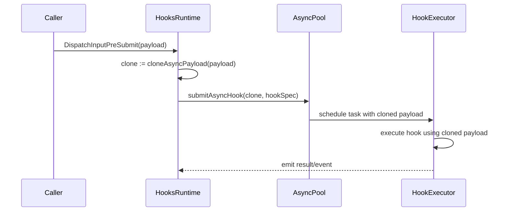

# PR #29: refactor: module improvements

- **URL**: https://github.com/compozy/agh/pull/29
- **Author**: @pedronauck
- **State**: merged
- **Created**: 2026-04-17T16:25:30Z
- **Merged**: 2026-04-17T17:44:04Z

## Summary by CodeRabbit

- **Bug Fixes**
  - Safer session ID/path handling to prevent traversal; UTF‑8‑safe terminal output truncation; prompt extraction handles varied casing; refuse to overwrite non‑managed output directories.

- **Robustness Improvements**
  - Improved JSON parsing/fallbacks and marshaling failure handling; stronger validation across config, bridge delivery defaults, peer/webhook flows, and subprocess stop logic; rate limiter evicts expired keys.

- **User Experience**
  - Terminal working‑directory resolution; more resilient SSE/event decoding and SSE multi‑line support; various stability and performance test additions.

## Walkthrough

Adds many benchmark suites across packages, implements generic async hook payload cloning with per-payload clone methods and submits cloned payloads to the async pool, tightens validation/sanitization in multiple subsystems, and applies performance and correctness refactors across hooks, bridges, registry, resources, SSE, subprocess, and others.

## Changes

| Cohort / File(s)                                                                                                                                                                                                                                                                                                                                                                                                                                                                                                                                                                                                                                                                                                                                                                                                                                                                                                                                                                                                                                                                                                                                                                                                                                                                                                                                                                                                                                                                                                                                                                                   | Summary                                                                                                                                                                                                                                                            |
| -------------------------------------------------------------------------------------------------------------------------------------------------------------------------------------------------------------------------------------------------------------------------------------------------------------------------------------------------------------------------------------------------------------------------------------------------------------------------------------------------------------------------------------------------------------------------------------------------------------------------------------------------------------------------------------------------------------------------------------------------------------------------------------------------------------------------------------------------------------------------------------------------------------------------------------------------------------------------------------------------------------------------------------------------------------------------------------------------------------------------------------------------------------------------------------------------------------------------------------------------------------------------------------------------------------------------------------------------------------------------------------------------------------------------------------------------------------------------------------------------------------------------------------------------------------------------------------------------- | ------------------------------------------------------------------------------------------------------------------------------------------------------------------------------------------------------------------------------------------------------------------ |
| **Benchmarks (many packages)**   `internal/acp/acp_bench_test.go`, `internal/api/core/perf_bench_test.go`, `internal/automation/perf_bench_test.go`, `internal/bridges/perf_bench_test.go`, `internal/bridgesdk/perf_bench_test.go`, `internal/bundles/perf_bench_test.go`, `internal/cli/perf_bench_test.go`, `internal/codegen/sdkts/perf_bench_test.go`, `internal/config/perf_bench_test.go`, `internal/daemon/perf_bench_test.go`, `internal/environment/daytona/perf_bench_test.go`, `internal/extension/perf_bench_test.go`, `internal/extensiontest/perf_bench_test.go`, `internal/filesnap/filesnap_bench_test.go`, `internal/fileutil/atomic_bench_test.go`, `internal/frontmatter/frontmatter_bench_test.go`, `internal/hooks/dispatch_bench_test.go`, `internal/logger/logger_bench_test.go`, `internal/memory/...`, `internal/network/perf_bench_test.go`, `internal/observe/perf_bench_test.go`, `internal/procutil/procutil_bench_test.go`, `internal/registry/perf_bench_test.go`, `internal/resources/perf_bench_test.go`, `internal/session/perf_bench_test.go`, `internal/skills/perf_bench_test.go`, `internal/sse/perf_bench_test.go`, `internal/store/globaldb/perf_bench_test.go`, `internal/store/sessiondb/perf_bench_test.go`, `internal/subprocess/perf_bench_test.go`, `internal/task/perf_bench_test.go`, `internal/testutil/testutil_bench_test.go`, `internal/tools/perf_bench_test.go`, `internal/transcript/transcript_bench_test.go`, `internal/version/version_bench_test.go`, `internal/workref/ref_bench_test.go`, `internal/workspace/perf_bench_test.go` | Adds numerous performance benchmarks and deterministic generators across ~37+ packages measuring allocations, throughput, and latency.                                                                                                                             |
| **Hooks async cloning & dispatch**   `internal/hooks/async_clone.go`, `internal/hooks/async_clone_test.go`, `internal/hooks/dispatch_async.go`, `internal/hooks/dispatch_async_test.go`                                                                                                                                                                                                                                                                                                                                                                                                                                                                                                                                                                                                                                                                                                                                                                                                                                                                                                                                                                                                                                                                                                                                                                                                                                                                                                                                                                                                         | Adds generic `cloneAsyncPayload` infrastructure, per-payload `cloneForAsync` implementations, and changes async submission to use cloned payloads; tests confirm async hooks see stable snapshots.                                                                 |
| **Hooks ordering & pipeline**   `internal/hooks/ordering.go`, `internal/hooks/pipeline.go`, `internal/hooks/pipeline_test.go`                                                                                                                                                                                                                                                                                                                                                                                                                                                                                                                                                                                                                                                                                                                                                                                                                                                                                                                                                                                                                                                                                                                                                                                                                                                                                                                                                                                                                                                                   | Adds conditional ordering helper to avoid unnecessary sorts and uses it in pipeline execution; adds test for unsorted hooks ordering.                                                                                                                              |
| **ACP client & terminal/output handling**   `internal/acp/client.go`, `internal/acp/client_test.go`, `internal/acp/handlers.go`, `internal/acp/handlers_test.go`, `internal/acp/acp_bench_test.go`                                                                                                                                                                                                                                                                                                                                                                                                                                                                                                                                                                                                                                                                                                                                                                                                                                                                                                                                                                                                                                                                                                                                                                                                                                                                                                                                                                                              | Introduces explicit process-state errors and tests; replaces terminal shutdown goroutine with `watchTerminalShutdown`; implements UTF‑8-aware terminal output windowing and trimming helpers; adjusts permission-event raw fallback and marshaling error handling. |
| **SSE and API streaming changes**   `internal/api/core/sse.go`, `internal/api/core/conversions.go`, `internal/api/core/more_coverage_test.go`, `internal/sse/decode.go`, `internal/sse/decode_test.go`                                                                                                                                                                                                                                                                                                                                                                                                                                                                                                                                                                                                                                                                                                                                                                                                                                                                                                                                                                                                                                                                                                                                                                                                                                                                                                                                                                                          | Writes SSE data as raw bytes with segmented writes and helper wrappers; adds byte-based JSON coercion (`payloadJSONBytes`); SSE decode now accumulates data in bytes, enforces max event size, and supports early stop handling; tests extended.                   |
| **Bridges keying & delivery-defaults**   `internal/bridges/delivery_broker.go`, `internal/bridges/resource.go`, `internal/bridges/registry.go`, `internal/bridges/types.go`, `internal/bridges/resource_test.go`, `internal/bridges/registry_test.go`                                                                                                                                                                                                                                                                                                                                                                                                                                                                                                                                                                                                                                                                                                                                                                                                                                                                                                                                                                                                                                                                                                                                                                                                                                                                                                                                           | Replaces string-concatenated turn keys with typed composite key type; shifts `delivery_defaults` normalization to `NormalizeDeliveryDefaultsJSON` and changes/relaxes normalization behavior; tests updated for stricter type checks and provider fields.          |
| **Bridges SDK & rate limiter**   `internal/bridgesdk/batching.go`, `internal/bridgesdk/cache.go`, `internal/bridgesdk/peer.go`, `internal/bridgesdk/peer_test.go`, `internal/bridgesdk/webhook.go`, `internal/bridgesdk/webhook_test.go`, `internal/bridgesdk/perf_bench_test.go`                                                                                                                                                                                                                                                                                                                                                                                                                                                                                                                                                                                                                                                                                                                                                                                                                                                                                                                                                                                                                                                                                                                                                                                                                                                                                                               | Optimizes routing key building via `strings.Builder`; removes unnecessary clone in cache snapshot; adds safe `marshalParams` with error propagation; adds rate-limiter eviction of expired keys and tests.                                                         |
| **Registry installer checksum & installer refactor**   `internal/registry/installer.go`, `internal/registry/installer_checksum.go`, `internal/registry/installer_test.go`                                                                                                                                                                                                                                                                                                                                                                                                                                                                                                                                                                                                                                                                                                                                                                                                                                                                                                                                                                                                                                                                                                                                                                                                                                                                                                                                                                                                                       | Moves deterministic SHA-256 install-checksum implementation to new file; walks directory, sorts entries, streams file contents to hasher, handles symlinks; adds tests for ordering and symlink-target sensitivity.                                                |
| **Resources, reconcile & kernel locks**   `internal/resources/reconcile.go`, `internal/resources/reconcile_test.go`, `internal/resources/kernel.go`, `internal/resources/kernel_test.go`                                                                                                                                                                                                                                                                                                                                                                                                                                                                                                                                                                                                                                                                                                                                                                                                                                                                                                                                                                                                                                                                                                                                                                                                                                                                                                                                                                                                        | Moves event emission outside mutex, returns coalesced event from enqueue for unlocked emission; introduces reference-counted `sourceLock` entries with automatic deletion when idle; adds reentrancy test.                                                         |
| **Memory store & index parsing**   `internal/memory/store.go`, `internal/memory/store_test.go`                                                                                                                                                                                                                                                                                                                                                                                                                                                                                                                                                                                                                                                                                                                                                                                                                                                                                                                                                                                                                                                                                                                                                                                                                                                                                                                                                                                                                                                                                                  | Pre-collects and sorts scan candidates by mod time with cap, improves index-entry removal by parsing Markdown links, and adds tests for edge cases and cap enforcement.                                                                                            |
| **Config/env lookup and dotenv isolation**   `internal/config/config.go`, `internal/config/automation.go`, `internal/config/bootstrap.go`, `internal/config/home.go`, `internal/config/config_test.go`                                                                                                                                                                                                                                                                                                                                                                                                                                                                                                                                                                                                                                                                                                                                                                                                                                                                                                                                                                                                                                                                                                                                                                                                                                                                                                                                                                                          | Introduces `envLookup` abstraction layering .env over process env, refactors validation to accept injected lookups, avoids mutating process env across workspace loads, and adds tests to prevent dotenv leakage.                                                  |
| **Subprocess buffer & health probe**   `internal/subprocess/process.go`, `internal/subprocess/health.go`, `internal/subprocess/process_test.go`, `internal/subprocess/perf_bench_test.go`                                                                                                                                                                                                                                                                                                                                                                                                                                                                                                                                                                                                                                                                                                                                                                                                                                                                                                                                                                                                                                                                                                                                                                                                                                                                                                                                                                                                       | Reworks `boundedBuffer.Write` to avoid intermediate allocation, uses process lifecycle context for health probes, adjusts ioCopyLimit semantics, and adds tests/benchmarks for transport and buffer paths.                                                         |
| **Observe sanitization & filters**   `internal/observe/observer.go`, `internal/observe/tasks.go`, `internal/observe/helpers_test.go`, `internal/observe/hooks_test.go`                                                                                                                                                                                                                                                                                                                                                                                                                                                                                                                                                                                                                                                                                                                                                                                                                                                                                                                                                                                                                                                                                                                                                                                                                                                                                                                                                                                                                          | Adds session ID sanitization rejecting traversal and unsafe IDs; `summarizeEvent` prioritizes permission fields; replaces some filters with count/backfill optimizations; adds related tests.                                                                      |
| **Transcript/tool result parsing**   `internal/transcript/transcript.go`, `internal/transcript/transcript_test.go`, `internal/transcript/transcript_bench_test.go`                                                                                                                                                                                                                                                                                                                                                                                                                                                                                                                                                                                                                                                                                                                                                                                                                                                                                                                                                                                                                                                                                                                                                                                                                                                                                                                                                                                                                              | Adds byte-based empty-object detection, `rawToolResultOutput` helper to extract raw + mapped payloads without unconditional unmarshal, and tests verifying decoding of raw JSON object payloads; adds benchmarks.                                                  |
| **CLI, docpost, TOON rendering & SSE tests**   `internal/cli/docpost/docpost.go`, `internal/cli/docpost/docpost_test.go`, `internal/cli/format.go`, `internal/cli/render_test.go`, `internal/cli/client_test.go`                                                                                                                                                                                                                                                                                                                                                                                                                                                                                                                                                                                                                                                                                                                                                                                                                                                                                                                                                                                                                                                                                                                                                                                                                                                                                                                                                                                | Adds managed-output-dir detection/refusal for non-managed dirs, improves TOON rendering to use `strings.Builder` (streaming), and adds tests for rerun/ownership and SSE multi-line decoding.                                                                      |
| **Various smaller refactors & tests**   multiple files (e.g., `internal/logger/logger.go`, `internal/tools/*`, `internal/frontmatter/*`, `internal/fileutil/*`, `internal/testutil/*`, `internal/workspace/*`, `internal/skills/*`, `internal/task/*`, `internal/session/*`, etc.)                                                                                                                                                                                                                                                                                                                                                                                                                                                                                                                                                                                                                                                                                                                                                                                                                                                                                                                                                                                                                                                                                                                                                                                                                                                                                                              | Multiple optimizations: builder/bytes usage, preallocation, safer normalization of IDs/paths, detached rollback delete context for workspace registration, Unicode-aware truncation, SSE/JSON helpers, and numerous tests covering edge cases.                     |

## Sequence Diagram

