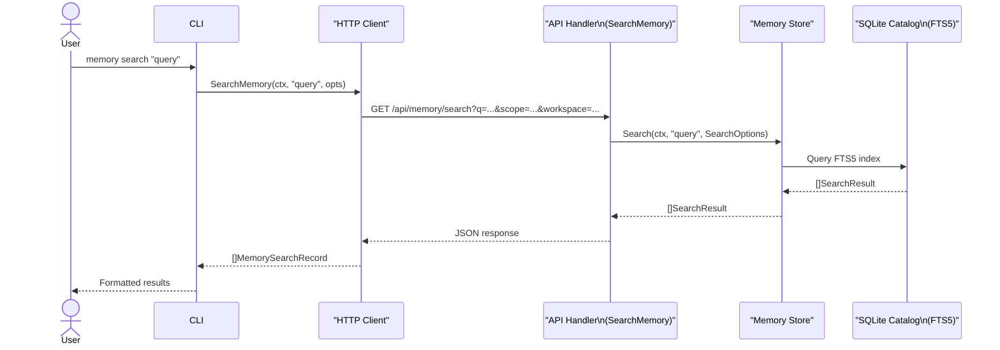
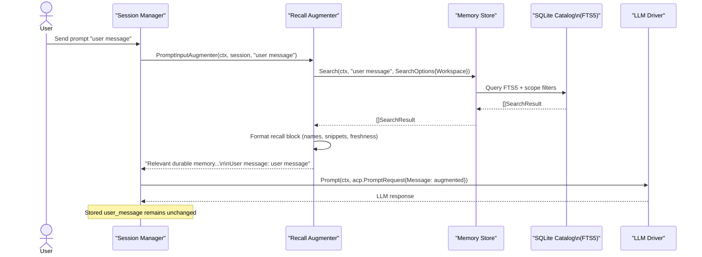

# PR #35: refactor: memory improvements

- **URL**: https://github.com/compozy/agh/pull/35
- **Author**: @pedronauck
- **State**: merged
- **Created**: 2026-04-18T00:07:51Z
- **Merged**: 2026-04-18T02:23:41Z

## Summary by CodeRabbit

- **New Features**
  - Memory search and reindex via CLI and API; durable-memory recall prepends relevant memories to prompts without altering stored user messages.
- **Improvements**
  - Memory health now includes catalog stats (indexed/orphaned files, last reindex); memory backed by an SQLite-derived catalog for more reliable search.
  - Prompt handling can be augmented with memory recall for richer dispatch.
- **API Improvements**
  - New REST endpoints: GET /api/memory/search and POST /api/memory/reindex.
- **CLI**
  - Added `memory search` and `memory reindex` commands.
- **Tests**
  - Expanded unit, integration, and end-to-end tests covering memory search, reindex, health, and prompt augmentation.

## Walkthrough

Adds an SQLite-backed FTS5 durable-memory catalog with Search/Reindex APIs and CLI commands, integrates a recall augmenter into session prompt dispatch, records memory operation logs in the global DB, and updates numerous tests, routes, store/catalog, and tooling to support the feature.

## Changes

| Cohort / File(s)                                                                                                                                                                                                                             | Summary                                                                                                                                                                                                         |
| -------------------------------------------------------------------------------------------------------------------------------------------------------------------------------------------------------------------------------------------- | --------------------------------------------------------------------------------------------------------------------------------------------------------------------------------------------------------------- |
| **Dependency**   `go.mod`                                                                                                                                                                                                                 | Moved `github.com/gorilla/websocket v1.5.4-...` from indirect require to direct require.                                                                                                                        |
| **API Contracts**   `internal/api/contract/contract.go`                                                                                                                                                                                   | Added `MemoryReindexRequest` and expanded `MemoryHealthPayload` with config/catalog/indexing fields.                                                                                                            |
| **HTTP/UDS Handlers & Routes**   `internal/api/core/memory.go`, `internal/api/httpapi/routes.go`, `internal/api/udsapi/routes.go`, `internal/api/httpapi/handlers_test.go`, `internal/api/udsapi/handlers_test.go`                        | Added `SearchMemory` and `ReindexMemory` handlers; registered `GET /api/memory/search` and `POST /api/memory/reindex`; health now includes memory stats; tests updated.                                         |
| **CLI Client & Commands**   `internal/cli/client.go`, `internal/cli/memory.go`, `internal/cli/*_test.go`, `internal/cli/helpers_test.go`                                                                                                  | Extended `DaemonClient` with `SearchMemory`/`ReindexMemory` and HTTP implementations; added `memory search` and `memory reindex` commands and tests; added request helper `memorySearchValues`.                 |
| **Memory Types, Store & Catalog**   `internal/memory/types.go`, `internal/memory/store.go`, `internal/memory/catalog.go`, `internal/memory/store_test.go`                                                                                 | Added cross-layer types and Backend interface; `Store` supports options incl. `WithCatalogDatabasePath`; implemented SQLite FTS5 catalog, Search/Reindex/HealthStats, derived sync logic, and many store tests. |
| **Recall & Session Integration**   `internal/memory/recall.go`, `internal/memory/staleness.go`, `internal/session/interfaces.go`, `internal/session/manager.go`, `internal/session/manager_prompt.go`, `internal/session/manager_test.go` | Added `NewRecallAugmenter`, exported `FreshnessWarning`, `PromptInputAugmenter` type and manager option; manager augments driver prompt while preserving stored user message; tests added.                      |
| **Daemon Boot & Wiring**   `internal/daemon/boot.go`, `internal/daemon/daemon.go`                                                                                                                                                         | Initialize memory store with explicit catalog DB path and wire `MemoryStore` into session manager deps; session manager constructed with recall augmenter.                                                      |
| **Global DB & Observability**   `internal/store/globaldb/global_db.go`, `internal/store/globaldb/global_db_observe.go`, `internal/store/globaldb/global_db_test.go`                                                                       | Added `memory_operation_log` table and indexes; `ListEventSummaries` unions memory operations with event summaries and enforces deterministic ordering; tests updated.                                          |
| **Daemon E2E & Test Harness**   `internal/daemon/daemon_memory_e2e_integration_test.go`, `internal/daemon/daemon_test.go`, `internal/testutil/e2e/runtime_harness.go`, `internal/testutil/e2e/...`                                        | Added end-to-end memory CLI/HTTP parity and recall tests; `RunInDir` helpers; test fixtures now include index-backed documents.                                                                                 |
| **Prompt Assembler & Tests**   `internal/memory/assembler.go`, `internal/memory/assembler_test.go`                                                                                                                                        | Added memory CLI commands to injected prompt help; updated tests to create stub documents referenced by indexes.                                                                                                |
| **Runtime & Build Tooling**   `magefile.go`, `magefile_test.go`                                                                                                                                                                           | Pinned tool versions; added context-aware command helpers and race-enabled `go` runner; tests for helpers.                                                                                                      |
| **Web & Site**   `packages/site/*`, `web/src/components/...stories.tsx`, `packages/site/app/global.css`, `packages/site/app/global.test.ts`, `packages/site/source.config.ts`                                                             | MDX theming change, CSS selector tweak and test; removed `tags: ["autodocs"]` from multiple Storybook stories.                                                                                                  |

## Sequence Diagram

