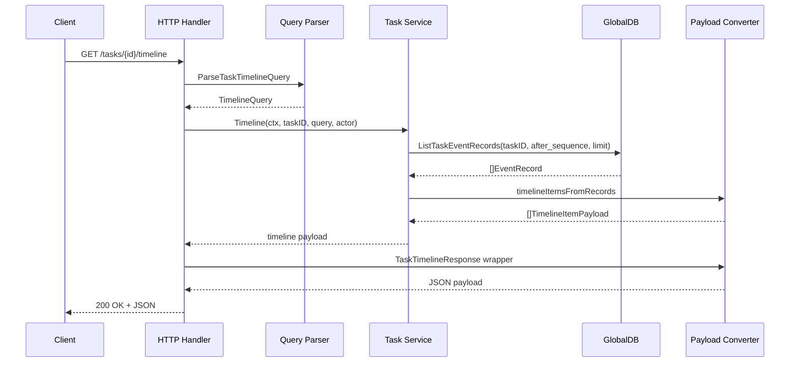
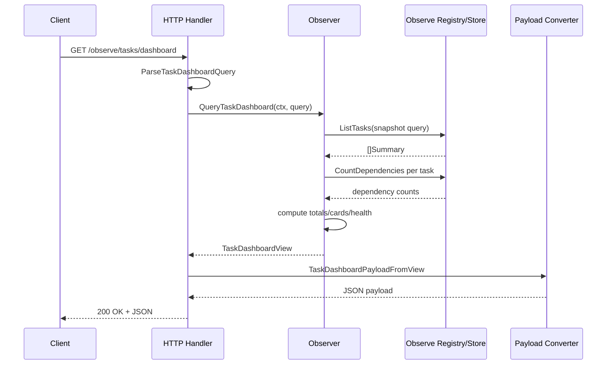
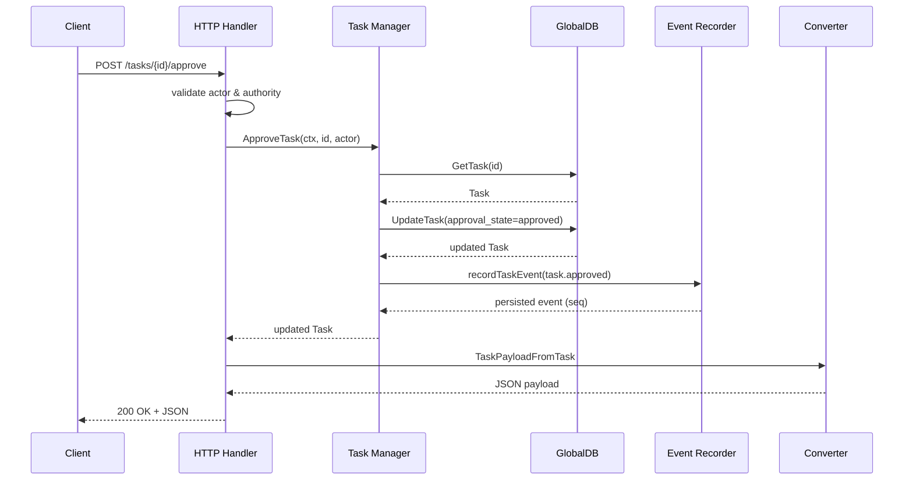

# PR #36: feat: tasks ui

- **URL**: https://github.com/compozy/agh/pull/36
- **Author**: @pedronauck
- **State**: merged
- **Created**: 2026-04-18T02:00:50Z
- **Merged**: 2026-04-18T04:16:31Z

## Summary by CodeRabbit

- **New Features**
  - Task timeline viewing and real-time SSE streaming (replay via Last-Event-ID)
  - Task run detail retrieval and publish-to-live endpoint
  - Task tree hierarchy navigation
  - Approval workflow (publish, approve, reject)
  - Triage actions (mark read, archive, dismiss) and inbox lanes (my work, approvals, failed, blocked, archived)
  - Task dashboard with aggregated metrics, cards and status breakdown
  - Enhanced task attributes and filters: priority, max attempts, approval policy/state, include_drafts, and free-text search

## Walkthrough

Adds comprehensive task read/observe surfaces: new API contract types, converters, parsers, handlers (live timeline/stream/tree, dashboard, inbox, triage/approval), DB schema/migration and persistence for task fields/triage/event sequences, domain/live service implementations, and extensive unit/integration tests across HTTP, UDS, Host API, CLI, and daemon layers.

## Changes

| Cohort / File(s)                                                                                                                                                              | Summary                                                                                                                                                                                                                                               |
| ----------------------------------------------------------------------------------------------------------------------------------------------------------------------------- | ----------------------------------------------------------------------------------------------------------------------------------------------------------------------------------------------------------------------------------------------------- |
| **API Response Contracts**   `internal/api/contract/responses.go`                                                                                                          | Added exported response wrappers: `TaskTimelineResponse`, `TaskTreeResponse`, `TaskRunDetailResponse`, `TaskDashboardResponse`, `TaskInboxResponse`, `TaskTriageStateResponse`.                                                                       |
| **API Payload Contracts**   `internal/api/contract/tasks.go`                                                                                                               | Expanded payloads (summary/detail/payloads) with priority/max_attempts/approval fields, dependency/run summaries, timeline/stream/tree/run/dashboard/inbox/triage types, and extended request/query contracts (list/timeline/stream/dashboard/inbox). |
| **Contract Tests**   `internal/api/contract/tasks_test.go`                                                                                                                 | Added JSON contract tests validating marshaled shapes for detail/run/tree/timeline/dashboard/inbox and UpdateTaskRequest.HasChanges behavior.                                                                                                         |
| **Conversions**   `internal/api/core/conversions.go`                                                                                                                       | Added many converters mapping domain/observer task views to contract payloads (timeline, stream, tree, run detail/session/summary, dashboard, inbox, triage, dependency refs).                                                                        |
| **Interfaces**   `internal/api/core/interfaces.go`                                                                                                                         | Extended `Observer` with `QueryTaskDashboard`/`QueryTaskInbox`; replaced explicit TaskService methods by embedding `taskpkg.Manager`.                                                                                                                 |
| **Parsers**   `internal/api/core/parsers.go`                                                                                                                               | Added parsing functions for task list/run/timeline/stream/dashboard/inbox queries and domain-query builders with validation and workspace binding.                                                                                                    |
| **Handlers & SSE**   `internal/api/core/tasks.go`, `internal/api/core/sse.go`                                                                                              | Added handlers: publish, get run, timeline, stream (SSE), tree, dashboard, inbox, approve/reject/mark-read/archive/dismiss; added `WriteTaskStreamEvent` SSE helper; refactored query handling and response mapping.                                  |
| **Handler Tests & Surface Integration**   `internal/api/core/tasks_surface_*.go`, `internal/api/core/test_helpers_test.go`                                                 | Added unit/integration tests for handler delegation, query parsing, SSE streaming, triage/approval delegation, and route registrations; test router fixtures updated.                                                                                 |
| **HTTP/UDS Routes**   `internal/api/httpapi/routes.go`, `internal/api/udsapi/routes.go`                                                                                    | Registered new HTTP and UDS endpoints for observe/dashboard/inbox, publish, timeline/stream/tree, approval/reject, triage, and task-run GET.                                                                                                          |
| **HTTP Integration & Parity Tests**   `internal/api/httpapi/*.go`, `internal/api/udsapi/*.go`                                                                              | Added end-to-end HTTP/UDS integration tests covering publish/run lifecycle, run detail, timeline/tree/stream, dashboard/inbox, approval/triage flows, and transport parity checks against OpenAPI spec.                                               |
| **OpenAPI Spec**   `internal/api/spec/spec.go`, `internal/api/spec/spec_test.go`                                                                                           | Added response ContentType, `after_sequence` param helper, enums for task priority/approval/state/inbox lane, updated operation specs for new endpoints and tests verifying schemas/uniqueness.                                                       |
| **Test Utilities**   `internal/api/testutil/apitest.go`                                                                                                                    | Extended `StubObserver` and `StubTaskManager` with dashboard/inbox and publish/approve/reject/triage/timeline/stream/tree/run-detail hooks.                                                                                                           |
| **Task Domain: Live & Types**   `internal/task/live_types.go`                                                                                                              | Added `LiveService` interface and types for Timeline/Stream/Tree/RunDetail, timeline/stream/event record types, tree/run/session/operational summary, and runtime view reader interface.                                                              |
| **Task Domain: Implementation**   `internal/task/live.go`, `internal/task/manager.go`, `internal/task/interfaces.go`, `internal/task/limits.go`, `internal/task/errors.go` | Implemented Timeline/Stream/Tree/RunDetail and new lifecycle/triage mutations (Publish/Approve/Reject/MarkRead/Archive/Dismiss); added triage error sentinel and new mutable field constants and limits.                                              |
| **Observer / Aggregation**   `internal/observe/*.go`                                                                                                                       | Added TaskDashboardQuery/View and TaskInboxQuery/View and implemented `QueryTaskDashboard`/`QueryTaskInbox`, dependency counting, dashboard aggregation, triage-aware inbox grouping, and related tests.                                              |
| **Database Schema & Migration**   `internal/store/globaldb/global_db.go`, `internal/store/globaldb/migrate_workspace.go`                                                   | Added columns `priority`, `max_attempts`, `approval_policy`, `approval_state` with constraints and `draft` status; added `task_triage_state` table, event `event_seq` and indexes; migration logic to rebuild/backfill when needed.                   |
| **Persistence APIs & Logic**   `internal/store/globaldb/global_db_task.go`, `internal/store/globaldb/global_db_task_aux.go`                                                | Persist/retrieve new task fields; added triage persistence (Get/Upsert/List), event-record retrieval (Get/List) with stable sequences, search filtering and activity-based ordering, and event sequence allocation on write.                          |
| **Store Tests & Integration**   `internal/store/globaldb/*`                                                                                                                | Expanded tests for new fields, triage table round-trips, event sequence behavior, search/ordering, migration compatibility, and concurrency idempotency.                                                                                              |
| **CLI & Daemon Adjustments**   `internal/cli/*`, `internal/daemon/*`                                                                                                       | Updated CLI renderers to accept pointer detail; updated daemon test doubles and helpers to support new observer/triage/event methods and pointer-based helpers.                                                                                       |
| **Extension Host API**   `internal/extension/*`                                                                                                                            | Added Host API method constants/param types for tasks timeline/tree/dashboard/inbox/runs-get; extended host observer/manager interfaces and handlers; added capability grants and tests.                                                              |

## Sequence Diagram

