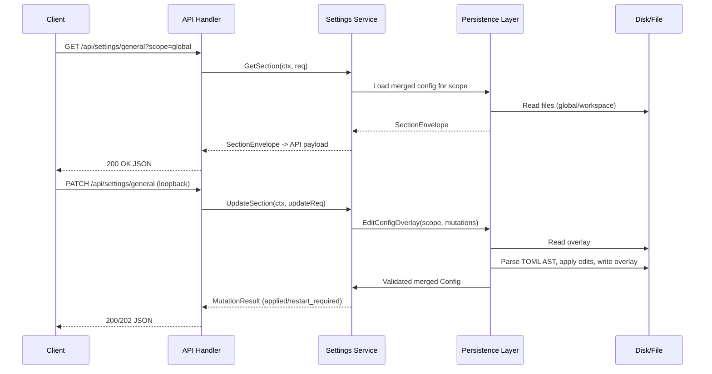
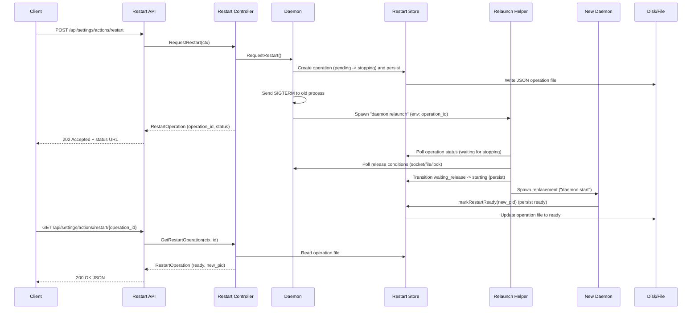

# PR #37: feat: settings ui

- **URL**: https://github.com/compozy/agh/pull/37
- **Author**: @pedronauck
- **State**: merged
- **Created**: 2026-04-18T02:01:19Z
- **Merged**: 2026-04-18T03:27:47Z

## Summary by CodeRabbit

- **New Features**
  - Comprehensive settings API (multiple sections) and collection endpoints (providers, MCP servers, environments, hooks)
  - Daemon restart flow with durable operations, status endpoints and CLI relaunch helper
  - Observability log-tail streaming via SSE
  - Extension management HTTP endpoints (list/install/enable/disable)
  - Config overlay persistence that preserves file structure/comments and workspace/global scopes
  - HTTP mutation guarding: remote mutations restricted to loopback hosts

- **Documentation**
  - OpenAPI schemas updated for settings and extension endpoints

## Walkthrough

Adds a complete settings subsystem: API contracts, conversion layer, HTTP/UDS handlers (including SSE log-tail), config overlay persistence with TOML AST edits, MCP JSON sidecar writes, daemon restart orchestration with persisted operations and relaunch helper, detached process utilities, extension handlers, and extensive tests across server, UDS, spec, persistence, and restart flows.

## Changes

| Cohort / File(s)                                                                                                                                                                                                                                                      | Summary                                                                                                                                                                                                                         |
| --------------------------------------------------------------------------------------------------------------------------------------------------------------------------------------------------------------------------------------------------------------------- | ------------------------------------------------------------------------------------------------------------------------------------------------------------------------------------------------------------------------------- |
| **Project scaffolding**   `\.compozy/tasks/settings-ui/qa/issues/.gitkeep`, `\.compozy/tasks/settings-ui/qa/screenshots/.gitkeep`                                                                                                                                  | Add empty .gitkeep files to preserve QA directories.                                                                                                                                                                            |
| **Deps**   `go.mod`                                                                                                                                                                                                                                                | Added indirect toml dependency `github.com/pelletier/go-toml v1.9.5`.                                                                                                                                                           |
| **API contract**   `internal/api/contract/settings.go`, `internal/api/contract/settings_test.go`                                                                                                                                                                   | New comprehensive settings API types, enums, request/response payloads, and JSON-shape tests for MutationResult.                                                                                                                |
| **API conversion**   `internal/api/core/conversions.go`                                                                                                                                                                                                            | New conversion helpers mapping internal settings envelopes to API payloads with validation and time/field normalization.                                                                                                        |
| **API errors & interfaces**   `internal/api/core/errors.go`, `internal/api/core/interfaces.go`                                                                                                                                                                     | Added settings sentinel errors + status mapping; added SettingsService and SettingsRestartController interfaces and SettingsRestartOperation type.                                                                              |
| **Core handlers**   `internal/api/core/handlers.go`, `internal/api/core/settings.go`, `internal/api/core/settings_*.go`                                                                                                                                            | Wired Settings and SettingsRestart into BaseHandlers; implemented full settings HTTP/SSE handlers (sections, collections, restart), plus extensive handler unit tests and internal tests.                                       |
| **HTTP API: routes, middleware, handlers**   `internal/api/httpapi/routes.go`, `internal/api/httpapi/middleware.go`, `internal/api/httpapi/extensions.go`, `internal/api/httpapi/handlers.go`, `internal/api/httpapi/server.go`, `internal/api/httpapi/*.go tests` | Registered settings and extensions routes, added loopback-only privileged-mutation guard, extension handlers/service interface, server wiring options, and tests enforcing loopback mutation restrictions and transport parity. |
| **UDS API wiring & tests**   `internal/api/udsapi/*.go`                                                                                                                                                                                                            | Wired settings/restart into UDS server, registered settings routes for UDS, and added UDS handler/tests and transport-parity integration tests.                                                                                 |
| **OpenAPI spec**   `internal/api/spec/spec.go`, `internal/api/spec/settings_test.go`                                                                                                                                                                               | Added settings enums/operations to OpenAPI document and tests validating operation presence, transports, and schemas.                                                                                                           |
| **Config persistence & MCP JSON**   `internal/config/persistence.go`, `internal/config/merge.go`, `internal/config/mcpjson.go`, `internal/config/mcpjson_write.go`, tests                                                                                          | Introduced TOML-overlay AST-aware editor, EditConfigOverlay, MCP sidecar JSON read/write (camelCase/snake_case support) and comprehensive persistence tests/integration tests.                                                  |
| **Bootstrap & home layout**   `internal/config/bootstrap.go`, `internal/config/home.go`, `internal/config/*_test.go`                                                                                                                                               | Refactored bootstrap to use overlay edits; added RestartsDir/HomePaths.RestartsDir and tests.                                                                                                                                   |
| **Daemon: restart & settings runtime**   `internal/daemon/restart.go`, `internal/daemon/settings.go`, `internal/daemon/boot.go`, `internal/daemon/daemon.go`, tests                                                                                                | Durable restart operation state machine with file-backed store, relaunch helper flow, settings runtime surface exposing status, restart controller, boot integration, and wide test coverage (unit + integration).              |
| **Daemon relaunch CLI & procutils**   `internal/cli/daemon.go`, `internal/cli/root.go`, `internal/cli/daemon_wait_test.go`, `internal/procutil/*.go`                                                                                                               | Added hidden `daemon relaunch` command, delegated detached spawning to procutil, and implemented cross-platform SpawnDetachedLoggedProcess with log capture and enriched error context.                                         |
| **Settings classification**   `internal/settings/classify.go`                                                                                                                                                                                                      | Added mutation classification logic to determine apply-now vs restart-required behavior.                                                                                                                                        |

## Sequence Diagram

