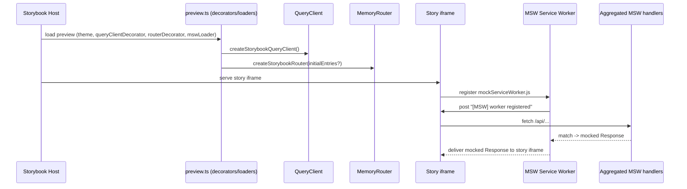

# PR #38: refactor: storybook for web and ui

- **URL**: https://github.com/compozy/agh/pull/38
- **Author**: @pedronauck
- **State**: merged
- **Created**: 2026-04-18T02:11:19Z
- **Merged**: 2026-04-18T03:20:25Z

## Summary by CodeRabbit

- **New Features**
  - Big Storybook expansion: interactive stories for many UI components and system pages, theme toggles, and Tailwind-styled previews.
  - Integrated Mock Service Worker with comprehensive mock fixtures to power realistic interactive demos.

- **Tests**
  - New unit, integration and end-to-end tests validating Storybook setup, MSW contracts, fixtures, and Storybook boot.

- **Chores**
  - Storybook/Vite/Vitest updated for Tailwind; test setup hardened; message send control given an accessible name.

## Walkthrough

Adds Storybook setups for packages/ui and web, integrates Tailwind and MSW (service worker + aggregated handlers), many new component stories and system fixtures/handlers across systems, Storybook tests and Playwright e2e, and small test/runtime adjustments.

## Changes

| Cohort / File(s)                                                                                                                                                     | Summary                                                                                                                                                                                                                                                                                                                             |
| -------------------------------------------------------------------------------------------------------------------------------------------------------------------- | ----------------------------------------------------------------------------------------------------------------------------------------------------------------------------------------------------------------------------------------------------------------------------------------------------------------------------------- |
| **packages/ui Storybook**   `packages/ui/.storybook/main.ts`, `packages/ui/.storybook/preview.ts`, `packages/ui/.storybook/preview.css`                           | New Storybook config (Vite + `@storybook/react-vite`), Tailwind integrated via viteFinal and preview CSS, theme decorator and preview parameters added.                                                                                                                                                                             |
| **web Storybook config**   `web/.storybook/main.ts`, `web/.storybook/preview.ts`                                                                                  | Added staticDirs and replaced inline preview with exported decorators/loaders: theme, React Query (QueryClient), Memory Router, and MSW loader; aggregates system MSW handlers.                                                                                                                                                     |
| **MSW worker & e2e**   `web/public/mockServiceWorker.js`, `web/e2e/storybook-bootstrap.spec.ts`                                                                   | Adds service worker implementation for MSW and a Playwright test that boots Storybook, verifies MSW registration and request handling.                                                                                                                                                                                              |
| **Storybook tests & test infra**   `web/src/storybook/*.test.ts*`, `web/src/storybook/story-layout.tsx`, `web/src/test-setup.ts`, `web/vitest.config.ts`          | Adds multiple Vitest suites validating Storybook config/handlers/stories/fixtures, reusable story layout components, scrollTo noop in test setup, and Tailwind Vite plugin for Vitest.                                                                                                                                              |
| **packages/ui component stories**   `packages/ui/src/components/stories/*.stories.tsx`                                                                            | Adds ~14 story modules for base UI components (Alert, Badge, Button, Card, Input, Kbd, Label, Progress, Separator, Skeleton, Spinner, Table, etc.).                                                                                                                                                                                 |
| **web UI component stories**   `web/src/components/ui/stories/*.stories.tsx`                                                                                      | Adds 30+ story modules for UI primitives and composed components (Accordion, Avatar, Breadcrumb, ButtonGroup, Collapsible, Combobox, Command, Dialog, DropdownMenu, Empty, Field, InputGroup, Item, NativeSelect, Popover, ScrollArea, Select, Sheet, Sidebar, Sonner, Switch, Tabs, Textarea, Toggle, ToggleGroup, Tooltip, etc.). |
| **System stories, fixtures & handlers**   `web/src/systems/*/{mocks,components/stories}/...`                                                                      | Adds fixtures, MSW handlers, barrels, and many stories across systems: agent, automation, bridges, daemon, knowledge, network, session, skill, workspace (including extensive session/tool fixtures and handlers).                                                                                                                  |
| **Session accessibility fix & tests**   `web/src/systems/session/components/message-composer.tsx`, `web/src/systems/session/components/message-composer.test.tsx` | Adds `aria-label="Send message"` to send button and updates test to query by role/accessible name.                                                                                                                                                                                                                                  |
| **Tool-renderer stories**   `web/src/systems/session/components/tool-renderers/stories/*`                                                                         | Adds many tool renderer stories (Bash, Edit, Read, Search, Write, Generic, ExpandedToolContent, etc.).                                                                                                                                                                                                                              |
| **MSW handler aggregation & contracts**   `web/src/storybook/*.test.ts*`, `web/src/systems/*/mocks/index.ts`                                                      | Aggregates system handlers into storybookSystemHandlers, adds tests asserting handler composition and uniqueness (no duplicate method/path signatures).                                                                                                                                                                             |

## Sequence Diagram

