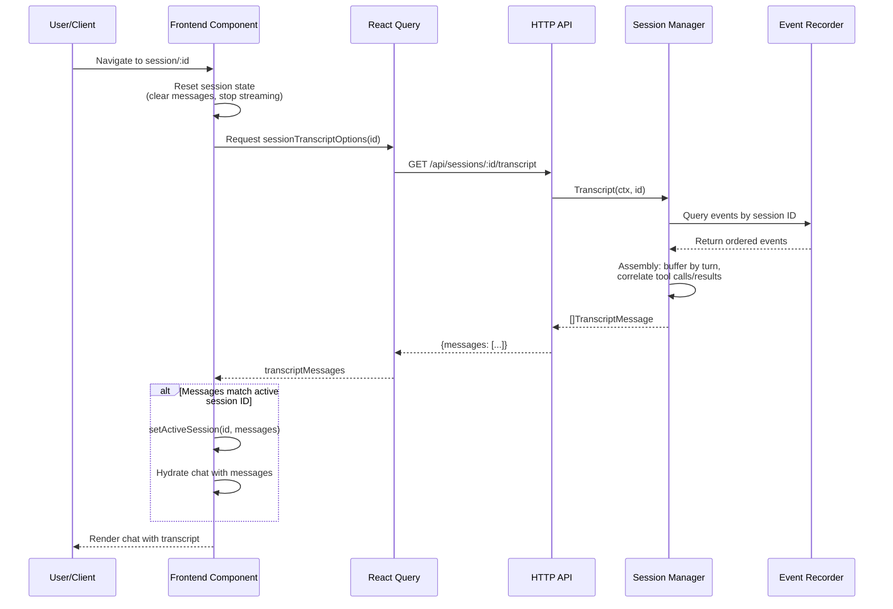
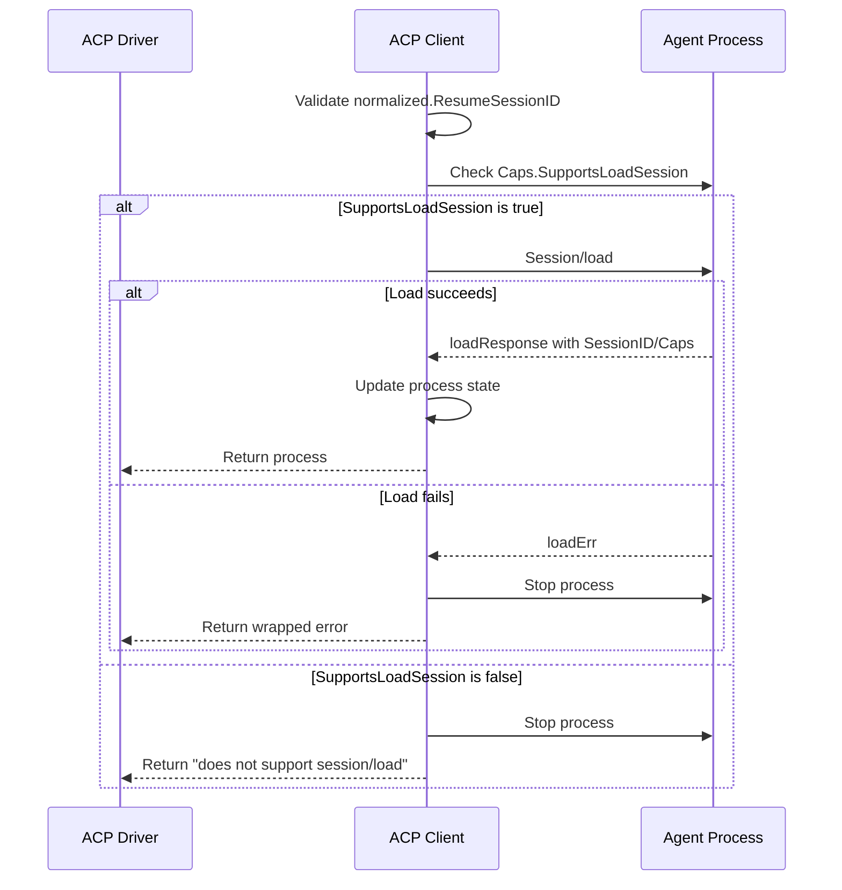

# PR #4: fix: acp integration

- **URL**: https://github.com/compozy/agh/pull/4
- **Author**: @pedronauck
- **State**: merged
- **Created**: 2026-04-06T14:39:45Z
- **Merged**: 2026-04-06T21:38:18Z

## Summary by CodeRabbit

- **New Features**
  - Session transcripts now available for retrieval and viewing via API endpoints
  - Transcript assembly properly aggregates user messages, agent responses, tool calls, and tool results
  - Support for multiple transcript payload formats ensures compatibility

- **Bug Fixes**
  - Improved session resumption error handling to properly report when session loading is not supported

## Walkthrough

This pull request introduces a comprehensive session transcript feature across the backend and frontend, adding session history retrieval endpoints and replacing history-based hydration with transcript-based initialization. It also modifies session resume validation to independently check ResumeSessionID and error if the agent lacks LoadSession support.

## Changes

| Cohort / File(s)                                                                                                                                                                                                                                                              | Summary                                                                                                                                                                                                                                                                                                                                                                                      |
| ----------------------------------------------------------------------------------------------------------------------------------------------------------------------------------------------------------------------------------------------------------------------------- | -------------------------------------------------------------------------------------------------------------------------------------------------------------------------------------------------------------------------------------------------------------------------------------------------------------------------------------------------------------------------------------------- |
| **Configuration**   `.gitignore`                                                                                                                                                                                                                                           | Added pattern to ignore `.codex/ledger/*-MEMORY-*` files; removed `.codex/plans` from ignored paths.                                                                                                                                                                                                                                                                                         |
| **Session Resume Validation**   `internal/acp/client.go`, `internal/acp/client_test.go`                                                                                                                                                                                    | Modified resume-session control flow to validate `ResumeSessionID` independently and stop the process with an error if `SupportsLoadSession` is false. Updated load error handling to stop the process instead of falling back to session/new. Added tests for load failure and missing capability scenarios.                                                                                |
| **Event Persistence & Marshaling**   `internal/session/manager.go`, `internal/session/manager_test.go`, `internal/session/additional_test.go`, `internal/session/query_test.go`                                                                                            | Added user message persistence before invoking driver prompt with notification support. Refactored event marshaling from minimal map to strongly-typed `canonicalEventPayload` with enhanced raw event handling, tool metadata extraction, and legacy payload support. Updated test expectations for stored event counts and added verification that user messages are persisted pre-prompt. |
| **Transcript Rendering**   `internal/session/transcript.go`, `internal/session/transcript_test.go`                                                                                                                                                                         | Introduced new transcript assembly logic that stably sorts events by sequence/timestamp/ID, buffers assistant output by turn, correlates tool calls with results, and supports both canonical and legacy event payload formats. Includes comprehensive parsing and helper functions for multiple transcript shape formats.                                                                   |
| **Backend SessionManager Interface**   `internal/daemon/daemon.go`, `internal/daemon/daemon_test.go`, `internal/httpapi/server.go`, `internal/udsapi/server.go`                                                                                                            | Extended `SessionManager` interface across daemon and HTTP API servers with new `Transcript(ctx, id)` method. Updated test doubles (`fakeSessionManager`, `stubSessionManager`) to support transcript retrieval.                                                                                                                                                                             |
| **HTTP Transcript Endpoints**   `internal/httpapi/sessions.go`, `internal/httpapi/handlers_test.go`, `internal/httpapi/helpers_test.go`, `internal/udsapi/handlers.go`, `internal/udsapi/handlers_test.go`, `internal/udsapi/helpers_test.go`, `internal/udsapi/routes.go` | Added new HTTP GET handlers and routes for `/api/sessions/:id/transcript` in both HTTP API and UDS API layers. Handlers retrieve transcripts and return JSON responses with message arrays. Updated test helpers and handler tests to cover new endpoint.                                                                                                                                    |
| **Frontend Transcript Types & Schemas**   `web/src/systems/session/types.ts`, `web/src/systems/session/types.test.ts`                                                                                                                                                      | Added Zod schemas and TypeScript types for transcript payload structures: `TranscriptMessage`, `TranscriptToolResult`, and `SessionTranscriptResponse`. Extended `ToolUseResult` interface with optional `rawOutput` field.                                                                                                                                                                  |
| **Frontend API Adapter**   `web/src/systems/session/adapters/session-api.ts`, `web/src/systems/session/adapters/session-api.test.ts`                                                                                                                                       | Introduced new `fetchSessionTranscript` API adapter to request `/api/sessions/{id}/transcript`, replacing `fetchSessionHistory`. Added 404 error handling and response schema validation.                                                                                                                                                                                                    |
| **Frontend Query Infrastructure**   `web/src/systems/session/lib/query-keys.ts`, `web/src/systems/session/lib/query-options.ts`                                                                                                                                            | Added `sessionKeys.transcript` query key generator and `sessionTranscriptOptions` query configuration function with 10-second stale time and conditional enabling.                                                                                                                                                                                                                           |
| **Frontend Transcript Mapping**   `web/src/systems/session/lib/transcript-mapper.ts`, `web/src/systems/session/lib/transcript-mapper.test.ts`                                                                                                                              | Implemented transcript-to-UI message transformation logic that maps transcript messages (including tool calls/results) to UI message format, with timestamp parsing and tool result field mapping.                                                                                                                                                                                           |
| **Frontend Hooks & Session System**   `web/src/systems/session/hooks/use-session-transcript.ts`, `web/src/systems/session/hooks/use-session-history.ts`, `web/src/systems/session/index.ts`                                                                                | Added new `useSessionTranscript` hook for fetching and mapping transcript data. Refactored `useSessionHistory` to wrap the transcript hook. Extended public session system exports to include transcript types, schemas, adapters, query options, mappers, and hooks.                                                                                                                        |
| **Frontend Session Route**   `web/src/routes/_app/session.$id.tsx`, `web/src/routes/_app/-session.$id.test.tsx`                                                                                                                                                            | Updated session page component to use transcript hydration instead of history, with immediate session reset on ID change and "hydrated-once" tracking via `hydratedSessionIdRef`. Added integration tests verifying transcript arrival updates chat messages and session switches properly reset prior state.                                                                                |

## Sequence Diagram

