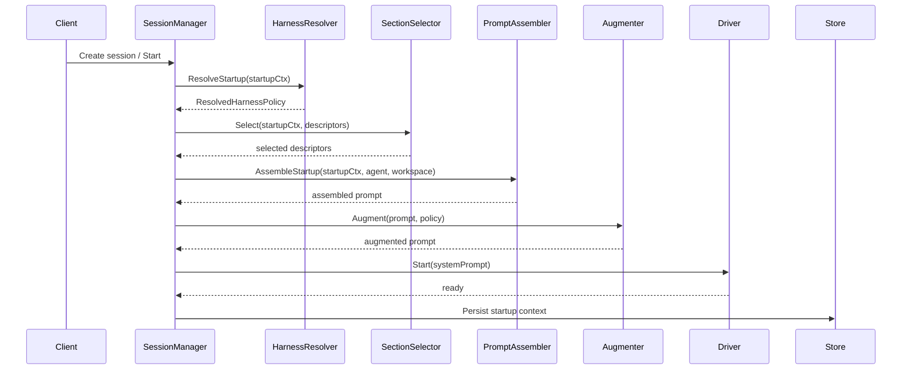
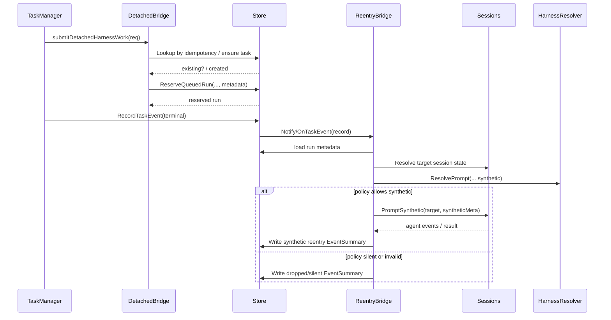

# PR #44: feat: harness improvements

- **URL**: https://github.com/compozy/agh/pull/44
- **Author**: @pedronauck
- **State**: merged
- **Created**: 2026-04-18T22:25:13Z
- **Merged**: 2026-04-19T04:11:47Z

## Summary by CodeRabbit

- **New Features**
  - Synthetic prompt system for daemon-initiated session wake-ups and deterministic reentry.
  - Configurable startup/turn prompt sections (memory, skills, network) with per-section budgets.
  - Composable prompt-input augmenters with sequential application, budget enforcement, and failure modes.
  - Detached (background) task submission and synthetic reentry workflows.

- **Improvements**
  - Enhanced harness lifecycle observability with timeline summaries for resolution, selection, and augmenter outcomes.
  - Task/run metadata persisted and surfaced end-to-end.
  - Session transcripts now include synthetic/system-origin messages and preserve turn/tool ordering.
  - Startup prompt overlay and improved assembler integration.

- **Bug Fixes**
  - Corrected empty-state title element HTML semantics.

- **Tests**
  - Expanded integration and unit tests covering synthetic prompts, reentry, augmenters, and observability.

## Walkthrough

Adds a harness subsystem: typed harness context resolution, descriptor-driven startup prompt sections, composite prompt-input augmenters, detached harness task submission with synthetic reentry orchestration, lifecycle observability, synthetic prompt queuing/persistence, task-run metadata persistence and DB migration, plus extensive unit/integration tests and wiring.

## Changes

| Cohort / File(s)                                                                                                                                                                                                                                                    | Summary                                                                                                                                                                                                                                    |
| ------------------------------------------------------------------------------------------------------------------------------------------------------------------------------------------------------------------------------------------------------------------- | ------------------------------------------------------------------------------------------------------------------------------------------------------------------------------------------------------------------------------------------ |
| **Harness core & policy**   `internal/daemon/harness_context.go`, `internal/daemon/harness_context_test.go`, `internal/daemon/harness_context_integration_test.go`                                                                                               | New HarnessContextResolver, enums, input/output types, resolution/validation logic, diagnostic tags, and tests/integration coverage.                                                                                                       |
| **Prompt sections & assembler**   `internal/daemon/prompt_sections.go`, `internal/daemon/section_selector.go`, `internal/daemon/composed_assembler.go`, `internal/daemon/composed_assembler_test.go`                                                             | Introduce PromptSectionDescriptor, SectionSelector, descriptor-driven ComposedAssembler (AssembleStartup) with budget/position/ordering rules and tests; backward compatibility for legacy providers.                                      |
| **Prompt input augmentation**   `internal/daemon/prompt_input_composite.go`, `internal/daemon/prompt_input_composite_test.go`, `internal/daemon/prompt_input_composite_integration_test.go`                                                                      | New composite PromptInputAugmenter with descriptor normalization, ordered execution, budget accounting (trim/omit), failure semantics, lifecycle recording, and tests.                                                                     |
| **Detached work & synthetic reentry**   `internal/daemon/harness_detached_work.go`, `internal/daemon/harness_reentry_bridge.go`, `internal/daemon/task_runtime.go`, `internal/daemon/task_runtime_test.go`                                                       | Detached-harness submission normalization/idempotency, task/run creation, reentry bridge processing and recovery, ordered synthetic wake dispatch and outcome persistence, and extensive tests.                                            |
| **Observability & summaries**   `internal/daemon/harness_observability.go`, `internal/daemon/harness_observability_test.go`, `internal/observe/observer_test.go`                                                                                                 | Lifecycle recorder buffering/flushing into EventSummaryStore, summary formatting/truncation helpers, and tests for queued flush and augmenter failure/continuation.                                                                        |
| **Daemon boot & wiring**   `internal/daemon/boot.go`, `internal/daemon/daemon.go`, `internal/daemon/daemon_test.go`, `internal/daemon/daemon_integration_test.go`                                                                                                | Boot wiring for harnessResolver/recorder, prompt assembler/augmenter/overlay injection, task runtime wiring (detached/reentry), shutdown target handling, and new integration tests.                                                       |
| **Session startup & synthetic prompts**   `internal/session/prompt_overlay.go`, `internal/session/manager.go`, `internal/session/manager_helpers.go`, `internal/session/synthetic_prompt.go`, `internal/session/manager_prompt.go`, `internal/session/*_test.go` | StartupPromptContext/assembler/overlay interfaces; TurnSourceSynthetic; Manager synthetic queuing/dispatch, exclusive prompt setup, currentPromptMeta, persistence of synthetic events, and tests for ordering, persistence, and overlays. |
| **Prompt-section selection & bundled network**   `internal/session/*`, `internal/daemon/...`                                                                                                                                                                     | Bundled network section integrated into descriptor model; SectionSelector selects channel-aware sections and deduplicates; tests updated.                                                                                                  |
| **Transcript & stored event mapping**   `internal/transcript/transcript.go`, `internal/transcript/transcript_test.go`                                                                                                                                            | Map synthetic reentry to system-role messages, add Synthetic metadata to canonical payload, adjust tool call/result ID pairing, and add tests for mixed-turn/tool pairing.                                                                 |
| **Task/run metadata & task APIs**   `internal/task/types.go`, `internal/task/interfaces.go`, `internal/task/manager.go`, `internal/task/validate.go`, `internal/task/manager_test.go`                                                                            | Add Run/EnqueueRun.Metadata (json.RawMessage), update RunStore ReserveQueuedRun signature, metadata validation, manager wiring to pass metadata through reservation and persistence, and tests for metadata-preserving idempotency.        |
| **DB migrations & persistence**   `internal/store/globaldb/global_db.go`, `internal/store/globaldb/global_db_task.go`, `internal/store/globaldb/global_db_task_aux.go`, `internal/store/globaldb/migrate_workspace.go`, `internal/store/globaldb/*_test.go`      | Add `metadata_json` column to `task_runs`, update CRUD and reservation paths to persist/scan metadata, add migration helper that adds column when missing, and tests.                                                                      |
| **Host API / Extensions**   `internal/extension/host_api.go`, `internal/extension/host_api_tasks.go`, `internal/extension/host_api_test.go`                                                                                                                      | Refactor prompt submission helpers to treat synthetic reentry as prompt boundary, extract turn-id helper, include run metadata in TaskRunPayload conversions, and update tests.                                                            |
| **Observe / SSE & transport parity tests**   `internal/api/httpapi/...`, `internal/api/udsapi/...`, `internal/api/udsapi/transport_parity_integration_test.go`                                                                                                   | New SSE/observe endpoint tests asserting harness lifecycle payloads and parity between HTTP and UDS transports; transcript endpoints include synthetic turns.                                                                              |
| **Memory recall**   `internal/memory/recall.go`, `internal/memory/recall_test.go`                                                                                                                                                                                | Export RecallAugmenterBudget constant and add tests for recall augmentation and recall block construction.                                                                                                                                 |
| **Session stop / lifecycle changes**   `internal/session/stop_reason.go`, `internal/session/manager_lifecycle.go`, `internal/session/session.go`, `internal/session/stop_reason_test.go`                                                                         | Observed process-exit finalize path, finalizeStopped drains queued synthetic prompts, ErrPromptInProgress and currentPromptMeta tracking, and tests for wrapped stop preparation errors.                                                   |
| **Task live & observers**   `internal/task/live.go`, `internal/task/live_types.go`, `internal/task/manager.go`                                                                                                                                                   | Extracted emit helper, added EventObserver interface and WithEventObserver option, invoke observer post-commit and best-effort live emission.                                                                                              |
| **Transcript storage projection & tests**   `internal/extension/host_api_test.go`, `internal/transcript/*`                                                                                                                                                       | Helpers to marshal AgentEvent into stored SessionEvent and tests validating stored projections and decoding.                                                                                                                               |
| **Bridge & provider tests**   `extensions/bridges/teams/provider_test.go`                                                                                                                                                                                        | Test now waits for provider readiness marker (`BridgeStatusReady`) before asserting server address availability.                                                                                                                           |
| **Web UI**   `web/src/components/ui/empty.tsx`                                                                                                                                                                                                                   | `EmptyTitle` now renders an `<h2>` and narrows props to `h2` props.                                                                                                                                                                        |
| **QA infra**   `.compozy/tasks/harness/qa/issues/.gitkeep`, `.compozy/tasks/harness/qa/screenshots/.gitkeep`                                                                                                                                                     | Added `.gitkeep` files to retain QA directories in source control.                                                                                                                                                                         |

## Sequence Diagram

Note: rectangles/colors omitted; components represent distinct actors.
