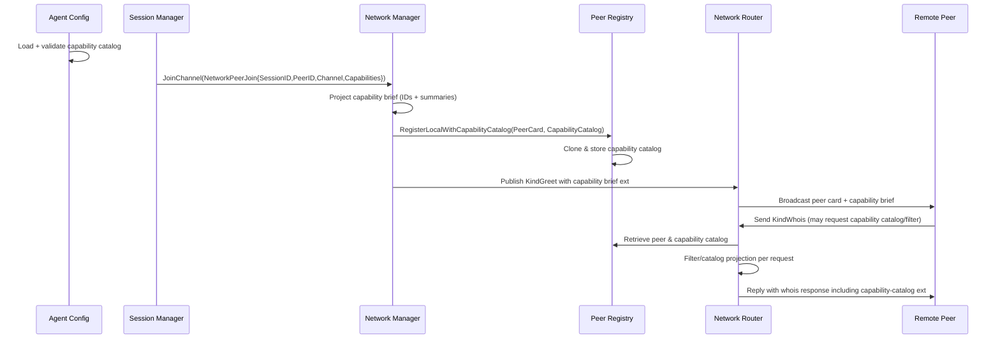

# PR #49: feat: agent capabilities

- **URL**: https://github.com/compozy/agh/pull/49
- **Author**: @pedronauck
- **State**: open
- **Created**: 2026-04-19T12:39:11Z

## Summary by CodeRabbit

- **New Features**
  - Agents can publish per-agent capability catalogs and advertise them to peers.
  - WHOIS discovery can return rich capability metadata and supports ID-based filtering.
  - Peer discovery now includes compact capability briefs for lightweight capability display.

- **Bug Fixes / Reliability**
  - Improved network validation and error responses for invalid requests and oversized responses.

## Walkthrough

Adds an agent capability catalog system and propagates capability data through agent config, session lifecycle, network peer registration, WHOIS discovery, and related tests and clones.

## Changes

| Cohort / File(s)                                                                                                                                                                                                                                                                                                | Summary                                                                                                                                                                                                                                  |
| --------------------------------------------------------------------------------------------------------------------------------------------------------------------------------------------------------------------------------------------------------------------------------------------------------------- | ---------------------------------------------------------------------------------------------------------------------------------------------------------------------------------------------------------------------------------------- |
| **Capability model & loader**   `internal/config/capabilities.go`, `internal/config/capabilities_test.go`                                                                                                                                                                                                    | New capability model types (`CapabilityDef`, `CapabilityCatalog`, `CapabilityBrief`), strict JSON/TOML loaders supporting single-file or directory layouts, normalization, validation, duplication checks, and comprehensive unit tests. |
| **Agent config integration & validation**   `internal/config/agent.go`, `internal/config/agent_capabilities_test.go`, `internal/config/agent_resource.go`, `internal/config/agent_resource_test.go`                                                                                                          | `AgentDef` gains `Capabilities *CapabilityCatalog`; loader populates and validates/normalizes catalogs; tests for loading precedence, normalization, and resource validation added.                                                      |
| **Session & join plumbing**   `internal/session/interfaces.go`, `internal/session/network_peer.go`, `internal/session/manager_helpers.go`, `internal/session/manager_start.go`, `internal/session/manager_test.go`, `internal/session/manager_hooks_test.go`, `internal/session/manager_integration_test.go` | Introduces `NetworkPeerCapability` and `NetworkPeerJoin`, updates `NetworkPeerLifecycle.JoinChannel` to accept a `NetworkPeerJoin`, projects/clones capabilities into join requests, and updates tests/integration coverage.             |
| **Network manager & peer registry**   `internal/network/manager.go`, `internal/network/manager_test.go`, `internal/network/manager_integration_test.go`, `internal/network/peer.go`, `internal/network/peer_test.go`                                                                                         | `Manager.JoinChannel` now accepts `NetworkPeerJoin`; local peer registration persists cloned capability catalogs; prepares peer cards with capability brief projections; tests updated/added.                                            |
| **Network capability projection & WHOIS**   `internal/network/capability_brief.go`, `internal/network/capability_catalog.go`, `internal/network/capability_catalog_test.go`, `internal/network/capability_brief_test.go`                                                                                     | Implements capability-brief projection (`agh.capabilities_brief` ext), WHOIS discovery parsing/filtering, catalog response building, envelope size limiting, cloning helpers, and unit tests for projection/filtering behavior.          |
| **Router WHOIS refactor & tests**   `internal/network/router.go`, `internal/network/router_test.go`, `internal/network/router_integration_test.go`                                                                                                                                                           | Refactors whois flow into responder selection and response-building helpers; attaches capability-catalog ext to responses with filtering and size checks; adds unit/integration tests for rich discovery and filtering.                  |
| **Envelope validation & errors**   `internal/network/validate.go`, `internal/network/validate_test.go`                                                                                                                                                                                                       | Adds `ErrEnvelopeTooLarge` sentinel and updates test vectors to include capability-catalog ext roundtrip.                                                                                                                                |
| **Daemon & workspace cloning**   `internal/daemon/agent_skill_resources.go`, `internal/daemon/daemon_test.go`, `internal/daemon/daemon_integration_test.go`, `internal/extension/manager.go`, `internal/workspace/clone.go`                                                                                  | Clone routines updated to deep-clone `Capabilities`; tests/fakes updated to record and assert cloned capability data; integration tests updated to use struct-based join calls.                                                          |
| **API tests & minor refactor**   `internal/api/core/network_test.go`, `internal/config/mcpjson.go`, `internal/network/validate_test.go`                                                                                                                                                                      | Network HTTP handler tests extended to assert `agh.capabilities_brief` ext; `mcpjson.go` now uses shared JSON EOF helper.                                                                                                                |
| **QA directories**   `.compozy/tasks/agent-capabilities/qa/issues/.gitkeep`, `.compozy/tasks/agent-capabilities/qa/screenshots/.gitkeep`                                                                                                                                                                     | Added placeholder files to preserve QA directories.                                                                                                                                                                                      |

## Sequence Diagram

