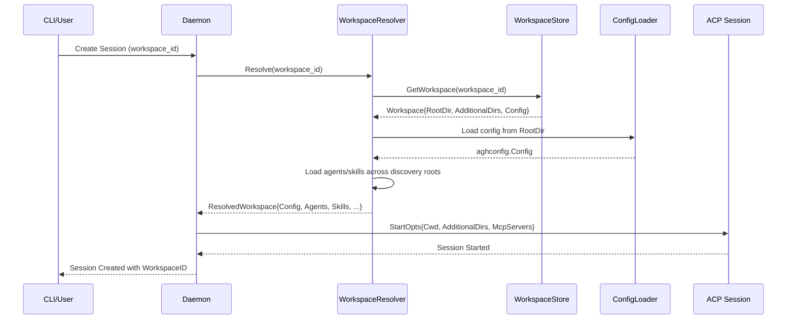
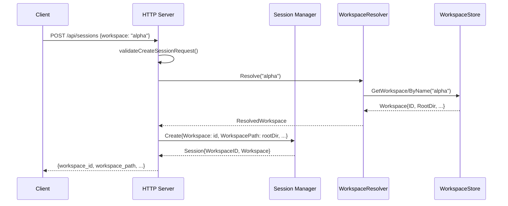

# PR #5: feat: add workspace entity

- **URL**: https://github.com/compozy/agh/pull/5
- **Author**: @pedronauck
- **State**: merged
- **Created**: 2026-04-06T21:41:11Z
- **Merged**: 2026-04-06T22:59:57Z

## Summary by CodeRabbit

- **New Features**
  - Added workspace management system: register, list, view, edit, and remove workspaces via CLI and API
  - Sessions now associated with workspaces; filter sessions by workspace
  - Workspace selector in UI sidebar for managing sessions across workspaces
  - Support for additional directories within workspaces to extend agent/skill discovery
  - Session display now shows workspace information in headers and list views

## Walkthrough

Introduces multi-root workspace management system with persistent workspace registration, resolver-based configuration loading, and workspace-aware session management. Splits session workspace identity into WorkspaceID (durable identifier) and WorkspacePath (filesystem root), adds AdditionalDirs support, integrates workspace APIs, CLI commands, and frontend UI with workspace selection and display.

## Changes

| Cohort / File(s)                                                                                                                                                                                                                                                                                          | Summary                                                                                                                                                                                                                                                                                                                                                                                          |
| --------------------------------------------------------------------------------------------------------------------------------------------------------------------------------------------------------------------------------------------------------------------------------------------------------- | ------------------------------------------------------------------------------------------------------------------------------------------------------------------------------------------------------------------------------------------------------------------------------------------------------------------------------------------------------------------------------------------------ |
| **Workspace Domain & Store**   `internal/workspace/workspace.go`, `internal/workspace/store.go`                                                                                                                                                                                                        | Introduces `Workspace`, `ResolvedWorkspace`, `SkillPath` models; sentinel errors (`ErrWorkspaceNotFound`, `ErrWorkspaceRootMissing`, `ErrAgentNotAvailable`, `ErrWorkspaceNameTaken`, `ErrWorkspacePathTaken`); `WorkspaceResolver` interface with `Resolve` and `ResolveOrRegister` methods; `WorkspaceStore` interface for persistence (insert, update, delete, lookup by ID/path/name, list). |
| **Workspace Resolver Implementation**   `internal/workspace/resolver.go`, `internal/workspace/options.go`                                                                                                                                                                                              | Implements `Resolver` with snapshot-based caching, configuration/agent/skill loading across discovery roots, symlink canonicalization, `RegisterOptions`/`UpdateOptions` structs; defines `ConfigLoader` and cache configuration options (`WithHomePaths`, `WithConfigLoader`, `WithLogger`, `WithNow`, `WithCacheTTL`, `WithIDGenerator`).                                                      |
| **Workspace Resolver Testing**   `internal/workspace/resolver_test.go`, `internal/workspace/resolver_integration_test.go`, `internal/workspace/workspace_test.go`                                                                                                                                      | Comprehensive unit and integration tests validating resolution by ID/name/path, caching semantics, symlink handling, agent/skill precedence, TTL expiry, concurrent registration, error behavior; structural surface tests for exported types.                                                                                                                                                   |
| **Global Database Workspace Persistence**   `internal/store/global_db.go`, `internal/store/schema.go`                                                                                                                                                                                                  | Adds `InsertWorkspace`, `UpdateWorkspace`, `DeleteWorkspace`, `GetWorkspace`, `GetWorkspaceByPath`, `GetWorkspaceByName`, `ListWorkspaces` methods; introduces `workspaces` table and migrates `sessions.workspace` → `sessions.workspace_id` with foreign key; includes constraint error mapping to workspace-specific sentinel errors.                                                         |
| **Session Model & Validation**   `internal/store/store.go`, `internal/store/meta_test.go`, `internal/store/store_helpers_test.go`, `internal/store/global_db_test.go`                                                                                                                                  | Renames `SessionInfo.Workspace` → `WorkspaceID`, adds `SessionInfo.WorkspacePath`; updates `SessionMeta` similarly; changes validation to enforce `WorkspaceID` instead of `Workspace`; updates JSON serialization tags; includes migration tests for legacy schema conversion.                                                                                                                  |
| **ACP & Session Management**   `internal/acp/client.go`, `internal/acp/handlers.go`, `internal/acp/types.go`                                                                                                                                                                                           | Adds `StartOpts.AdditionalDirs` field with absolute-path validation; introduces `normalizeWorkspaceDir` and `normalizeAdditionalDirs` helpers; creates `wireNewSessionRequest` and `wireLoadSessionRequest` structs with `AdditionalDirs` JSON fields; updates session initialization to serialize workspace-specific request payloads.                                                          |
| **Daemon & Session Manager**   `internal/daemon/daemon.go`, `internal/daemon/daemon_test.go`, `internal/session/manager.go`                                                                                                                                                                            | Threads `WorkspaceResolver` through daemon and session manager; changes `CreateOpts` to support both `Workspace` and `WorkspacePath`; implements `resolveCreateWorkspace` / `resolveResumeWorkspace` helpers; switches session workspace identity to `WorkspaceID`; updates prompt assembly signatures to accept `ResolvedWorkspace`.                                                            |
| **HTTP API Workspace Endpoints**   `internal/httpapi/workspaces.go`, `internal/httpapi/sessions.go`, `internal/httpapi/server.go`, `internal/httpapi/handlers_error_test.go`, `internal/httpapi/handlers_test.go`                                                                                      | Adds `/api/workspaces` routes (POST/GET/PATCH/DELETE/resolve); updates session create/list handlers to support workspace filtering and `workspace_path` field; introduces `WorkspaceService` interface and `WithWorkspaceResolver` option; maps workspace errors to HTTP status codes via `statusForWorkspaceError`.                                                                             |
| **UDS API Workspace Endpoints**   `internal/udsapi/workspaces.go`, `internal/udsapi/handlers.go`, `internal/udsapi/server.go`, `internal/udsapi/routes.go`, `internal/udsapi/handlers_test.go`                                                                                                         | Mirrors HTTP API workspace endpoints; adds workspace filtering for session lists; updates session payloads to include `workspace_id` / `workspace_path`; registers `/api/workspaces` routes; requires `WorkspaceResolver` on server initialization.                                                                                                                                              |
| **CLI Workspace Commands**   `internal/cli/workspace.go`, `internal/cli/workspace_test.go`, `internal/cli/session.go`                                                                                                                                                                                  | Introduces `workspace add/list/info/edit/remove` commands; implements `--workspace` and `--cwd` flags for session creation; adds output formatting for workspace records with sessions/agents/skills; includes directory merge/deduplication logic for edit operations.                                                                                                                          |
| **Config & Agent Discovery**   `internal/config/agent.go`, `internal/config/agent_test.go`, `internal/config/config.go`, `internal/config/config_test.go`                                                                                                                                              | Adds `WorkspaceDiscoveryRoot`, `WorkspaceDiscoverySource` types; implements `WorkspaceDiscoveryRoots` and `LoadWorkspaceAgentDefs` for multi-root agent discovery; introduces `LoadForHome` for explicit home path resolution; adjusts workspace-overlay application and `.env` loading logic.                                                                                                   |
| **Prompt Assembly & Skills**   `internal/daemon/composed_assembler.go`, `internal/memory/assembler.go`, `internal/skills/catalog.go`, `internal/skills/registry.go`, `internal/skills/types.go`                                                                                                        | Changes `PromptAssembler.Assemble` and `PromptProvider.PromptSection` signatures to accept `workspacepkg.ResolvedWorkspace` instead of string; updates skill loading to use resolver-provided `SkillPath` entries; replaces `SourceAgents` with `SourceAdditional` in skill source enum.                                                                                                         |
| **Observer & Permission Resolution**   `internal/observe/observer.go`, `internal/observe/helpers_test.go`, `internal/observe/observer_test.go`                                                                                                                                                         | Updates `PermissionModeResolver` to accept `context.Context` and `workspaceID` instead of workspace string; adds `WithWorkspaceResolver` option; changes permission config loading to resolve workspace-scoped config; updates session snapshot storage from `workspace` to `workspaceID`.                                                                                                       |
| **Dream Service**   `internal/memory/dream.go`, `internal/memory/dream_test.go`                                                                                                                                                                                                                        | Changes `SessionSpawner` signature from `workspace string` → `workspaceID string`; updates `Service.Run` to accept `workspaceRef` and resolve it via `prepareWorkspace`; adds `WithWorkspaceResolver` option; includes workspace directory creation via `memStore.ForWorkspace`.                                                                                                                 |
| **Session Query & Lifecycle**   `internal/session/query.go`, `internal/session/session.go`, `internal/session/interfaces.go`                                                                                                                                                                           | Adds `sessionInfoFromMeta` manager method for context-aware workspace resolution; introduces prompt-setup lifecycle coordination via `promptSetupCount`, `promptSetupDone`; adds `beginPromptSetup`, `finishPromptSetup`, `prepareStop` methods; changes `PromptAssembler.Assemble` interface to use `ResolvedWorkspace`.                                                                        |
| **API Support Layer**   `internal/apisupport/session_workspace.go`                                                                                                                                                                                                                                     | Introduces workspace validation/filtering utilities: `ValidateCreateSessionRequest`, `ValidateAbsolutePath(s)`, `LookupWorkspaceID`, `FilterSessionInfosByWorkspaceID`, `TrimStringSlice`; adds `StatusForWorkspaceError` / `StatusForSessionError` for workspace-aware HTTP error mapping.                                                                                                      |
| **Test Fixtures & Helpers**   `internal/acp/client_test.go`, `internal/acp/handlers_test.go`, `internal/cli/*_test.go`, `internal/daemon/*_test.go`, `internal/httpapi/*_test.go`, `internal/observe/*_test.go`, `internal/session/*_test.go`, `internal/store/*_test.go`, `internal/udsapi/*_test.go` | Extensive updates to test fixtures, mocks, and helpers to accommodate `WorkspaceID`/`WorkspacePath` instead of single `Workspace` field; adds workspace resolver stubs; introduces resolver-seeding helpers; adds new test cases for workspace validation, filtering, and error handling.                                                                                                        |
| **Frontend Workspace System**   `web/src/systems/workspace/*`                                                                                                                                                                                                                                          | Introduces complete workspace frontend system: `WorkspacePayload` / response schemas via Zod; `workspace-api` adapter with `fetchWorkspaces` / `resolveWorkspace`; `WorkspaceSelector` component; `useWorkspaces` / `useResolveWorkspace` hooks; query keys/options; integration into session creation/listing with workspace filtering.                                                         |
| **Frontend Session Updates**   `web/src/systems/session/*`, `web/src/components/app-sidebar.tsx`                                                                                                                                                                                                       | Updates session payload schema to include `workspace_id` / `workspace_path` instead of `workspace`; adds workspace display in `ChatHeader` and `SessionSidebarItem`; refactors `AppSidebar` to load workspaces, track selected workspace, and gate session creation on workspace selection; updates `useSessions` to accept workspace filter and optional enable flag.                           |

## Sequence Diagram

