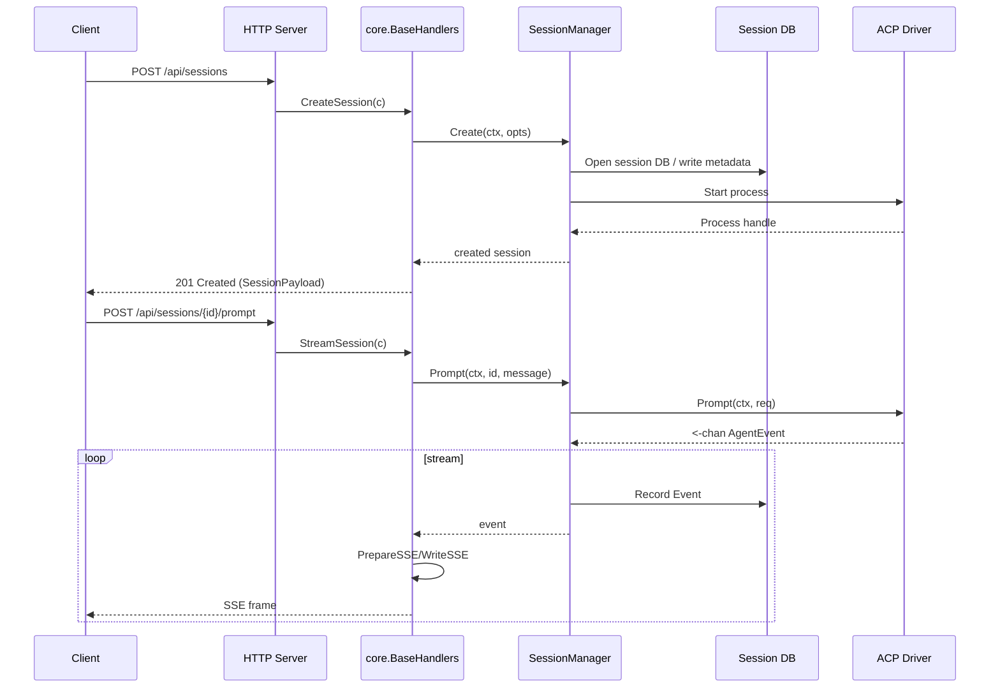

# PR #7: refactor: project structure

- **URL**: https://github.com/compozy/agh/pull/7
- **Author**: @pedronauck
- **State**: merged
- **Created**: 2026-04-07T15:19:46Z
- **Merged**: 2026-04-07T18:19:24Z

## Summary by CodeRabbit

- **New Features**
  - Unified HTTP API with consistent endpoints across transports
  - Shared contract for standardized request/response payloads
  - Expanded session lifecycle: create, resume, stop, prompt, and permission approval flows
  - Workspace CRUD and resolve endpoints
  - Background memory consolidation/runtime for automated “dream” sessions

- **Bug Fixes**
  - More consistent HTTP status codes and error responses
  - Fixed edge cases in session, workspace, and streaming flows

- **Improvements**
  - Standardized API payload shapes and streaming (SSE) behavior
  - Better observability and health endpoints

## Walkthrough

Introduces a shared API contract and core HTTP handler layer, migrates transport handlers to delegate to core, refactors session lifecycle and prompt/permission flows, adds consolidation/dream runtime and daemon boot logic, and introduces multiple utility packages and test helpers. Changes are primarily API, handler, session, memory, daemon, CLI, and tests.

## Changes

| Cohort / File(s)                                                                                                                                                                                                                | Summary                                                                                                                                                                                                                                                                             |
| ------------------------------------------------------------------------------------------------------------------------------------------------------------------------------------------------------------------------------- | ----------------------------------------------------------------------------------------------------------------------------------------------------------------------------------------------------------------------------------------------------------------------------------- |
| **ACP**   `internal/acp/handlers.go`, `internal/acp/rawjson.go`, `internal/acp/handlers_test.go`, `internal/acp/client_test.go`, `internal/acp/client_integration_test.go`                                                   | Centralized permission event emission via `emitPermissionEvent`, replaced local raw-copy with `CloneRawMessage`, and updated tests to use `testutil.Context(t)`.                                                                                                                    |
| **API Contract & Core**   `internal/api/contract/contract.go`, `internal/api/contract/contract_test.go`, `internal/api/core/...`                                                                                             | Added canonical contract DTOs and core package: conversion helpers, interfaces, error mapping, SSE utilities, parsers, payloads, BaseHandlers implementation (sessions/agents/observe/memory/workspaces/daemon), and extensive tests.                                               |
| **HTTP & UDS Transport**   `internal/api/httpapi/...`, `internal/api/udsapi/...`                                                                                                                                             | Transport layers refactored to delegate to `core.BaseHandlers`; route registration updated; added/adjusted handlers (approveSession, promptSession), unified error handling to `core.RespondError`, and updated many tests and stubs to core interfaces.                            |
| **API Test Utilities**   `internal/api/testutil/apitest.go`, `internal/api/testutil/apitest_test.go`                                                                                                                         | New shared API test stubs (`StubSessionManager`, `StubObserver`, `StubWorkspaceService`) and HTTP/SSE test helpers (SSE parsing, request helpers, home-path helpers).                                                                                                               |
| **Session Manager**   `internal/session/manager.go`, `internal/session/manager_lifecycle.go`, `internal/session/manager_prompt.go`, `internal/session/manager_helpers.go`, `internal/session/manager_workspace.go`, tests... | Reorganized session lifecycle: extracted Create/Stop/Resume/Prompt/ApprovePermission implementations into focused files, added lifecycle helpers (activate/watch, prompt pumping, workspace resolution), added lifecycle context option, and switched to `sessiondb.OpenSessionDB`. |
| **Memory & Consolidation**   `internal/memory/consolidation/runtime.go`, `internal/memory/...`, tests...                                                                                                                     | New consolidation runtime and session spawner for dream runs, gated scheduling, workspace resolution, and integration tests; replaced frontmatter and atomic write logic to use dedicated packages; process-alive checks now use `procutil`.                                        |
| **Daemon & Orphans**   `internal/daemon/boot.go`, `internal/daemon/boundary.go`, `internal/daemon/orphan.go`, `internal/daemon/notifier.go`, `internal/daemon/daemon.go`, tests...                                           | Adds daemon boot sequence, import-boundary verifier, orphan process cleanup, notifier fan-out; refactors daemon wiring to use core interfaces and consolidation runtime; many integration/test updates.                                                                             |
| **Observability**   `internal/observe/*.go`, tests...                                                                                                                                                                        | Narrowed Registry interface, switched DB opener to `globaldb.OpenGlobalDB`, improved active agent counting, and updated tests to `testutil.Context`.                                                                                                                                |
| **Frontmatter & Config**   `internal/frontmatter/frontmatter.go`, `internal/config/agent.go`, `internal/config/home.go`, tests...                                                                                            | New frontmatter splitter/decoder and mapped sentinel errors; agent frontmatter parsing now uses frontmatter package; added `ResolvePath` and `ResolveUserAgentsSkillsDir`.                                                                                                          |
| **Process/File Utilities**   `internal/procutil/*`, `internal/fileutil/*`, `internal/filesnap/*`, tests...                                                                                                                   | New cross-platform process utilities (`procutil`), atomic file write with dir-sync (`fileutil`), and filesystem snapshot utilities (`filesnap`) with tests and platform-specific implementations.                                                                                   |
| **CLI**   `internal/cli/*`                                                                                                                                                                                                   | CLI code updated to alias shared contract types, replaced rendering with generic `listBundle`, delegated process utilities to `procutil`, adjusted daemon status construction, and added extensive tests; contexts in tests use `testutil.Context(t)`.                              |
| **Various Tests & Test Utilities**   multiple `internal/.../*_test.go` and new `internal/testutil` usage                                                                                                                     | Widespread test updates to use shared test utilities, rename stub fields to exported `*Fn` forms, and align tests with new core interfaces and behavior.                                                                                                                            |

## Sequence Diagram

