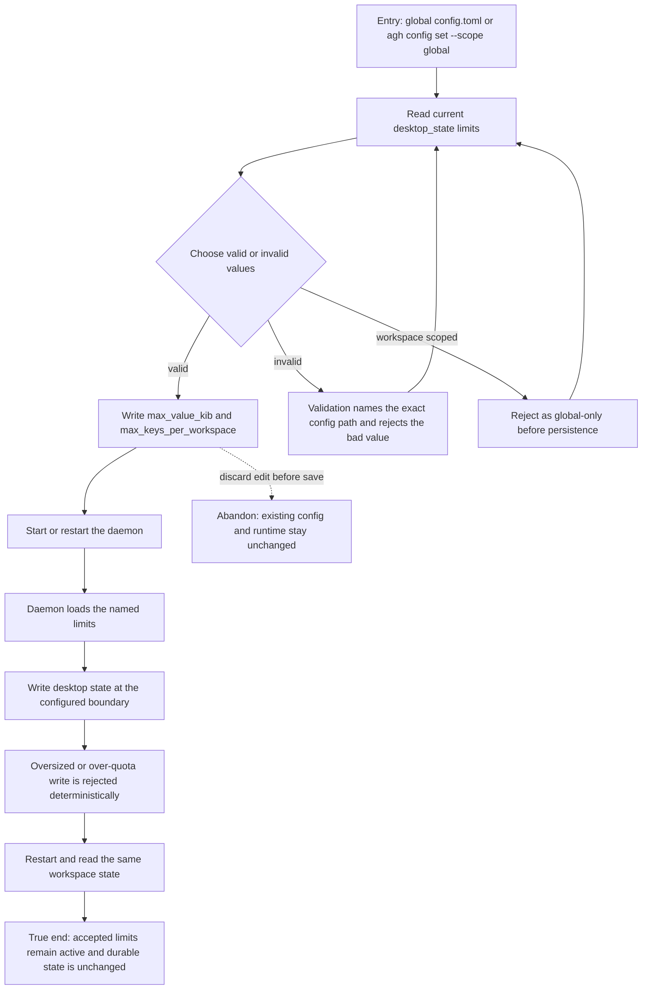

# J-administer-desktop-state-limits — Bound durable desktop state safely

An operator changes the daemon's desktop-state storage limits, verifies invalid values fail without replacing the last good configuration, and confirms the accepted limits still govern the workspace after restart.



```yaml
journey:
  id: J-administer-desktop-state-limits
  name: "Bound durable desktop state safely"
  value_statement: "An operator can cap desktop-state storage without risking silent truncation, unbounded growth, or loss after restart."
  personas: [Bruno, Ada]
  entry_points:
    - url: "config.toml"
      origin: direct
    - url: "agh config set desktop_state.<key> <value> --scope global"
      origin: direct
  actions:
    - step: 1
      verb: "Read and change desktop-state limits"
      expected_observable: "The two canonical paths expose defaults 256 and 512, preserve explicit valid global overrides, and reject workspace-scoped writes before persistence."
    - step: 2
      verb: "Start the daemon with the edited configuration"
      expected_observable: "Valid ranges load; invalid values fail with the exact named path before normal runtime work starts."
    - step: 3
      verb: "Write state at and beyond each configured boundary"
      expected_observable: "Boundary writes commit atomically; oversized and new over-quota identities return deterministic errors without changing state."
    - step: 4
      verb: "Restart and re-read the workspace"
      expected_observable: "The accepted configuration and durable entries retain their values, revisions, and sequence."
  goal:
    observable: "Configured storage limits are enforced atomically and the accepted desktop survives restart unchanged."
    side_effects: [config-persisted, desktop-state-bounded, clientstate-reopened]
  true_end_state: "After restart, the same workspace state is readable and the same accepted limits reject only out-of-bounds writes."
  exit:
    natural: "The operator returns to normal desktop use with bounded persistence active."
  abandonment:
    - at_step: 1
      how: "The operator discards the edit before saving."
      resume: "The previous config remains authoritative and can be edited again later."
    - at_step: 2
      how: "An invalid value blocks startup."
      resume: "The named path points to the correction; restoring a valid value allows startup without mutating desktop state."
  crosses: [config-lifecycle, clientstate-store, workspace-isolation, daemon-restart]
```

Taxonomy sweep: the scenario owns the functional round trip, invalid-range recovery, boundary errors, and restart continuity. There is no viewport or visual surface in this task, so responsiveness and accessibility are deliberate skips; CLI/API parity and the desktop UI ride the later public-surface and shell journeys.
