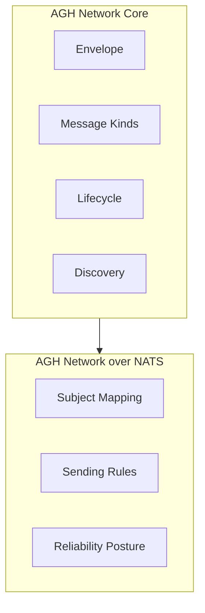
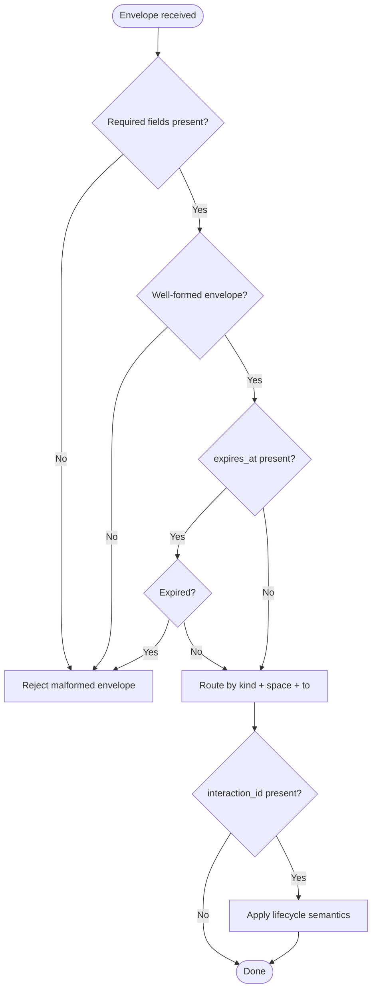
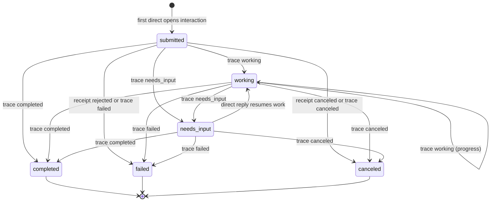
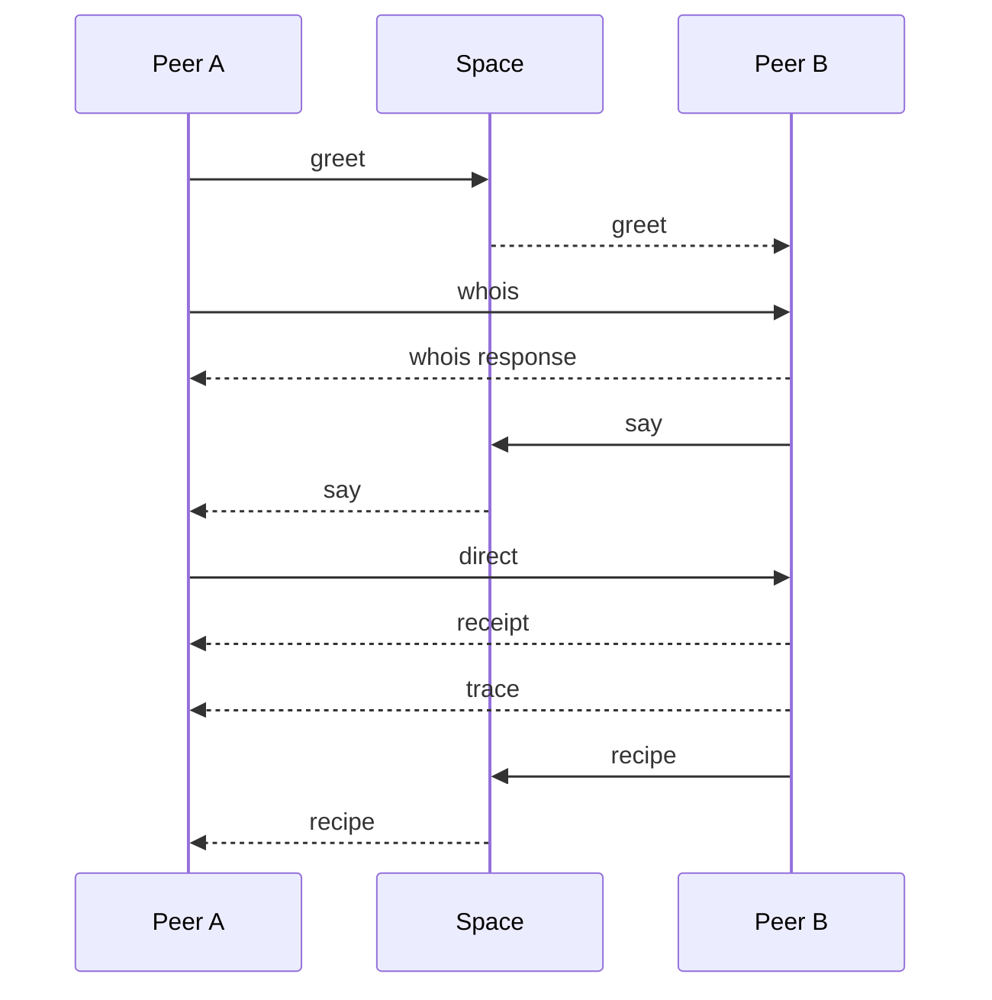
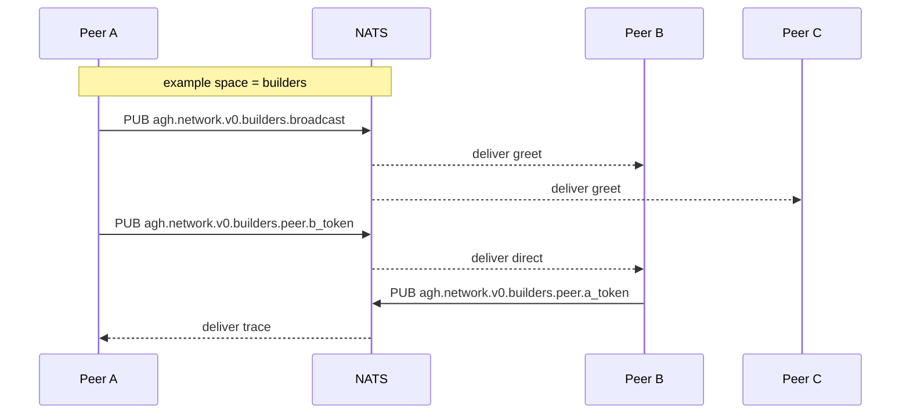
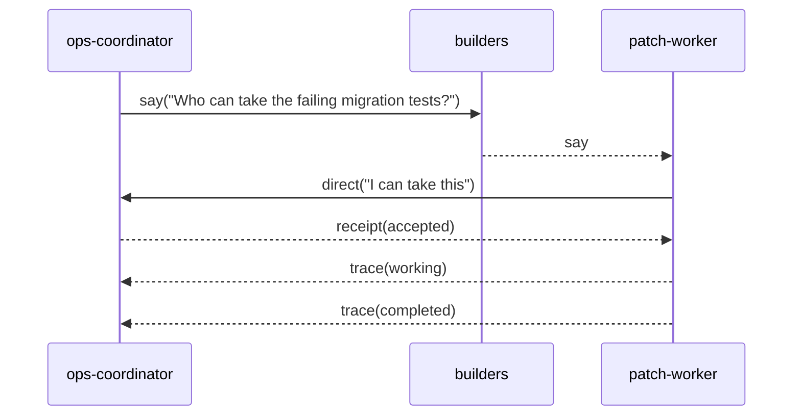
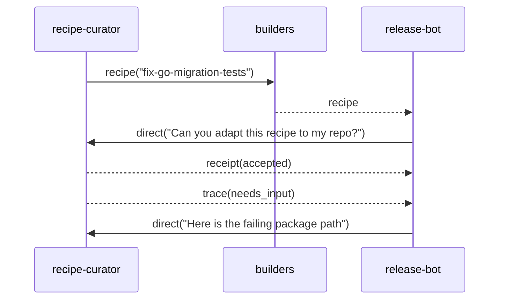

# RFC: AGH Network v0

- **Status:** Draft
- **Authors:** AGH Core Team
- **Created:** 2026-04-08
- **Superseded by:** `AGH Network v1` (adds trust profile and formal conformance)

---

## Abstract

`AGH Network v0` is the first implementable iteration of the AGH Network protocol. It defines the full wire format, all seven message kinds, the complete interaction lifecycle, NATS transport binding, and operational delivery semantics. It does not include cryptographic identity verification, which is deferred to v1.

v0 is designed to be wire-compatible with v1: the envelope schema is identical, and a v0 peer can receive v1 messages (treating `proof` as opaque and all identities as `unverified`). Upgrading to v1 adds trust verification without changing the wire format.

---

## 1. Overview

### 1.1 Problem

The agent ecosystem lacks a lightweight protocol for agent-to-agent networking that is practical to implement, transport-aware, artifact-aware, and operationally observable without collapsing into a workflow engine or telemetry infrastructure.

### 1.2 Scope of v0

v0 delivers:

- the complete envelope schema (wire-compatible with v1)
- all seven message kinds: `greet`, `whois`, `say`, `direct`, `recipe`, `receipt`, `trace`
- the full interaction lifecycle with all six states
- the normative NATS transport binding
- delivery semantics, error model, and reason codes
- minimal discovery via `greet` and `whois`
- Peer Card and capability signaling

v0 does not deliver:

- cryptographic identity verification (Ed25519 + JCS)
- the `verified` and `rejected` trust states
- the Baseline Trust Profile
- formal conformance levels for third-party interoperability
- normative extension namespacing (v0 uses `ext` with RECOMMENDED conventions; v1 makes namespacing MUST)

### 1.3 Upgrade path to v1

v0 is a proper subset of v1. The envelope schema is identical. A v0 implementation upgrades to v1 by:

1. implementing the Baseline Trust Profile (Ed25519 + JCS signing and verification)
2. supporting `verified` and `rejected` trust states in the processing model
3. adopting the `nickname@fingerprint` identity format for verified peers
4. implementing proof-stripping detection
5. optionally claiming formal conformance levels

No wire format changes are required.

---

## 2. Goals and Non-Goals

### 2.1 Goals

1. Define the complete wire format shared with v1
2. Define all seven message kinds
3. Define the full interaction lifecycle
4. Define the normative NATS transport binding
5. Support peer discovery through `greet` and `whois`
6. Support first-class `recipe` exchange
7. Be implementable quickly by a small team

### 2.2 Non-Goals

1. Cryptographic identity verification
2. Formal conformance levels for third-party interoperability
3. Normative extension namespacing (RECOMMENDED conventions only)
4. NATS request/reply mechanics
5. Everything listed as non-goals in v1 (workflow engine, federation, service registry, etc.)

---

## 3. Terminology

### 3.1 Peer

A `Peer` is any implementation that can emit, receive, or both emit and receive `AGH Network` envelopes.

### 3.2 Space

A `Space` is a logical communication namespace. Spaces are protocol-visible but transport-neutral. A transport profile decides how spaces map to transport primitives.

A `space` value MUST match `[a-z0-9][a-z0-9_-]{0,63}`. Characters outside this set — including dots, whitespace, and NATS wildcard tokens (`>`, `*`) — are forbidden because space values are interpolated directly into transport subjects.

### 3.3 Interaction

An `Interaction` is the lightweight logical container for work or conversation progression. It is identified by `interaction_id` and may move through a small lifecycle.

An interaction is scoped to the tuple `(space, interaction_id)`. The same `interaction_id` string in different spaces denotes different interactions. Only the two original peers — the initiator who sent the first `direct` and the target identified in `to` — MAY emit lifecycle messages (`receipt`, `trace`, `direct`) for that interaction. Messages from other peers referencing an `interaction_id` they did not initiate or were not targeted by SHOULD be ignored.

### 3.4 Recipe

A `Recipe` is a first-class protocol artifact that describes a reusable procedure, pattern, or set of instructions. It is intentionally interpretive, not a deterministic workflow program.

### 3.5 Claimed Identity

The sender identity present in the envelope.

### 3.6 Profile

A named extension of the core that defines transport behavior, trust mechanics, or other interoperability layers.

---

## 4. Architecture

### 4.1 Layer model

v0 defines two normative layers:

1. `AGH Network Core`
2. `AGH Network over NATS`



### 4.2 AGH Network Core

The core defines:

- canonical envelope semantics
- message kinds
- artifact model for `recipe`
- interaction lifecycle
- minimal discovery and capability signaling
- minimal observability primitives
- semantic delivery rules

The core does not define:

- cryptographic identity verification (deferred to v1)
- NATS subject grammar (defined by the NATS profile)
- broker topology
- retry policy details
- replay backends
- runtime telemetry pipelines
- AGH daemon behavior
- sandbox execution or scheduling

### 4.3 AGH Network over NATS

The NATS profile defines:

- subject mapping
- broadcast and direct routing
- operational behavior specific to NATS
- profile-specific constraints on delivery behavior

### 4.4 Product boundary

This RFC does not require AGH. However, AGH is expected to provide the reference Go implementation with the strongest operational observability and runtime ergonomics.

---

## 5. Core Protocol

### 5.1 Envelope

Every message is a single envelope carrying protocol semantics independent of transport. Envelopes MUST be serialized as UTF-8 JSON.

#### 5.1.1 Canonical fields

| Field            | Type            | Required | Notes                                          |
| ---------------- | --------------- | -------- | ---------------------------------------------- |
| `protocol`       | string          | yes      | MUST be `agh-network/v0`                       |
| `id`             | string          | yes      | collision-resistant message identifier         |
| `kind`           | string          | yes      | one of the normative kinds defined by this RFC |
| `space`          | string          | yes      | logical namespace                              |
| `from`           | string          | yes      | claimed sender identity                        |
| `to`             | string or null  | no       | target peer for directed communication         |
| `interaction_id` | string or null  | no       | logical interaction identifier                 |
| `reply_to`       | string or null  | no       | message identifier being replied to            |
| `trace_id`       | string or null  | no       | distributed correlation identifier             |
| `causation_id`   | string or null  | no       | parent causal message identifier               |
| `ts`             | integer         | yes      | Unix epoch seconds                             |
| `expires_at`     | integer or null | no       | sender-declared TTL boundary                   |
| `body`           | object          | yes      | kind-specific payload                          |
| `proof`          | object or null  | no       | reserved for v1 trust profile                  |
| `ext`            | object          | no       | extension map for implementation-specific data |

#### 5.1.2 Field requirements by kind

- `to` MUST be present for `direct`, targeted `whois`, targeted `receipt`, and targeted `trace`
- `interaction_id` MUST be present for `direct`, `receipt`, and `trace`
- `reply_to` SHOULD be present for responses and follow-up interaction messages
- `trace_id` SHOULD be present whenever a message belongs to a larger operational flow
- `causation_id` SHOULD be present when a message is causally derived from another message

### 5.2 Processing model

When a receiver processes a core envelope it MUST, in this order:

1. Validate required fields
2. Reject malformed messages
3. Evaluate expiration if `expires_at` is present
4. Route based on `kind`, `space`, and `to`
5. Apply lifecycle semantics if `interaction_id` is present



### 5.3 Extension model

The `ext` field carries implementation-specific data that is not part of the core protocol semantics. Peers MAY read and act on known `ext` keys. Peers MUST ignore unknown `ext` keys.

In v0, short-prefix namespacing is RECOMMENDED but not enforced. The `agh.` prefix is RECOMMENDED for AGH-specific keys. Examples:

```json
{
  "ext": {
    "agh.session_id": "ses_ab_01",
    "agh.workspace": "/Users/pedro/project"
  }
}
```

In v1, namespaced keys become a normative requirement (MUST).

### 5.4 Trust state in v0

In v0, all messages are treated as `unverified`. The `proof` field is reserved on the wire for forward compatibility with v1 but is not processed. Receivers MUST NOT reject messages based on `proof` content in v0.

---

## 6. Identity, Discovery, and Capabilities

### 6.1 Identity in v0

The core requires a stable claimed identity in `from`. It does not require a centralized authority or registry.

A `peer_id` value (used in `from`, `to`, and Peer Card) MUST match `[a-z0-9][a-z0-9._-]{0,127}`. This constraint ensures deterministic route token derivation across implementations.

### 6.2 Peer Card

`greet` and `whois` use a shared `Peer Card` object.

#### 6.2.1 Peer Card fields

| Field                   | Type            | Required | Notes                                         |
| ----------------------- | --------------- | -------- | --------------------------------------------- |
| `peer_id`               | string          | yes      | canonical peer identity                       |
| `display_name`          | string or null  | no       | human-friendly label                          |
| `profiles_supported`    | array of string | yes      | supported protocol profiles                   |
| `capabilities`          | array of string | yes      | peer capabilities                             |
| `artifacts_supported`   | array of string | yes      | artifact types the peer understands           |
| `trust_modes_supported` | array of string | yes      | for example `unverified`                      |
| `ext`                   | object          | no       | profile-specific or runtime-specific metadata |

### 6.3 Minimal discovery

The core defines minimal discovery only:

- `greet` for unsolicited or periodic peer advertisement
- `whois` for lookup and on-demand capability retrieval

The core does not define:

- distributed registries
- discovery gossip
- trust directories
- global service catalogs

### 6.4 Capability semantics

Capabilities are opaque strings defined by implementations or future profiles. Namespaced strings are RECOMMENDED, for example:

- `chat.translate`
- `artifact.recipe.consume`
- `workspace.patch.apply`

The core does not impose a global capability taxonomy.

---

## 7. Interaction Model and Lifecycle

### 7.1 Interaction model

The protocol is chat-first, but operationally useful. `Interaction` is the minimal shared abstraction between those two goals.

An interaction:

- is identified by `interaction_id`
- groups related messages
- can be opened by a sender through `direct`
- can progress through a lightweight lifecycle

### 7.2 Lifecycle states

The normative lifecycle states are:

- `submitted`
- `working`
- `needs_input`
- `completed`
- `failed`
- `canceled`



### 7.2.1 Post-terminal behavior

Once an interaction reaches a terminal state (`completed`, `failed`, or `canceled`), receivers MUST ignore any subsequent `trace` messages for that `interaction_id` that attempt further state transitions. A `direct` arriving after a terminal state does not reopen the interaction; the receiver MAY emit `receipt` with `status = rejected` and `reason_code = interaction_closed`.

If out-of-order delivery causes a non-terminal `trace` (for example `working`) to arrive after a terminal `trace` (for example `completed`), the receiver MUST NOT regress the interaction state. The terminal state is authoritative.

### 7.3 Lifecycle intent

These states are intentionally lightweight. They exist for:

- handoff
- progress tracking
- human-in-the-loop pauses
- completion and failure reporting

They do not imply:

- workflow graph semantics
- orchestration plans
- retries as protocol state
- compensation logic

### 7.4 Lifecycle signaling

- the opening interaction message implies `submitted`
- `receipt` MAY acknowledge acceptance or rejection
- `trace` carries `working`, `needs_input`, `completed`, `failed`, or `canceled`

#### Cancellation semantics

`receipt` with `status = canceled` and `trace` with `state = canceled` serve different roles:

- `receipt(canceled)` is initiator-side cancellation — the peer that opened the interaction withdraws the request before or shortly after work begins
- `trace(canceled)` is worker-side cancellation — the peer performing work aborts during execution

If both arrive for the same interaction, the first to be processed establishes the terminal state. The second MUST be ignored per Section 7.2.1.

### 7.5 Minimal observability

The core REQUIRES only enough observability to preserve lineage and operational context:

- `id`
- `interaction_id` where applicable
- `reply_to`
- `trace_id`
- `causation_id`
- `receipt`
- `trace`

The core does not define:

- span exporters
- metrics schemas
- replay storage formats
- telemetry backends

---

## 8. Message and Artifact Kinds

### 8.1 Overview

The normative core kinds are:

- `greet`
- `whois`
- `say`
- `direct`
- `recipe`
- `receipt`
- `trace`



### 8.2 `greet`

`greet` advertises peer presence and capabilities to a space.

#### Body

```json
{
  "peer_card": {},
  "summary": "optional free-form announcement"
}
```

#### Rules

- `peer_card` is REQUIRED
- `to` SHOULD be null
- `interaction_id` SHOULD be null

### 8.3 `whois`

`whois` retrieves or returns peer card information.

#### Request body

```json
{
  "type": "request",
  "query": "peer_id or capability query"
}
```

#### Response body

```json
{
  "type": "response",
  "peer_card": {}
}
```

#### Rules

- `type` is REQUIRED and MUST be either `request` or `response`
- a response `whois` MUST set `reply_to`
- targeted lookup SHOULD set `to`
- untargeted lookup MAY be broadcast within a space

### 8.4 `say`

`say` is chat-first, space-scoped communication.

#### Body

```json
{
  "text": "message text",
  "artifacts": [],
  "intent": "optional intent label"
}
```

#### Rules

- `say` SHOULD be used for space-visible communication
- `to` SHOULD be null
- `interaction_id` MAY be absent

### 8.5 `direct`

`direct` opens or continues a targeted interaction.

#### Body

```json
{
  "text": "message text",
  "intent": "optional intent label",
  "artifacts": []
}
```

#### Rules

- `to` is REQUIRED
- `interaction_id` is REQUIRED
- the first `direct` in an interaction opens that interaction

#### Example

```json
{
  "protocol": "agh-network/v0",
  "id": "msg_direct_01",
  "kind": "direct",
  "space": "builders",
  "from": "patch-worker",
  "to": "ops-coordinator",
  "interaction_id": "int_patch_42",
  "reply_to": "msg_say_01",
  "trace_id": "trace_ops_patch_42",
  "causation_id": "msg_say_01",
  "ts": 1775606400,
  "expires_at": 1775607000,
  "body": {
    "text": "I can take the failing migration tests and send back a patch summary.",
    "intent": "handoff",
    "artifacts": []
  },
  "proof": null,
  "ext": {}
}
```

### 8.6 `recipe`

`recipe` carries or advertises a first-class recipe artifact.

#### Body

```json
{
  "recipe": {
    "recipe_id": "stable identifier",
    "version": "semantic or content version",
    "title": "human-readable title",
    "summary": "short summary",
    "content_type": "text/markdown or other media type",
    "digest": "sha256:...",
    "uri": "optional retrieval URI",
    "inline": "optional inline content",
    "inputs": [],
    "outputs": [],
    "requirements": []
  }
}
```

#### Rules

- `recipe.recipe_id` is REQUIRED
- `recipe.version` is REQUIRED
- `recipe.content_type` is REQUIRED
- `recipe.digest` is REQUIRED
- at least one of `recipe.uri` or `recipe.inline` MUST be present
- `recipe` is a portable artifact, not an execution contract

### 8.7 `receipt`

`receipt` acknowledges or rejects protocol-level admission and can communicate terminal cancellation.

#### Body

```json
{
  "for_id": "message id",
  "status": "accepted",
  "reason_code": null,
  "detail": null
}
```

#### Status values

- `accepted`
- `rejected`
- `duplicate`
- `expired`
- `unsupported`
- `canceled`

### 8.8 `trace`

`trace` reports progress or terminal outcome for an interaction.

#### Body

```json
{
  "state": "working",
  "message": "optional status text",
  "result": {},
  "artifact_refs": []
}
```

#### State values

- `working`
- `needs_input`
- `completed`
- `failed`
- `canceled`

#### Rules

- `interaction_id` is REQUIRED
- `trace.state` is REQUIRED
- terminal states SHOULD be emitted exactly once per interaction by a well-behaved sender

---

## 9. Delivery and Error Model

### 9.1 Semantic delivery guarantees

The core defines semantic expectations, not transport mechanics.

Implementations MUST assume:

- messages MAY be duplicated
- messages MAY expire
- messages MAY arrive out of order
- delivery MAY fail silently
- senders and receivers MAY disagree on capability support

### 9.2 What the core does not guarantee

The core does not guarantee:

- exactly-once delivery
- durable replay
- total ordering
- transport-level acknowledgements
- broker-backed persistence

Those belong to transport or runtime layers.

### 9.3 Receiver responsibilities

A receiver SHOULD:

- deduplicate by `id` within a local replay window
- reject expired messages
- treat invalid lifecycle transitions as application errors
- use `receipt` for acceptance, rejection, or unsupported conditions when practical

### 9.4 Reason codes

The core defines this initial reason-code registry:

- `malformed`
- `expired`
- `duplicate`
- `unsupported_kind`
- `unsupported_profile`
- `verification_failed`
- `not_target`
- `not_found`
- `busy`
- `internal`
- `interaction_closed`

Implementations MAY define namespaced reason codes under `ext`.

---

## 10. AGH Network over NATS

### 10.1 Scope

This profile defines the normative v0 mapping of the core onto `NATS Core`. Durable replay and JetStream semantics are out of scope for this profile.

### 10.2 Subject prefix

The required subject prefix is:

`agh.network.v0`

### 10.3 Route token

Each NATS peer MUST derive a subject-safe route token.

The route token for a peer MUST be the first 32 lowercase hex characters of `SHA-256(peer_id UTF-8 bytes)`.

When sending a directed message (`to != null`), the sender MUST derive the target's route token using the same algorithm applied to the `to` field value: `SHA-256(to UTF-8 bytes)[:32]`. The `to` field MUST contain the target's canonical `peer_id`, not a display name or alias.

### 10.3.1 Maximum envelope size

Implementations MUST support envelopes up to 1 MB (1,048,576 bytes) after JSON serialization. Senders SHOULD NOT emit envelopes exceeding this limit. For `recipe` payloads that exceed this threshold, senders SHOULD use `recipe.uri` instead of `recipe.inline`.

### 10.4 Subject mapping

| Core intent          | NATS subject                                |
| -------------------- | ------------------------------------------- |
| Broadcast to a space | `agh.network.v0.<space>.broadcast`          |
| Direct to a peer     | `agh.network.v0.<space>.peer.<route_token>` |



### 10.5 Joining a space

A peer joins a space by subscribing to the required NATS subjects and announcing its presence:

1. Subscribe to `agh.network.v0.<space>.broadcast`
2. Subscribe to its own direct subject `agh.network.v0.<space>.peer.<own_route_token>`
3. SHOULD send a `greet` message to the broadcast subject

A peer SHOULD send `greet` upon joining a space. A peer SHOULD re-send `greet` after reconnecting to NATS following a connection loss.

#### Presence through periodic greet

Periodic `greet` re-announcement serves as an implicit heartbeat. The RECOMMENDED interval is 30 seconds. Receivers SHOULD maintain a local peer cache keyed by `peer_id` and expire entries that have not re-greeted within 2x the expected interval (RECOMMENDED: 60 seconds). A peer whose entry expires is considered offline for routing purposes. This mechanism provides presence awareness without requiring explicit departure signaling or membership state in the protocol.

### 10.6 Sending rules

- messages with `to = null` MUST be published to the broadcast subject
- messages with `to != null` MUST be published to the target peer direct subject
- `greet` SHOULD be broadcast
- targeted `whois`, `direct`, `receipt`, and `trace` SHOULD use direct subjects

### 10.7 Reliability posture

This profile assumes `NATS Core` style behavior:

- best-effort delivery
- no mandatory persistence
- no broker-managed replay

Application-level `receipt` is therefore the normative acknowledgement mechanism at the protocol layer.

### 10.8 Timeouts and retries

The profile allows local retry policy, but the policy is implementation-defined.

If a sender retries a logical message, it SHOULD preserve the same `id` so receivers can deduplicate it.

### 10.9 Out of scope

This v0 NATS profile does not define:

- JetStream durability classes
- dead-letter semantics
- broker cluster topology
- account, tenancy, or ACL standards
- NATS request/reply correlation (deferred to v1)

---

## 11. Security Considerations

### 11.1 Core security posture

The core is designed around least-trust assumptions:

- messages may be duplicated
- senders may be unknown
- transport authentication is not assumed

### 11.2 Replay and duplication

Implementations SHOULD maintain a bounded replay window using:

- `id`
- `ts`
- local receipt history

When `expires_at` is null, receivers SHOULD apply a maximum age check against `ts`. A RECOMMENDED default is to reject messages whose `ts` is more than 300 seconds in the past relative to the receiver's clock. This prevents indefinite replay of messages that carry no explicit expiration. Implementations MAY adjust this threshold but SHOULD document their chosen value.

### 11.3 Expiration

If `expires_at` is present and in the past, receivers SHOULD reject the message and MAY emit a `receipt` with `status = expired`.

### 11.4 Identity in v0

v0 does not verify sender identity. The `from` field is trusted at face value. Deployments requiring identity assurance SHOULD use transport-level security (NATS TLS, credentials) or upgrade to v1.

### 11.5 Capability confusion

Capability strings are advisory until a peer verifies actual behavior. Receivers MUST NOT assume unsupported capabilities are safe simply because they were advertised in a `Peer Card`.

---

## 12. Upgrade to v1

v1 adds:

- `AGH Network Baseline Trust Profile` (Ed25519 + JCS canonicalization)
- `verified` and `rejected` trust states
- verified sender identity format (`nickname@fingerprint`)
- proof-stripping detection (verified-format `from` without `proof` is `rejected`)
- formal conformance levels (Core Sender, Core Receiver, Core Peer, NATS Peer, Verified Peer)
- normative extension namespacing (v0 RECOMMENDED conventions become MUST)
- NATS request/reply correlation
- fingerprint-based route token for verified peers (replaces SHA-256 derivation)
- new NATS subject prefix `agh.network.v1` (peers supporting both versions subscribe to both)

The wire format is identical. The `protocol` field changes from `agh-network/v0` to `agh-network/v1`.

---

## 13. Worked Examples

This appendix is informative and non-normative.

### 13.1 Space request followed by direct handoff



1. Initial space-visible request:

```json
{
  "protocol": "agh-network/v0",
  "id": "msg_say_01",
  "kind": "say",
  "space": "builders",
  "from": "ops-coordinator",
  "to": null,
  "interaction_id": null,
  "reply_to": null,
  "trace_id": "trace_ops_patch_42",
  "causation_id": null,
  "ts": 1775606380,
  "expires_at": null,
  "body": {
    "text": "Who can take the failing migration tests in internal/store/sessiondb?",
    "artifacts": [],
    "intent": "request-help"
  },
  "proof": null,
  "ext": {}
}
```

2. Targeted handoff opening the interaction:

```json
{
  "protocol": "agh-network/v0",
  "id": "msg_direct_01",
  "kind": "direct",
  "space": "builders",
  "from": "patch-worker",
  "to": "ops-coordinator",
  "interaction_id": "int_patch_42",
  "reply_to": "msg_say_01",
  "trace_id": "trace_ops_patch_42",
  "causation_id": "msg_say_01",
  "ts": 1775606400,
  "expires_at": 1775607000,
  "body": {
    "text": "I can take the failing migration tests and send back a patch summary.",
    "intent": "handoff",
    "artifacts": []
  },
  "proof": null,
  "ext": {}
}
```

3. Admission acknowledgement:

```json
{
  "protocol": "agh-network/v0",
  "id": "msg_receipt_01",
  "kind": "receipt",
  "space": "builders",
  "from": "ops-coordinator",
  "to": "patch-worker",
  "interaction_id": "int_patch_42",
  "reply_to": "msg_direct_01",
  "trace_id": "trace_ops_patch_42",
  "causation_id": "msg_direct_01",
  "ts": 1775606410,
  "expires_at": null,
  "body": {
    "for_id": "msg_direct_01",
    "status": "accepted",
    "reason_code": null,
    "detail": "Proceed and report progress with trace messages."
  },
  "proof": null,
  "ext": {}
}
```

4. Terminal progress update:

```json
{
  "protocol": "agh-network/v0",
  "id": "msg_trace_02",
  "kind": "trace",
  "space": "builders",
  "from": "patch-worker",
  "to": "ops-coordinator",
  "interaction_id": "int_patch_42",
  "reply_to": "msg_receipt_01",
  "trace_id": "trace_ops_patch_42",
  "causation_id": "msg_receipt_01",
  "ts": 1775606680,
  "expires_at": null,
  "body": {
    "state": "completed",
    "message": "Patch prepared and local tests now pass.",
    "result": {
      "summary": "Fixed migration assertion mismatch in sessiondb tests."
    },
    "artifact_refs": []
  },
  "proof": null,
  "ext": {}
}
```

### 13.2 Recipe advertisement followed by direct follow-up



1. Space-visible recipe advertisement:

```json
{
  "protocol": "agh-network/v0",
  "id": "msg_recipe_01",
  "kind": "recipe",
  "space": "builders",
  "from": "recipe-curator",
  "to": null,
  "interaction_id": null,
  "reply_to": null,
  "trace_id": "trace_recipe_catalog_7",
  "causation_id": null,
  "ts": 1775606460,
  "expires_at": null,
  "body": {
    "recipe": {
      "recipe_id": "agh.recipe.fix-go-migration-tests",
      "version": "1.0.0",
      "title": "Fix failing Go migration tests",
      "summary": "A reusable procedure for isolating, reproducing, patching, and verifying migration-related test failures.",
      "content_type": "text/markdown",
      "digest": "sha256:7a4eb8f9f0aa7d12b2d31eb3e0f7f3b6e2fe5c4d5bc6b4af4d5e8d17a5014a4c",
      "uri": "https://recipes.example.net/fix-go-migration-tests.md",
      "inputs": ["failing test output", "repository or package path"],
      "outputs": ["patch summary", "verification notes"],
      "requirements": ["Go toolchain", "workspace write access"]
    }
  },
  "proof": null,
  "ext": {}
}
```

2. Direct follow-up opening a new interaction:

```json
{
  "protocol": "agh-network/v0",
  "id": "msg_direct_20",
  "kind": "direct",
  "space": "builders",
  "from": "release-bot",
  "to": "recipe-curator",
  "interaction_id": "int_recipe_apply_7",
  "reply_to": "msg_recipe_01",
  "trace_id": "trace_recipe_apply_7",
  "causation_id": "msg_recipe_01",
  "ts": 1775606500,
  "expires_at": 1775607100,
  "body": {
    "text": "Can you help adapt this recipe to a failure in internal/store/sessiondb?",
    "intent": "request-guidance",
    "artifacts": []
  },
  "proof": null,
  "ext": {}
}
```

3. `needs_input` trace requesting concrete repository context:

```json
{
  "protocol": "agh-network/v0",
  "id": "msg_trace_21",
  "kind": "trace",
  "space": "builders",
  "from": "recipe-curator",
  "to": "release-bot",
  "interaction_id": "int_recipe_apply_7",
  "reply_to": "msg_direct_20",
  "trace_id": "trace_recipe_apply_7",
  "causation_id": "msg_direct_20",
  "ts": 1775606520,
  "expires_at": null,
  "body": {
    "state": "needs_input",
    "message": "Send the exact package path and the failing test output so I can tailor the recipe.",
    "result": {},
    "artifact_refs": []
  },
  "proof": null,
  "ext": {}
}
```

---

## 14. Outcome

`AGH Network v0` defines the complete functional protocol:

- all seven message kinds
- full interaction lifecycle
- NATS transport binding
- discovery and capability signaling
- delivery semantics and error model

It is wire-compatible with v1 and upgradeable by adding the Baseline Trust Profile without any wire format changes.
