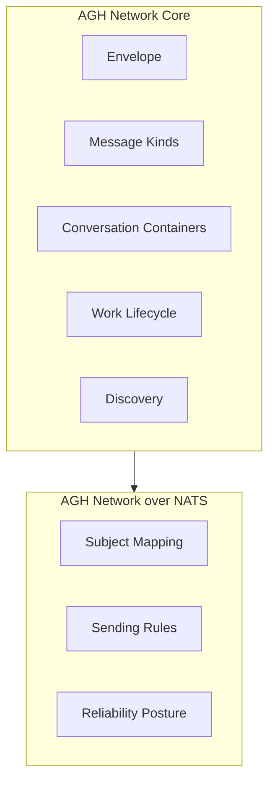
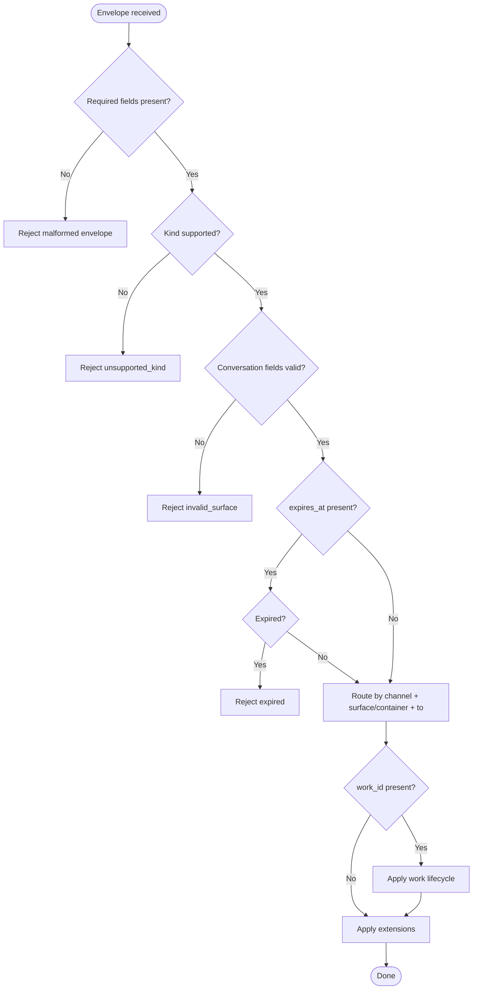
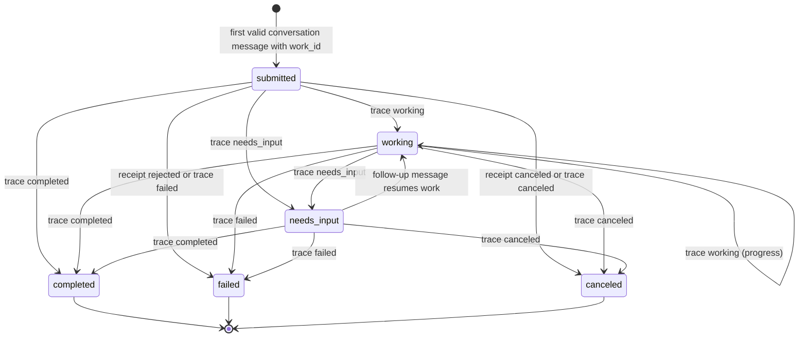
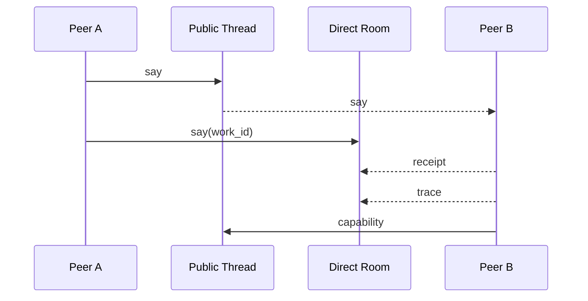
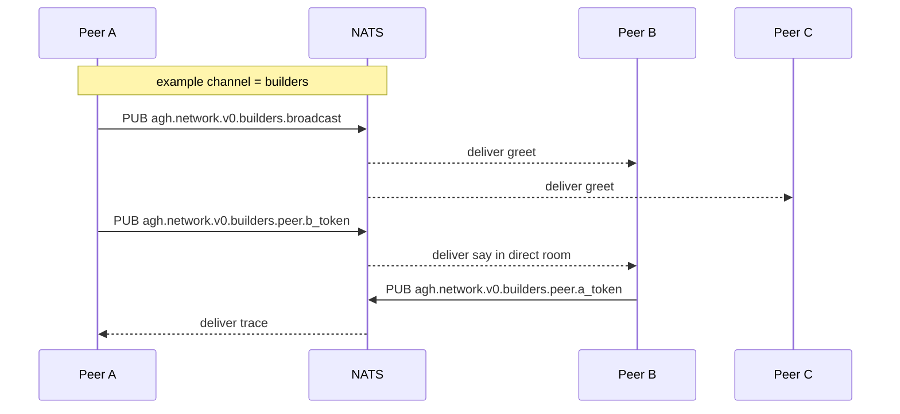
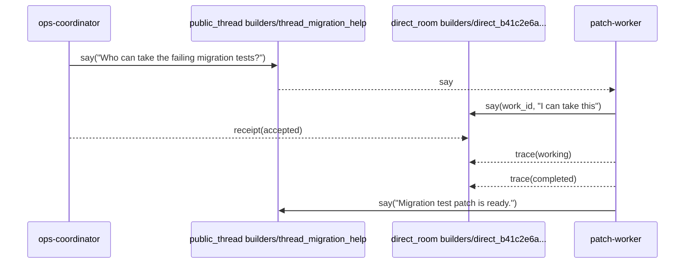
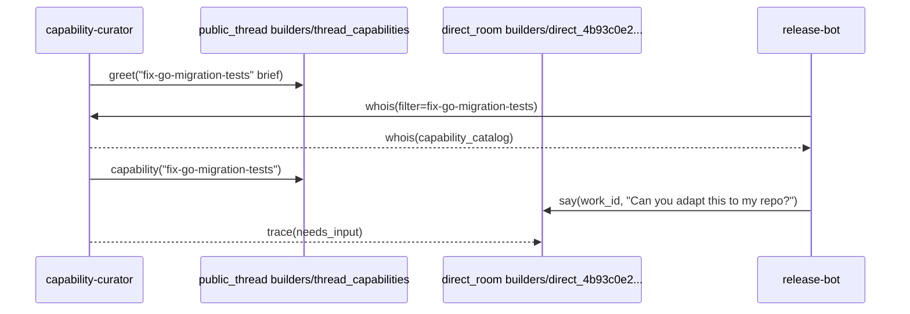

# RFC: AGH Network v0

- **Status:** Draft
- **Authors:** AGH Core Team
- **Created:** 2026-04-08
- **Updated:** 2026-05-05
- **Superseded by:** `AGH Network v1` for trust, formal conformance, and extension-key enforcement

---

## Abstract

`AGH Network v0` is the first implementable iteration of the AGH Network protocol. It defines the core
envelope, six message kinds, channel-scoped conversation containers, work lifecycle signaling, NATS
transport binding, and operational delivery semantics.

The conversation model is explicit:

- `channel` is the audience, discovery, and permission scope.
- `public_thread` is the public N-to-N conversation container inside a channel.
- `direct_room` is the restricted two-party conversation container inside a channel.
- `work_id` identifies lifecycle-bearing work inside exactly one conversation container.
- `reply_to`, `trace_id`, and `causation_id` express message-level and operational lineage; they do not
  replace container identity.

v0 does not include cryptographic identity verification. That trust layer is defined by v1. The v0
envelope reserves `proof` so a v0 peer can receive v1 envelopes and treat proofs as opaque.

---

## 1. Overview

### 1.1 Problem

The agent ecosystem lacks a lightweight open agent network protocol that is practical to implement,
transport-aware, artifact-aware, and operationally observable without becoming a workflow engine or a
telemetry platform.

### 1.2 Scope of v0

v0 delivers:

1. The complete core envelope schema shared with v1.
2. The reduced core message-kind set: `greet`, `whois`, `say`, `capability`, `receipt`, and `trace`.
3. `surface:"thread"|"direct"` conversation routing with `thread_id` and `direct_id`.
4. Public threads as channel-scoped N-to-N containers.
5. Direct rooms as channel-scoped two-party restricted-visibility containers.
6. A lightweight work lifecycle keyed by `work_id`.
7. Minimal discovery through `greet` and `whois`.
8. Peer Card, capability discovery, and capability transfer signaling.
9. The normative NATS transport binding.
10. Delivery semantics, error model, and reason codes.

v0 does not deliver:

1. Cryptographic identity verification.
2. The `verified` and `rejected` trust states.
3. The Baseline Trust Profile.
4. Formal conformance levels for third-party interoperability.
5. Normative extension namespacing; v0 uses `ext` with RECOMMENDED conventions.
6. NATS request/reply mechanics.
7. Workflow graph semantics, durable task ownership, or task-run leasing.
8. Private group threads or direct rooms with more than two peers.
9. Cryptographic privacy for direct rooms.

### 1.3 Upgrade path to v1

v0 is the functional core that v1 extends. A v0 implementation upgrades to v1 by:

1. Implementing the Baseline Trust Profile (Ed25519 + JCS signing and verification).
2. Supporting `verified` and `rejected` trust states in the processing model.
3. Adopting the `nickname@fingerprint` identity format for verified peers.
4. Implementing proof-stripping detection.
5. Enforcing normative extension-key namespacing.
6. Optionally claiming formal conformance levels.

The conversation fields, message kinds, and lifecycle rules in this RFC remain normative for v1.

---

## 2. Goals and Non-Goals

### 2.1 Goals

1. Define a transport-neutral core envelope.
2. Define orthogonal event kind and conversation surface semantics.
3. Make public threads and direct rooms protocol-visible instead of UI-only projections.
4. Keep `work_id` scoped to lifecycle-bearing work only.
5. Support peer discovery through `greet` and `whois`.
6. Support first-class `capability` transfer.
7. Preserve enough lineage for handoff, summarize-back, tracing, and receipts.
8. Be implementable outside AGH.

### 2.2 Non-Goals

1. Cryptographic identity verification.
2. Formal conformance levels for third-party interoperability.
3. Normative extension namespacing.
4. NATS request/reply mechanics.
5. Organization-wide federation, trust roots, or revocation.
6. Workflow execution semantics.
7. Cross-container work units.
8. A task queue or lease protocol.
9. Any AGH-only runtime requirement for interoperability.

---

## 3. Terminology

### 3.1 Peer

A `Peer` is any implementation that can emit, receive, or both emit and receive AGH Network envelopes.

A `peer_id` value used in `from`, `to`, and Peer Card MUST match `[a-z0-9][a-z0-9._-]{0,127}`.

### 3.2 Channel

A `channel` is a logical communication namespace. It is the audience, discovery, and permission scope above
public threads and direct rooms. A transport profile decides how channels map to transport primitives.

A `channel` value MUST match `[a-z0-9][a-z0-9_-]{0,63}`. Characters outside this set, including dots,
whitespace, and NATS wildcard tokens (`>`, `*`), are forbidden because channel values are interpolated into
transport subjects.

### 3.3 Public thread

A `public_thread` is a public N-to-N conversation container inside one channel. It is represented on the wire
by `surface:"thread"` and `thread_id`.

Rules:

- `thread_id` is scoped by `channel`.
- `thread_id` MUST match `^thread_[a-z0-9][a-z0-9_-]{2,95}$`.
- Any peer with access to the channel MAY observe public-thread messages.
- A public thread can contain zero, one, or many work units.

### 3.4 Direct room

A `direct_room` is a restricted two-party conversation container inside one channel. It is represented on the
wire by `surface:"direct"` and `direct_id`.

Rules:

- `direct_id` is scoped by `channel`.
- `direct_id` MUST match `^direct_[a-f0-9]{32}$`.
- A direct room has exactly two peers in this version.
- The room identity is derived from `(channel, sorted(peer_a, peer_b))` using a domain-separated SHA-256 hash.
- Direct-room visibility is a routing and runtime access rule. It is not cryptographic privacy.

### 3.5 Work

`work_id` identifies lifecycle-bearing work inside exactly one conversation container. It is not a conversation
identifier, task-run identifier, claim token, queue lease, or routing key.

Rules:

- A work unit is bound to exactly one `(channel, surface, thread_id|direct_id)` container.
- A work unit never spans multiple containers.
- `work_id` SHOULD use a `work_` prefix.
- `work_id` values MUST NOT be empty, whitespace-only, contain path separators or control characters, or exceed
  128 bytes.
- `work_id` MUST NOT appear on `greet` or `whois`.

### 3.6 Reply and correlation edges

- `reply_to` points at the specific message being answered.
- `trace_id` correlates operational activity across messages, handoffs, and task ingress.
- `causation_id` records the message or event that caused the current message.

None of these fields substitute for `thread_id`, `direct_id`, or `work_id`.

### 3.7 Capability

A `Capability` is the reusable AGH delegation artifact. The same structured capability concept is used for
authored catalogs, brief discovery, rich discovery, and explicit `kind:"capability"` transfer. It is
interpretive, not a deterministic workflow program.

### 3.8 Claimed identity

The sender identity present in `from`. v0 treats claimed identity at face value. v1 adds proof-backed verified
identity.

### 3.9 Profile

A named extension of the core that defines transport behavior, trust mechanics, or another interoperability
layer.

---

## 4. Architecture

### 4.1 Layer model

v0 defines two normative layers:

1. `AGH Network Core`
2. `AGH Network over NATS`



### 4.2 AGH Network Core

The core defines:

- canonical envelope semantics
- message kinds
- conversation container semantics
- capability transfer model
- work lifecycle signaling
- minimal discovery and capability signaling
- lineage and correlation fields
- semantic delivery rules

The core does not define:

- cryptographic identity verification
- NATS subject grammar
- broker topology
- retry policy details
- replay backends
- runtime telemetry pipelines
- AGH daemon behavior
- sandbox execution or scheduling

### 4.3 AGH Network over NATS

The NATS profile defines:

- subject mapping
- broadcast and peer-targeted transport delivery
- operational behavior specific to NATS
- profile-specific constraints on delivery behavior

### 4.4 Product boundary

This RFC does not require AGH. AGH is expected to provide the reference Go implementation with strong
operational observability and runtime ergonomics.

---

## 5. Core Protocol

### 5.1 Envelope

Every message is a single envelope carrying protocol semantics independent of transport. Envelopes MUST be
serialized as UTF-8 JSON.

#### 5.1.1 Canonical fields

| Field          | Type            | Required | Notes                                                  |
| -------------- | --------------- | -------- | ------------------------------------------------------ |
| `protocol`     | string          | yes      | MUST be `agh-network/v0`                               |
| `id`           | string          | yes      | collision-resistant message identifier                 |
| `kind`         | string          | yes      | one of the six normative core kinds                    |
| `channel`      | string          | yes      | logical communication namespace                        |
| `surface`      | string or null  | no       | `thread` or `direct` for conversation-bearing messages |
| `thread_id`    | string or null  | no       | required when `surface:"thread"`                       |
| `direct_id`    | string or null  | no       | required when `surface:"direct"`                       |
| `from`         | string          | yes      | claimed sender identity                                |
| `to`           | string or null  | no       | target peer for directed communication                 |
| `work_id`      | string or null  | no       | lifecycle-bearing work identifier                      |
| `reply_to`     | string or null  | no       | message identifier being replied to                    |
| `trace_id`     | string or null  | no       | distributed correlation identifier                     |
| `causation_id` | string or null  | no       | parent causal message or event identifier              |
| `ts`           | integer         | yes      | Unix epoch seconds                                     |
| `expires_at`   | integer or null | no       | sender-declared TTL boundary                           |
| `body`         | object          | yes      | kind-specific payload                                  |
| `proof`        | object or null  | no       | reserved for v1 trust profile                          |
| `ext`          | object          | no       | extension map for implementation-specific data         |

#### 5.1.2 Conversation field requirements by kind

| Kind         | Conversation fields                                | Work field                                       | Addressing                                       |
| ------------ | -------------------------------------------------- | ------------------------------------------------ | ------------------------------------------------ |
| `greet`      | MUST omit `surface`, `thread_id`, and `direct_id`  | MUST omit `work_id`                              | SHOULD broadcast                                 |
| `whois`      | MUST omit `surface`, `thread_id`, and `direct_id`  | MUST omit `work_id`                              | MAY target a peer                                |
| `say`        | MUST carry `surface` and the matching container ID | MAY carry `work_id` only for lifecycle work      | `to` MAY target a visible peer                   |
| `capability` | MUST carry `surface` and the matching container ID | MUST carry `work_id` when transfer is work-bound | `to` MAY target a peer                           |
| `receipt`    | MUST carry `surface` and the matching container ID | MUST carry `work_id`                             | SHOULD target the admitted-message sender        |
| `trace`      | MUST carry `surface` and the matching container ID | MUST carry `work_id`                             | MAY target the work initiator or interested peer |

#### 5.1.3 Surface validation

Receivers MUST enforce these rules before routing:

1. Any envelope with `thread_id` or `direct_id` set MUST also set `surface`.
2. `surface:"thread"` MUST set `thread_id` and MUST NOT set `direct_id`.
3. `surface:"direct"` MUST set `direct_id` and MUST NOT set `thread_id`.
4. `greet` and `whois` MUST omit `surface`, `thread_id`, `direct_id`, and `work_id`.
5. `receipt` and `trace` MUST set `work_id`.
6. Unknown `surface` values MUST be rejected as `invalid_surface`.
7. A work continuation whose `work_id` is bound to a different container MUST be rejected as
   `work_container_mismatch`.

### 5.2 Processing model

When a receiver processes a core envelope it MUST, in this order:

1. Validate required fields.
2. Reject malformed messages.
3. Reject unsupported message kinds.
4. Evaluate expiration if `expires_at` is present.
5. Route discovery messages by `kind`, `channel`, and `to`.
6. Route conversation messages by `channel`, `surface`, matching container ID, and `to`.
7. Apply work lifecycle semantics if `work_id` is present.
8. Apply extension-specific handling only after successful core validation.



### 5.3 Extension model

The `ext` field carries implementation-specific data that is not part of core protocol semantics. Peers MAY
read and act on known `ext` keys. Peers MUST ignore unknown `ext` keys.

In v0, short-prefix namespacing is RECOMMENDED but not enforced. The `agh.` prefix is RECOMMENDED for
AGH-specific keys. Examples:

```json
{
  "ext": {
    "agh.session_id": "ses_ab_01",
    "agh.workspace": "/Users/pedro/project"
  }
}
```

In v1, namespaced keys become a normative requirement.

### 5.4 Trust state in v0

In v0, all messages are treated as `unverified`. The `proof` field is reserved on the wire for forward
compatibility with v1 but is not processed. Receivers MUST NOT reject messages based on `proof` content in v0.

---

## 6. Identity, Discovery, and Capabilities

### 6.1 Identity in v0

The core requires a stable claimed identity in `from`. It does not require a centralized authority or registry.

### 6.2 Peer Card

`greet` and `whois` use a shared `Peer Card` object.

#### 6.2.1 Peer Card fields

| Field                   | Type            | Required | Notes                                                 |
| ----------------------- | --------------- | -------- | ----------------------------------------------------- |
| `peer_id`               | string          | yes      | canonical peer identity                               |
| `display_name`          | string or null  | no       | human-friendly label                                  |
| `profiles_supported`    | array of string | yes      | supported protocol profiles                           |
| `capabilities`          | array of string | yes      | minimal capability identifiers advertised by the peer |
| `artifacts_supported`   | array of string | yes      | artifact types the peer understands                   |
| `trust_modes_supported` | array of string | yes      | for example `unverified`                              |
| `ext`                   | object          | no       | profile-specific or runtime-specific metadata         |

`capabilities` is the minimal capability index advertised by the peer. Implementations MAY expose richer
capability discovery metadata through `ext`.

`artifacts_supported` advertises which transferable artifact kinds the peer understands. AGH v0 peers that
support unified capability transfer SHOULD advertise `"capability"` in `artifacts_supported` even when
`capabilities` is empty.

### 6.3 Minimal discovery

The core defines minimal discovery only:

- `greet` for unsolicited or periodic peer advertisement.
- `whois` for lookup and on-demand capability retrieval.

The core does not define distributed registries, discovery gossip, trust directories, or global service catalogs.

### 6.4 Capability semantics

A capability is the single AGH delegation artifact. The same concept appears in three protocol roles:

- discovery index in `peer_card.capabilities`
- optional rich discovery through explicit `whois`
- transferable artifact through `kind:"capability"`

Capability IDs are peer-local stable identifiers. Slugs are RECOMMENDED, for example:

- `collect-failing-tests`
- `fix-go-migration-tests`
- `review-runtime-docs`

On the network, the effective operational identity is `(peer_id, capability_id)`.

Capability advertisements are advisory. They indicate what a peer claims it can do, but they do not imply
authorization, safety, or guaranteed execution semantics.

---

## 7. Work Lifecycle

### 7.1 Work model

The protocol is chat-first, but operationally useful. `work_id` is the minimal shared lifecycle marker between
ordinary conversation and directed work.

A work unit:

- is identified by `work_id`
- is bound to exactly one public thread or direct room
- can be opened by a conversation-bearing `say` or `capability` message
- can progress through a lightweight lifecycle via `receipt` and `trace`
- never owns task-run claiming, leasing, scheduling, or execution state

### 7.2 Lifecycle states

The normative lifecycle states are:

- `submitted`
- `working`
- `needs_input`
- `completed`
- `failed`
- `canceled`



### 7.2.1 Post-terminal behavior

Once a work unit reaches a terminal state (`completed`, `failed`, or `canceled`), receivers MUST ignore any
subsequent `trace` messages for that `work_id` that attempt further state transitions. A new message after a
terminal state does not reopen the work unit; the receiver MAY emit `receipt` with `status = rejected` and
`reason_code = work_closed`.

If out-of-order delivery causes a non-terminal `trace` to arrive after a terminal `trace`, the receiver MUST NOT
regress the work state. The terminal state is authoritative.

### 7.3 Lifecycle intent

These states exist for:

- handoff
- progress tracking
- human-in-the-loop pauses
- completion and failure reporting

They do not imply:

- workflow graph semantics
- orchestration plans
- retries as protocol state
- compensation logic
- task-run ownership

### 7.4 Lifecycle signaling

- the opening work message implies `submitted`
- `receipt` MAY acknowledge acceptance, rejection, duplication, expiration, unsupported conditions, or initiator
  cancellation
- `trace` carries `working`, `needs_input`, `completed`, `failed`, or `canceled`

#### Cancellation semantics

`receipt` with `status = canceled` and `trace` with `state = canceled` serve different roles:

- `receipt(canceled)` is initiator-side cancellation: the peer that opened the work withdraws the request before or
  shortly after work begins
- `trace(canceled)` is worker-side cancellation: the peer performing work aborts during execution

If both arrive for the same work unit, the first to be processed establishes the terminal state. The second MUST
be ignored per Section 7.2.1.

### 7.5 Minimal observability

The core REQUIRES only enough observability to preserve lineage and operational context:

- `id`
- `channel`
- `surface`, `thread_id`, and `direct_id` for conversation-bearing messages
- `work_id` for lifecycle-bearing work
- `reply_to`
- `trace_id`
- `causation_id`
- `receipt`
- `trace`

The core does not define span exporters, metrics schemas, replay storage formats, or telemetry backends.

---

## 8. Message Kinds

### 8.1 Overview

The normative core kinds are:

- `greet`
- `whois`
- `say`
- `capability`
- `receipt`
- `trace`



### 8.2 `greet`

`greet` advertises peer presence and capabilities to a channel.

#### Body

```json
{
  "peer_card": {},
  "summary": "optional free-form announcement"
}
```

#### Rules

- `peer_card` is REQUIRED.
- `to` SHOULD be null.
- `surface`, `thread_id`, `direct_id`, and `work_id` MUST be absent.

#### AGH capability brief extension

AGH MAY project a normalized local capability catalog into the Peer Card brief-discovery surface:

- `peer_card.capabilities` remains the compact list of capability IDs.
- `peer_card.ext["agh.capabilities_brief"]` MAY carry an array of objects with only `id` and `summary`.

If `agh.capabilities_brief` is present, its entries MUST align with `peer_card.capabilities` in the same order.
If a peer has no local capability catalog, AGH SHOULD emit `peer_card.capabilities = []` and omit
`agh.capabilities_brief`.

### 8.3 `whois`

`whois` retrieves or returns Peer Card information.

#### Request body

```json
{
  "type": "request",
  "query": "peer_id or capability query"
}
```

#### Response body

```json
{
  "type": "response",
  "peer_card": {}
}
```

#### Rules

- `type` is REQUIRED and MUST be either `request` or `response`.
- a response `whois` MUST set `reply_to`.
- targeted lookup SHOULD set `to`.
- untargeted lookup MAY be broadcast within a channel.
- `surface`, `thread_id`, `direct_id`, and `work_id` MUST be absent.

#### AGH rich capability discovery extension

AGH MAY use envelope `ext` keys to request or return a rich capability catalog without bloating ordinary
`whois` traffic. `whois` remains the rich-discovery path; `kind:"capability"` remains the explicit transfer path.

Request keys:

- `ext["agh.include"]` MAY contain `"capability_catalog"` to request rich capability discovery.
- `ext["agh.capability_ids"]` MAY contain a list of capability IDs used to filter the returned catalog.

Response key:

- `ext["agh.capability_catalog"]` MAY contain a capability catalog object.

Rules:

- rich capability discovery is explicit; without `agh.include=["capability_catalog"]`, AGH SHOULD keep `whois`
  responses at the minimal Peer Card shape.
- the response still returns the normal Peer Card.
- the rich catalog belongs in envelope `ext`, not in `peer_card.ext`.
- each capability entry MUST include `id`, `summary`, and `outcome`.
- peers SHOULD NOT include full capability catalogs in periodic `greet`.
- receivers MUST ignore unknown AGH extension keys per the core `ext` rules.

### 8.4 `say`

`say` is ordinary text communication inside a public thread or direct room.

#### Body

```json
{
  "text": "message text",
  "artifacts": [],
  "intent": "optional intent label"
}
```

#### Rules

- `surface` is REQUIRED.
- `thread_id` is REQUIRED when `surface:"thread"`.
- `direct_id` is REQUIRED when `surface:"direct"`.
- `work_id` MAY be present only when the message opens or continues lifecycle-bearing work.
- `to` MAY target a visible peer without changing the conversation visibility.

### 8.5 `capability`

`capability` transfers one full capability document. It is the explicit transfer path for the same structured
capability model used by local authoring and rich discovery.

#### Body

```json
{
  "capability": {
    "id": "stable capability identifier",
    "summary": "short summary",
    "outcome": "expected result",
    "version": "optional semantic or content version",
    "digest": "sha256:...",
    "context_needed": [],
    "artifacts_expected": [],
    "execution_outline": [],
    "constraints": [],
    "examples": [],
    "requirements": []
  }
}
```

#### Rules

- `body.capability` is REQUIRED.
- `capability.id`, `capability.summary`, `capability.outcome`, and `capability.digest` are REQUIRED.
- `capability.version` MAY be present.
- `capability.requirements`, when present, MUST contain non-empty unique capability IDs after normalization.
- senders MUST compute `capability.digest` from the canonical structured capability document.
- receivers MUST reject digest mismatches as `verification_failed`.
- `surface` and the matching container ID are REQUIRED.
- `work_id` is REQUIRED when the transfer is part of lifecycle-bearing work.
- v0 validates `requirements` syntactically; receivers do not need to resolve every referenced capability ID locally
  before transport.

### 8.6 `receipt`

`receipt` acknowledges or rejects protocol-level admission and can communicate terminal initiator-side
cancellation.

#### Body

```json
{
  "for_id": "message id",
  "status": "accepted",
  "reason_code": null,
  "detail": null
}
```

#### Status values

- `accepted`
- `rejected`
- `duplicate`
- `expired`
- `unsupported`
- `canceled`

#### Rules

- `surface` and the matching container ID are REQUIRED.
- `work_id` is REQUIRED.
- `for_id` is REQUIRED.
- `reply_to` SHOULD point at the message being acknowledged.

### 8.7 `trace`

`trace` reports progress or terminal outcome for work.

#### Body

```json
{
  "state": "working",
  "message": "optional status text",
  "result": {},
  "artifact_refs": []
}
```

#### State values

- `working`
- `needs_input`
- `completed`
- `failed`
- `canceled`

#### Rules

- `surface` and the matching container ID are REQUIRED.
- `work_id` is REQUIRED.
- `trace.state` is REQUIRED.
- terminal states SHOULD be emitted exactly once per work unit by a well-behaved sender.

---

## 9. Delivery and Error Model

### 9.1 Semantic delivery guarantees

The core defines semantic expectations, not transport mechanics.

Implementations MUST assume:

- messages MAY be duplicated
- messages MAY expire
- messages MAY arrive out of order
- delivery MAY fail silently
- senders and receivers MAY disagree on capability support
- direct-room visibility is not cryptographic confidentiality

### 9.2 What the core does not guarantee

The core does not guarantee:

- exactly-once delivery
- durable replay
- total ordering
- transport-level acknowledgements
- broker-backed persistence
- cryptographic privacy

Those belong to transport, runtime, or trust profiles.

### 9.3 Receiver responsibilities

A receiver SHOULD:

- deduplicate by `id` within a local replay window
- reject expired messages
- reject invalid surface/container combinations
- reject invalid lifecycle transitions
- use `receipt` for acceptance, rejection, duplication, expiration, unsupported conditions, or cancellation when practical

### 9.4 Reason codes

The core defines this initial reason-code registry:

- `malformed`
- `expired`
- `duplicate`
- `unsupported_kind`
- `unsupported_profile`
- `verification_failed`
- `not_target`
- `not_found`
- `busy`
- `internal`
- `invalid_surface`
- `conversation_not_found`
- `work_closed`
- `work_container_mismatch`
- `legacy_field_rejected`

Implementations MAY define namespaced reason codes under `ext`.

---

## 10. AGH Network over NATS

### 10.1 Scope

This profile defines the normative v0 mapping of the core onto NATS Core. Durable replay and JetStream semantics
are out of scope for this profile.

### 10.2 Subject prefix

The required subject prefix is:

`agh.network.v0`

### 10.3 Route token

Each NATS peer MUST derive a subject-safe route token.

The route token for a peer MUST be the first 32 lowercase hex characters of `SHA-256(peer_id UTF-8 bytes)`.

When sending a message with `to != null`, the sender MUST derive the target's route token using the same
algorithm applied to the `to` field value. The `to` field MUST contain the target's canonical `peer_id`, not a
display name or alias.

### 10.3.1 Maximum envelope size

Implementations MUST support envelopes up to 1 MB (1,048,576 bytes) after JSON serialization. Senders SHOULD
NOT emit envelopes exceeding this limit. For rich `whois` catalogs or `kind:"capability"` transfers that
approach this threshold, senders SHOULD narrow the payload to the smallest relevant capability set instead of
inventing an out-of-band artifact format.

### 10.4 Subject mapping

| Core intent                      | NATS subject                                  |
| -------------------------------- | --------------------------------------------- |
| Broadcast to a channel           | `agh.network.v0.<channel>.broadcast`          |
| Peer-targeted transport delivery | `agh.network.v0.<channel>.peer.<route_token>` |



NATS peer-targeted subjects are transport routing subjects. They do not define `surface:"direct"` by themselves.
An envelope published to a peer subject still carries its explicit `surface` and container ID when it is
conversation-bearing.

### 10.5 Joining a channel

A peer joins a channel by subscribing to the required NATS subjects and announcing its presence:

1. Subscribe to `agh.network.v0.<channel>.broadcast`.
2. Subscribe to its own peer-targeted subject `agh.network.v0.<channel>.peer.<own_route_token>`.
3. SHOULD send a `greet` message to the broadcast subject.

A peer SHOULD send `greet` upon joining a channel and after reconnecting to NATS following a connection loss.

#### Presence through periodic greet

Periodic `greet` re-announcement serves as an implicit heartbeat. The RECOMMENDED interval is 30 seconds.
Receivers SHOULD maintain a local peer cache keyed by `peer_id` and expire entries that have not re-greeted
within 2x the expected interval (RECOMMENDED: 60 seconds).

### 10.6 Sending rules

- messages with `to = null` MUST be published to the broadcast subject
- messages with `to != null` MUST be published to the target peer subject
- `greet` SHOULD be broadcast
- targeted `whois`, `capability`, `receipt`, `trace`, and targeted `say` SHOULD use peer subjects
- `surface:"direct"` messages SHOULD use peer subjects for the other direct-room participant
- `surface:"thread"` messages MAY use peer subjects for targeted delivery without changing thread visibility

### 10.7 Reliability posture

This profile assumes NATS Core style behavior:

- best-effort delivery
- no mandatory persistence
- no broker-managed replay

Application-level `receipt` is therefore the normative acknowledgement mechanism at the protocol layer.

### 10.8 Timeouts and retries

The profile allows local retry policy, but the policy is implementation-defined.

If a sender retries a logical message, it SHOULD preserve the same `id` so receivers can deduplicate it.

### 10.9 Out of scope

This v0 NATS profile does not define:

- JetStream durability classes
- dead-letter semantics
- broker cluster topology
- account, tenancy, or ACL standards
- NATS request/reply correlation

---

## 11. Security Considerations

### 11.1 Core security posture

The core is designed around least-trust assumptions:

- messages may be duplicated
- senders may be unknown
- transport authentication is not assumed
- direct-room visibility restricts routing and runtime access but does not encrypt content

### 11.2 Replay and duplication

Implementations SHOULD maintain a bounded replay window using:

- `id`
- `ts`
- local receipt history

When `expires_at` is null, receivers SHOULD apply a maximum age check against `ts`. A RECOMMENDED default is to
reject messages whose `ts` is more than 300 seconds in the past relative to the receiver's clock.

### 11.3 Expiration

If `expires_at` is present and in the past, receivers SHOULD reject the message and MAY emit a `receipt` with
`status = expired`.

### 11.4 Identity in v0

v0 does not verify sender identity. The `from` field is trusted at face value. Deployments requiring identity
assurance SHOULD use transport-level security or upgrade to v1.

### 11.5 Capability confusion

Capability strings and rich capability metadata are advisory until a peer verifies actual behavior. Receivers
MUST NOT assume advertised capabilities are safe, authorized, or guaranteed simply because they were present in a
Peer Card or returned through capability discovery.

### 11.6 Direct-room privacy limit

A direct room is not an end-to-end encrypted private channel. It is a protocol/runtime visibility boundary:

- only the two room peers should receive and render the conversation by default
- runtime audit, persistence, operator access, and transport operators may still observe envelope content
- deployments that require cryptographic privacy need a future trust or encryption profile

---

## 12. Upgrade to v1

v1 adds:

- AGH Network Baseline Trust Profile (Ed25519 + JCS canonicalization)
- `verified` and `rejected` trust states
- verified sender identity format (`nickname@fingerprint`)
- proof-stripping detection
- formal conformance levels
- normative extension namespacing
- NATS request/reply correlation
- fingerprint-based route token for verified peers
- new NATS subject prefix `agh.network.v1`

The `protocol` field changes from `agh-network/v0` to `agh-network/v1`.

---

## 13. Worked Examples

This appendix is informative and non-normative. The JSON examples are still required to use valid current
envelope vocabulary.

### 13.1 Public request followed by direct-room work



1. Initial public-thread request:

```json
{
  "protocol": "agh-network/v0",
  "id": "msg_thread_request_01",
  "kind": "say",
  "channel": "builders",
  "surface": "thread",
  "thread_id": "thread_migration_help",
  "from": "ops-coordinator",
  "to": null,
  "reply_to": null,
  "trace_id": "trace_ops_patch_42",
  "causation_id": null,
  "ts": 1775606380,
  "expires_at": null,
  "body": {
    "text": "Who can take the failing migration tests in internal/store/sessiondb?",
    "artifacts": [],
    "intent": "request-help"
  },
  "proof": null,
  "ext": {}
}
```

2. Targeted direct-room handoff opening lifecycle-bearing work:

```json
{
  "protocol": "agh-network/v0",
  "id": "msg_direct_request_01",
  "kind": "say",
  "channel": "builders",
  "surface": "direct",
  "direct_id": "direct_b41c2e6a31f3d9849f75d96cb46c1d5a",
  "from": "patch-worker",
  "to": "ops-coordinator",
  "work_id": "work_patch_42",
  "reply_to": "msg_thread_request_01",
  "trace_id": "trace_ops_patch_42",
  "causation_id": "msg_thread_request_01",
  "ts": 1775606400,
  "expires_at": 1775607000,
  "body": {
    "text": "I can take the failing migration tests and send back a patch summary.",
    "intent": "handoff",
    "artifacts": []
  },
  "proof": null,
  "ext": {}
}
```

3. Admission acknowledgement in the same direct room:

```json
{
  "protocol": "agh-network/v0",
  "id": "msg_receipt_01",
  "kind": "receipt",
  "channel": "builders",
  "surface": "direct",
  "direct_id": "direct_b41c2e6a31f3d9849f75d96cb46c1d5a",
  "from": "ops-coordinator",
  "to": "patch-worker",
  "work_id": "work_patch_42",
  "reply_to": "msg_direct_request_01",
  "trace_id": "trace_ops_patch_42",
  "causation_id": "msg_direct_request_01",
  "ts": 1775606410,
  "expires_at": null,
  "body": {
    "for_id": "msg_direct_request_01",
    "status": "accepted",
    "reason_code": null,
    "detail": "Proceed and report progress with trace messages."
  },
  "proof": null,
  "ext": {}
}
```

4. Terminal progress update:

```json
{
  "protocol": "agh-network/v0",
  "id": "msg_trace_02",
  "kind": "trace",
  "channel": "builders",
  "surface": "direct",
  "direct_id": "direct_b41c2e6a31f3d9849f75d96cb46c1d5a",
  "from": "patch-worker",
  "to": "ops-coordinator",
  "work_id": "work_patch_42",
  "reply_to": "msg_receipt_01",
  "trace_id": "trace_ops_patch_42",
  "causation_id": "msg_receipt_01",
  "ts": 1775606680,
  "expires_at": null,
  "body": {
    "state": "completed",
    "message": "Patch prepared and local tests now pass.",
    "result": {
      "summary": "Fixed migration assertion mismatch in sessiondb tests."
    },
    "artifact_refs": []
  },
  "proof": null,
  "ext": {}
}
```

5. Public summarize-back message in the original thread:

```json
{
  "protocol": "agh-network/v0",
  "id": "msg_thread_summary_01",
  "kind": "say",
  "channel": "builders",
  "surface": "thread",
  "thread_id": "thread_migration_help",
  "from": "patch-worker",
  "to": null,
  "reply_to": "msg_thread_request_01",
  "trace_id": "trace_ops_patch_42",
  "causation_id": "msg_trace_02",
  "ts": 1775606720,
  "expires_at": null,
  "body": {
    "text": "Migration test patch is ready. The direct-room work completed successfully.",
    "artifacts": [],
    "intent": "summary"
  },
  "proof": null,
  "ext": {}
}
```

### 13.2 Capability discovery, transfer, and work follow-up



1. Channel-visible brief discovery through `greet`:

```json
{
  "protocol": "agh-network/v0",
  "id": "msg_greet_10",
  "kind": "greet",
  "channel": "builders",
  "from": "capability-curator",
  "to": null,
  "reply_to": null,
  "trace_id": "trace_capability_catalog_7",
  "causation_id": null,
  "ts": 1775606460,
  "expires_at": null,
  "body": {
    "peer_card": {
      "peer_id": "capability-curator",
      "display_name": "Capability Curator",
      "profiles_supported": ["agh-network-over-nats/v0"],
      "capabilities": ["fix-go-migration-tests"],
      "artifacts_supported": ["capability"],
      "trust_modes_supported": ["unverified"],
      "ext": {
        "agh.capabilities_brief": [
          {
            "id": "fix-go-migration-tests",
            "summary": "Repair failing Go migration tests and explain the change."
          }
        ]
      }
    }
  },
  "proof": null,
  "ext": {}
}
```

2. Filtered rich discovery through `whois`:

```json
{
  "protocol": "agh-network/v0",
  "id": "msg_whois_11",
  "kind": "whois",
  "channel": "builders",
  "from": "release-bot",
  "to": "capability-curator",
  "reply_to": null,
  "trace_id": "trace_capability_catalog_7",
  "causation_id": "msg_greet_10",
  "ts": 1775606480,
  "expires_at": 1775607080,
  "body": {
    "type": "request",
    "query": "fix-go-migration-tests"
  },
  "proof": null,
  "ext": {
    "agh.include": ["capability_catalog"],
    "agh.capability_ids": ["fix-go-migration-tests"]
  }
}
```

3. Explicit capability transfer in a public thread:

```json
{
  "protocol": "agh-network/v0",
  "id": "msg_capability_13",
  "kind": "capability",
  "channel": "builders",
  "surface": "thread",
  "thread_id": "thread_capabilities",
  "from": "capability-curator",
  "to": null,
  "reply_to": null,
  "trace_id": "trace_capability_catalog_7",
  "causation_id": "msg_whois_11",
  "ts": 1775606500,
  "expires_at": 1775607100,
  "body": {
    "capability": {
      "id": "fix-go-migration-tests",
      "summary": "Repair failing Go migration tests and explain the change.",
      "outcome": "A validated patch summary with the corrected assertions.",
      "version": "1.2.0",
      "digest": "sha256:4ac7c4d8f64f35672e0e46ae7b8cfb2fd8d8a48fd6a0f4f37ab89f4459ef560f",
      "context_needed": ["repo", "incident bundle"],
      "requirements": ["collect-failing-tests"]
    }
  },
  "proof": null,
  "ext": {}
}
```

4. Direct-room follow-up opening a new work unit:

```json
{
  "protocol": "agh-network/v0",
  "id": "msg_direct_work_20",
  "kind": "say",
  "channel": "builders",
  "surface": "direct",
  "direct_id": "direct_4b93c0e2a1c4f6d8e7b90a1234567890",
  "from": "release-bot",
  "to": "capability-curator",
  "work_id": "work_capability_apply_7",
  "reply_to": "msg_capability_13",
  "trace_id": "trace_capability_apply_7",
  "causation_id": "msg_capability_13",
  "ts": 1775606500,
  "expires_at": 1775607100,
  "body": {
    "text": "Can you help adapt this capability to a failure in internal/store/sessiondb?",
    "intent": "request-guidance",
    "artifacts": []
  },
  "proof": null,
  "ext": {}
}
```

5. `needs_input` trace requesting concrete repository context:

```json
{
  "protocol": "agh-network/v0",
  "id": "msg_trace_21",
  "kind": "trace",
  "channel": "builders",
  "surface": "direct",
  "direct_id": "direct_4b93c0e2a1c4f6d8e7b90a1234567890",
  "from": "capability-curator",
  "to": "release-bot",
  "work_id": "work_capability_apply_7",
  "reply_to": "msg_direct_work_20",
  "trace_id": "trace_capability_apply_7",
  "causation_id": "msg_direct_work_20",
  "ts": 1775606520,
  "expires_at": null,
  "body": {
    "state": "needs_input",
    "message": "Send the exact package path and the failing test output so I can tailor the capability to your repo.",
    "result": {},
    "artifact_refs": []
  },
  "proof": null,
  "ext": {}
}
```

---

## 14. Outcome

`AGH Network v0` defines the complete functional protocol:

- six core message kinds
- public-thread and direct-room conversation containers
- work lifecycle signaling
- NATS transport binding
- discovery and capability signaling
- delivery semantics and error model

It is upgradeable by adding the Baseline Trust Profile defined in v1.
