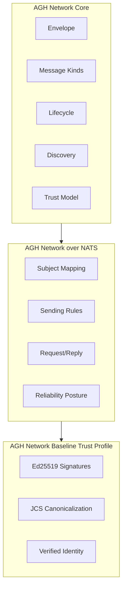
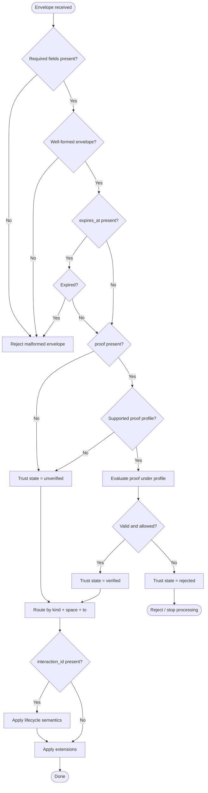
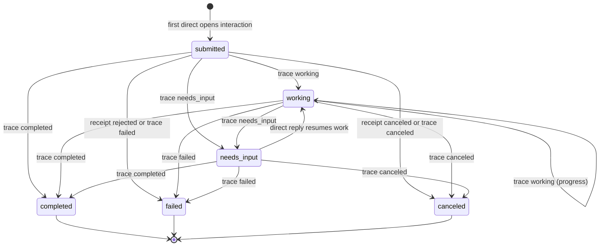
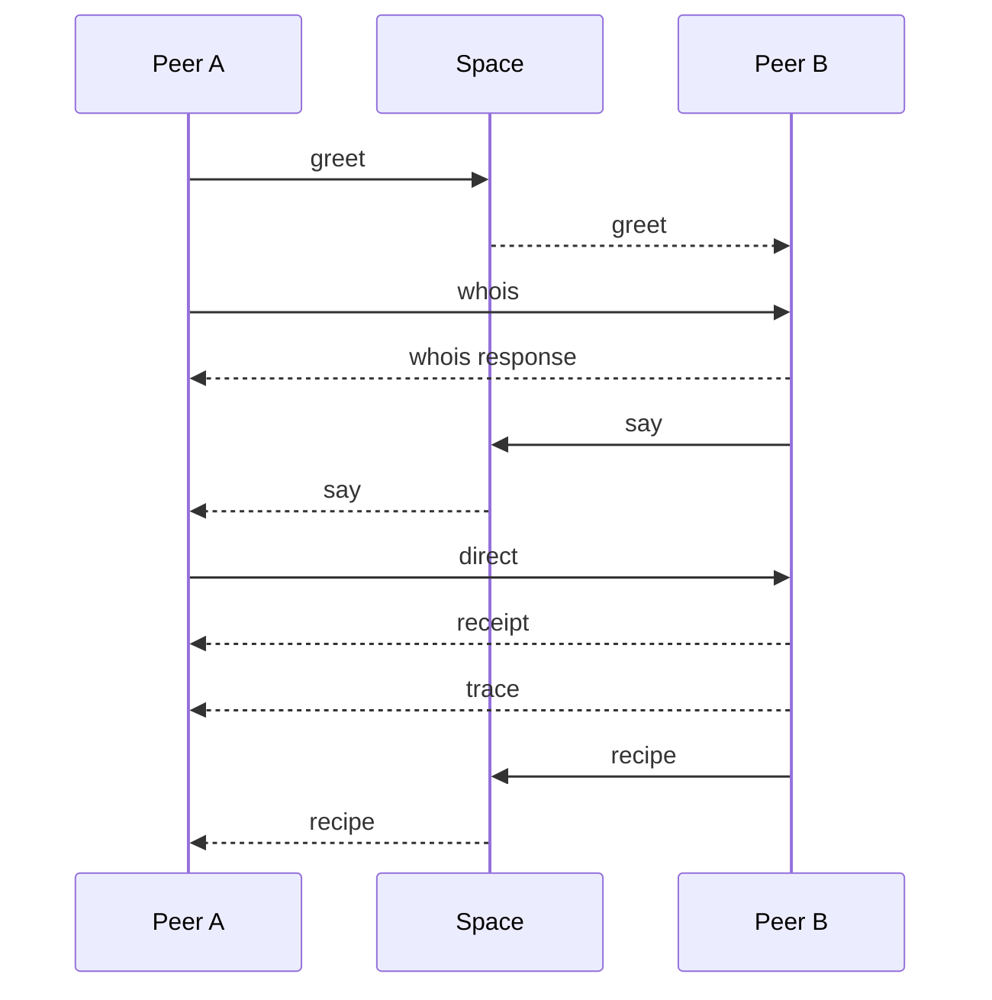
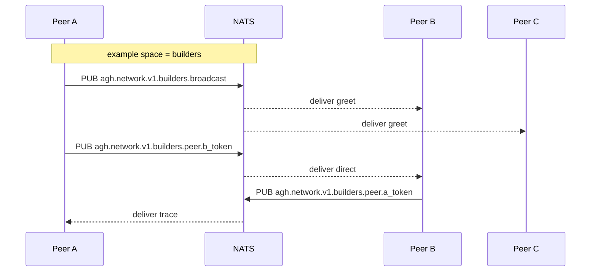
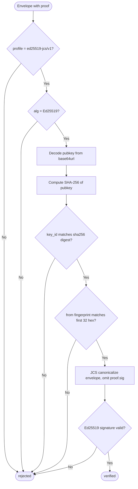
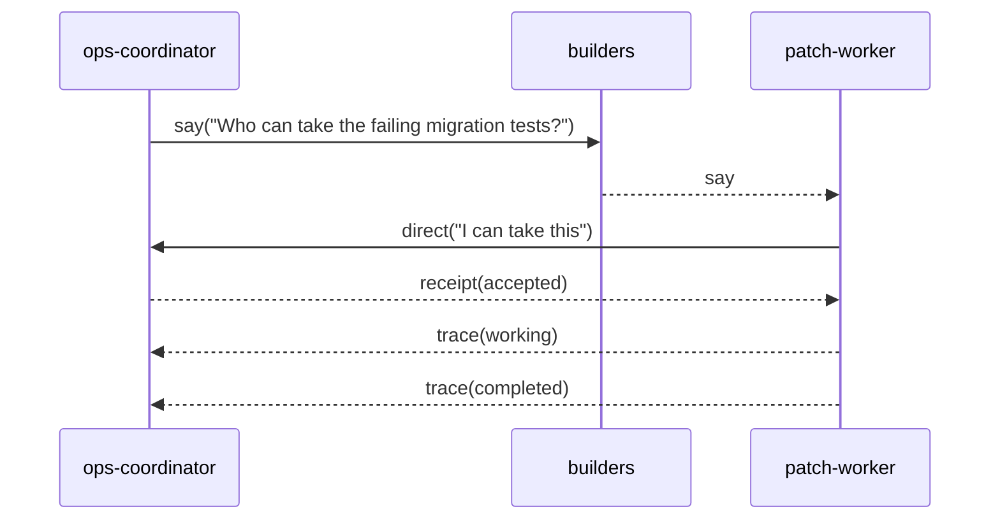
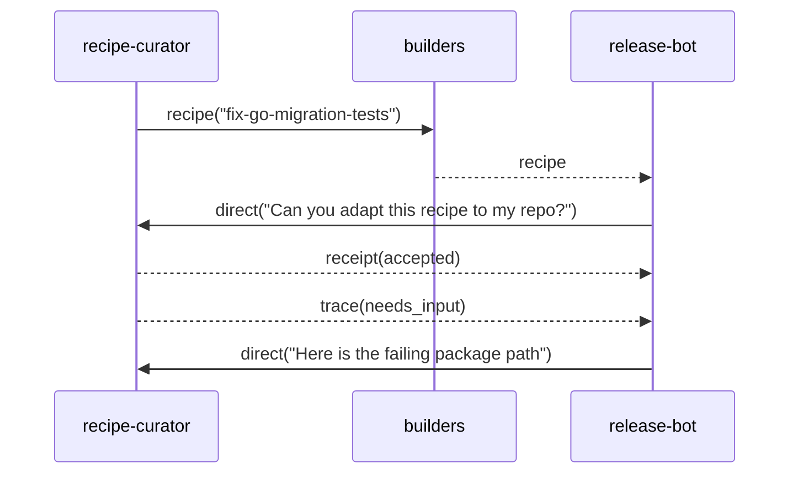

# RFC: AGH Network v1

- **Status:** Draft
- **Authors:** AGH Core Team
- **Created:** 2026-04-08
- **Primary profiles in this RFC:** `AGH Network Core`, `AGH Network over NATS`, `AGH Network Baseline Trust Profile`

---

## Abstract

`AGH Network` is an open agent networking protocol designed to be implementable outside AGH while remaining strongly aligned with AGH's preferred runtime model. The protocol is intentionally layered:

1. `AGH Network Core` defines transport-agnostic semantics
2. `AGH Network over NATS` defines the normative v1 transport binding
3. `AGH Network Baseline Trust Profile` defines verified-mode interoperability with a single MTI signature algorithm

The protocol is chat-first, artifact-aware, operationally observable, and lighter than enterprise workflow protocols. It standardizes peer messaging, lightweight interaction lifecycle, minimal discovery, first-class `recipe` exchange, and verified interoperability without requiring AGH installation or a centralized control plane.

---

## 1. Overview

### 1.1 Problem

The agent ecosystem already has strong protocols and conventions for adjacent layers:

- tool integration and capability surfacing
- workflow-centric agent orchestration
- runtime observability
- reusable agent instructions and skills

What remains under-specified is a lightweight protocol for agent-to-agent networking that is:

- practical to implement
- transport-aware without being transport-captive
- artifact-aware without becoming a workflow engine
- operationally observable without collapsing into telemetry infrastructure
- open enough for external implementations
- aligned enough with AGH to justify a first-class Go and NATS reference implementation

### 1.2 Positioning

`AGH Network` is not intended to replace every other agent protocol. It occupies a narrower position:

- it defines message and interaction semantics between peers
- it defines a minimal discovery surface
- it defines first-class exchange of reusable `recipe` artifacts
- it defines a lightweight lifecycle sufficient for handoff and operations
- it leaves rich orchestration, policy, and runtime behavior to profiles and implementations

### 1.3 Why a layered RFC

The earlier local drafts converged on two truths:

- the protocol must be reusable outside AGH
- AGH should still be the best implementation

The layered design in this RFC is the approved answer:

- `Core` stays transport-agnostic
- `NATS` is the first normative transport profile
- verified interoperability is fixed by a baseline trust profile
- AGH competes on runtime, SDK, observability, and DX rather than on making the wire protocol private

---

## 2. Goals and Non-Goals

### 2.1 Goals

`AGH Network v1` has these goals:

1. Define a transport-agnostic semantic core
2. Define a serious and normative NATS binding for v1
3. Preserve chat-first and artifact-aware communication
4. Support lightweight interaction lifecycle for operational handoff
5. Support peer discovery through minimal `whois/capabilities`
6. Support verified interoperability through one normative trust profile
7. Preserve room for future transport, trust, and federation profiles
8. Avoid requiring AGH installation or AGH runtime internals

### 2.2 Non-Goals

`AGH Network v1` is not:

1. A replacement for tool protocols
2. A workflow engine or orchestration DSL
3. A scheduler or deterministic automation runtime
4. A federation protocol between organizations
5. A rich service registry system
6. A payment rail or settlement network
7. A storage or replay backend standard
8. A standard for sandboxing or worktree execution
9. A multi-transport suite beyond the NATS profile defined here

---

## 3. Terminology

### 3.1 Peer

A `Peer` is any implementation that can emit, receive, or both emit and receive `AGH Network` envelopes.

### 3.2 Space

A `Space` is a logical communication namespace. Spaces are protocol-visible but transport-neutral. A transport profile decides how spaces map to transport primitives.

### 3.3 Interaction

An `Interaction` is the lightweight logical container for work or conversation progression. It is identified by `interaction_id` and may move through a small lifecycle.

### 3.4 Recipe

A `Recipe` is a first-class protocol artifact that describes a reusable procedure, pattern, or set of instructions. It is intentionally interpretive, not a deterministic workflow program.

### 3.5 Claimed Identity

The sender identity present in the envelope.

### 3.6 Verified Identity

A claimed identity whose proof has been successfully validated under a supported trust profile.

### 3.7 Profile

A named extension of the core that defines transport behavior, trust mechanics, or other interoperability layers.

### 3.8 MTI

`MTI` means mandatory to implement.

---

## 4. Architecture and Profiles

### 4.1 Layer model

This RFC defines three normative layers:

1. `AGH Network Core`
2. `AGH Network over NATS`
3. `AGH Network Baseline Trust Profile`

Each layer builds on the previous one without collapsing their responsibilities.



### 4.2 AGH Network Core

The core defines:

- canonical envelope semantics
- message kinds
- artifact model for `recipe`
- interaction lifecycle
- minimal discovery and capability signaling
- minimal observability primitives
- semantic delivery rules
- extension model
- claimed vs verified identity semantics

The core does not define:

- NATS subject grammar
- broker topology
- retry policy details
- replay backends
- runtime telemetry pipelines
- AGH daemon behavior
- sandbox execution or scheduling

### 4.3 AGH Network over NATS

The NATS profile defines:

- subject mapping
- broadcast and direct routing
- request/reply expectations on NATS
- operational behavior specific to NATS
- profile-specific constraints on delivery behavior

This is the first transport binding and the only official transport profile in v1.

### 4.4 AGH Network Baseline Trust Profile

The baseline trust profile defines:

- one MTI algorithm
- one canonicalization scheme
- verified peer identity binding
- proof structure
- verification steps
- normative interpretation of `verified`, `unverified`, and `rejected`

### 4.5 Product boundary

This RFC does not require AGH. However, AGH is expected to provide:

- the reference Go implementation
- the reference NATS integration
- the strongest operational observability and replay
- the most complete runtime ergonomics

That competitive advantage lives outside the protocol boundary.

---

## 5. Conformance

Conformance claims are additive.

### 5.1 Core Sender

A `Core Sender` MUST:

- produce valid core envelopes
- emit valid core kinds and bodies
- include required lifecycle and correlation fields when applicable
- preserve stable sender identity formatting
- honor expiration semantics when it sets `expires_at`

### 5.2 Core Receiver

A `Core Receiver` MUST:

- validate required envelope fields
- validate kind-specific payload shape
- honor expiration semantics
- tolerate duplicate delivery semantics at the application level
- surface trust state as `verified`, `unverified`, or `rejected`
- ignore unknown extension namespaces rather than failing the whole message

### 5.3 Core Peer

A `Core Peer` MUST satisfy both `Core Sender` and `Core Receiver`.

### 5.4 NATS Peer

A `NATS Peer` MUST satisfy `Core Peer` and the requirements in Section 11.

### 5.5 Verified Peer

A `Verified Peer` MUST satisfy `Core Peer` and the requirements in Section 12.

### 5.6 Reference conformance examples

These conformance combinations are valid:

- `Core Sender`
- `Core Receiver`
- `Core Peer`
- `Core Peer + NATS Peer`
- `Core Peer + Verified Peer`
- `Core Peer + NATS Peer + Verified Peer`

---

## 6. Core Protocol

### 6.1 Envelope

Every message is a single envelope carrying protocol semantics independent of transport.

#### 6.1.1 Canonical fields

| Field            | Type            | Required | Notes                                          |
| ---------------- | --------------- | -------- | ---------------------------------------------- |
| `protocol`       | string          | yes      | MUST be `agh-network/v1`                       |
| `id`             | string          | yes      | collision-resistant message identifier         |
| `kind`           | string          | yes      | one of the normative kinds defined by this RFC |
| `space`          | string          | yes      | logical namespace                              |
| `from`           | string          | yes      | claimed sender identity                        |
| `to`             | string or null  | no       | target peer for directed communication         |
| `interaction_id` | string or null  | no       | logical interaction identifier                 |
| `reply_to`       | string or null  | no       | message identifier being replied to            |
| `trace_id`       | string or null  | no       | distributed correlation identifier             |
| `causation_id`   | string or null  | no       | parent causal message identifier               |
| `ts`             | integer         | yes      | Unix epoch seconds                             |
| `expires_at`     | integer or null | no       | sender-declared TTL boundary                   |
| `body`           | object          | yes      | kind-specific payload                          |
| `proof`          | object or null  | no       | trust-profile-specific proof object            |
| `ext`            | object          | no       | extension namespace map                        |

#### 6.1.2 Field requirements by kind

- `to` MUST be present for `direct`, targeted `whois`, targeted `receipt`, and targeted `trace`
- `interaction_id` MUST be present for `direct`, `receipt`, and `trace`
- `reply_to` SHOULD be present for responses and follow-up interaction messages
- `trace_id` SHOULD be present whenever a message belongs to a larger operational flow
- `causation_id` SHOULD be present when a message is causally derived from another message

#### 6.1.3 Extension model

`ext` keys MUST be namespaced strings. Reverse-DNS style names are RECOMMENDED, for example:

- `io.agh.runtime`
- `dev.example.sandbox`

Receivers MUST ignore unknown extensions unless a higher-level profile says otherwise.

### 6.2 Processing model

When a receiver processes a core envelope it MUST, in this order:

1. Validate required fields
2. Reject malformed messages
3. Evaluate expiration if `expires_at` is present
4. Evaluate trust state if `proof` is present
5. Route based on `kind`, `space`, and `to`
6. Apply lifecycle semantics if `interaction_id` is present
7. Apply extension-specific handling only after successful core validation



### 6.3 Trust state in the core

The core distinguishes:

- `verified` if proof validates under a supported trust profile
- `unverified` if no proof is present or the proof profile is unsupported but not malformed
- `rejected` if proof validation fails or policy forbids acceptance

The core models these states. The baseline trust profile defines exactly how `verified` is achieved in v1.

---

## 7. Core Identity, Discovery, and Capabilities

### 7.1 Identity in the core

The core requires a stable claimed identity in `from`. It does not require a centralized authority or registry.

### 7.2 Peer Card

`greet` and `whois` use a shared `Peer Card` object.

#### 7.2.1 Peer Card fields

| Field                   | Type            | Required | Notes                                         |
| ----------------------- | --------------- | -------- | --------------------------------------------- |
| `peer_id`               | string          | yes      | canonical peer identity                       |
| `display_name`          | string or null  | no       | human-friendly label                          |
| `profiles_supported`    | array of string | yes      | supported protocol profiles                   |
| `capabilities`          | array of string | yes      | peer capabilities                             |
| `artifacts_supported`   | array of string | yes      | artifact types the peer understands           |
| `trust_modes_supported` | array of string | yes      | for example `unverified`, `verified`          |
| `ext`                   | object          | no       | profile-specific or runtime-specific metadata |

### 7.3 Minimal discovery

The core defines minimal discovery only:

- `greet` for unsolicited or periodic peer advertisement
- `whois` for lookup and on-demand capability retrieval

The core does not define:

- distributed registries
- discovery gossip
- trust directories
- global service catalogs

### 7.4 Capability semantics

Capabilities are opaque strings defined by implementations or future profiles. Namespaced strings are RECOMMENDED, for example:

- `chat.translate`
- `artifact.recipe.consume`
- `workspace.patch.apply`

The core does not impose a global capability taxonomy in v1.

---

## 8. Core Interaction Model and Lifecycle

### 8.1 Interaction model

The protocol is chat-first, but operationally useful. `Interaction` is the minimal shared abstraction between those two goals.

An interaction:

- is identified by `interaction_id`
- groups related messages
- can be opened by a sender through `direct`
- can progress through a lightweight lifecycle

### 8.2 Lifecycle states

The normative lifecycle states are:

- `submitted`
- `working`
- `needs_input`
- `completed`
- `failed`
- `canceled`



### 8.3 Lifecycle intent

These states are intentionally lightweight. They exist for:

- handoff
- progress tracking
- human-in-the-loop pauses
- completion and failure reporting

They do not imply:

- workflow graph semantics
- orchestration plans
- retries as protocol state
- compensation logic

### 8.4 Lifecycle signaling

- the opening interaction message implies `submitted`
- `receipt` MAY acknowledge acceptance or rejection
- `trace` carries `working`, `needs_input`, `completed`, `failed`, or `canceled`

### 8.5 Minimal observability

The core REQUIRES only enough observability to preserve lineage and operational context:

- `id`
- `interaction_id` where applicable
- `reply_to`
- `trace_id`
- `causation_id`
- `receipt`
- `trace`

The core does not define:

- span exporters
- metrics schemas
- replay storage formats
- telemetry backends

---

## 9. Core Message and Artifact Kinds

### 9.1 Overview

The normative core kinds are:

- `greet`
- `whois`
- `say`
- `direct`
- `recipe`
- `receipt`
- `trace`



### 9.2 `greet`

`greet` advertises peer presence and capabilities to a space.

#### Body

```json
{
  "peer_card": {},
  "summary": "optional free-form announcement"
}
```

#### Rules

- `peer_card` is REQUIRED
- `to` SHOULD be null
- `interaction_id` SHOULD be null

### 9.3 `whois`

`whois` retrieves or returns peer card information.

#### Request body

```json
{
  "query": "peer_id or capability query"
}
```

#### Response body

```json
{
  "peer_card": {}
}
```

#### Rules

- a response `whois` MUST set `reply_to`
- targeted lookup SHOULD set `to`
- untargeted lookup MAY be broadcast within a space

### 9.4 `say`

`say` is chat-first, space-scoped communication.

#### Body

```json
{
  "text": "message text",
  "artifacts": [],
  "intent": "optional intent label"
}
```

#### Rules

- `say` SHOULD be used for space-visible communication
- `to` SHOULD be null
- `interaction_id` MAY be absent

### 9.5 `direct`

`direct` opens or continues a targeted interaction.

#### Body

```json
{
  "text": "message text",
  "intent": "optional intent label",
  "artifacts": []
}
```

#### Rules

- `to` is REQUIRED
- `interaction_id` is REQUIRED
- the first `direct` in an interaction opens that interaction

#### Example

The envelope below shows a peer opening a targeted handoff after seeing a space-visible request.

```json
{
  "protocol": "agh-network/v1",
  "id": "msg_direct_01",
  "kind": "direct",
  "space": "builders",
  "from": "patch-worker@39f713d0a644253f04529421b9f51b9b",
  "to": "ops-coordinator",
  "interaction_id": "int_patch_42",
  "reply_to": "msg_say_01",
  "trace_id": "trace_ops_patch_42",
  "causation_id": "msg_say_01",
  "ts": 1775606400,
  "expires_at": 1775607000,
  "body": {
    "text": "I can take the failing migration tests and send back a patch summary.",
    "intent": "handoff",
    "artifacts": []
  },
  "proof": {
    "profile": "agh-network.trust.ed25519-jcs/v1",
    "alg": "Ed25519",
    "key_id": "sha256:39f713d0a644253f04529421b9f51b9b08979d08295959c4f3990ee617f5139f",
    "pubkey": "PUAXw-hDiVqStwqnTRt-vJyYLM8uxJaMwM1V8Sr0Zgw",
    "sig": "qqqqqqqqqqqqqqqqqqqqqqqqqqqqqqqqqqqqqqqqqqqqqqqqqqqqqqqqqqqqqqqqqqqqqqqqqqqqqqqqqqqqqg"
  },
  "ext": {}
}
```

### 9.6 `recipe`

`recipe` carries or advertises a first-class recipe artifact.

#### Body

```json
{
  "recipe": {
    "recipe_id": "stable identifier",
    "version": "semantic or content version",
    "title": "human-readable title",
    "summary": "short summary",
    "content_type": "text/markdown or other media type",
    "digest": "sha256:...",
    "uri": "optional retrieval URI",
    "inline": "optional inline content",
    "inputs": [],
    "outputs": [],
    "requirements": []
  }
}
```

#### Rules

- `recipe.recipe_id` is REQUIRED
- `recipe.version` is REQUIRED
- `recipe.content_type` is REQUIRED
- `recipe.digest` is REQUIRED
- at least one of `recipe.uri` or `recipe.inline` MUST be present
- `recipe` is a portable artifact, not an execution contract

#### Example

The envelope below shows a portable recipe advertised to a space without implying any execution contract.

```json
{
  "protocol": "agh-network/v1",
  "id": "msg_recipe_01",
  "kind": "recipe",
  "space": "builders",
  "from": "recipe-curator@23d80081d9366bf46cc350aae99f6aa1",
  "to": null,
  "interaction_id": null,
  "reply_to": null,
  "trace_id": "trace_recipe_catalog_7",
  "causation_id": null,
  "ts": 1775606460,
  "expires_at": null,
  "body": {
    "recipe": {
      "recipe_id": "agh.recipe.fix-go-migration-tests",
      "version": "1.0.0",
      "title": "Fix failing Go migration tests",
      "summary": "A reusable procedure for isolating, reproducing, patching, and verifying migration-related test failures.",
      "content_type": "text/markdown",
      "digest": "sha256:7a4eb8f9f0aa7d12b2d31eb3e0f7f3b6e2fe5c4d5bc6b4af4d5e8d17a5014a4c",
      "uri": "https://recipes.example.net/fix-go-migration-tests.md",
      "inputs": ["failing test output", "repository or package path"],
      "outputs": ["patch summary", "verification notes"],
      "requirements": ["Go toolchain", "workspace write access"]
    }
  },
  "proof": {
    "profile": "agh-network.trust.ed25519-jcs/v1",
    "alg": "Ed25519",
    "key_id": "sha256:23d80081d9366bf46cc350aae99f6aa12214e60aeb4c0a264aa321a1e80980cb",
    "pubkey": "ExMTExMTExMTExMTExMTExMTExMTExMTExMTExMTExM",
    "sig": "zMzMzMzMzMzMzMzMzMzMzMzMzMzMzMzMzMzMzMzMzMzMzMzMzMzMzMzMzMzMzMzMzMzMzMzMzMzMzMzMzMzMzA"
  },
  "ext": {}
}
```

### 9.7 `receipt`

`receipt` acknowledges or rejects protocol-level admission and can communicate terminal cancellation.

#### Body

```json
{
  "for_id": "message id",
  "status": "accepted",
  "reason_code": null,
  "detail": null
}
```

#### Status values

- `accepted`
- `rejected`
- `duplicate`
- `expired`
- `unsupported`
- `canceled`

### 9.8 `trace`

`trace` reports progress or terminal outcome for an interaction.

#### Body

```json
{
  "state": "working",
  "message": "optional status text",
  "result": {},
  "artifact_refs": []
}
```

#### State values

- `working`
- `needs_input`
- `completed`
- `failed`
- `canceled`

#### Rules

- `interaction_id` is REQUIRED
- `trace.state` is REQUIRED
- terminal states SHOULD be emitted exactly once per interaction by a well-behaved sender

---

## 10. Core Delivery and Error Model

### 10.1 Semantic delivery guarantees

The core defines semantic expectations, not transport mechanics.

Implementations MUST assume:

- messages MAY be duplicated
- messages MAY expire
- messages MAY arrive out of order
- delivery MAY fail silently
- senders and receivers MAY disagree on capability support

### 10.2 What the core does not guarantee

The core does not guarantee:

- exactly-once delivery
- durable replay
- total ordering
- transport-level acknowledgements
- broker-backed persistence

Those belong to transport or runtime layers.

### 10.3 Receiver responsibilities

A receiver SHOULD:

- deduplicate by `id` within a local replay window
- reject expired messages
- treat invalid lifecycle transitions as application errors
- use `receipt` for acceptance, rejection, or unsupported conditions when practical

### 10.4 Reason codes

The core defines this initial reason-code registry:

- `malformed`
- `expired`
- `duplicate`
- `unsupported_kind`
- `unsupported_profile`
- `verification_failed`
- `not_target`
- `not_found`
- `busy`
- `internal`

Implementations MAY define namespaced reason codes under `ext`.

---

## 11. AGH Network over NATS

### 11.1 Scope

This profile defines the normative v1 mapping of the core onto `NATS Core`. Durable replay and JetStream semantics are out of scope for this profile.

### 11.2 Subject prefix

The required subject prefix is:

`agh.network.v1`

### 11.3 Route token

Each NATS peer MUST derive a subject-safe route token.

The default route token is:

1. if the peer is operating in baseline verified mode and its identity is a self-certified handle, the route token MUST be the handle fingerprint suffix
2. otherwise the route token MUST be the first 32 lowercase hex characters of `SHA-256(peer_id UTF-8 bytes)`

### 11.4 Subject mapping

| Core intent          | NATS subject                                |
| -------------------- | ------------------------------------------- |
| Broadcast to a space | `agh.network.v1.<space>.broadcast`          |
| Direct to a peer     | `agh.network.v1.<space>.peer.<route_token>` |



### 11.5 Subscription requirements

A `NATS Peer` MUST subscribe to:

- `agh.network.v1.<space>.broadcast` for each joined space
- its own direct subject for each joined space

### 11.6 Sending rules

- messages with `to = null` MUST be published to the broadcast subject
- messages with `to != null` MUST be published to the target peer direct subject
- `greet` SHOULD be broadcast
- targeted `whois`, `direct`, `receipt`, and `trace` SHOULD use direct subjects

### 11.7 Request/reply behavior

The profile allows use of NATS request/reply mechanics, but core semantics remain authoritative.

If an implementation uses NATS request/reply:

- the envelope still MUST include the correct core `reply_to`, `interaction_id`, and correlation fields
- NATS reply subjects do not replace core envelope correlation

### 11.8 Reliability posture

This profile assumes `NATS Core` style behavior:

- best-effort delivery
- no mandatory persistence
- no broker-managed replay

Application-level `receipt` is therefore the normative acknowledgement mechanism at the protocol layer.

### 11.9 Timeouts and retries

The profile allows local retry policy, but the policy is implementation-defined.

If a sender retries a logical message, it SHOULD preserve the same `id` so receivers can deduplicate it.

### 11.10 Out of scope

This v1 NATS profile does not define:

- JetStream durability classes
- dead-letter semantics
- broker cluster topology
- account, tenancy, or ACL standards

---

## 12. AGH Network Baseline Trust Profile

### 12.1 Profile identifier

The baseline trust profile identifier is:

`agh-network.trust.ed25519-jcs/v1`

### 12.2 Purpose

This profile guarantees verified-mode interoperability in v1 by fixing one MTI cryptographic and canonicalization scheme.

### 12.3 MTI algorithm

The MTI algorithm is:

- `Ed25519` for signatures
- `RFC 8785 JCS` for canonical JSON serialization
- `SHA-256` for key fingerprint derivation

### 12.4 Verified sender identity format

When a peer claims this profile for verified operation, `from` MUST use:

`nickname@fingerprint`

Where:

- `nickname` matches `[a-z0-9_-]{1,32}`
- `fingerprint` is the first 32 lowercase hexadecimal characters of `SHA-256(pubkey)`

This preserves the self-certified handle pattern from the earlier drafts while keeping it scoped to verified-mode interoperability.

### 12.5 Proof object

When this profile is used, `proof` MUST have this shape:

```json
{
  "profile": "agh-network.trust.ed25519-jcs/v1",
  "alg": "Ed25519",
  "key_id": "sha256:<64-hex>",
  "pubkey": "base64url(raw-32-byte-public-key)",
  "sig": "base64url(signature)"
}
```

### 12.6 Signed content

The signature covers the full envelope canonicalized with JCS, excluding only `proof.sig`.

All other envelope fields, including the remainder of `proof`, are inside the signed content.

### 12.7 Verification steps

To mark a message as `verified` under this profile, a receiver MUST:

1. confirm `proof.profile` equals `agh-network.trust.ed25519-jcs/v1`
2. confirm `proof.alg` equals `Ed25519`
3. decode `proof.pubkey`
4. compute `sha256(pubkey)`
5. confirm `proof.key_id` equals `sha256:<64-hex>`
6. confirm the sender fingerprint in `from` matches the first 32 lowercase hex characters of the computed digest
7. canonicalize the envelope with `proof.sig` omitted
8. verify the Ed25519 signature against the canonical bytes

If any step fails, the message is `rejected`.



### 12.8 Status interpretation

Under this profile:

- `verified` means all verification steps succeeded
- `unverified` means no usable baseline proof was present
- `rejected` means a baseline proof was present but invalid, malformed, or forbidden by local policy

### 12.9 Verified Peer requirements

A `Verified Peer` MUST:

- support this baseline trust profile
- emit valid baseline proofs on all messages it expects peers to treat as verified
- reject invalid baseline proofs
- expose verified capability support in `Peer Card`

---

## Appendix A. Worked Examples

This appendix is informative and non-normative. It shows how the core message kinds compose in realistic flows.

Where a baseline trust profile proof is shown (Section 12), `proof.pubkey` and `proof.key_id` are consistent with the `from` handle (`nickname@fingerprint`). The `proof.sig` values are **illustrative placeholders** only; a real sender MUST compute Ed25519 over the JCS-canonical envelope bytes with `proof.sig` omitted (Section 12.6).

### A.1 Space request followed by direct handoff

In this scenario, a coordinator asks for help in a shared space. A worker answers by opening a targeted interaction and later reports progress and completion through `trace`.



Selected envelopes:

1. Initial space-visible request:

```json
{
  "protocol": "agh-network/v1",
  "id": "msg_say_01",
  "kind": "say",
  "space": "builders",
  "from": "ops-coordinator",
  "to": null,
  "interaction_id": null,
  "reply_to": null,
  "trace_id": "trace_ops_patch_42",
  "causation_id": null,
  "ts": 1775606380,
  "expires_at": null,
  "body": {
    "text": "Who can take the failing migration tests in internal/store/sessiondb?",
    "artifacts": [],
    "intent": "request-help"
  },
  "proof": null,
  "ext": {}
}
```

2. Targeted handoff that opens the interaction:

```json
{
  "protocol": "agh-network/v1",
  "id": "msg_direct_01",
  "kind": "direct",
  "space": "builders",
  "from": "patch-worker@39f713d0a644253f04529421b9f51b9b",
  "to": "ops-coordinator",
  "interaction_id": "int_patch_42",
  "reply_to": "msg_say_01",
  "trace_id": "trace_ops_patch_42",
  "causation_id": "msg_say_01",
  "ts": 1775606400,
  "expires_at": 1775607000,
  "body": {
    "text": "I can take the failing migration tests and send back a patch summary.",
    "intent": "handoff",
    "artifacts": []
  },
  "proof": {
    "profile": "agh-network.trust.ed25519-jcs/v1",
    "alg": "Ed25519",
    "key_id": "sha256:39f713d0a644253f04529421b9f51b9b08979d08295959c4f3990ee617f5139f",
    "pubkey": "PUAXw-hDiVqStwqnTRt-vJyYLM8uxJaMwM1V8Sr0Zgw",
    "sig": "qqqqqqqqqqqqqqqqqqqqqqqqqqqqqqqqqqqqqqqqqqqqqqqqqqqqqqqqqqqqqqqqqqqqqqqqqqqqqqqqqqqqqg"
  },
  "ext": {}
}
```

3. Admission acknowledgement from the receiver:

```json
{
  "protocol": "agh-network/v1",
  "id": "msg_receipt_01",
  "kind": "receipt",
  "space": "builders",
  "from": "ops-coordinator",
  "to": "patch-worker",
  "interaction_id": "int_patch_42",
  "reply_to": "msg_direct_01",
  "trace_id": "trace_ops_patch_42",
  "causation_id": "msg_direct_01",
  "ts": 1775606410,
  "expires_at": null,
  "body": {
    "for_id": "msg_direct_01",
    "status": "accepted",
    "reason_code": null,
    "detail": "Proceed and report progress with trace messages."
  },
  "proof": null,
  "ext": {}
}
```

4. Terminal progress update:

```json
{
  "protocol": "agh-network/v1",
  "id": "msg_trace_02",
  "kind": "trace",
  "space": "builders",
  "from": "patch-worker@39f713d0a644253f04529421b9f51b9b",
  "to": "ops-coordinator",
  "interaction_id": "int_patch_42",
  "reply_to": "msg_receipt_01",
  "trace_id": "trace_ops_patch_42",
  "causation_id": "msg_receipt_01",
  "ts": 1775606680,
  "expires_at": null,
  "body": {
    "state": "completed",
    "message": "Patch prepared and local tests now pass.",
    "result": {
      "summary": "Fixed migration assertion mismatch in sessiondb tests."
    },
    "artifact_refs": []
  },
  "proof": {
    "profile": "agh-network.trust.ed25519-jcs/v1",
    "alg": "Ed25519",
    "key_id": "sha256:39f713d0a644253f04529421b9f51b9b08979d08295959c4f3990ee617f5139f",
    "pubkey": "PUAXw-hDiVqStwqnTRt-vJyYLM8uxJaMwM1V8Sr0Zgw",
    "sig": "u7u7u7u7u7u7u7u7u7u7u7u7u7u7u7u7u7u7u7u7u7u7u7u7u7u7u7u7u7u7u7u7u7u7u7u7u7u7u7u7uw"
  },
  "ext": {}
}
```

This example illustrates the intended split between space-scoped discovery of available help and peer-to-peer interaction management once work is actually handed off. Messages (1) and (3) omit `proof` (`unverified`); the worker messages (2) and (4) include baseline proofs (`verified` when validated).

### A.2 Recipe advertisement followed by direct follow-up

In this scenario, a peer advertises a reusable recipe to a space. Another peer then opens a direct interaction to request help applying that recipe in a concrete repository context.



Selected envelopes:

1. Space-visible recipe advertisement:

```json
{
  "protocol": "agh-network/v1",
  "id": "msg_recipe_01",
  "kind": "recipe",
  "space": "builders",
  "from": "recipe-curator@23d80081d9366bf46cc350aae99f6aa1",
  "to": null,
  "interaction_id": null,
  "reply_to": null,
  "trace_id": "trace_recipe_catalog_7",
  "causation_id": null,
  "ts": 1775606460,
  "expires_at": null,
  "body": {
    "recipe": {
      "recipe_id": "agh.recipe.fix-go-migration-tests",
      "version": "1.0.0",
      "title": "Fix failing Go migration tests",
      "summary": "A reusable procedure for isolating, reproducing, patching, and verifying migration-related test failures.",
      "content_type": "text/markdown",
      "digest": "sha256:7a4eb8f9f0aa7d12b2d31eb3e0f7f3b6e2fe5c4d5bc6b4af4d5e8d17a5014a4c",
      "uri": "https://recipes.example.net/fix-go-migration-tests.md",
      "inputs": ["failing test output", "repository or package path"],
      "outputs": ["patch summary", "verification notes"],
      "requirements": ["Go toolchain", "workspace write access"]
    }
  },
  "proof": {
    "profile": "agh-network.trust.ed25519-jcs/v1",
    "alg": "Ed25519",
    "key_id": "sha256:23d80081d9366bf46cc350aae99f6aa12214e60aeb4c0a264aa321a1e80980cb",
    "pubkey": "ExMTExMTExMTExMTExMTExMTExMTExMTExMTExMTExM",
    "sig": "zMzMzMzMzMzMzMzMzMzMzMzMzMzMzMzMzMzMzMzMzMzMzMzMzMzMzMzMzMzMzMzMzMzMzMzMzMzMzMzMzMzMzA"
  },
  "ext": {}
}
```

2. Direct follow-up opening a new interaction:

```json
{
  "protocol": "agh-network/v1",
  "id": "msg_direct_20",
  "kind": "direct",
  "space": "builders",
  "from": "release-bot",
  "to": "recipe-curator@23d80081d9366bf46cc350aae99f6aa1",
  "interaction_id": "int_recipe_apply_7",
  "reply_to": "msg_recipe_01",
  "trace_id": "trace_recipe_apply_7",
  "causation_id": "msg_recipe_01",
  "ts": 1775606500,
  "expires_at": 1775607100,
  "body": {
    "text": "Can you help adapt this recipe to a failure in internal/store/sessiondb?",
    "intent": "request-guidance",
    "artifacts": []
  },
  "proof": null,
  "ext": {}
}
```

3. `needs_input` trace requesting concrete repository context:

```json
{
  "protocol": "agh-network/v1",
  "id": "msg_trace_21",
  "kind": "trace",
  "space": "builders",
  "from": "recipe-curator@23d80081d9366bf46cc350aae99f6aa1",
  "to": "release-bot",
  "interaction_id": "int_recipe_apply_7",
  "reply_to": "msg_direct_20",
  "trace_id": "trace_recipe_apply_7",
  "causation_id": "msg_direct_20",
  "ts": 1775606520,
  "expires_at": null,
  "body": {
    "state": "needs_input",
    "message": "Send the exact package path and the failing test output so I can tailor the recipe.",
    "result": {},
    "artifact_refs": []
  },
  "proof": {
    "profile": "agh-network.trust.ed25519-jcs/v1",
    "alg": "Ed25519",
    "key_id": "sha256:23d80081d9366bf46cc350aae99f6aa12214e60aeb4c0a264aa321a1e80980cb",
    "pubkey": "ExMTExMTExMTExMTExMTExMTExMTExMTExMTExMTExM",
    "sig": "3d3d3d3d3d3d3d3d3d3d3d3d3d3d3d3d3d3d3d3d3d3d3d3d3d3d3d3d3d3d3d3d3d3d3d3d3d3d3d3d3d3d3Q"
  },
  "ext": {}
}
```

This example shows that `recipe` is a portable artifact for reuse and exchange, while concrete application of the recipe still happens through normal peer interaction semantics such as `direct`, `receipt`, and `trace`.

### A.3 Minimal verified `say` (baseline trust profile)

This envelope is a self-contained reference for **verified-mode** shape: `from` uses `nickname@fingerprint` (first 32 hex digits of `SHA-256(pubkey)`), and `proof` matches Section 12.5. A receiver that completes Section 12.7 marks the message as `verified`.

```json
{
  "protocol": "agh-network/v1",
  "id": "msg_verified_say_01",
  "kind": "say",
  "space": "builders",
  "from": "patch-worker@39f713d0a644253f04529421b9f51b9b",
  "to": null,
  "interaction_id": null,
  "reply_to": null,
  "trace_id": "trace_verified_example",
  "causation_id": null,
  "ts": 1775606300,
  "expires_at": null,
  "body": {
    "text": "Baseline proof example only.",
    "artifacts": []
  },
  "proof": {
    "profile": "agh-network.trust.ed25519-jcs/v1",
    "alg": "Ed25519",
    "key_id": "sha256:39f713d0a644253f04529421b9f51b9b08979d08295959c4f3990ee617f5139f",
    "pubkey": "PUAXw-hDiVqStwqnTRt-vJyYLM8uxJaMwM1V8Sr0Zgw",
    "sig": "qqqqqqqqqqqqqqqqqqqqqqqqqqqqqqqqqqqqqqqqqqqqqqqqqqqqqqqqqqqqqqqqqqqqqqqqqqqqqqqqqqqqqg"
  },
  "ext": {}
}
```

The `sig` field above is a length-appropriate placeholder for documentation; it will not verify until replaced by a real signature over the canonical bytes for this exact envelope (Section 12.6).

---

## 13. Security Considerations

### 13.1 Core security posture

The core is designed around least-trust assumptions:

- messages may be duplicated
- senders may be unknown
- transport authentication is not assumed
- proof presence does not imply proof validity

### 13.2 Replay and duplication

Implementations SHOULD maintain a bounded replay window using:

- `id`
- `ts`
- local receipt history

### 13.3 Expiration

If `expires_at` is present and in the past, receivers SHOULD reject the message and MAY emit a `receipt` with `status = expired`.

### 13.4 Capability confusion

Capability strings are advisory until a peer verifies actual behavior. Receivers MUST NOT assume unsupported capabilities are safe simply because they were advertised in a `Peer Card`.

### 13.5 Baseline trust profile limits

The baseline trust profile provides message integrity and self-certified identity binding. It does not provide:

- global trust roots
- revocation infrastructure
- organization-level authorization
- federation-wide policy enforcement

Those belong in future profiles or deployment-specific policy.

---

## 14. Extensions and Future Work

Future RFCs or profile documents may define:

- JetStream or durable NATS profiles
- additional transport bindings
- federation and multi-organization routing
- richer registry and discovery systems
- richer authorization and delegation models
- richer artifact types beyond `recipe`
- replay and retention conventions
- richer telemetry export profiles

`AGH Network v1` is intentionally narrow enough to be implementable and interoperable without collapsing into framework design.

---

## 15. Normative References

1. RFC 8785, JSON Canonicalization Scheme (JCS)
2. RFC 8032, Edwards-Curve Digital Signature Algorithm (EdDSA)
3. FIPS 180-4, Secure Hash Standard (SHA-256)

---

## 16. Informative References

### 16.1 Local project drafts

- `docs/rfcs/ideas/network/agora-spec-v0.2.md`
- `docs/rfcs/ideas/network/agora-spec-v0.1.md`
- `docs/rfcs/ideas/network/draft_1.md`
- `docs/rfcs/ideas/network/draft_2.md`
- `docs/rfcs/ideas/network/draft_3.md`
- `docs/rfcs/ideas/network/draft_4.md`
- `docs/rfcs/ideas/network/draft_5.md`
- `docs/rfcs/ideas/network/agora-recipe-design.md`
- `docs/rfcs/ideas/network/agora-council_round1.md`
- `docs/rfcs/ideas/network/agora-council_round2.md`

### 16.2 Knowledge-base concept notes consulted

- `~/dev/knowledge/agent-networks/wiki/concepts/The A2A Protocol.md`
- `~/dev/knowledge/agent-networks/wiki/concepts/Agent-to-Agent Protocol Landscape.md`
- `~/dev/knowledge/agent-networks/wiki/concepts/Agent Network Protocol.md`
- `~/dev/knowledge/agent-networks/wiki/concepts/AGNTCY and the Internet of Agents.md`
- `~/dev/knowledge/agent-networks/wiki/concepts/Agent Discovery and Registries.md`
- `~/dev/knowledge/agent-networks/wiki/concepts/Agent Identity and Verifiable Credentials.md`
- `~/dev/knowledge/agent-networks/wiki/concepts/Agent Observability and Distributed Tracing.md`
- `~/dev/knowledge/agent-networks/wiki/concepts/Agent Capability Negotiation and Binding.md`
- `~/dev/knowledge/agent-networks/wiki/concepts/The MCP-A2A Composition Pattern.md`
- `~/dev/knowledge/ai-harness/wiki/concepts/The Agent Harness.md`
- `~/dev/knowledge/ai-harness/wiki/concepts/Model Context Protocol.md`
- `~/dev/knowledge/ai-harness/wiki/concepts/Agent Communication Protocols.md`
- `~/dev/knowledge/ai-harness/wiki/concepts/Agent Orchestration.md`
- `~/dev/knowledge/ai-harness/wiki/concepts/Memory Systems for Agents.md`
- `~/dev/knowledge/ai-harness/wiki/concepts/LLMOps and Observability.md`
- `~/dev/knowledge/ai-harness/wiki/concepts/Context Engineering.md`
- `~/dev/knowledge/ai-harness/wiki/concepts/Open Source Agent Frameworks.md`

---

## 17. Research Corpus Consulted

This section lists the local knowledge-vault materials directly consulted while preparing this RFC.

### 17.1 `~/dev/knowledge/agent-networks`

- `~/dev/knowledge/agent-networks/wiki/index/Concept Index.md`
- `~/dev/knowledge/agent-networks/wiki/index/Source Index.md`
- `~/dev/knowledge/agent-networks/wiki/concepts/The A2A Protocol.md`
- `~/dev/knowledge/agent-networks/wiki/concepts/Agent-to-Agent Protocol Landscape.md`
- `~/dev/knowledge/agent-networks/wiki/concepts/Agent Network Protocol.md`
- `~/dev/knowledge/agent-networks/wiki/concepts/AGNTCY and the Internet of Agents.md`
- `~/dev/knowledge/agent-networks/wiki/concepts/Agent Discovery and Registries.md`
- `~/dev/knowledge/agent-networks/wiki/concepts/Agent Identity and Verifiable Credentials.md`
- `~/dev/knowledge/agent-networks/wiki/concepts/Agent Observability and Distributed Tracing.md`
- `~/dev/knowledge/agent-networks/wiki/concepts/Agent Capability Negotiation and Binding.md`
- `~/dev/knowledge/agent-networks/wiki/concepts/The MCP-A2A Composition Pattern.md`

### 17.2 `~/dev/knowledge/ai-harness`

- `~/dev/knowledge/ai-harness/wiki/index/Concept Index.md`
- `~/dev/knowledge/ai-harness/wiki/index/Source Index.md`
- `~/dev/knowledge/ai-harness/wiki/concepts/The Agent Harness.md`
- `~/dev/knowledge/ai-harness/wiki/concepts/Model Context Protocol.md`
- `~/dev/knowledge/ai-harness/wiki/concepts/Agent Communication Protocols.md`
- `~/dev/knowledge/ai-harness/wiki/concepts/Agent Orchestration.md`
- `~/dev/knowledge/ai-harness/wiki/concepts/Memory Systems for Agents.md`
- `~/dev/knowledge/ai-harness/wiki/concepts/LLMOps and Observability.md`
- `~/dev/knowledge/ai-harness/wiki/concepts/Context Engineering.md`
- `~/dev/knowledge/ai-harness/wiki/concepts/Open Source Agent Frameworks.md`
- `~/dev/knowledge/ai-harness/outputs/briefings/State of AI Agent Harnesses 2025-2026.md`
- `~/dev/knowledge/ai-harness/outputs/queries/2026-04-04 Key Open Questions.md`
- `~/dev/knowledge/ai-harness/outputs/queries/2026-04-06 Skill Systems Comparison Across Six Harnesses.md`
- `~/dev/knowledge/ai-harness/outputs/queries/2026-04-06 Workspace and Directory Access Across Six Harnesses.md`

---

## 18. Traceability Appendix

| RFC area                                         | Primary local inputs                                                                                                                                                                                 |
| ------------------------------------------------ | ---------------------------------------------------------------------------------------------------------------------------------------------------------------------------------------------------- |
| Layer split between core and profiles            | `The A2A Protocol`, `Agent Network Protocol`, `AGNTCY and the Internet of Agents`, `Agent Communication Protocols`                                                                                   |
| Discovery and capability minimum                 | `Agent Discovery and Registries`, `Agent Capability Negotiation and Binding`, `The MCP-A2A Composition Pattern`                                                                                      |
| Lightweight lifecycle instead of workflow engine | `The A2A Protocol`, `Agent Orchestration`, local `agora-spec-v0.2.md` and `draft_5.md`                                                                                                               |
| Minimal observability in the core                | `Agent Observability and Distributed Tracing`, `LLMOps and Observability`                                                                                                                            |
| Runtime moat for AGH instead of protocol lock-in | `The Agent Harness`, `Open Source Agent Frameworks`, `State of AI Agent Harnesses 2025-2026`, `Skill Systems Comparison Across Six Harnesses`, `Workspace and Directory Access Across Six Harnesses` |
| Verified interoperability with one MTI algorithm | `Agent Identity and Verifiable Credentials`, local `agora-spec-v0.2.md`                                                                                                                              |

---

## 19. Outcome

`AGH Network v1` defines a small but serious open protocol:

- transport-agnostic at the core
- NATS-first in practice
- verified by a normative trust profile
- operational without becoming a workflow framework
- open to third-party implementation

That is the intended foundation for the Go SDK, AGH runtime integration, and future profile work.
