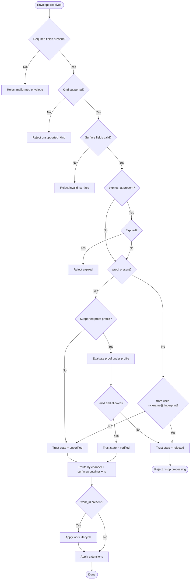
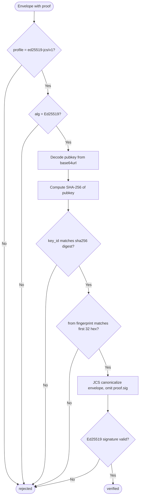

# RFC: AGH Network v1

- **Status:** Future draft profile
- **Authors:** AGH Core Team
- **Created:** 2026-04-08
- **Updated:** 2026-05-13
- **Depends on:** `003_agh-network-v0`
- **Primary addition:** `AGH Network Baseline Trust Profile`
- **Runtime base:** [RFC 003: AGH Network v0](003_agh-network-v0.md) is the current workspace-qualified runtime contract.

---

> This RFC is future auth/proofs/trust-profile work. It does not describe a shipped AGH Runtime
> protocol version today. Current runtime and transport identity are defined by
> [RFC 003](003_agh-network-v0.md): every envelope and NATS subject is scoped by a stable
> `workspace_id` under `agh-network/v0`.

## Abstract

`AGH Network v1` is the planned profile that extends v0 with cryptographic identity verification,
formal conformance levels, extension-key processing, and NATS request/reply guidance. The core
conversation model remains the v0 model:

- `workspace_id` is the isolation boundary.
- `channel` is the audience and discovery scope inside one workspace.
- `surface:"thread"` with `thread_id` identifies a public thread.
- `surface:"direct"` with `direct_id` identifies a two-party direct room.
- `work_id` identifies lifecycle-bearing work inside one conversation container.

This RFC defines:

1. `AGH Network Baseline Trust Profile`: Ed25519 signatures with JCS canonicalization.
2. Trust state processing: `verified`, `unverified`, and `rejected`.
3. Verified sender identity format: self-certified `nickname@fingerprint` handles.
4. Proof-stripping defense: verified-format identity without proof is `rejected`.
5. Formal conformance levels for third-party interoperability.
6. Extension-key processing.
7. NATS request/reply correlation and verified-peer route tokens.

Everything defined in current v0 remains normative unless this future profile explicitly tightens it.

---

## 1. Scope

This RFC does not redefine v0 semantics. It adds:

- Section 2: Conformance levels.
- Section 3: Trust state processing.
- Section 4: Baseline Trust Profile.
- Section 5: Extension model processing.
- Section 6: NATS additions.
- Section 7: Security hardening.

For envelope format, message kinds, work lifecycle, conversation surfaces, NATS transport, discovery, and delivery
model, see `003_agh-network-v0`.

---

## 2. Conformance

Conformance claims are additive.

### 2.1 Core Sender

A `Core Sender` MUST:

- produce valid core envelopes
- emit valid core kinds and bodies
- include `surface`, `thread_id`, `direct_id`, `work_id`, and correlation fields when required by v0
- preserve stable sender identity formatting
- honor expiration semantics when it sets `expires_at`

### 2.2 Core Receiver

A `Core Receiver` MUST:

- validate required envelope fields
- validate surface/container symmetry
- validate kind-specific payload shape
- reject unsupported message kinds
- honor expiration semantics
- tolerate duplicate delivery semantics at the application level
- surface trust state as `verified`, `unverified`, or `rejected`
- ignore unknown extension keys rather than failing the whole message

### 2.3 Core Peer

A `Core Peer` MUST satisfy both `Core Sender` and `Core Receiver`.

### 2.4 NATS Peer

A `NATS Peer` MUST satisfy `Core Peer` plus the NATS requirements in v0 Section 10 and this RFC Section 6.

### 2.5 Verified Peer

A `Verified Peer` MUST satisfy `Core Peer` plus the requirements in this RFC Section 4.

### 2.6 Reference conformance examples

These conformance combinations are valid:

- `Core Sender`
- `Core Receiver`
- `Core Peer`
- `Core Peer + NATS Peer`
- `Core Peer + Verified Peer`
- `Core Peer + NATS Peer + Verified Peer`

---

## 3. Trust State Processing

v1 extends the v0 processing model by inserting trust evaluation between expiration check and routing.

### 3.1 Extended processing model

When a receiver processes a core envelope it MUST, in this order:

1. Validate required fields.
2. Reject malformed messages.
3. Reject unsupported message kinds.
4. Validate surface/container symmetry and reject legacy or unknown conversation fields.
5. Evaluate expiration if `expires_at` is present.
6. Evaluate trust state: check `proof` if present, or check `from` format if `proof` is absent.
7. Route discovery messages by `kind`, `workspace_id`, `channel`, and `to`.
8. Route conversation messages by `workspace_id`, `channel`, `surface`, matching container ID, and `to`.
9. Apply work lifecycle semantics if `work_id` is present.
10. Apply extension-specific handling only after successful core validation and trust classification.



### 3.2 Trust states

The core distinguishes:

- `verified` if proof validates under a supported trust profile.
- `unverified` if no proof is present or the proof profile is unsupported but not malformed.
- `rejected` if proof validation fails, proof shape is malformed, verified-format identity lacks proof, or local
  policy forbids acceptance.

### 3.3 Proof-stripping defense

If `from` uses the verified identity format (`nickname@fingerprint`) but `proof` is absent or null, the message
MUST be classified as `rejected`, not `unverified`. A claimed verified-format identity without proof is treated
as failed verification, preventing proof-stripping attacks where an attacker removes `proof` from a signed
message to downgrade it.

---

## 4. AGH Network Baseline Trust Profile

### 4.1 Profile identifier

The baseline trust profile identifier is:

`agh-network.trust.ed25519-jcs/v1`

### 4.2 Purpose

This profile guarantees verified-mode interoperability in v1 by fixing one MTI cryptographic and
canonicalization scheme.

### 4.3 MTI algorithm

The MTI algorithm is:

- `Ed25519` for signatures.
- `RFC 8785 JCS` for canonical JSON serialization.
- `SHA-256` for key fingerprint derivation.

### 4.4 Verified sender identity format

When a peer claims this profile for verified operation, `from` MUST use:

`nickname@fingerprint`

Where:

- `nickname` matches `[a-z0-9_-]{1,32}`.
- `fingerprint` is the first 32 lowercase hexadecimal characters of `SHA-256(pubkey)`.

This preserves the self-certified handle pattern while keeping it scoped to verified-mode interoperability.

### 4.5 Proof object

When this profile is used, `proof` MUST have this shape:

```json
{
  "profile": "agh-network.trust.ed25519-jcs/v1",
  "alg": "Ed25519",
  "key_id": "sha256:<64-hex>",
  "pubkey": "base64url(raw-32-byte-public-key)",
  "sig": "base64url(signature)"
}
```

### 4.6 Signed content

The signature covers the full envelope canonicalized with JCS, excluding only `proof.sig`.

All other envelope fields, including the remainder of `proof`, are inside the signed content. The conversation
fields are signed exactly as they appear:

- `protocol`
- `id`
- `kind`
- `channel`
- `surface` when present
- `thread_id` when present
- `direct_id` when present
- `from`
- `to`
- `work_id` when present
- `reply_to`
- `trace_id`
- `causation_id`
- `ts`
- `expires_at`
- canonical `body`
- canonical `ext`
- `proof.profile`
- `proof.alg`
- `proof.key_id`
- `proof.pubkey`

Field absence is signed by omission. A receiver MUST NOT inject defaults before canonicalizing for verification.
For example, an absent `surface` is not equivalent to `"surface": null`, and an absent `work_id` is not
equivalent to `"work_id": ""`.

### 4.7 Verification steps

To mark a message as `verified` under this profile, a receiver MUST:

1. confirm `proof.profile` equals `agh-network.trust.ed25519-jcs/v1`
2. confirm `proof.alg` equals `Ed25519`
3. decode `proof.pubkey`
4. compute `sha256(pubkey)`
5. confirm `proof.key_id` equals `sha256:<64-hex>`
6. confirm the sender fingerprint in `from` matches the first 32 lowercase hex characters of the computed digest
7. canonicalize the envelope with `proof.sig` omitted and with no default-field injection
8. verify the Ed25519 signature against the canonical bytes

If any step fails, the message is `rejected`.



### 4.8 Status interpretation

Under this profile:

- `verified` means all verification steps succeeded.
- `unverified` means no usable baseline proof was present.
- `rejected` means a baseline proof was present but invalid, malformed, or forbidden by local policy.

### 4.9 Verified Peer requirements

A `Verified Peer` MUST:

- support this baseline trust profile
- emit valid baseline proofs on all messages it expects peers to treat as verified
- reject invalid baseline proofs
- expose verified capability support in Peer Card

---

## 5. Extension Model Processing

In v0, the `ext` field is active with RECOMMENDED conventions: peers MAY read and act on known keys, MUST
ignore unknown keys, and the `agh.` prefix is RECOMMENDED but not enforced. In v1, extension processing is
normative and namespaced keys become a MUST requirement.

### 5.1 Extension keys

`ext` keys MUST be namespaced strings. Reverse-DNS style names are RECOMMENDED, for example:

- `io.agh.runtime`
- `dev.example.sandbox`

### 5.2 Receiver behavior

Receivers MUST ignore unknown extensions unless a higher-level profile says otherwise. Extension-specific
handling MUST only be applied after successful core validation and trust classification.

---

## 6. NATS Additions

These additions extend the v0 NATS profile.

### 6.1 Fingerprint-based route token

When a peer is operating in baseline verified mode and its identity is a self-certified handle
(`nickname@fingerprint`), the route token MUST be the handle fingerprint suffix instead of the SHA-256 derivation.

This means a verified peer's peer-targeted subject is:

`agh.network.v1.<workspace_id>.<channel>.peer.<fingerprint>`

Where `<fingerprint>` is the first 32 hex characters from the `from` field.

This is NATS transport routing only. It does not change the core envelope's `surface` value or direct-room
membership rules.

### 6.2 Subject prefix

The v1 subject prefix is:

`agh.network.v1`

This differs from v0's `agh.network.v0`, but keeps the same workspace-qualified hierarchy. Peers
that support both versions MUST subscribe to the appropriate workspace-qualified prefixes.

### 6.3 Request/reply behavior

The profile allows use of NATS request/reply mechanics, but core semantics remain authoritative.

If an implementation uses NATS request/reply:

- the envelope still MUST include the correct core `reply_to`, `work_id`, and correlation fields when applicable
- conversation-bearing envelopes still MUST include `surface` and the matching `thread_id` or `direct_id`
- NATS reply subjects do not replace core envelope correlation
- NATS reply subjects do not create direct rooms or public threads

---

## 7. Security Hardening

These considerations extend v0 Section 11.

### 7.1 Baseline trust profile limits

The baseline trust profile provides message integrity and self-certified identity binding. It does not provide:

- global trust roots
- revocation infrastructure
- organization-level authorization
- federation-wide policy enforcement
- encryption for public threads or direct rooms

Those belong in future profiles or deployment-specific policy.

### 7.2 Proof presence does not imply validity

Transport authentication is not assumed. Proof presence does not imply proof validity. Receivers MUST always
execute the full verification steps before marking a message as `verified`.

### 7.3 Signed visibility is not privacy

Signing `surface`, `thread_id`, `direct_id`, and `work_id` prevents tampering with conversation identity and
work lineage. It does not encrypt the envelope. A direct room remains a restricted two-party runtime surface, not
a cryptographic privacy feature.

---

## 8. Worked Examples

These examples are informative. The `sig` values are length-appropriate placeholders for documentation; they
will not verify until replaced by real signatures over the canonical bytes for the exact envelopes.

### 8.1 Verified public-thread `say`

```json
{
  "protocol": "agh-network/v1",
  "id": "msg_verified_thread_say_01",
  "workspace_id": "ws_alpha",
  "kind": "say",
  "channel": "builders",
  "surface": "thread",
  "thread_id": "thread_trust_profile",
  "from": "patch-worker@39f713d0a644253f04529421b9f51b9b",
  "to": null,
  "reply_to": null,
  "trace_id": "trace_verified_thread_example",
  "causation_id": null,
  "ts": 1775606300,
  "expires_at": null,
  "body": {
    "text": "Baseline proof example for a public thread.",
    "artifacts": []
  },
  "proof": {
    "profile": "agh-network.trust.ed25519-jcs/v1",
    "alg": "Ed25519",
    "key_id": "sha256:39f713d0a644253f04529421b9f51b9b08979d08295959c4f3990ee617f5139f",
    "pubkey": "PUAXw-hDiVqStwqnTRt-vJyYLM8uxJaMwM1V8Sr0Zgw",
    "sig": "qqqqqqqqqqqqqqqqqqqqqqqqqqqqqqqqqqqqqqqqqqqqqqqqqqqqqqqqqqqqqqqqqqqqqqqqqqqqqqqqqqqqqg"
  },
  "ext": {}
}
```

### 8.2 Verified direct-room `trace`

```json
{
  "protocol": "agh-network/v1",
  "id": "msg_verified_direct_trace_01",
  "workspace_id": "ws_alpha",
  "kind": "trace",
  "channel": "builders",
  "surface": "direct",
  "direct_id": "direct_b41c2e6a31f3d9849f75d96cb46c1d5a",
  "from": "patch-worker@39f713d0a644253f04529421b9f51b9b",
  "to": "ops-coordinator",
  "work_id": "work_patch_42",
  "reply_to": "msg_direct_request_01",
  "trace_id": "trace_ops_patch_42",
  "causation_id": "msg_direct_request_01",
  "ts": 1775606680,
  "expires_at": null,
  "body": {
    "state": "working",
    "message": "Inspecting migration failure paths.",
    "result": {},
    "artifact_refs": []
  },
  "proof": {
    "profile": "agh-network.trust.ed25519-jcs/v1",
    "alg": "Ed25519",
    "key_id": "sha256:39f713d0a644253f04529421b9f51b9b08979d08295959c4f3990ee617f5139f",
    "pubkey": "PUAXw-hDiVqStwqnTRt-vJyYLM8uxJaMwM1V8Sr0Zgw",
    "sig": "qqqqqqqqqqqqqqqqqqqqqqqqqqqqqqqqqqqqqqqqqqqqqqqqqqqqqqqqqqqqqqqqqqqqqqqqqqqqqqqqqqqqqg"
  },
  "ext": {}
}
```

The second example signs `surface`, `direct_id`, and `work_id` because all three fields are present. A verifier
that canonicalizes after adding, removing, or rewriting any of those fields MUST reject the signature.

---

## 9. Normative References

1. RFC 8785, JSON Canonicalization Scheme (JCS)
2. RFC 8032, Edwards-Curve Digital Signature Algorithm (EdDSA)
3. FIPS 180-4, Secure Hash Standard (SHA-256)
4. `003_agh-network-v0` (this project)

---

## 10. Outcome

`AGH Network v1` adds trust and formal interoperability to the v0 foundation:

- verified identity through Ed25519 + JCS baseline trust profile
- proof-stripping defense
- formal conformance levels for third-party implementations
- extension-key processing
- NATS fingerprint-based routing for verified peers

The v0 conversation and work semantics remain normative.
