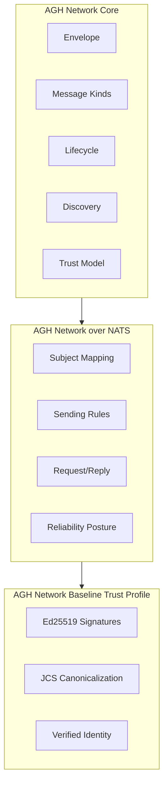
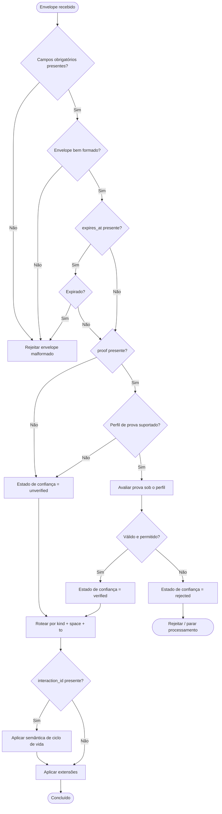
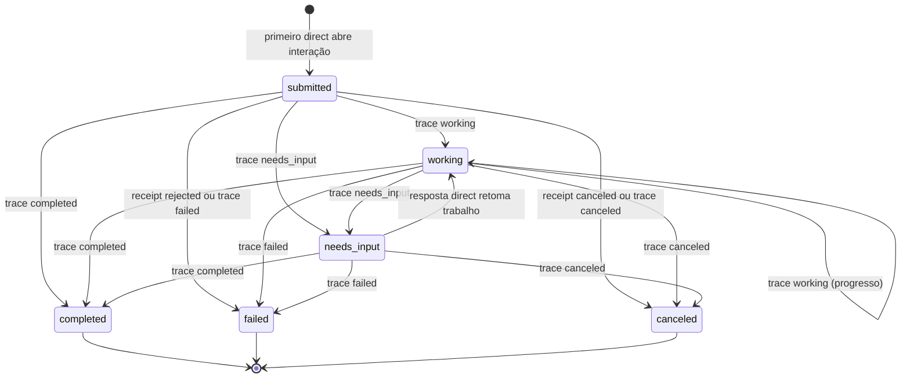
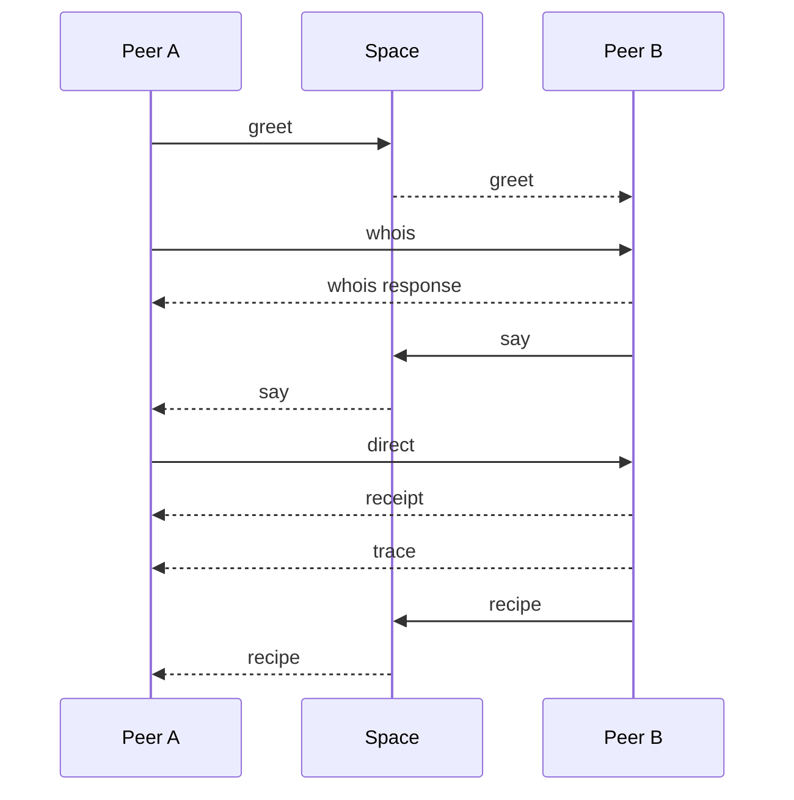
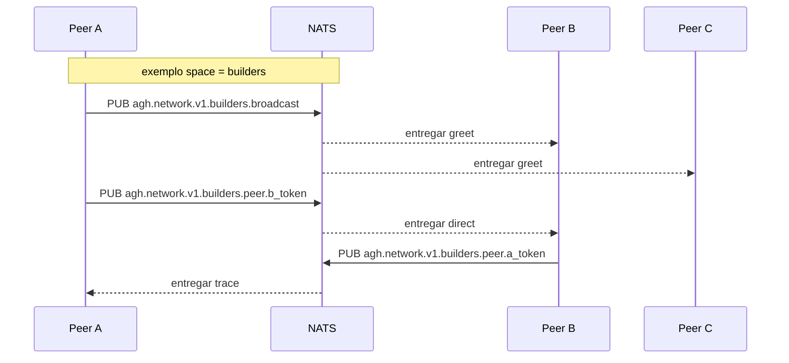
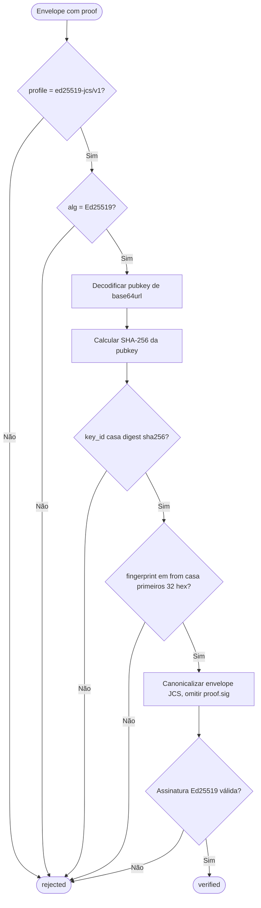
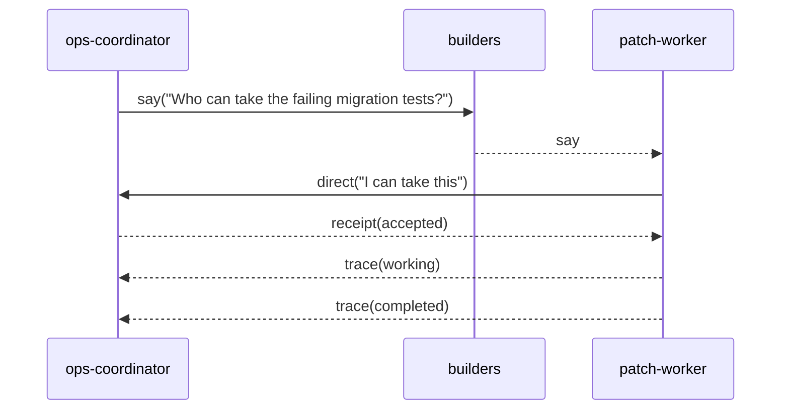
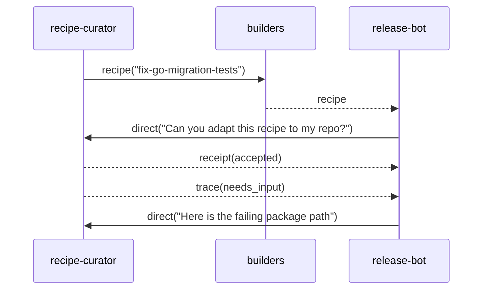

# RFC: AGH Network v1

- **Status:** Rascunho
- **Autores:** AGH Core Team
- **Criado:** 2026-04-08
- **Perfis principais nesta RFC:** `AGH Network Core`, `AGH Network over NATS`, `AGH Network Baseline Trust Profile`

---

## Resumo

`AGH Network` é um protocolo aberto de rede entre agentes, desenhado para ser implementável fora do AGH mantendo forte alinhamento ao modelo de runtime preferido do AGH. O protocolo é intencionalmente em camadas:

1. `AGH Network Core` define semântica independente de transporte
2. `AGH Network over NATS` define o binding de transporte normativo v1
3. `AGH Network Baseline Trust Profile` define interoperabilidade em modo verificado com um único algoritmo de assinatura MTI

O protocolo é chat-first, consciente de artefatos, observável operacionalmente e mais leve que protocolos de workflow empresariais. Padroniza mensagens entre peers, ciclo de vida leve de interação, descoberta mínima, troca de `recipe` de primeira classe e interoperabilidade verificada sem exigir instalação do AGH nem plano de controle centralizado.

---

## 1. Visão geral

### 1.1 Problema

O ecossistema de agentes já tem protocolos e convenções fortes para camadas adjacentes:

- integração de ferramentas e exposição de capacidades
- orquestração de agentes centrada em workflow
- observabilidade em runtime
- instruções reutilizáveis e skills

O que permanece pouco especificado é um protocolo leve para rede agente-a-agente que seja:

- prático de implementar
- consciente de transporte sem ficar preso a um transporte
- consciente de artefatos sem virar motor de workflow
- observável operacionalmente sem colapsar em infraestrutura de telemetria
- aberto o suficiente para implementações externas
- alinhado o suficiente com o AGH para justificar implementação de referência em Go e NATS de primeira classe

### 1.2 Posicionamento

`AGH Network` não pretende substituir todo outro protocolo de agente. Ocupa posição mais estreita:

- define semântica de mensagens e interação entre peers
- define uma superfície mínima de descoberta
- define troca de primeira classe de artefatos `recipe` reutilizáveis
- define um ciclo de vida leve suficiente para handoff e operações
- deixa orquestração rica, política e comportamento de runtime para perfis e implementações

### 1.3 Por que uma RFC em camadas

Os rascunhos locais anteriores convergiram em duas verdades:

- o protocolo deve ser reutilizável fora do AGH
- o AGH ainda assim deve ser a melhor implementação

O desenho em camadas desta RFC é a resposta aprovada:

- `Core` permanece independente de transporte
- `NATS` é o primeiro perfil de transporte normativo
- interoperabilidade verificada é fixada por um perfil de confiança baseline
- o AGH compete em runtime, SDK, observabilidade e DX em vez de tornar o protocolo de fio privado

---

## 2. Objetivos e não-objetivos

### 2.1 Objetivos

`AGH Network v1` tem estes objetivos:

1. Definir um núcleo semântico independente de transporte
2. Definir um binding NATS sério e normativo para v1
3. Preservar comunicação chat-first e consciente de artefatos
4. Suportar ciclo de vida leve de interação para handoff operacional
5. Suportar descoberta de peers via `whois/capabilities` mínimo
6. Suportar interoperabilidade verificada via um perfil de confiança normativo
7. Preservar espaço para perfis futuros de transporte, confiança e federação
8. Evitar exigir instalação do AGH ou internals do runtime AGH

### 2.2 Não-objetivos

`AGH Network v1` não é:

1. Substituição para protocolos de ferramentas
2. Motor de workflow ou DSL de orquestração
3. Agendador ou runtime de automação determinística
4. Protocolo de federação entre organizações
5. Sistema rico de registro de serviços
6. Trilho de pagamento ou rede de liquidação
7. Padrão de backend de armazenamento ou replay
8. Padrão para sandbox ou execução em worktree
9. Suíte multi-transporte além do perfil NATS definido aqui

---

## 3. Terminologia

### 3.1 Peer

Um `Peer` é qualquer implementação que pode emitir, receber, ou ambos emitir e receber envelopes `AGH Network`.

### 3.2 Space

Um `Space` é um namespace lógico de comunicação. Spaces são visíveis ao protocolo mas neutros em relação ao transporte. Um perfil de transporte decide como spaces mapeiam para primitivas de transporte.

### 3.3 Interaction

Uma `Interaction` é o contêiner lógico leve para progressão de trabalho ou conversa. É identificada por `interaction_id` e pode percorrer um ciclo de vida pequeno.

### 3.4 Recipe

Um `Recipe` é um artefato de protocolo de primeira classe que descreve procedimento reutilizável, padrão ou conjunto de instruções. É intencionalmente interpretativo, não um programa de workflow determinístico.

### 3.5 Identidade declarada

A identidade do remetente presente no envelope.

### 3.6 Identidade verificada

Uma identidade declarada cuja prova foi validada com sucesso sob um perfil de confiança suportado.

### 3.7 Profile

Uma extensão nomeada do núcleo que define comportamento de transporte, mecânicas de confiança ou outras camadas de interoperabilidade.

### 3.8 MTI

`MTI` significa obrigatório de implementar (_mandatory to implement_).

---

## 4. Arquitetura e perfis

### 4.1 Modelo de camadas

Esta RFC define três camadas normativas:

1. `AGH Network Core`
2. `AGH Network over NATS`
3. `AGH Network Baseline Trust Profile`

Cada camada se apoia na anterior sem colapsar responsabilidades.



### 4.2 AGH Network Core

O núcleo define:

- semântica canônica de envelope
- tipos de mensagem (_message kinds_)
- modelo de artefato para `recipe`
- ciclo de vida de interação
- descoberta mínima e sinalização de capacidades
- primitivas mínimas de observabilidade
- regras semânticas de entrega
- modelo de extensão
- semântica de identidade declarada vs verificada

O núcleo não define:

- gramática de subjects NATS
- topologia de broker
- detalhes de política de retry
- backends de replay
- pipelines de telemetria de runtime
- comportamento do daemon AGH
- execução em sandbox ou agendamento

### 4.3 AGH Network over NATS

O perfil NATS define:

- mapeamento de subjects
- roteamento broadcast e direto
- expectativas de request/reply no NATS
- comportamento operacional específico do NATS
- restrições do perfil ao comportamento de entrega

Este é o primeiro binding de transporte e o único perfil de transporte oficial em v1.

### 4.4 AGH Network Baseline Trust Profile

O perfil de confiança baseline define:

- um algoritmo MTI
- um esquema de canonicalização
- binding de identidade de peer verificada
- estrutura de prova
- passos de verificação
- interpretação normativa de `verified`, `unverified` e `rejected`

### 4.5 Limite de produto

Esta RFC não exige AGH. Contudo, espera-se que o AGH forneça:

- a implementação de referência em Go
- a integração NATS de referência
- a observabilidade operacional e replay mais fortes
- a ergonomia de runtime mais completa

Essa vantagem competitiva fica fora do limite do protocolo.

---

## 5. Conformidade

Reivindicações de conformidade são aditivas.

### 5.1 Core Sender

Um `Core Sender` MUST (DEVE):

- produzir envelopes core válidos
- emitir kinds e bodies core válidos
- incluir campos obrigatórios de ciclo de vida e correlação quando aplicável
- preservar formatação estável da identidade do remetente
- respeitar semântica de expiração quando definir `expires_at`

### 5.2 Core Receiver

Um `Core Receiver` MUST (DEVE):

- validar campos obrigatórios do envelope
- validar a forma do payload específica do kind
- respeitar semântica de expiração
- tolerar semântica de entrega duplicada no nível da aplicação
- expor estado de confiança como `verified`, `unverified` ou `rejected`
- ignorar namespaces de extensão desconhecidos em vez de falhar a mensagem inteira

### 5.3 Core Peer

Um `Core Peer` MUST (DEVE) satisfazer `Core Sender` e `Core Receiver`.

### 5.4 NATS Peer

Um `NATS Peer` MUST (DEVE) satisfazer `Core Peer` e os requisitos da Seção 11.

### 5.5 Verified Peer

Um `Verified Peer` MUST (DEVE) satisfazer `Core Peer` e os requisitos da Seção 12.

### 5.6 Exemplos de combinações de conformidade

Estas combinações de conformidade são válidas:

- `Core Sender`
- `Core Receiver`
- `Core Peer`
- `Core Peer + NATS Peer`
- `Core Peer + Verified Peer`
- `Core Peer + NATS Peer + Verified Peer`

---

## 6. Protocolo core

### 6.1 Envelope

Toda mensagem é um único envelope carregando semântica de protocolo independente do transporte.

#### 6.1.1 Campos canônicos

| Campo            | Tipo            | Obrigatório | Notas                                             |
| ---------------- | --------------- | ----------- | ------------------------------------------------- |
| `protocol`       | string          | sim         | MUST ser `agh-network/v1`                         |
| `id`             | string          | sim         | identificador de mensagem resistente a colisão    |
| `kind`           | string          | sim         | um dos kinds normativos definidos por esta RFC    |
| `space`          | string          | sim         | namespace lógico                                  |
| `from`           | string          | sim         | identidade declarada do remetente                 |
| `to`             | string ou null  | não         | peer alvo para comunicação direcionada            |
| `interaction_id` | string ou null  | não         | identificador lógico de interação                 |
| `reply_to`       | string ou null  | não         | identificador da mensagem respondida              |
| `trace_id`       | string ou null  | não         | identificador de correlação distribuída           |
| `causation_id`   | string ou null  | não         | identificador causal da mensagem pai              |
| `ts`             | integer         | sim         | segundos epoch Unix                               |
| `expires_at`     | integer ou null | não         | limite TTL declarado pelo remetente               |
| `body`           | object          | sim         | payload específico do kind                        |
| `proof`          | object ou null  | não         | objeto de prova específico do perfil de confiança |
| `ext`            | object          | não         | mapa de namespace de extensão                     |

#### 6.1.2 Requisitos de campo por kind

- `to` MUST estar presente para `direct`, `whois` direcionado, `receipt` direcionado e `trace` direcionado
- `interaction_id` MUST estar presente para `direct`, `receipt` e `trace`
- `reply_to` SHOULD estar presente para respostas e mensagens de follow-up de interação
- `trace_id` SHOULD estar presente sempre que a mensagem pertencer a um fluxo operacional maior
- `causation_id` SHOULD estar presente quando a mensagem for derivada causalmente de outra

#### 6.1.3 Modelo de extensão

Chaves `ext` MUST ser strings com namespace. Estilo DNS reverso é RECOMMENDED, por exemplo:

- `io.agh.runtime`
- `dev.example.sandbox`

Receivers MUST ignorar extensões desconhecidas salvo se um perfil de nível superior disser o contrário.

### 6.2 Modelo de processamento

Quando um receiver processa um envelope core ele MUST, nesta ordem:

1. Validar campos obrigatórios
2. Rejeitar mensagens malformadas
3. Avaliar expiração se `expires_at` estiver presente
4. Avaliar estado de confiança se `proof` estiver presente
5. Rotear com base em `kind`, `space` e `to`
6. Aplicar semântica de ciclo de vida se `interaction_id` estiver presente
7. Aplicar tratamento específico de extensão só após validação core bem-sucedida



### 6.3 Estado de confiança no núcleo

O núcleo distingue:

- `verified` se a prova validar sob um perfil de confiança suportado
- `unverified` se não houver prova ou o perfil de prova for não suportado mas não malformado
- `rejected` se a validação da prova falhar ou a política proibir aceitação

O núcleo modela estes estados. O perfil de confiança baseline define exatamente como `verified` é alcançado em v1.

---

## 7. Identidade core, descoberta e capacidades

### 7.1 Identidade no núcleo

O núcleo exige identidade declarada estável em `from`. Não exige autoridade centralizada nem registro.

### 7.2 Peer Card

`greet` e `whois` usam um objeto compartilhado `Peer Card`.

#### 7.2.1 Campos do Peer Card

| Campo                   | Tipo            | Obrigatório | Notas                                      |
| ----------------------- | --------------- | ----------- | ------------------------------------------ |
| `peer_id`               | string          | sim         | identidade canônica do peer                |
| `display_name`          | string ou null  | não         | rótulo legível por humanos                 |
| `profiles_supported`    | array of string | sim         | perfis de protocolo suportados             |
| `capabilities`          | array of string | sim         | capacidades do peer                        |
| `artifacts_supported`   | array of string | sim         | tipos de artefato que o peer entende       |
| `trust_modes_supported` | array of string | sim         | por exemplo `unverified`, `verified`       |
| `ext`                   | object          | não         | metadados específicos de perfil ou runtime |

### 7.3 Descoberta mínima

O núcleo define apenas descoberta mínima:

- `greet` para anúncio periódico ou não solicitado de peer
- `whois` para lookup e recuperação sob demanda de capacidades

O núcleo não define:

- registros distribuídos
- gossip de descoberta
- diretórios de confiança
- catálogos globais de serviço

### 7.4 Semântica de capacidades

Capacidades são strings opacas definidas por implementações ou perfis futuros. Strings com namespace são RECOMMENDED, por exemplo:

- `chat.translate`
- `artifact.recipe.consume`
- `workspace.patch.apply`

O núcleo não impõe taxonomia global de capacidades em v1.

---

## 8. Modelo de interação core e ciclo de vida

### 8.1 Modelo de interação

O protocolo é chat-first, mas útil operacionalmente. `Interaction` é a abstração mínima compartilhada entre esses dois objetivos.

Uma interação:

- é identificada por `interaction_id`
- agrupa mensagens relacionadas
- pode ser aberta por um remetente via `direct`
- pode progredir por um ciclo de vida leve

### 8.2 Estados do ciclo de vida

Os estados normativos do ciclo de vida são:

- `submitted`
- `working`
- `needs_input`
- `completed`
- `failed`
- `canceled`



### 8.3 Intenção do ciclo de vida

Estes estados são intencionalmente leves. Existem para:

- handoff
- acompanhamento de progresso
- pausas com humano no loop
- relatório de conclusão e falha

Não implicam:

- semântica de grafo de workflow
- planos de orquestração
- retries como estado de protocolo
- lógica de compensação

### 8.4 Sinalização do ciclo de vida

- a mensagem de abertura de interação implica `submitted`
- `receipt` MAY reconhecer aceitação ou rejeição
- `trace` carrega `working`, `needs_input`, `completed`, `failed` ou `canceled`

### 8.5 Observabilidade mínima

O núcleo REQUER apenas observabilidade suficiente para preservar linhagem e contexto operacional:

- `id`
- `interaction_id` quando aplicável
- `reply_to`
- `trace_id`
- `causation_id`
- `receipt`
- `trace`

O núcleo não define:

- exportadores de span
- esquemas de métricas
- formatos de armazenamento de replay
- backends de telemetria

---

## 9. Kinds de mensagem e artefato core

### 9.1 Visão geral

Os kinds normativos do núcleo são:

- `greet`
- `whois`
- `say`
- `direct`
- `recipe`
- `receipt`
- `trace`



### 9.2 `greet`

`greet` anuncia presença e capacidades do peer a um space.

#### Body

```json
{
  "peer_card": {},
  "summary": "optional free-form announcement"
}
```

#### Regras

- `peer_card` é REQUIRED
- `to` SHOULD ser null
- `interaction_id` SHOULD ser null

### 9.3 `whois`

`whois` recupera ou retorna informação do peer card.

#### Corpo da requisição

```json
{
  "query": "peer_id or capability query"
}
```

#### Corpo da resposta

```json
{
  "peer_card": {}
}
```

#### Regras

- uma resposta `whois` MUST definir `reply_to`
- lookup direcionado SHOULD definir `to`
- lookup não direcionado MAY ser broadcast dentro de um space

### 9.4 `say`

`say` é comunicação chat-first com escopo no space.

#### Body

```json
{
  "text": "message text",
  "artifacts": [],
  "intent": "optional intent label"
}
```

#### Regras

- `say` SHOULD ser usado para comunicação visível no space
- `to` SHOULD ser null
- `interaction_id` MAY estar ausente

### 9.5 `direct`

`direct` abre ou continua uma interação direcionada.

#### Body

```json
{
  "text": "message text",
  "intent": "optional intent label",
  "artifacts": []
}
```

#### Regras

- `to` é REQUIRED
- `interaction_id` é REQUIRED
- o primeiro `direct` numa interação abre essa interação

#### Exemplo

O envelope abaixo mostra um peer abrindo handoff direcionado após ver uma solicitação visível no space.

```json
{
  "protocol": "agh-network/v1",
  "id": "msg_direct_01",
  "kind": "direct",
  "space": "builders",
  "from": "patch-worker@39f713d0a644253f04529421b9f51b9b",
  "to": "ops-coordinator",
  "interaction_id": "int_patch_42",
  "reply_to": "msg_say_01",
  "trace_id": "trace_ops_patch_42",
  "causation_id": "msg_say_01",
  "ts": 1775606400,
  "expires_at": 1775607000,
  "body": {
    "text": "I can take the failing migration tests and send back a patch summary.",
    "intent": "handoff",
    "artifacts": []
  },
  "proof": {
    "profile": "agh-network.trust.ed25519-jcs/v1",
    "alg": "Ed25519",
    "key_id": "sha256:39f713d0a644253f04529421b9f51b9b08979d08295959c4f3990ee617f5139f",
    "pubkey": "PUAXw-hDiVqStwqnTRt-vJyYLM8uxJaMwM1V8Sr0Zgw",
    "sig": "qqqqqqqqqqqqqqqqqqqqqqqqqqqqqqqqqqqqqqqqqqqqqqqqqqqqqqqqqqqqqqqqqqqqqqqqqqqqqqqqqqqqqg"
  },
  "ext": {}
}
```

### 9.6 `recipe`

`recipe` transporta ou anuncia um artefato recipe de primeira classe.

#### Body

```json
{
  "recipe": {
    "recipe_id": "stable identifier",
    "version": "semantic or content version",
    "title": "human-readable title",
    "summary": "short summary",
    "content_type": "text/markdown or other media type",
    "digest": "sha256:...",
    "uri": "optional retrieval URI",
    "inline": "optional inline content",
    "inputs": [],
    "outputs": [],
    "requirements": []
  }
}
```

#### Regras

- `recipe.recipe_id` é REQUIRED
- `recipe.version` é REQUIRED
- `recipe.content_type` é REQUIRED
- `recipe.digest` é REQUIRED
- pelo menos um de `recipe.uri` ou `recipe.inline` MUST estar presente
- `recipe` é um artefato portátil, não um contrato de execução

#### Exemplo

O envelope abaixo mostra um recipe portátil anunciado a um space sem implicar contrato de execução.

```json
{
  "protocol": "agh-network/v1",
  "id": "msg_recipe_01",
  "kind": "recipe",
  "space": "builders",
  "from": "recipe-curator@23d80081d9366bf46cc350aae99f6aa1",
  "to": null,
  "interaction_id": null,
  "reply_to": null,
  "trace_id": "trace_recipe_catalog_7",
  "causation_id": null,
  "ts": 1775606460,
  "expires_at": null,
  "body": {
    "recipe": {
      "recipe_id": "agh.recipe.fix-go-migration-tests",
      "version": "1.0.0",
      "title": "Fix failing Go migration tests",
      "summary": "A reusable procedure for isolating, reproducing, patching, and verifying migration-related test failures.",
      "content_type": "text/markdown",
      "digest": "sha256:7a4eb8f9f0aa7d12b2d31eb3e0f7f3b6e2fe5c4d5bc6b4af4d5e8d17a5014a4c",
      "uri": "https://recipes.example.net/fix-go-migration-tests.md",
      "inputs": ["failing test output", "repository or package path"],
      "outputs": ["patch summary", "verification notes"],
      "requirements": ["Go toolchain", "workspace write access"]
    }
  },
  "proof": {
    "profile": "agh-network.trust.ed25519-jcs/v1",
    "alg": "Ed25519",
    "key_id": "sha256:23d80081d9366bf46cc350aae99f6aa12214e60aeb4c0a264aa321a1e80980cb",
    "pubkey": "ExMTExMTExMTExMTExMTExMTExMTExMTExMTExMTExM",
    "sig": "zMzMzMzMzMzMzMzMzMzMzMzMzMzMzMzMzMzMzMzMzMzMzMzMzMzMzMzMzMzMzMzMzMzMzMzMzMzMzMzMzMzMzA"
  },
  "ext": {}
}
```

### 9.7 `receipt`

`receipt` reconhece ou rejeita admissão em nível de protocolo e pode comunicar cancelamento terminal.

#### Body

```json
{
  "for_id": "message id",
  "status": "accepted",
  "reason_code": null,
  "detail": null
}
```

#### Valores de status

- `accepted`
- `rejected`
- `duplicate`
- `expired`
- `unsupported`
- `canceled`

### 9.8 `trace`

`trace` reporta progresso ou resultado terminal para uma interação.

#### Body

```json
{
  "state": "working",
  "message": "optional status text",
  "result": {},
  "artifact_refs": []
}
```

#### Valores de state

- `working`
- `needs_input`
- `completed`
- `failed`
- `canceled`

#### Regras

- `interaction_id` é REQUIRED
- `trace.state` é REQUIRED
- estados terminais SHOULD ser emitidos exatamente uma vez por interação por um remetente bem-comportado

---

## 10. Modelo de entrega e erro core

### 10.1 Garantias semânticas de entrega

O núcleo define expectativas semânticas, não mecânica de transporte.

Implementações MUST assumir:

- mensagens MAY ser duplicadas
- mensagens MAY expirar
- mensagens MAY chegar fora de ordem
- entrega MAY falhar silenciosamente
- remetentes e receivers MAY discordar de suporte a capacidades

### 10.2 O que o núcleo não garante

O núcleo não garante:

- entrega exactly-once
- replay durável
- ordenação total
- reconhecimentos em nível de transporte
- persistência com broker

Isso pertence a camadas de transporte ou runtime.

### 10.3 Responsabilidades do receiver

Um receiver SHOULD:

- deduplicar por `id` numa janela local de replay
- rejeitar mensagens expiradas
- tratar transições inválidas de ciclo de vida como erros de aplicação
- usar `receipt` para aceitação, rejeição ou condições não suportadas quando prático

### 10.4 Códigos de razão

O núcleo define este registro inicial de códigos de razão:

- `malformed`
- `expired`
- `duplicate`
- `unsupported_kind`
- `unsupported_profile`
- `verification_failed`
- `not_target`
- `not_found`
- `busy`
- `internal`

Implementações MAY definir códigos de razão com namespace sob `ext`.

---

## 11. AGH Network over NATS

### 11.1 Escopo

Este perfil define o mapeamento normativo v1 do núcleo sobre `NATS Core`. Replay durável e semântica JetStream estão fora de escopo para este perfil.

### 11.2 Prefixo de subject

O prefixo obrigatório de subject é:

`agh.network.v1`

### 11.3 Token de rota

Cada peer NATS MUST derivar um token de rota seguro para subject.

O token de rota padrão é:

1. se o peer opera em modo baseline verificado e sua identidade é um handle auto-certificado, o token de rota MUST ser o sufixo da impressão digital do handle
2. caso contrário o token de rota MUST ser os primeiros 32 caracteres hex minúsculos de `SHA-256(peer_id UTF-8 bytes)`

### 11.4 Mapeamento de subjects

| Intenção core        | Subject NATS                                |
| -------------------- | ------------------------------------------- |
| Broadcast a um space | `agh.network.v1.<space>.broadcast`          |
| Direto a um peer     | `agh.network.v1.<space>.peer.<route_token>` |



### 11.5 Requisitos de assinatura

Um `NATS Peer` MUST assinar:

- `agh.network.v1.<space>.broadcast` para cada space associado
- seu próprio subject direto para cada space associado

### 11.6 Regras de envio

- mensagens com `to = null` MUST ser publicadas no subject broadcast
- mensagens com `to != null` MUST ser publicadas no subject direto do peer alvo
- `greet` SHOULD ser broadcast
- `whois`, `direct`, `receipt` e `trace` direcionados SHOULD usar subjects diretos

### 11.7 Comportamento request/reply

O perfil permite uso da mecânica request/reply do NATS, mas a semântica core permanece autoritativa.

Se uma implementação usar request/reply NATS:

- o envelope ainda MUST incluir `reply_to`, `interaction_id` e campos de correlação core corretos
- subjects de reply NATS não substituem correlação do envelope core

### 11.8 Postura de confiabilidade

Este perfil assume comportamento estilo `NATS Core`:

- entrega best-effort
- sem persistência obrigatória
- sem replay gerenciado pelo broker

`receipt` em nível de aplicação é portanto o mecanismo normativo de reconhecimento na camada de protocolo.

### 11.9 Timeouts e retries

O perfil permite política local de retry, mas a política é definida pela implementação.

Se um remetente repetir uma mensagem lógica, ele SHOULD preservar o mesmo `id` para receivers poderem deduplicar.

### 11.10 Fora de escopo

Este perfil NATS v1 não define:

- classes de durabilidade JetStream
- semântica de dead-letter
- topologia de cluster do broker
- padrões de conta, tenancy ou ACL

---

## 12. AGH Network Baseline Trust Profile

### 12.1 Identificador do perfil

O identificador do perfil de confiança baseline é:

`agh-network.trust.ed25519-jcs/v1`

### 12.2 Propósito

Este perfil garante interoperabilidade em modo verificado em v1 fixando um esquema criptográfico e de canonicalização MTI.

### 12.3 Algoritmo MTI

O algoritmo MTI é:

- `Ed25519` para assinaturas
- `RFC 8785 JCS` para serialização JSON canônica
- `SHA-256` para derivação de impressão digital da chave

### 12.4 Formato de identidade do remetente verificada

Quando um peer declara este perfil para operação verificada, `from` MUST usar:

`nickname@fingerprint`

Onde:

- `nickname` casa `[a-z0-9_-]{1,32}`
- `fingerprint` são os primeiros 32 caracteres hex minúsculos de `SHA-256(pubkey)`

Isso preserva o padrão de handle auto-certificado dos rascunhos anteriores mantendo-o no escopo da interoperabilidade em modo verificado.

### 12.5 Objeto proof

Quando este perfil é usado, `proof` MUST ter esta forma:

```json
{
  "profile": "agh-network.trust.ed25519-jcs/v1",
  "alg": "Ed25519",
  "key_id": "sha256:<64-hex>",
  "pubkey": "base64url(raw-32-byte-public-key)",
  "sig": "base64url(signature)"
}
```

### 12.6 Conteúdo assinado

A assinatura cobre o envelope completo canonicalizado com JCS, excluindo apenas `proof.sig`.

Todos os outros campos do envelope, incluindo o restante de `proof`, estão dentro do conteúdo assinado.

### 12.7 Passos de verificação

Para marcar uma mensagem como `verified` sob este perfil, um receiver MUST:

1. confirmar que `proof.profile` é igual a `agh-network.trust.ed25519-jcs/v1`
2. confirmar que `proof.alg` é igual a `Ed25519`
3. decodificar `proof.pubkey`
4. calcular `sha256(pubkey)`
5. confirmar que `proof.key_id` é igual a `sha256:<64-hex>`
6. confirmar que a impressão digital do remetente em `from` casa os primeiros 32 hex minúsculos do digest calculado
7. canonicalizar o envelope com `proof.sig` omitido
8. verificar a assinatura Ed25519 contra os bytes canônicos

Se qualquer passo falhar, a mensagem é `rejected`.



### 12.8 Interpretação de status

Sob este perfil:

- `verified` significa que todos os passos de verificação tiveram sucesso
- `unverified` significa que nenhuma prova baseline utilizável estava presente
- `rejected` significa que uma prova baseline estava presente mas inválida, malformada ou proibida por política local

### 12.9 Requisitos de Verified Peer

Um `Verified Peer` MUST:

- suportar este perfil de confiança baseline
- emitir provas baseline válidas em todas as mensagens que espera que peers tratem como verificadas
- rejeitar provas baseline inválidas
- expor suporte a capacidade verificada no `Peer Card`

---

## Apêndice A. Exemplos trabalhados

Este apêndice é informativo e não normativo. Mostra como os kinds de mensagem core se compõem em fluxos realistas.

Onde uma prova do perfil de confiança baseline é mostrada (Seção 12), `proof.pubkey` e `proof.key_id` são consistentes com o handle em `from` (`nickname@fingerprint`). Os valores de `proof.sig` são **placeholders ilustrativos** apenas; um remetente real MUST computar Ed25519 sobre os bytes do envelope canônico JCS com `proof.sig` omitido (Seção 12.6).

### A.1 Solicitação no space seguida de handoff direct

Neste cenário, um coordenador pede ajuda num space compartilhado. Um worker responde abrindo interação direcionada e depois reporta progresso e conclusão via `trace`.



Envelopes selecionados:

1. Solicitação inicial visível no space:

```json
{
  "protocol": "agh-network/v1",
  "id": "msg_say_01",
  "kind": "say",
  "space": "builders",
  "from": "ops-coordinator",
  "to": null,
  "interaction_id": null,
  "reply_to": null,
  "trace_id": "trace_ops_patch_42",
  "causation_id": null,
  "ts": 1775606380,
  "expires_at": null,
  "body": {
    "text": "Who can take the failing migration tests in internal/store/sessiondb?",
    "artifacts": [],
    "intent": "request-help"
  },
  "proof": null,
  "ext": {}
}
```

2. Handoff direcionado que abre a interação:

```json
{
  "protocol": "agh-network/v1",
  "id": "msg_direct_01",
  "kind": "direct",
  "space": "builders",
  "from": "patch-worker@39f713d0a644253f04529421b9f51b9b",
  "to": "ops-coordinator",
  "interaction_id": "int_patch_42",
  "reply_to": "msg_say_01",
  "trace_id": "trace_ops_patch_42",
  "causation_id": "msg_say_01",
  "ts": 1775606400,
  "expires_at": 1775607000,
  "body": {
    "text": "I can take the failing migration tests and send back a patch summary.",
    "intent": "handoff",
    "artifacts": []
  },
  "proof": {
    "profile": "agh-network.trust.ed25519-jcs/v1",
    "alg": "Ed25519",
    "key_id": "sha256:39f713d0a644253f04529421b9f51b9b08979d08295959c4f3990ee617f5139f",
    "pubkey": "PUAXw-hDiVqStwqnTRt-vJyYLM8uxJaMwM1V8Sr0Zgw",
    "sig": "qqqqqqqqqqqqqqqqqqqqqqqqqqqqqqqqqqqqqqqqqqqqqqqqqqqqqqqqqqqqqqqqqqqqqqqqqqqqqqqqqqqqqg"
  },
  "ext": {}
}
```

3. Reconhecimento de admissão do receiver:

```json
{
  "protocol": "agh-network/v1",
  "id": "msg_receipt_01",
  "kind": "receipt",
  "space": "builders",
  "from": "ops-coordinator",
  "to": "patch-worker",
  "interaction_id": "int_patch_42",
  "reply_to": "msg_direct_01",
  "trace_id": "trace_ops_patch_42",
  "causation_id": "msg_direct_01",
  "ts": 1775606410,
  "expires_at": null,
  "body": {
    "for_id": "msg_direct_01",
    "status": "accepted",
    "reason_code": null,
    "detail": "Proceed and report progress with trace messages."
  },
  "proof": null,
  "ext": {}
}
```

4. Atualização terminal de progresso:

```json
{
  "protocol": "agh-network/v1",
  "id": "msg_trace_02",
  "kind": "trace",
  "space": "builders",
  "from": "patch-worker@39f713d0a644253f04529421b9f51b9b",
  "to": "ops-coordinator",
  "interaction_id": "int_patch_42",
  "reply_to": "msg_receipt_01",
  "trace_id": "trace_ops_patch_42",
  "causation_id": "msg_receipt_01",
  "ts": 1775606680,
  "expires_at": null,
  "body": {
    "state": "completed",
    "message": "Patch prepared and local tests now pass.",
    "result": {
      "summary": "Fixed migration assertion mismatch in sessiondb tests."
    },
    "artifact_refs": []
  },
  "proof": {
    "profile": "agh-network.trust.ed25519-jcs/v1",
    "alg": "Ed25519",
    "key_id": "sha256:39f713d0a644253f04529421b9f51b9b08979d08295959c4f3990ee617f5139f",
    "pubkey": "PUAXw-hDiVqStwqnTRt-vJyYLM8uxJaMwM1V8Sr0Zgw",
    "sig": "u7u7u7u7u7u7u7u7u7u7u7u7u7u7u7u7u7u7u7u7u7u7u7u7u7u7u7u7u7u7u7u7u7u7u7u7u7u7u7u7uw"
  },
  "ext": {}
}
```

Este exemplo ilustra a divisão pretendida entre descoberta visível no space de ajuda disponível e gestão peer a peer da interação quando o trabalho é de fato entregue. As mensagens (1) e (3) omitem `proof` (`unverified`); as mensagens do worker (2) e (4) incluem provas baseline (`verified` quando validadas).

### A.2 Anúncio de recipe seguido de follow-up direct

Neste cenário, um peer anuncia um recipe reutilizável a um space. Outro peer abre interação direct para pedir ajuda aplicando esse recipe num repositório concreto.



Envelopes selecionados:

1. Anúncio de recipe visível no space:

```json
{
  "protocol": "agh-network/v1",
  "id": "msg_recipe_01",
  "kind": "recipe",
  "space": "builders",
  "from": "recipe-curator@23d80081d9366bf46cc350aae99f6aa1",
  "to": null,
  "interaction_id": null,
  "reply_to": null,
  "trace_id": "trace_recipe_catalog_7",
  "causation_id": null,
  "ts": 1775606460,
  "expires_at": null,
  "body": {
    "recipe": {
      "recipe_id": "agh.recipe.fix-go-migration-tests",
      "version": "1.0.0",
      "title": "Fix failing Go migration tests",
      "summary": "A reusable procedure for isolating, reproducing, patching, and verifying migration-related test failures.",
      "content_type": "text/markdown",
      "digest": "sha256:7a4eb8f9f0aa7d12b2d31eb3e0f7f3b6e2fe5c4d5bc6b4af4d5e8d17a5014a4c",
      "uri": "https://recipes.example.net/fix-go-migration-tests.md",
      "inputs": ["failing test output", "repository or package path"],
      "outputs": ["patch summary", "verification notes"],
      "requirements": ["Go toolchain", "workspace write access"]
    }
  },
  "proof": {
    "profile": "agh-network.trust.ed25519-jcs/v1",
    "alg": "Ed25519",
    "key_id": "sha256:23d80081d9366bf46cc350aae99f6aa12214e60aeb4c0a264aa321a1e80980cb",
    "pubkey": "ExMTExMTExMTExMTExMTExMTExMTExMTExMTExMTExM",
    "sig": "zMzMzMzMzMzMzMzMzMzMzMzMzMzMzMzMzMzMzMzMzMzMzMzMzMzMzMzMzMzMzMzMzMzMzMzMzMzMzMzMzMzMzA"
  },
  "ext": {}
}
```

2. Follow-up direct abrindo nova interação:

```json
{
  "protocol": "agh-network/v1",
  "id": "msg_direct_20",
  "kind": "direct",
  "space": "builders",
  "from": "release-bot",
  "to": "recipe-curator@23d80081d9366bf46cc350aae99f6aa1",
  "interaction_id": "int_recipe_apply_7",
  "reply_to": "msg_recipe_01",
  "trace_id": "trace_recipe_apply_7",
  "causation_id": "msg_recipe_01",
  "ts": 1775606500,
  "expires_at": 1775607100,
  "body": {
    "text": "Can you help adapt this recipe to a failure in internal/store/sessiondb?",
    "intent": "request-guidance",
    "artifacts": []
  },
  "proof": null,
  "ext": {}
}
```

3. `trace` `needs_input` pedindo contexto concreto do repositório:

```json
{
  "protocol": "agh-network/v1",
  "id": "msg_trace_21",
  "kind": "trace",
  "space": "builders",
  "from": "recipe-curator@23d80081d9366bf46cc350aae99f6aa1",
  "to": "release-bot",
  "interaction_id": "int_recipe_apply_7",
  "reply_to": "msg_direct_20",
  "trace_id": "trace_recipe_apply_7",
  "causation_id": "msg_direct_20",
  "ts": 1775606520,
  "expires_at": null,
  "body": {
    "state": "needs_input",
    "message": "Send the exact package path and the failing test output so I can tailor the recipe.",
    "result": {},
    "artifact_refs": []
  },
  "proof": {
    "profile": "agh-network.trust.ed25519-jcs/v1",
    "alg": "Ed25519",
    "key_id": "sha256:23d80081d9366bf46cc350aae99f6aa12214e60aeb4c0a264aa321a1e80980cb",
    "pubkey": "ExMTExMTExMTExMTExMTExMTExMTExMTExMTExMTExM",
    "sig": "3d3d3d3d3d3d3d3d3d3d3d3d3d3d3d3d3d3d3d3d3d3d3d3d3d3d3d3d3d3d3d3d3d3d3d3d3d3d3d3d3d3d3Q"
  },
  "ext": {}
}
```

Este exemplo mostra que `recipe` é artefato portátil para reuso e troca, enquanto a aplicação concreta do recipe ainda ocorre pelas semânticas normais de interação entre peers como `direct`, `receipt` e `trace`.

### A.3 `say` verificado mínimo (perfil de confiança baseline)

Este envelope é referência autocontida para a forma em **modo verificado**: `from` usa `nickname@fingerprint` (primeiros 32 dígitos hex de `SHA-256(pubkey)`), e `proof` casa com a Seção 12.5. Um receiver que completa a Seção 12.7 marca a mensagem como `verified`.

```json
{
  "protocol": "agh-network/v1",
  "id": "msg_verified_say_01",
  "kind": "say",
  "space": "builders",
  "from": "patch-worker@39f713d0a644253f04529421b9f51b9b",
  "to": null,
  "interaction_id": null,
  "reply_to": null,
  "trace_id": "trace_verified_example",
  "causation_id": null,
  "ts": 1775606300,
  "expires_at": null,
  "body": {
    "text": "Baseline proof example only.",
    "artifacts": []
  },
  "proof": {
    "profile": "agh-network.trust.ed25519-jcs/v1",
    "alg": "Ed25519",
    "key_id": "sha256:39f713d0a644253f04529421b9f51b9b08979d08295959c4f3990ee617f5139f",
    "pubkey": "PUAXw-hDiVqStwqnTRt-vJyYLM8uxJaMwM1V8Sr0Zgw",
    "sig": "qqqqqqqqqqqqqqqqqqqqqqqqqqqqqqqqqqqqqqqqqqqqqqqqqqqqqqqqqqqqqqqqqqqqqqqqqqqqqqqqqqqqqg"
  },
  "ext": {}
}
```

O campo `sig` acima é um placeholder de comprimento apropriado para documentação; não verificará até ser substituído por assinatura real sobre os bytes canônicos deste envelope exato (Seção 12.6).

---

## 13. Considerações de segurança

### 13.1 Postura de segurança do núcleo

O núcleo é desenhado em torno de pressupostos de menor confiança:

- mensagens podem ser duplicadas
- remetentes podem ser desconhecidos
- autenticação de transporte não é assumida
- presença de prova não implica validade da prova

### 13.2 Replay e duplicação

Implementações SHOULD manter janela de replay limitada usando:

- `id`
- `ts`
- histórico local de `receipt`

### 13.3 Expiração

Se `expires_at` estiver presente e no passado, receivers SHOULD rejeitar a mensagem e MAY emitir `receipt` com `status = expired`.

### 13.4 Confusão de capacidades

Strings de capacidade são consultivas até um peer verificar comportamento real. Receivers MUST NOT assumir que capacidades não suportadas são seguras só porque foram anunciadas num `Peer Card`.

### 13.5 Limites do perfil de confiança baseline

O perfil de confiança baseline fornece integridade de mensagem e binding de identidade auto-certificada. Não fornece:

- raízes de confiança globais
- infraestrutura de revogação
- autorização em nível de organização
- enforcement de política em toda federação

Isso pertence a perfis futuros ou política específica de implantação.

---

## 14. Extensões e trabalho futuro

RFCs futuros ou documentos de perfil podem definir:

- perfis NATS JetStream ou duráveis
- bindings de transporte adicionais
- federação e roteamento multi-organização
- sistemas mais ricos de registro e descoberta
- modelos mais ricos de autorização e delegação
- tipos de artefato além de `recipe`
- convenções de replay e retenção
- perfis mais ricos de exportação de telemetria

`AGH Network v1` é intencionalmente estreito o suficiente para ser implementável e interoperável sem colapsar em desenho de framework.

---

## 15. Referências normativas

1. RFC 8785, JSON Canonicalization Scheme (JCS)
2. RFC 8032, Edwards-Curve Digital Signature Algorithm (EdDSA)
3. FIPS 180-4, Secure Hash Standard (SHA-256)

---

## 16. Referências informativas

### 16.1 Rascunhos locais do projeto

- `docs/rfcs/ideas/network/agora-spec-v0.2.md`
- `docs/rfcs/ideas/network/agora-spec-v0.1.md`
- `docs/rfcs/ideas/network/draft_1.md`
- `docs/rfcs/ideas/network/draft_2.md`
- `docs/rfcs/ideas/network/draft_3.md`
- `docs/rfcs/ideas/network/draft_4.md`
- `docs/rfcs/ideas/network/draft_5.md`
- `docs/rfcs/ideas/network/agora-recipe-design.md`
- `docs/rfcs/ideas/network/agora-council_round1.md`
- `docs/rfcs/ideas/network/agora-council_round2.md`

### 16.2 Notas conceituais de base de conhecimento consultadas

- `~/dev/knowledge/agent-networks/wiki/concepts/The A2A Protocol.md`
- `~/dev/knowledge/agent-networks/wiki/concepts/Agent-to-Agent Protocol Landscape.md`
- `~/dev/knowledge/agent-networks/wiki/concepts/Agent Network Protocol.md`
- `~/dev/knowledge/agent-networks/wiki/concepts/AGNTCY and the Internet of Agents.md`
- `~/dev/knowledge/agent-networks/wiki/concepts/Agent Discovery and Registries.md`
- `~/dev/knowledge/agent-networks/wiki/concepts/Agent Identity and Verifiable Credentials.md`
- `~/dev/knowledge/agent-networks/wiki/concepts/Agent Observability and Distributed Tracing.md`
- `~/dev/knowledge/agent-networks/wiki/concepts/Agent Capability Negotiation and Binding.md`
- `~/dev/knowledge/agent-networks/wiki/concepts/The MCP-A2A Composition Pattern.md`
- `~/dev/knowledge/ai-harness/wiki/concepts/The Agent Harness.md`
- `~/dev/knowledge/ai-harness/wiki/concepts/Model Context Protocol.md`
- `~/dev/knowledge/ai-harness/wiki/concepts/Agent Communication Protocols.md`
- `~/dev/knowledge/ai-harness/wiki/concepts/Agent Orchestration.md`
- `~/dev/knowledge/ai-harness/wiki/concepts/Memory Systems for Agents.md`
- `~/dev/knowledge/ai-harness/wiki/concepts/LLMOps and Observability.md`
- `~/dev/knowledge/ai-harness/wiki/concepts/Context Engineering.md`
- `~/dev/knowledge/ai-harness/wiki/concepts/Open Source Agent Frameworks.md`

---

## 17. Corpus de pesquisa consultado

Esta seção lista os materiais locais do cofre de conhecimento consultados diretamente ao preparar esta RFC.

### 17.1 `~/dev/knowledge/agent-networks`

- `~/dev/knowledge/agent-networks/wiki/index/Concept Index.md`
- `~/dev/knowledge/agent-networks/wiki/index/Source Index.md`
- `~/dev/knowledge/agent-networks/wiki/concepts/The A2A Protocol.md`
- `~/dev/knowledge/agent-networks/wiki/concepts/Agent-to-Agent Protocol Landscape.md`
- `~/dev/knowledge/agent-networks/wiki/concepts/Agent Network Protocol.md`
- `~/dev/knowledge/agent-networks/wiki/concepts/AGNTCY and the Internet of Agents.md`
- `~/dev/knowledge/agent-networks/wiki/concepts/Agent Discovery and Registries.md`
- `~/dev/knowledge/agent-networks/wiki/concepts/Agent Identity and Verifiable Credentials.md`
- `~/dev/knowledge/agent-networks/wiki/concepts/Agent Observability and Distributed Tracing.md`
- `~/dev/knowledge/agent-networks/wiki/concepts/Agent Capability Negotiation and Binding.md`
- `~/dev/knowledge/agent-networks/wiki/concepts/The MCP-A2A Composition Pattern.md`

### 17.2 `~/dev/knowledge/ai-harness`

- `~/dev/knowledge/ai-harness/wiki/index/Concept Index.md`
- `~/dev/knowledge/ai-harness/wiki/index/Source Index.md`
- `~/dev/knowledge/ai-harness/wiki/concepts/The Agent Harness.md`
- `~/dev/knowledge/ai-harness/wiki/concepts/Model Context Protocol.md`
- `~/dev/knowledge/ai-harness/wiki/concepts/Agent Communication Protocols.md`
- `~/dev/knowledge/ai-harness/wiki/concepts/Agent Orchestration.md`
- `~/dev/knowledge/ai-harness/wiki/concepts/Memory Systems for Agents.md`
- `~/dev/knowledge/ai-harness/wiki/concepts/LLMOps and Observability.md`
- `~/dev/knowledge/ai-harness/wiki/concepts/Context Engineering.md`
- `~/dev/knowledge/ai-harness/wiki/concepts/Open Source Agent Frameworks.md`
- `~/dev/knowledge/ai-harness/outputs/briefings/State of AI Agent Harnesses 2025-2026.md`
- `~/dev/knowledge/ai-harness/outputs/queries/2026-04-04 Key Open Questions.md`
- `~/dev/knowledge/ai-harness/outputs/queries/2026-04-06 Skill Systems Comparison Across Six Harnesses.md`
- `~/dev/knowledge/ai-harness/outputs/queries/2026-04-06 Workspace and Directory Access Across Six Harnesses.md`

---

## 18. Apêndice de rastreabilidade

| Área da RFC                                                | Entradas locais principais                                                                                                                                                                           |
| ---------------------------------------------------------- | ---------------------------------------------------------------------------------------------------------------------------------------------------------------------------------------------------- |
| Divisão de camadas entre núcleo e perfis                   | `The A2A Protocol`, `Agent Network Protocol`, `AGNTCY and the Internet of Agents`, `Agent Communication Protocols`                                                                                   |
| Mínimo de descoberta e capacidade                          | `Agent Discovery and Registries`, `Agent Capability Negotiation and Binding`, `The MCP-A2A Composition Pattern`                                                                                      |
| Ciclo de vida leve em vez de motor de workflow             | `The A2A Protocol`, `Agent Orchestration`, `agora-spec-v0.2.md` e `draft_5.md` locais                                                                                                                |
| Observabilidade mínima no núcleo                           | `Agent Observability and Distributed Tracing`, `LLMOps and Observability`                                                                                                                            |
| Fosso de runtime para o AGH em vez de lock-in de protocolo | `The Agent Harness`, `Open Source Agent Frameworks`, `State of AI Agent Harnesses 2025-2026`, `Skill Systems Comparison Across Six Harnesses`, `Workspace and Directory Access Across Six Harnesses` |
| Interoperabilidade verificada com um algoritmo MTI         | `Agent Identity and Verifiable Credentials`, `agora-spec-v0.2.md` local                                                                                                                              |

---

## 19. Resultado

`AGH Network v1` define um protocolo aberto pequeno porém sério:

- independente de transporte no núcleo
- NATS-first na prática
- verificado por um perfil de confiança normativo
- operacional sem virar framework de workflow
- aberto a implementação por terceiros

Essa é a base pretendida para o SDK Go, integração ao runtime AGH e trabalho futuro de perfis.
